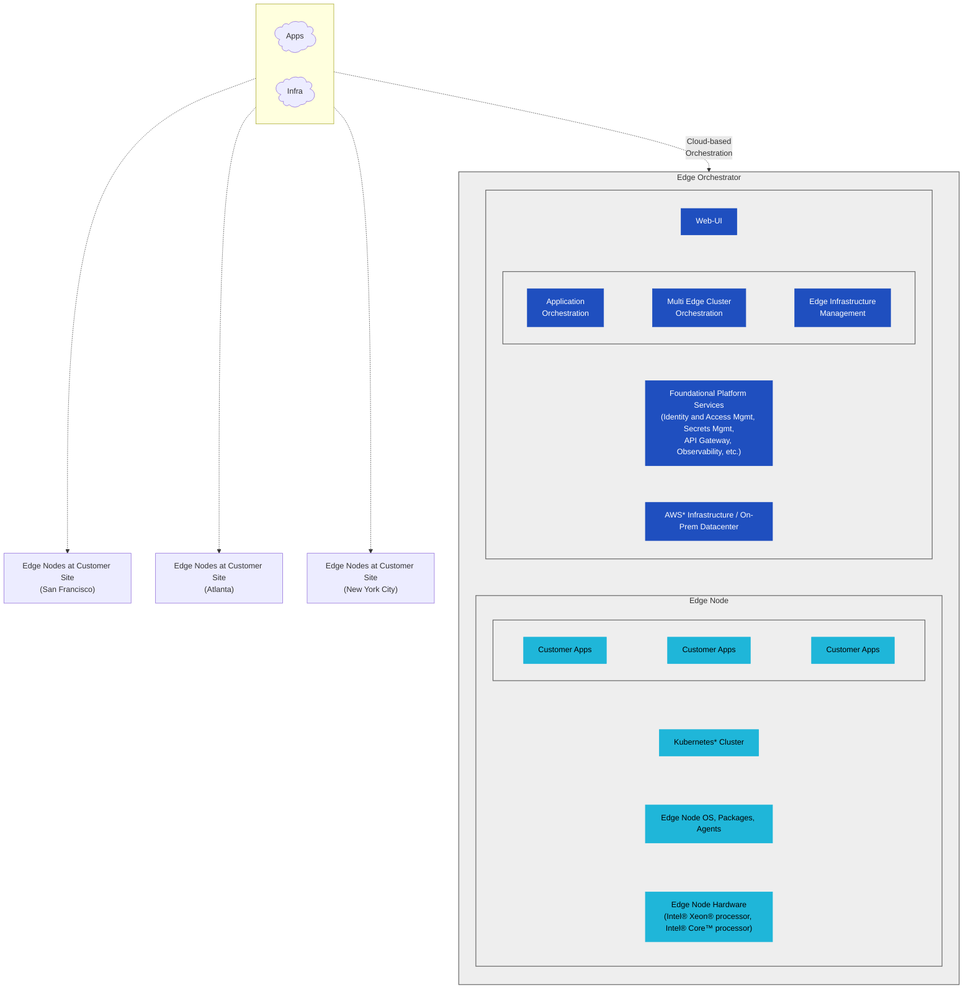

https://mermaid.ai/open-source/syntax/flowchart.html
```mermaid
A@{ shape: manual-file }
```
```mermaid
  flowchart LR
    A@{ shape: cloud, label: "Comment"  }
    info
    subgraph Cloud[" "]
        shape cloud
        Apps[Apps]
        Infra[Infra]
    end

```

