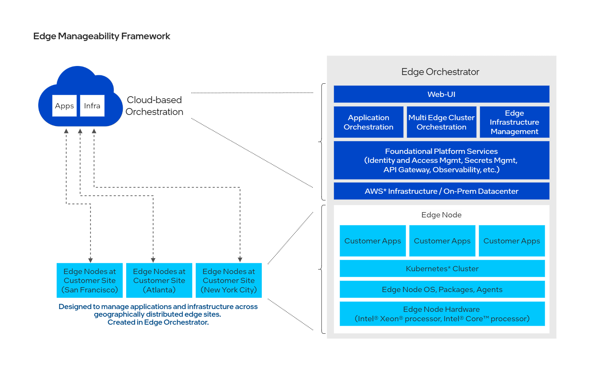

 [](https://opensource.org/licenses/Apache-2.0) [](https://github.com/open-edge-platform/edge-manageability-framework/actions/workflows/virtual-integration.yml?query=branch%3Amain)

# Edge Manageability Framework

## Overview

Welcome to the Edge Manageability Framework, a comprehensive suite designed to streamline and enhance the deployment and management of infrastructure and applications at the edge. This framework leverages cutting-edge technologies to provide robust solutions for hardware onboarding, secure workload deployment, and cluster lifecycle management, all centered around Kubernetes-based application deployment for edge computing.

## Primary Product: Edge Orchestrator
At the center of Edge Manageability Framework is Edge Orchestrator, the primary solution to manage edge environments efficiently and securely. It encompasses a range of features that cater to the unique demands of edge computing, ensuring seamless integration and operation across diverse hardware and software landscapes. Edge Orchestrator is designed to be the central hub for managing edge infrastructure and edge application deployments at scale across geographically distributed edge sites.  It offers multitenancy and IDAM for tenants and offers automation, configuration, observability and alerting capabilities, dashboards for quick views of status and issue identification, and management of all infrastructure components including edge nodes (i.e. hosts) and clusters.



### Key Components and Repositories

#### Edge Manageability Framework
- [edge-manageability-framework](https://github.com/open-edge-platform/edge-manageability-framework): This repository is the central hub for deploying the Edge Orchestrator. It includes Argo CD applications, Helm charts, and deployment scripts necessary for setting up the orchestrator in various environments, including on-premise and cloud-based setups.

#### Documentation
- [orch-docs](https://github.com/open-edge-platform/orch-docs): Documentation including deployment, user, developer, and contribution guides, API references, tutorials, troubleshooting, and software architecture specifications.

#### Foundational Platform Services
- [orch-utils](https://github.com/open-edge-platform/orch-utils): The orch-utils repository provides various utility functions and tools that support the deployment and management of the Edge Orchestrator. This includes Kubernetes jobs, Helm charts, Dockerfiles, and Go code for tasks such as namespace creation, policy management, and Traefik route configuration.

#### Common Services
- [orch-library](https://github.com/open-edge-platform/orch-library): Offers shared libraries and resources for application and cluster lifecycle management.
- [cluster-extensions](https://github.com/open-edge-platform/cluster-extensions): Provides extensions for cluster orchestration and standardized cluster creation.

#### User Interface
- [orch-ui](https://github.com/open-edge-platform/orch-ui): User interface components for all services and a single UI for users to interact with.
- [orch-metadata-broker](https://github.com/open-edge-platform/orch-metadata-broker): Manages metadata and brokerage services.

#### Edge Application Orchestrator
- [app-orch-catalog](https://github.com/open-edge-platform/app-orch-catalog): Facilitates catalog services for application packaging and deployment.
- [app-orch-tenant-controller](https://github.com/open-edge-platform/app-orch-tenant-controller): Manages tenant control.
- [app-orch-deployment](https://github.com/open-edge-platform/app-orch-deployment): Manages deployment services and application lifecycles for cloud-native applications across distributed edge networks.

#### Edge Cluster Orchestration
- [cluster-manager](https://github.com/open-edge-platform/cluster-manager): Oversees management services for clusters, including monitoring and operation.
- [cluster-api-provider-intel](https://github.com/open-edge-platform/cluster-api-provider-intel): Provides Intel-specific API support for clusters.
- [cluster-tests](https://github.com/open-edge-platform/cluster-tests): Offers testing frameworks for cluster management.
- [cluster-connect-gateway](https://github.com/open-edge-platform/cluster-connect-gateway): Ensures gateway services for cluster connectivity.

#### Edge Infrastructure Manager
- [infra-core](https://github.com/open-edge-platform/infra-core): Manages core infrastructure services.
- [infra-managers](https://github.com/open-edge-platform/infra-managers): Provides life-cycle management services for infrastructure resources.
- [infra-onboarding](https://github.com/open-edge-platform/infra-onboarding): Onboarding and provisioning services.
- [infra-external](https://github.com/open-edge-platform/infra-external): Manages third party infrastructure components.
- [infra-charts](https://github.com/open-edge-platform/infra-charts): Supplies Helm charts for infrastructure deployment.

#### Observability
- [o11y-charts](https://github.com/open-edge-platform/olly-charts): Provides Helm charts for observability services.
- [o11y-alerting-monitor](https://github.com/open-edge-platform/olly-alerting-monitor): Offers alerting and monitoring services.
- [o11y-sre-exporter](https://github.com/open-edge-platform/olly-sre-exporter): Supplies SRE exporter services for enhanced observability.
- [o11y-tenant-controller](https://github.com/open-edge-platform/olly-tenant-controller): Manages tenant control services.

#### Edge Nodes / Hosts
- [edge-node-agents](https://github.com/open-edge-platform/edge-node-agents): Deploys agents for managing edge nodes and hosts with policy-based management.
- [virtual-edge-node](https://github.com/open-edge-platform/virtual-edge-node): Emulates hardware edge nodes.

#### Secure Edge Deployment
- [trusted-compute](https://github.com/open-edge-platform/trusted-compute): Ensures secure deployment within virtual machines, providing trusted compute environments.


## Get Started
To get started with Edge Orchestrator, go here TODO to view deployment and installation guides.

TODO: Use Make targets before releasing source code.

### Lint

```sh
mage lint:all
```

### Test

```sh
mage test:go
```

### Build

```sh
echo TODO
```

### Release

```sh
echo TODO
```

## Develop

To develop edge-manageability-framework, the following development prerequisites are required:

- [Go](https://go.dev/doc/install)
- [Mage](https://magefile.org/)
- [asdf](https://asdf-vm.com/guide/getting-started.html)
- [Docker](https://docs.docker.com/get-docker/)

To build and test edge-manageability-framework, first clone the repository:

```sh
git clone https://github.com/open-edge-platform/edge-manageability-framework edge-manageability-framework
cd edge-manageability-framework
```

Then, install the required install tools:

```sh
mage asdfPlugins
```

## Contribute

To learn how to contribute to the project, see the [Contributor's Guide](/CONTRIBUTING.md).

## Community and Support

To learn more about the project, its community, and governance, visit the [Edge Orchestrator
Community](https://github.com/open-edge-platform).

## License

Copyright 2025 Intel Corporation

Licensed under the Apache License, Version 2.0 (the "License"); you may not use this file except in compliance with the
License. You may obtain a copy of the License at

[http://www.apache.org/licenses/LICENSE-2.0](http://www.apache.org/licenses/LICENSE-2.0)

Unless required by applicable law or agreed to in writing, software distributed under the License is distributed on an
"AS IS" BASIS, WITHOUT WARRANTIES OR CONDITIONS OF ANY KIND, either express or implied. See the License for the specific
language governing permissions and limitations under the License.
