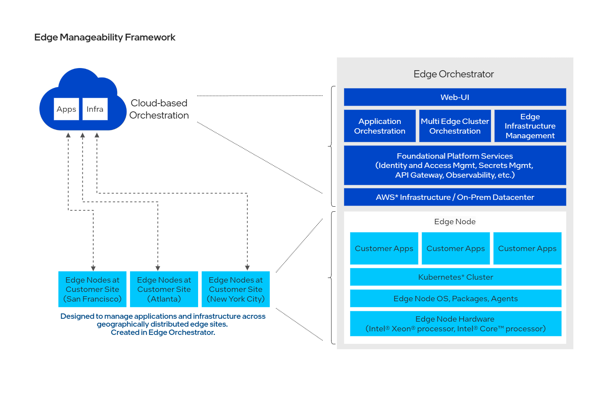

# Edge Manageability Framework

## Overview

Welcome to the Edge Manageability Framework, a comprehensive solution designed
to streamline and enhance the deployment and management of infrastructure and
applications at the edge. This framework leverages cutting-edge technologies to
provide robust solutions for hardware onboarding, secure workload deployment,
and cluster lifecycle management, all centered around Kubernetes-based
application deployment for edge computing.

## Primary Product: Edge Orchestrator

At the center of Edge Manageability Framework is Edge Orchestrator, the primary
solution to manage edge environments efficiently and securely. It encompasses a
range of features that cater to the unique demands of edge computing, ensuring
seamless integration and operation across diverse hardware and software
landscapes. Edge Orchestrator is designed to be the central hub for managing
edge infrastructure and edge application deployments at scale across
geographically distributed edge sites. It offers automated application
deployment based on customer-defined configuration & criteria, multitenancy and
identity & access management for tenants, observability & alerting capabilities,
dashboards for quick views of status & issue identification, and management of
all software deployments & infrastructure components including edge nodes (i.e.
hosts) and clusters.

### Key Components

Edge Orchestrator is used to centrally manage all Edge Nodes at sites and perform all lifecycle management of OS, clusters, and applications in the managed nodes. Edge Orchestrator consists of six main components, and it is deployable on-premises or in the cloud:

- [Edge Infrastructure Manager](https://docs.openedgeplatform.intel.com/edge-manage-docs/main/developer_guide/infra_manager/index.html): Policy-based secure life cycle management of a fleet of edge nodes/devices at scale, spread across distributed locations allowing onboarding, provisioning, inventory management, upgrades and more.
- [Edge Cluster Orchestrator](https://docs.openedgeplatform.intel.com/edge-manage-docs/main/developer_guide/cluster_orch/index.html): A lightweight orchestrator based on the Cluster API (CAPI) standard designed to automate the deployment and lifecycle management of Kubernetes* clusters at scale across distributed edges, providing centralized monitoring and access control.
- [Edge Application Orchestrator](https://docs.openedgeplatform.intel.com/edge-manage-docs/main/developer_guide/app_orch/index.html): Offers customers the ability to easily package, deploy and monitor cloud-native applications at scale across distributed edges
- [UI](https://github.com/open-edge-platform/orch-ui): The web user interface for the Edge Orchestrator, allowing the user to manage most of the features of the product in an intuitive, visual, manner without having to trigger a series of APIs individually.
- [Observability](https://docs.openedgeplatform.intel.com/edge-manage-docs/main/developer_guide/observability/index.html): A modular observability stack that provides visibility into the health and performance of the system, including logging, reporting, alerts, and SRE data from Edge Orchestrator components and Edge Nodes.
- [Platform Services](https://docs.openedgeplatform.intel.com/edge-manage-docs/main/developer_guide/platform/index.html): A collection of services that support the deployment and management of the Edge Orchestrator, including identity and access management, multitenancy management, ingress route configuration, secrets and certificate management, cloud and on-prem infrastruture life-cycle management and more.

## Get Started

There are multiple ways to begin to learn about, use, or contribute to Edge
Orchestrator.

- Start by deploying your own
  orchestrator [in the cloud or on-premises](https://github.com/open-edge-platform/orch-docs/blob/main/docs/deployment_guide/index.rst)
- Read the
  latest [Release Notes](https://github.com/open-edge-platform/orch-docs/blob/main/docs/release_notes/index.rst)
  or explore
  the [User Guide](https://github.com/open-edge-platform/orch-docs/blob/main/docs/user_guide/index.rst)
- Learn about all components, their architecture and usage, and how to contribute in
  the [Developer Guide](https://docs.openedgeplatform.intel.com/edge-manage-docs/main/developer_guide/index.html)
   - CI based Dev workflow - make changes to any 1 component of the Edge Orchestrator, locally build your change, test locally with prebuilt images of the rest of the components and emulated Edge Nodes, and then submit a PR to the component CI and the [Edge Manageability Framework CI](https://github.com/open-edge-platform/edge-manageability-framework/actions).
   - Buildall based Dev workflow - make changes and build all the components locally and test using the [buildall](https://github.com/open-edge-platform/edge-manageability-framework/tree/main/buildall) script
- [Troubleshooting](https://docs.openedgeplatform.intel.com/edge-manage-docs/main/developer_guide/troubleshooting/index.html)

###  Repositories

There are several repos that make up the Edge Manageability Framework in the Open Edge Platform.
Here is brief description of all the repos.

#### Edge Manageability Framework (deploy)

- [edge-manageability-framework](https://github.com/open-edge-platform/edge-manageability-framework):
  The central hub for deploying the Edge Orchestrator. This repo includes Argo CD
  applications, Helm charts, and deployment scripts necessary for setting up the
  orchestrator in various environments, including on-premise and cloud-based
  setups. Once the Edge Orchestrator is operational, all Edge Node software is deployed via the Edge Orchestrator.

#### Edge Infrastructure Manager

- [infra-core](https://github.com/open-edge-platform/infra-core) (top-level repo): Core services
  for the Edge Infrastructure Manager including inventory, APIs, tenancy and more.
- [infra-managers](https://github.com/open-edge-platform/infra-managers):
  Provides life-cycle management services for edge infrastructure resources via a collection of resource managers.
- [infra-onboarding](https://github.com/open-edge-platform/infra-onboarding):
  A collection of services that enable remote onboarding and provisioning of Edge Nodes.
- [infra-external](https://github.com/open-edge-platform/infra-external):
  Vendor extensions for the Edge Infrastructure Manager allowing integration with 3rd party software
- [infra-charts](https://github.com/open-edge-platform/infra-charts): Helm
  charts for deploying Edge Infrastructure Manager services.

#### Edge Cluster Orchestration

- [cluster-manager](https://github.com/open-edge-platform/cluster-manager) (top-level repo):
  Core services for life cycle management of edge clusters, including APIs, tenancy, integration with CAPI, and operation.
- [cluster-api-provider-intel](https://github.com/open-edge-platform/cluster-api-provider-intel):
  Cluster-API (CAPI) compliant provider for edge clusters on Edge Nodes managed by Edge Orchestrator.
- [cluster-tests](https://github.com/open-edge-platform/cluster-tests): Offers
  testing framework for edge cluster management.
- [cluster-connect-gateway](https://github.com/open-edge-platform/cluster-connect-gateway):
  Provides access to edge clusters via a secure tunnel between the Edge Orchestrator and Edge Nodes.

#### Edge Application Orchestrator

- [app-orch-catalog](https://github.com/open-edge-platform/app-orch-catalog) (top-level repo):
  Facilitates catalog services for end-user application definition and packaging for deployment to Edge Nodes.
- [app-orch-tenant-controller](https://github.com/open-edge-platform/app-orch-tenant-controller):
  Manages tenancy control for Application Orchestrator
- [app-orch-deployment](https://github.com/open-edge-platform/app-orch-deployment):
  Manages deployment and application lifecycle for end-user cloud-native
  applications across distributed edges.

#### User Interface

- [orch-ui](https://github.com/open-edge-platform/orch-ui): The web user interface for the Edge Orchestrator, allowing the user to manage most of the features of the product in a single intuitive GUI.
- [orch-metadata-broker](https://github.com/open-edge-platform/orch-metadata-broker):
  Service responsible for storing and retrieving metadata, enabling the UI to populate dropdowns with previously entered metadata keys and values.

#### Observability

- [o11y-charts](https://github.com/open-edge-platform/o11y-charts): This
  repository provides key Observability Helm Charts and its helper applications
  deployable on the Edge Orchestrator.
- [o11y-alerting-monitor](https://github.com/open-edge-platform/o11y-alerting-monitor):
  Alerting Monitor service handles management of alert notifications in the Edge
  Orchestrator.
- [o11y-sre-exporter](https://github.com/open-edge-platform/o11y-sre-exporter):
  SRE Exporter service enables exporting Edge Orchestrator's Service Level
  Indicators (SLIs) and its key runtime metrics to external systems.
- [o11y-tenant-controller](https://github.com/open-edge-platform/o11y-tenant-controller):
  Observability Tenant Controller service maintains multitenancy configuration
  for Observability (o11y) services on Edge Orchestrator.

#### Platform Services

- [orch-utils](https://github.com/open-edge-platform/orch-utils): The orch-utils
  repository provides various utility functions and tools that support the
  deployment and management of the Edge Orchestrator. This includes Kubernetes
  jobs, Helm charts, Dockerfiles, and Go code for tasks such as namespace
  creation, policy management, Traefik route configuration, IAM and multitenancy.

#### Documentation

- [orch-docs](https://github.com/open-edge-platform/orch-docs): Edge
  Orchestrator documentation includes deployment, user, and developer guides; and API references, tutorials, troubleshooting, and
  software architecture specifications. You can also visit our
  [documentation](https://docs.openedgeplatform.intel.com/edge-manage-docs/main/developer_guide/contributor_guide/index.html).

#### Common Services

- [orch-library](https://github.com/open-edge-platform/orch-library): Offers
  shared libraries and resources for application and cluster lifecycle
  management.
- [cluster-extensions](https://github.com/open-edge-platform/cluster-extensions):
  Provides extensions for edge clusters managed by Edge Orchestrator. A standard set of extensions are deployed on all edge clusters.
  An optional set of extensions can be deployed on-demand.

#### Edge Nodes / Hosts

- [edge-node-agents](https://github.com/open-edge-platform/edge-node-agents):
  Collection of all the agents installed in the Edge Node OS that work together with the Edge Orchestrator to manage Edge Node functionality.
- [virtual-edge-node](https://github.com/open-edge-platform/virtual-edge-node):
  Collection of software based emulators and simulators for physical Edge Nodes used in test environments.

#### Secure Edge Deployment

- [trusted-compute](https://github.com/open-edge-platform/trusted-compute):
  Security extensions that utilize hardware security capabilities in Edge Nodes to enable continuous monitoring
  and end-user appliction (workload) protection through isolated execution.

#### Shared CI

- [orch-ci](https://github.com/open-edge-platform/orch-ci): Open Edge Platform
  Central hub for continuous integration (CI) workflows and actions shared across all repos.

## Community and Support

To learn more about the project, its community, and governance, visit
the [Edge Orchestrator Community](https://github.com/open-edge-platform).

## License

Edge Manageability Framework is licensed
under [Apache 2.0](http://www.apache.org/licenses/LICENSE-2.0)
