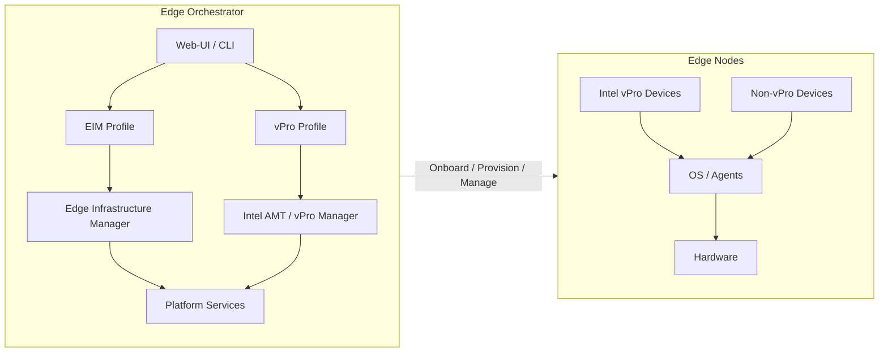

# Edge Manageability Framework

[](https://opensource.org/licenses/Apache-2.0)
[](https://scorecard.dev/viewer/?uri=github.com/open-edge-platform/edge-manageability-framework)

## Overview

Welcome to the Edge Manageability Framework, a comprehensive solution designed
to streamline and enhance the deployment and management of edge infrastructure.
This framework provides robust solutions for hardware onboarding, provisioning,
inventory management, and secure lifecycle management of edge nodes at scale,
with built-in support for Intel vPro and AMT-based remote management.

## Primary Product: Edge Orchestrator

At the center of Edge Manageability Framework is Edge Orchestrator, the primary
solution to manage edge infrastructure efficiently and securely. It encompasses
a range of features that cater to the unique demands of edge computing, ensuring
seamless integration and operation across diverse hardware landscapes. Edge
Orchestrator is designed to be the central hub for managing edge infrastructure
at scale across geographically distributed edge sites. It offers multitenancy
and identity & access management for tenants, dashboards for quick views of
status & issue identification, and management of all infrastructure components
including edge nodes (i.e. hosts). Two deployment profiles are supported:
**Edge Infrastructure Management (EIM)** for full infrastructure lifecycle
management, and **vPro** for lightweight Intel AMT-based remote management.


```mermaid
flowchart LR
    subgraph Orch["Edge Orchestrator"]
        direction TB
        A["Web-UI / CLI"]
        B["EIM Profile"]
        C["vPro Profile"]
        D["Edge Infrastructure Manager"]
        E["Intel AMT / vPro Manager"]
        F["Platform Services"]
        A --> B & C
        B --> D
        C --> E
        D & E --> F
    end

    subgraph Edge["Edge Nodes"]
        direction TB
        G["Intel vPro Devices"]
        H["Non-vPro Devices"]
        I["OS / Agents"]
        J["Hardware"]
        G & H --> I --> J
    end

    Orch -->|"Onboard / Provision / Manage"| Edge
```

### Key Components

Edge Orchestrator is used to centrally manage all Edge Nodes at sites and perform lifecycle management of OS
and infrastructure in the managed nodes. Edge Orchestrator consists of the following main components, and it is
deployable on-premises:

- [Edge Infrastructure Manager](https://docs.openedgeplatform.intel.com/edge-manage-docs/main/developer_guide/infra_manager/index.html):
Policy-based secure life cycle management of a fleet of edge nodes/devices at scale, spread across distributed
locations allowing onboarding, provisioning, inventory management, upgrades and more.
- [UI](https://github.com/open-edge-platform/orch-ui): The web user interface for the Edge Orchestrator, allowing the
user to manage most of the features of the product in an intuitive, visual, manner without having to trigger a series
of APIs individually.
- [CLI](https://github.com/open-edge-platform/orch-cli): The command line interface for the Edge Orchestrator,
allowing the user to manage most of the features of the product in an intuitive,
text-based manner without having to trigger a series of APIs individually.
- [Platform Services](https://docs.openedgeplatform.intel.com/edge-manage-docs/main/developer_guide/platform/index.html):
A collection of services that support the deployment and management of the Edge Orchestrator, including identity and
access management, multitenancy management, ingress route configuration, secrets and certificate management, and
on-prem infrastructure life-cycle management.

## Get Started

There are multiple ways to begin to learn about, use, or contribute to Edge Orchestrator.

### Deploy using Helmfile

The Edge Orchestrator is deployed on-premises using [Helmfile](https://github.com/helmfile/helmfile).
The deployment is organized into two phases under `helmfile-deploy/`:

1. **Pre-Orchestrator** (`helmfile-deploy/pre-orch/`) — Provisions the Kubernetes cluster
   (K3s, KIND, or RKE2), and optionally installs OpenEBS LocalPV and MetalLB:
   ```bash
   cd helmfile-deploy/pre-orch
   ./pre-orch.sh install
   ```

2. **Post-Orchestrator** (`helmfile-deploy/post-orch/`) — Deploys all Edge Orchestrator
   platform services, infrastructure managers, and Web UI using Helmfile with
   wave-based dependency ordering:
   ```bash
   cd helmfile-deploy/post-orch
   ./post-orch-deploy.sh install
   ```

Two deployment profiles are available:
- **`onprem-eim`** — Full Edge Infrastructure Management deployment
- **`onprem-vpro`** — Lightweight vPro-only deployment

Required configuration is set in `post-orch.env`:
- `EMF_CLUSTER_DOMAIN` — Cluster domain name
- `EMF_REGISTRY` — Container registry for Edge Orchestrator images
- `EMF_TRAEFIK_IP` / `EMF_HAPROXY_IP` — Load balancer IPs
- `EMF_STORAGE_CLASS` — Kubernetes storage class

For detailed deployment instructions, see [helmfile-deploy/post-orch/docs/README.md](helmfile-deploy/post-orch/docs/README.md).

### Learn More

- Read the latest [Release Notes](https://docs.openedgeplatform.intel.com/edge-manage-docs/main/release_notes/index.html)
  including KPIs, container and Helm chart listing and 3rd party dependencies
- Explore the [User Guide](https://docs.openedgeplatform.intel.com/edge-manage-docs/main/user_guide/index.html) and
  [API Reference](https://docs.openedgeplatform.intel.com/edge-manage-docs/main/api/index.html)
- Learn about all components, their architecture and inner workings, and how to contribute in
  the [Developer Guide](https://docs.openedgeplatform.intel.com/edge-manage-docs/main/developer_guide/index.html)
- [CI based Developer workflow](https://docs.openedgeplatform.intel.com/edge-manage-docs/main/developer_guide/contributor_guide/index.html):
  make changes to 1 or more components of the Edge Orchestrator, locally build your change, test locally with prebuilt
  images of the rest of the components, and then submit a PR to the component CI and the
  [Edge Manageability Framework CI](https://github.com/open-edge-platform/edge-manageability-framework/actions).

### Repositories

There are several repos that make up the Edge Manageability Framework in the Open Edge Platform.
Here is brief description of all the repos.

#### Edge Manageability Framework (deploy)

- [edge-manageability-framework](https://github.com/open-edge-platform/edge-manageability-framework):
  The central hub for deploying the Edge Orchestrator. This repo uses Helmfile
  to orchestrate Helm chart deployments and includes deployment scripts necessary
  for setting up the orchestrator in on-premise environments. The deployment is
  split into two phases: **pre-orch** (K8s cluster provisioning, OpenEBS, MetalLB)
  and **post-orch** (platform services, infrastructure managers, Web UI). Once the
  Edge Orchestrator is operational, all Edge Node software is deployed via the
  Edge Orchestrator.

#### Edge Infrastructure Manager

- [infra-core](https://github.com/open-edge-platform/infra-core) (top-level repo): Core services
  for the Edge Infrastructure Manager including inventory, APIs, tenancy and more.
- [infra-managers](https://github.com/open-edge-platform/infra-managers):
  Provides life-cycle management services for edge infrastructure resources via a collection of resource managers.
- [infra-onboarding](https://github.com/open-edge-platform/infra-onboarding):
  A collection of services that enable remote onboarding and provisioning of Edge Nodes.
- [infra-external](https://github.com/open-edge-platform/infra-external):
  Vendor extensions for the Edge Infrastructure Manager allowing integration with 3rd party software
- [infra-charts](https://github.com/open-edge-platform/infra-charts): Helm
  charts for deploying Edge Infrastructure Manager services.

#### User Interface

- [orch-ui](https://github.com/open-edge-platform/orch-ui): The web user interface for the Edge Orchestrator, allowing
  the user to manage most of the features of the product in a single intuitive GUI.
- [orch-metadata-broker](https://github.com/open-edge-platform/orch-metadata-broker):
  Service responsible for storing and retrieving metadata, enabling the UI to populate dropdowns with previously
  entered metadata keys and values.

#### Command Line Interface

- [orch-cli](https://github.com/open-edge-platform/orch-cli): The command line interface for the Edge Orchestrator, allowing
  the user to manage most of the features of the product in a single intuitive CLI.

#### Platform Services

- [orch-utils](https://github.com/open-edge-platform/orch-utils): The orch-utils
  repository provides various utility functions and tools that support the
  deployment and management of the Edge Orchestrator. This includes Kubernetes
  jobs, Helm charts, Dockerfiles, and Go code for tasks such as namespace
  creation, policy management, Traefik route configuration, IAM and multitenancy.

#### Documentation

- [edge-manage-docs](https://github.com/open-edge-platform/edge-manage-docs): Edge
  Orchestrator documentation includes deployment, user, and developer guides; and API references, tutorials,
  troubleshooting, and software architecture specifications. You can also visit our
  [documentation](https://docs.openedgeplatform.intel.com/edge-manage-docs/main/index.html).

#### Common Services

- [orch-library](https://github.com/open-edge-platform/orch-library): Offers
  shared libraries and resources for application and cluster lifecycle
  management.
- [cluster-extensions](https://github.com/open-edge-platform/cluster-extensions):
  Provides extensions for edge clusters managed by Edge Orchestrator. A standard set of extensions are deployed on all
  edge clusters.
  An optional set of extensions can be deployed on-demand.

#### Edge Nodes / Hosts

- [edge-node-agents](https://github.com/open-edge-platform/edge-node-agents):
  Collection of all the agents installed in the Edge Node OS that work together with the Edge Orchestrator to manage
  Edge Node functionality.
- [virtual-edge-node](https://github.com/open-edge-platform/virtual-edge-node):
  Collection of software based emulators and simulators for physical Edge Nodes used in test environments.

#### Secure Edge Deployment

- [trusted-compute](https://github.com/open-edge-platform/trusted-compute):
  Security extensions that utilize hardware security capabilities in Edge Nodes to enable continuous monitoring
  and end-user application (workload) protection through isolated execution.

#### Shared CI

- [orch-ci](https://github.com/open-edge-platform/orch-ci):
  Central hub for continuous integration (CI) workflows and actions shared across all repos.

## Community and Support

To learn more about the project, its community, and governance, visit
the Edge Manageability Framework community [Discussions page](https://github.com/open-edge-platform/edge-manageability-framework/discussions)

To submit issues, use the [Issues page](https://github.com/open-edge-platform/edge-manageability-framework/issues)

Discover more about the [Open Edge Platform](https://github.com/open-edge-platform).

## License

Edge Manageability Framework is licensed
under [Apache 2.0](http://www.apache.org/licenses/LICENSE-2.0)
