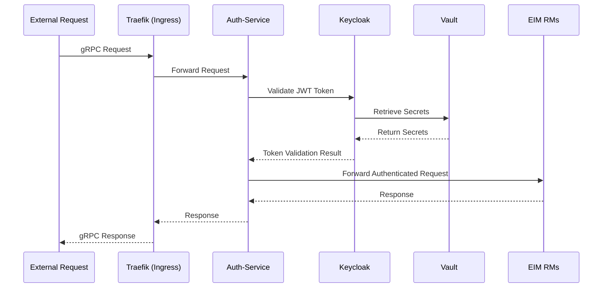

# ADR-001: Minimal Foundation Platform Services (FPS) for EMF

**Status:** Proposed

**Date:** 2025-09-30

## Context

The `eim-modular-decomposition.md` design proposal outlines a strategy to decompose the Edge Infrastructure Manager (EIM) into modular, independently consumable components. Currently, EIM services are tightly coupled to a monolithic deployment of shared infrastructure, including PostgreSQL, Keycloak, and other Foundation Platform Services (FPS). This makes it difficult for users to deploy subsets of EIM functionality without inheriting the entire infrastructure footprint.

To enable the modular evolution tracks, particularly "Track #1 (Status Quo + Use Case Enablement)" and "Track #2 (Bring-Your-Own Infrastructure)", we must first define a clear, minimal set of foundational services required for any functional EIM deployment. This ADR specifies that minimal core.

### Platform components used by EIM

#### Summary Table
| Pod in orch-infra       | Connects to External Service | Target Namespace | Service/Purpose            |
|--------------------------|-----------------------------|------------------|----------------------------|
| attestationstatusmgr     | platform-keycloak          | orch-platform    | OIDC Authentication        |
| dkam                     | platform-keycloak          | orch-platform    | OIDC Authentication        |
| dkam                     | rs-proxy                   | orch-platform    | Resource Proxy             |
| dm-manager               | platform-keycloak          | orch-platform    | OIDC Authentication        |
| host-manager             | platform-keycloak          | orch-platform    | OIDC Authentication        |
| maintenance-manager      | platform-keycloak          | orch-platform    | OIDC Authentication        |
| mps                      | vault                      | orch-platform    | Secrets Management         |
| onboarding-manager       | vault                      | orch-platform    | Secrets Management         |
| onboarding-manager       | platform-keycloak          | orch-platform    | OIDC Authentication        |
| onboarding-manager       | rs-proxy                   | orch-platform    | Resource Proxy             |
| os-resource-manager      | platform-keycloak          | orch-platform    | OIDC Authentication        |
| os-resource-manager      | rs-proxy                   | orch-platform    | Resource Proxy             |
| os-resource-manager      | rs-proxy-files             | orch-platform    | File Resource Proxy        |
| rps                      | vault                      | orch-platform    | Secrets Management         |
| telemetry-manager        | platform-keycloak          | orch-platform    | OIDC Authentication        |
| tenant-controller        | vault                      | orch-platform    | Secrets Management         |

---

#### Key External Services in orch-platform Namespace

##### platform-keycloak
- **Used by:** attestationstatusmgr, dkam, dm-manager, host-manager, maintenance-manager, onboarding-manager, os-resource-manager, telemetry-manager  
- **Purpose:** OIDC/OAuth2 authentication and authorization  

##### vault
- **Used by:** mps, rps, onboarding-manager, tenant-controller  
- **Purpose:** Secrets management and secure credential storage  

##### rs-proxy
- **Used by:** dkam, onboarding-manager, os-resource-manager  
- **Purpose:** Resource proxy service  

##### rs-proxy-files 
- **Used by:** os-resource-manager  
- **Purpose:** File resource proxy service  

## Decision

We will define the minimal required Foundation Platform Services (FPS) stack for the Edge Management Framework (EMF) to consist of the following four components:

1.  **Identity Service (Keycloak):** Provides centralized authentication and authorization (IAM) for all EIM services, APIs, and users. It is responsible for managing realms, clients, users, and issuing JWT tokens that are fundamental to securing inter-service communication and tenancy.

2.  **Secrets Management Service (Vault):** Provides secure storage, access, and lifecycle management for all secrets, including database credentials, service tokens, TLS certificates, and private keys. This decouples secret management from application configuration and enhances security.

3.  **Ingress Gateway (Traefik):** Acts as the reverse proxy and API gateway for the platform. It manages all external network traffic, provides TLS termination, and routes requests to the appropriate EIM microservices.

4. **Auth-service:** Acts as a service-to-service authentication and authorization gateway that integrates with Keycloak. It is an authentication middleware that validates JWT tokens issued by Keycloak for incoming API requests. It enforces authorization policies for EMF micro services and acts as centralized authentication layer betwee  traefik ingress gateway and back EMF services. Here is the source code for [auth service](https://github.com/open-edge-platform/orch-utils/tree/main/auth-service)


Here is the sqeuence of network traffic flow.


Typical Use Cases platform services in EIM

a. API Gateway Authentication: Validates that requests to EIM REST APIs have valid JWT tokens

b. Service Mesh Security: Ensures inter-service communication is authenticated

c. Multi-tenancy Enforcement: Routes requests based on tenant claims in JWT tokens

d. Token Introspection: Validates token expiration, scopes, and permissions before forwarding requests

These four services constitute the baseline infrastructure upon which all EIM modules, whether deployed individually or as a complete stack, will operate by default. The "Bring-Your-Own Infrastructure" track will focus on creating abstraction layers to make these specific components pluggable and replaceable with third-party equivalents.


### EIM Components level analysis for #Track1

This analysis identifies the minimum set of components required to run EIM (#Track1 only components) successfully. The current deployment has 100 pods (AO/CO/Observability disabled ) across 19 namespaces. 

#### Dependency Graph of EIM

```
orch-infra (26 pods - EIM Core)
    ├── orch-platform
    │   ├── platform-keycloak (OIDC Authentication)
    │   ├── vault (Secret Storage)
    │   ├── vault-agent-injector (Secret Injection)
    │   └── keycloak-tenant-controller (Multi-tenancy)
    │
    ├── orch-database
    │   └── postgresql-cluster (Database)
    │
    ├── istio-system
    │   └── istiod (Service Mesh)
    │
    ├── orch-iam
    │   ├── tenancy-manager (Tenant Management)
    │   └── nexus-api-gw (IAM Gateway)
    │
    └── kube-system (Kubernetes Core)
        ├── CoreDNS (DNS)
        ├── kube-proxy (Networking)
        └── Other K8s controllers
```
#### Minimal Configuration Summary

##### Key Findings:
- **orch-infra** requires 26 pods (all EIM components)
- **Critical dependencies:** Keycloak (auth), Vault (secrets), PostgreSQL (database), Istio (service mesh), Tenancy Manager (multi-tenancy)
- **Can be disabled:** ArgoCD, Kyverno, Web UI, Gateway, Boots, Cert-manager, Gitea, MetalLB, and others
- **Not needed:** Observability components (tracing disabled), external ingress, policy engines

---

##### Required Pods 

| Category | Namespace | Pods | Purpose |
|----------|-----------|------|---------|
| **EIM Core** | orch-infra | 26 | All Edge Infrastructure components |
| **Authentication** | orch-platform | 2 | Keycloak, Keycloak Tenant Controller |
| **Secrets** | orch-platform | 2 | Vault, Vault Agent Injector |
| **Database** | orch-database | 1 | PostgreSQL |
| **Service Mesh** | istio-system | 1-2 | Istiod control plane (TBD Should we disable it)|
| **Multi-tenancy** | orch-iam | 2 | Tenancy Manager, Nexus API Gateway |
| **Storage** | local-path-storage | 1 | PVC provisioner |
| **TOTAL** | | **35-40** | **Fully functional EIM** |

#### Optional Pods (62 total) - Can Disable

| Category | Namespaces | Pods | Impact of Disabling |
|----------|------------|------|---------------------|
| **GitOps** | argocd | 6 | Cannot deploy/update via ArgoCD (Shall be needed for 1st iteration)|
| **Policy** | kyverno | 9 | No policy enforcement |
| **UI** | orch-ui | 6 | No web interface (Orch-cli can be used for interaction)|
| **Ingress** | orch-gateway | 6 | Cannot expose externally (TBD: Nodeport?)|
| **Boot Services** | orch-boots | 2 | Alternative boot methods needed |
| **Certificates** | cert-manager | 3 | Manual cert management (TBD)|
| **Git Server** | gitea | 3 | No git repository |
| **Load Balancer** | metallb-system | 2 | No external LB (NodePort)|
| **Utilities** | ns-label, mailpit, postgresql-operator (optional) | 4 | Various utilities |
| **Istio Extras** | istio-system | 1 | Kiali visualization |
| **Platform Extras** | orch-platform | 3 | Proxy, reloader |
| **Trafik** | orch-platform |  | TBD: Shall be needed for 1st iteration (In case EIM handle the API this can be disabled) |

### Work items
- POC enable only the components needed for EIM deployment.
    - Identify the any dependency on any other components other than listed.
    - List out the any changes required to be done EIM.
    
- Split the deployment of Platform components and EIM components.
    - Script/Installer of OnPrem to setup only Platform components. This will for internal testing and development.
    - Script to deploy EIM and its dependent platform components. Assumes the Kubernetes cluster is provided by customer.

- Coder setup update to support only EIM profile.

- OnPrem setup update to support only EIM profile.

- Cloud TBD

### Optional Observability Services

While not strictly required for basic EIM functionality, the following services are strongly recommended for production deployments:

1. **Log Aggregation Service (Grafana Loki):** Provides centralized log collection, log aggregation, storage, and querying service that collects from all EIM components. Loki enables operators to troubleshoot issues, monitor system behavior, and maintain audit trails and operational insights across the distributed edge infrastructure. It includes 3 


## Consequences

### Positive

-   **Clear Dependency Contract:** Establishes a well-defined, minimal infrastructure baseline for developers and operators, simplifying the development of new modules.
-   **Enables Modularity:** Provides a stable foundation required to proceed with Track #1 and Track #2 of the modular decomposition. Use-case-specific deployments can rely on this core being present.
-   **Consistent Security Model:** Centralizes identity, secrets, and access control, ensuring a consistent security posture across all EIM components, regardless of the deployment profile.
-   **Simplified Onboarding:** New deployments have a clear, documented list of prerequisite infrastructure services.

### Negative

-   **Initial Overhead:** Even the most minimal EIM module deployment will require this foundational stack, which carries a non-trivial resource footprint.
-   **Technology Lock-in (Default):** While Track #2 aims to make these services pluggable, the default implementation creates a dependency on Keycloak, Vault, PostgreSQL, and Traefik.
-   **Configuration Complexity:** Operators must correctly configure the integration between EIM modules and these four foundational services.