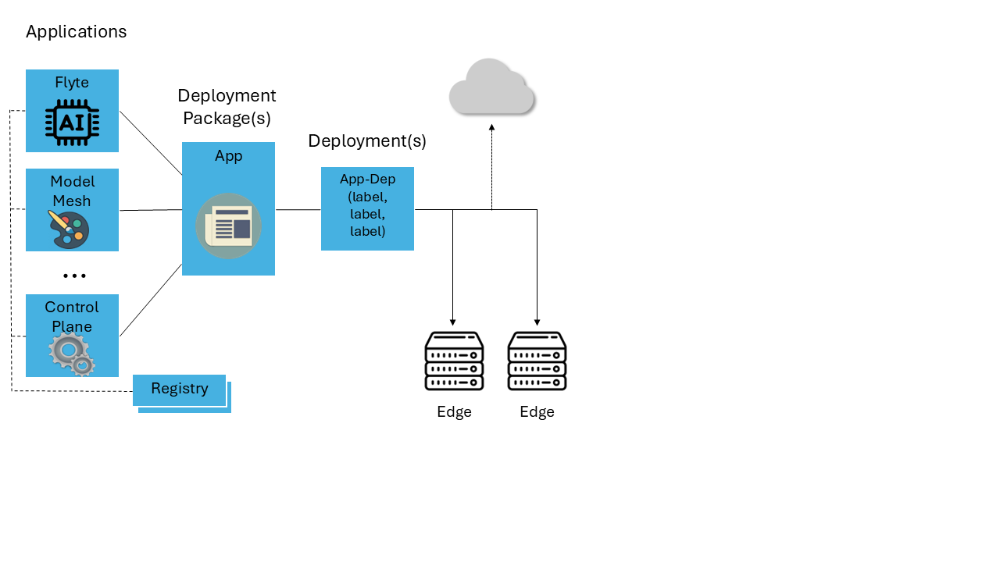
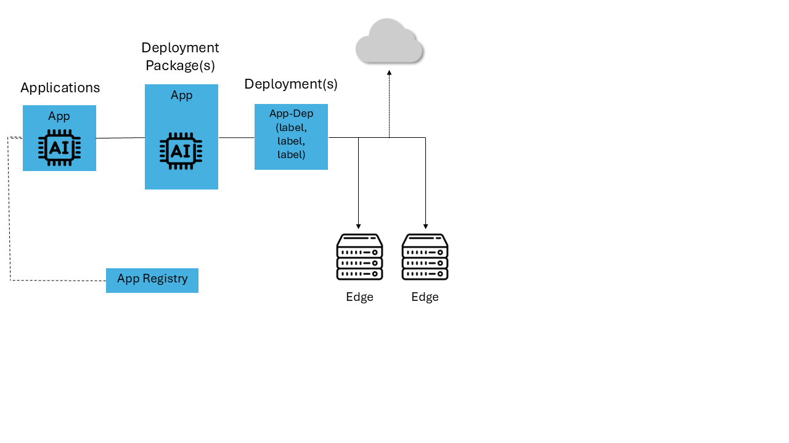

# Design Proposal: Deployment of Applications without using a Deployment Package

Author(s): Scott Baker

Last updated: 2025-05-08

## Abstract

Application Orchestration deploys Helm Charts.

A Helm Chart is represented in the App Orch Catalog as an `Application`, with each `Application`
object referring to exactly one Helm Chart. Applications are further bundled into
`Deployment Packages` with each `Deployment Package` containing one or more `Applications`. This
allows a collection of Applications (each of which is a Helm Chart) to be deployed as a unit to
one or more edge nodes. This feature has been leveraged for complex use cases that are built from
many helm charts.

While the `Deployment Package` offers flexibility in supporting complex use cases, it also
leads to unnecessary complexity for most common case, which only involve single  Helm Chart.
To deploy a single chart, the user has to create both an `Application` and `Deployment Package`.
The `Deployment Package` provides no added value if it points to exactly one `Application`,
but it creates a significant amount of additional work. Furthermore, a `Registry` object must
also exist to abstract the OCI registry URL of the chart.

This proposal is to allow deployment of `Application` without requiring creation of a
`Deployment Package`.

## Proposal

### Background

Below is a more detailed breakdown of the catalog data model. Some fields of these objects are
omitted for brevity, and this proposal will focus only on the fields that are relevant to
this proposal. Fields like display-names, descriptions, etc., have been omitted.

- `Registry`. A registry represents a Helm or Image Registry. The `Registry` object contains the
  following:

  - `name`. Name/identifier for the `Registry`.
  
  - `kind`. Whether the registry is used for Helm Charts or Docker Images.

  - `root_url`. The URL where charts are fetched from the registry.

  - `username`, `password`, `cacerts`. For private registries, the credentials necessary to access
    the registry.

- `Application`. The `Application` object contains the following:

  - `name`. Name/identifier for the `Application`

  - `version`. Version number for the `Application`. Not necessarily the same as the version
    number of the Helm Chart.

  - `helm_registry_name`, `chart_name`, `chart_version`. These three fields together identify the
    Helm Chart, by specifying a link to its `Registry` object, as well as the chart name and
    version.
  
  - `image_registry_name`. An optional link to an image registry that contains username and
    password for pulling docker images that are required by the helm chart.

  - `Profiles`. A set of named yaml files that are used as `values.yaml` parameters when
    deploying the helm chart. Each `Profile` supports `Parameter Templates`, which are an optional
    feature to prompt the user to fill in values at deployment time. Multiple `Profiles` are
    allowed, which allow the user to select between multiple canned configurations for the
    `Application`.

- `Deployment Package`. The `Deployment Package` object contains the following:

  - `name`. Name/identifier for the `Deployment Package`.

  - `version`. Version of the `Deployment Package`. Note that this is not necessarily the
    same as the `Application` version, or the Helm Chart version.

  - `applications`. A list of applications which comprise the `Deployment Package`. This is a
    set of (`application_name`, `application_version`) tuples.

  - `deployment_profiles`. A set of "master profiles", each of which contains a list of the
    application profiles to be bundled together. For example, if there are three `Applications`
    in the `Deployment Package`, then each `deployment_profile` would reference three
    application profiles, one for each application.

  - `is_deployed`. A boolean that keeps track of whether the `Deployment Package` is deployed.
    Used to prevent deletion of assets that are in use.

  - `default_namesspaces`. Used to pin applications to namespaces.

  - `namespaces`. Used to create and label namespaces at deployment time.

In Orchestrator 3.0, a single Helm Chart application requires all three objects to be created,
usually in a 1:1 correspondence. The user has to create the `Registry`, then they create an
`Application`, linking it to the `Registry`. Finally, the user creates the `Deployment Package`
and links it the `Application`. There is complexity and overhead in creating the
`deployment_profiles` as they have to shadow the application profiles.
There is complexity and error-prone in versioning all of these objects -- updating the
Helm Chart trickles up the chain requiring version increments to the `Application` and
`Deployment Package`.

### Deploying Applications

We will extend the Orchestrator to allow deploying an `Application`, without creating a
`Deployment Package`. To do this, we need to first make sure the `Application` contains all the
necessary information for deployment.

There are only three pieces of information in the `Deployment Package` that are not part of
the `Application` object.

- `is_deployed`. This must be added to `Application`, so we can track the deployment
  status of an `Application`.

- `default_namespaces`, `namespaces`. These can be represented as a single `default_namespace`
  field in the `Application`. The two fields in the `Deployment Package` can remain as
  overrides to alter the default behavior of the `Application` for more complex multi-application
  scenarios.

### Folding Registries into Applications

The common case is that a Helm Chart can be retrieved from its OCI URL, and optional username
and password. We could eliminate the need to have a separate `Registry` object by
adding these three fields to the `Application` object:

- `chart_url`. The URL of the OCI helm chart.

- `chart_username`, `chart_password`. Optional credentials to use when fetching the Helm Chart.

`chart_url` and the existing field `helm_registry_name` are mutually exclusive. The user must either
choose the simplified approach, or choose the more flexible approach of using the `Registry` object.
If `chart_url` is specified, then App Orch will also make it available as an image registry,
consistent with how `Image Pull Secrets` are implemented in the deployment manager. As such,
`chart_url` will also be mutually exclusive with `image_registry_name`.

If the user has a more complex use case that requires a custom cert, or they want to abstract
these details behind a named `Registry` object, they are free to do so. There is still value in
the `Registry` object, particularly in the case where private registries with authentication
are used as it allows sensitive security information to be stored in one object rather than
being replicated in many. Folding registry into Application is an optional means of simplifying
the common case, particularly for public charts.

### Automated Helm Chart Import

A separate proposal describes a `helm-to-dp` tool for automatically creating `Deployment Package`,
`Application`, and `Registry` by fetching and inspecting a Helm Chart.
This proposal works in synergy with that tool. The `helm-to-dp` tool currently creates all
three objects. If this proposal is accepted, then the `helm-to-dp` tool
will need to only create one object in the common case, instead of three.

## Rationale

One alternative approach would be eliminating `Deployment Package` entirely and make
`Application` a hierarchical object (i.e. An application could contain child Applications).
This approach has a certain elegance in that it mirrors the Helm pattern where a
Helm Chart may contain child charts. However, this is seen as too much of a divergence from
the current implementation as it would require completely refactoring the approach to
packages. Nothing in this proposal is incompatible with this alternative -- it could be
taken up as a second phase at a later time.

We could also consider eliminating the `Deployment Package` entirely. If a user wants to
deploy multiple charts at the same time, we could require them to use an "umbrella helm
chart", and we would represent the umbrella chart as a single Application object. Eliminating
objects is disruptive from a backward compatibility / upgrade standpoint. It also drops
a capability that is currently in use with demonstrated value. We propose re-evaluating
the prevalence of deployment packages after deployable Applications have been supported
for a few release cycles, and then making a decision whether to deprecate them.

Another proposal is to eliminate not just `Deployment Package`, but to eliminate `Application`
as well, and simply put OCI URLs into the `Deployment` objects. This has negative implications
on reusability -- if the user wishes to create a similar deployment on a second edge, then
they must re-create the deployment, entering all information a second time. Useful features
like Profiles and Parameter Templates are lost.

## Affected components and Teams

- Application Orchestration: Catalog and Deployment Services.

- GUI: User Interface.

## Implementation plan

- App Orch adds the new fields to the Application Object, updating API as
  necessary.

- App Orch modifies the Deployment object and Controller to support deploying applications
  without deployment packages.

- GUI team modifies the following pages:

  - Update the `Create Deployment` page with a choice to choose between deploying DPs or
    applications, and proceed with the appropriate workflow.

  - Update the deployment workflow so that in the case of deploying an `Application`, it can use
    the application profiles directly rather than requiring deployment package profiles.

  - Update the `Edit Deployment` page similar to the changes to `Create Deployment`
  - Update the `Deployments` list page to support linkage to both Apps and DP

  - Update the `Application` page to have a deployment link and display the `is_deployed` field in both list and detail view.

  - Update any status tables and dashboards as necessary to support these changes.

## Open issues (if applicable)

The requirements on GUI team are considerable. An idea that has been floated is to internally
create hidden internal `Deployment Packages` so the existing API calls and GUI workflow for
deployment would still work. This seems feasible -- Catalog could imply a `Deployment Package` object
if one does not exist and return it in the API. However, this might be confusing for users, if they
believe they are deploying `Applications`, and hidden `Deployment Package` leak into the workflows.
We decided it is better to have explicit deployment packages rather than trying to hide them.

## Decision

Decision is to defer this ADR. We will implement the ADR on helm-to-dp import and DP export which should
satisfy the requirement to simplify onboarding of helm-based applications.
