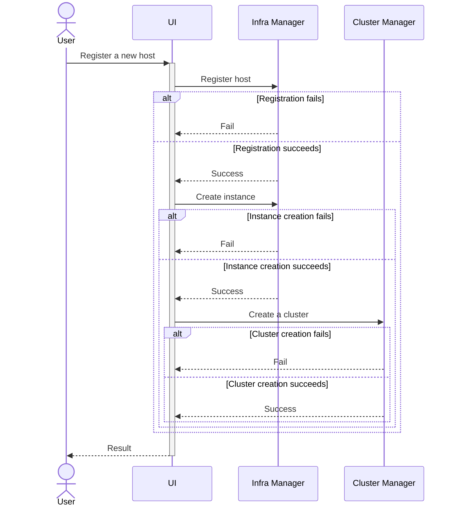

# Design Proposal: Automated Cluster Creation

Author(s): Hyunsun Moon

Last updated: 9/1/25

## Abstract

This proposal introduces an automated workflow that streamlines the process from host onboarding to cluster
bootstrapping, making bulk edge setup faster and more consistent.

### User Stories

#### User Story 1: Automatic Cluster Creation - Bulk Edge Onboarding

As an Edge Administrator (with Onboarding Manager and Operator roles), I want to onboard multiple edge hosts in bulk and
automatically create clusters using predefined templates, so that I can quickly provision a consistent environment for
workloads across distributed locations with minimal manual effort.

#### User Story 2: Manual Cluster Creation - Role-Based Separation of Duties

As an Edge Onboarding Manager, I want to onboard devices using their serial numbers and verify connectivity to the Edge
Manageability Framework, ensuring devices are ready for further configuration. As an Edge Operator, I want to focus on
deploying and managing workloads only without handling infrastructure details, maintaining a clear separation of
responsibilities.

#### User Story 3: Manual Cluster Creation - Manual Cluster Customization

As an Application Developer, I want to manually configure OS-level parameters (e.g., `isolcpus`), and create clusters
with custom templates accordingly, so that I can validate applications and experiment with different system and cluster
configurations.

## Proposal

Clusters for a specific host can be created in two ways:

**1. Automatically during host registration**: This option enables users to create clusters as part of the host
registration process, using a predefined cluster template. It is ideal for scenarios where edge usage is well-defined
and minimal manual intervention is desired for infrastructure setup.

**2. Manually through a direct request to the Cluster Manager**: This method allows users to create clusters on hosts
that have already been onboarded. It is particularly useful in scenarios where host onboarding and workload creation
occur independently, often managed by different users with distinct roles or at different times. For example, an
Onboarding Manager might register a pool of hosts with only the auto-onboard option enabled. Later, Edge Operators or
Users can select an operating system and create clusters using an OS profile, Kubernetes flavor, and template that best
align with specific workload requirements. This approach provides flexibility and adaptability, making it well-suited
for cloud-like edge usage.

### Automatic Cluster Creation

The first option introduces a streamlined process for users seeking simplicity or bulk registration of hosts, or both.
Both the Web UI and CLI will offer a new toggle for `Create Cluster Automatically` (potentially combined with `Provision
Automatically`, pending final design decisions) during registration. This option is only valid when `Provision
Automatically` is enabled. When enabled, it automatically creates a single-node cluster for each host.

Users can provide a default cluster template for all hosts in the registration request, with the flexibility to override
it for specific hosts if needed. For EMT machines, once a specific OS profile is selected, only cluster templates
compatible with that EMT version will be displayed.

The Cluster Manager API, which returns the list of cluster templates, will support filtering based on Kubernetes flavor
and version, ensuring users can only select templates that are compatible with their chosen OS profile.

An option to join an existing cluster was also considered to accommodate multi-node cluster scenarios. However, the
decision was made to defer workflow changes related to multi-node clusters to a later phase.

The sequence diagram illustrates the internal process of host registration. Each step in the sequence depends on the
success of the previous step. If a failure occurs at any point, subsequent requests will not be triggered. For example:

- If the `Register host` request to the Infra Manager fails, the process stops, and no further actions (e.g., creating
  an instance or cluster) are attempted.
- Similarly, if the `Create instance` request fails, the `Create a cluster` request will not be triggered.

Any successful requests will remain successful and will not be rolled back, as rollback mechanisms introduce significant
complexity. Instead, the UI will provide feedback to the user, indicating which steps succeeded and which failed, along
with the registration status of the host. This approach ensures transparency and allows users to address partial
failures manually.

### Manual Cluster Creation

Manual cluster creation enables users to dynamically create a cluster by selecting a template and hosts. We'll keep the
current workflow and implementation. For the record, following options has been considered:

**Option 1:** Restrict cluster creation to `onboarded and provisioned` hosts only, as in the current implementation.
During target host selection, provide a list of eligible hosts based on the selected region and site. This approach
introduces no changes to the user experience compared to previous releases.

**Option 2:** Allow cluster creation on any `onboarded` host, removing the requirement for the host to be `provisioned`.
During cluster creation, users can select an OS profile, cluster template, and optionally provide custom cloud-init
configuration for the cluster. This approach improves support for scenarios where system-level and Kubernetes-level
configurations must be coordinated (e.g., CPU pinning). However, it introduces breaking changes compared to previous
releases.

**Decision:** Continue with Option 1 for now, maintaining the current restriction to onboarded and provisioned hosts for
cluster creation.
