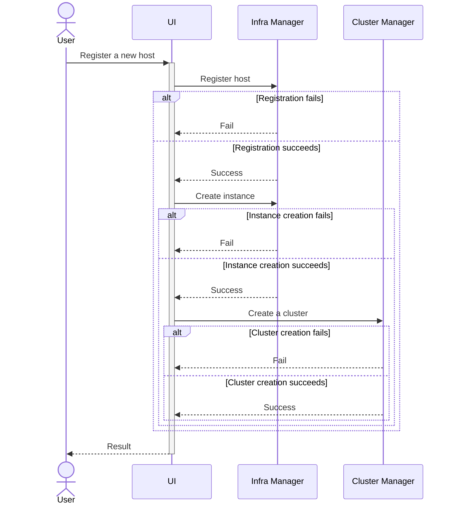

# Design Proposal: Automated Cluster Creation

Author(s): Hyunsun Moon

Last updated: 9/1/25

## Abstract

This proposal introduces an automated workflow that streamlines the process from host onboarding to cluster
bootstrapping, making bulk edge setup faster and more consistent.

### User Stories

#### User Story 1: Bulk Edge Onboarding with Automatic Cluster Creation

As an Edge Administrator (with Onboarding Manager and Operator roles), I want to onboard multiple edge hosts in bulk and
automatically create clusters using predefined templates, so that I can quickly provision a consistent environment for
workloads across distributed locations with minimal manual effort.

#### User Story 2: Role-Based Separation of Duties

As an Edge Onboarding Manager, I want to onboard devices using their serial numbers and verify connectivity to the Edge
Manageability Framework, ensuring devices are ready for further configuration. As an Edge Operator, I want to focus on
deploying and managing workloads only without handling infrastructure details, maintaining a clear separation of
responsibilities.

#### User Story 3: Manual OS and Cluster Customization

As an Application Developer, I want to manually configure OS-level parameters (e.g., `isolcpus`), and create clusters
with custom templates accordingly, so that I can validate applications and experiment with different system and cluster
configurations.

## Proposal

Clusters for a specific host can be created in two ways:

**1. Automatically during host registration**: This new option is designed for users with simple use cases who want
Kubernetes to be available with a pre-defined template, reducing user interactions during onboarding and cluster
creation.

**2. Manually through a direct request to the Cluster Manager**: This method allows users to create clusters on hosts
that have already been onboarded (or provisioned, depending on the finalized design). It is particularly useful in
scenarios where host onboarding and workload creation occur independently, often managed by different users with
distinct roles or at different times. For example, an Onboarding Manager might register a pool of hosts with only the
auto-onboard option enabled (and potentially auto-provision, based on the final design). Later, Edge Operators or Users
can select an operating system and create clusters using an OS profile, Kubernetes flavor, and template that best align
with specific workload requirements. This approach provides flexibility and adaptability, making it well-suited for
cloud-like edge usage.

#### Automatic Cluster Creation

The first option introduces a streamlined process for users seeking simplicity or bulk registration of hosts, or both.
Both the Web UI and CLI will offer a new toggle for `Create Cluster Automatically` (potentially combined with `Provision
Automatically`, pending final design decisions) during registration. This option is only valid when `Provision
Automatically` is enabled. When enabled, it automatically creates a single-node cluster for each host.

Users can provide a default cluster template for all hosts in the registration request, with the flexibility to override
it for specific hosts if needed. For EMT machines, once a specific OS profile is selected, only cluster templates
compatible with that EMT version will be displayed.

The Cluster Manager API, which returns the list of cluster templates, will support filtering based on Kubernetes flavor
and version, ensuring users can only select templates that are compatible with their chosen OS profile.

An option to join an existing cluster was also considered to accommodate multi-node cluster scenarios. However, the
decision was made to defer workflow changes related to multi-node clusters to a later phase.

The sequence diagram illustrates the internal process of host registration. Each step in the sequence depends on the
success of the previous step. If a failure occurs at any point, subsequent requests will not be triggered. For example:

- If the `Register host` request to the Infra Manager fails, the process stops, and no further actions (e.g., creating
  an instance or cluster) are attempted.
- Similarly, if the `Create instance` request fails, the `Create a cluster` request will not be triggered.

Any successful requests will remain successful and will not be rolled back, as rollback mechanisms introduce significant
complexity. Instead, the UI will provide feedback to the user, indicating which steps succeeded and which failed, along
with the registration status of the host. This approach ensures transparency and allows users to address partial
failures manually.

While this design avoids rollback complexity, future iterations may explore implementing rollback mechanisms to handle
partial failures more gracefully and make the host registration operation atomic. This could involve introducing
transactional workflows that ensure either all steps succeed or none are applied, reducing the need for manual
intervention in case of partial failures.

#### Manual Cluster Creation

Manual cluster creation enables users to dynamically create a cluster by selecting a template and host. Currently, this
process targets hosts already provisioned with a specific OS. With the proposed design change, the workflow must account
for the fact that the K3s version available on an EMT machine is predefined. Below are three potential approaches to
address this limitation:

**Option 1:** Restrict cluster creation to provisioned hosts only, as in the current implementation. During target host
selection, provide a list of eligible hosts based on the selected cluster template for K3s. This list includes all
Ubuntu machines and EMT machines with a compatible K3s version embedded for the selected cluster template. The UI must
clearly represent this behavior to avoid confusion. The logic for CAPINTEL remains unchanged, creating a Workload and
adding the Instance associated to the host to the Workload. If the K3s version to deploy is incompatible with the
existing EMT version, users must manually re-onboard and re-provision the host. This approach minimizes changes to the
user experience compared to previous releases.

**Option 2:** Similar to Option 1, but allow the selection of EMT machines with incompatible K3s versions. When such a
host is selected, CAPINTEL resolves the mismatch by requesting the Infra Manager to update the EMT version to one
compatible with the selected cluster template. (This assumes that A/B updates to a lower version are supported.)

**Option 3:** Restrict cluster creation to onboarded hosts only, rather than provisioned hosts. Alternatively,
streamline the process by removing the "provisioned" status of hosts, as its purpose is unclear. During cluster
creation, users would select an OS profile, with eligible profiles filtered based on the selected cluster template. This
includes all Ubuntu profiles and EMT profiles with compatible K3s versions for the chosen template. In this approach,
CAPINTEL must request the Infra Manager to create an Instance first to install the OS with the selected profile, before
assigning the Instance to the Workload. While this approach is a breaking change from previous releases, it aligns with
the new design principle of treating Kubernetes as an integral part of the infrastructure. It also supports the purpose
of manual creation, enabling users to configure the edge environment—including both the OS and Kubernetes—based on the
defined workload type.

**Decision for 3.1 Release** The decision for the 3.1 release is to proceed with **Option 1**, as it is less disruptive
and preserves the same user experience as the previous release. This approach minimizes changes while addressing the
immediate requirements from existing users. **Option 3** will be revisited in future releases to accommodate workloads
that require correlation between provisioning-time OS-level configuration via cloud-init and custom Kubernetes-level
configuration via cluster template, for example, RT workload with core pinning configuration, for manual cluster
creation and deletion workflows.

**Decision for 3.2 Release** Open
