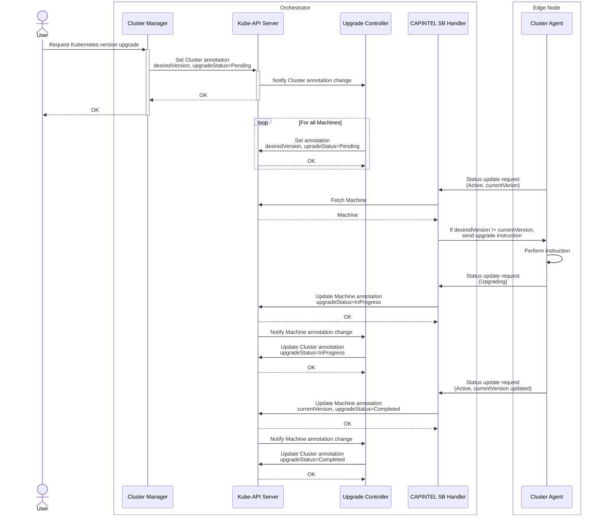

# Design Proposal: In-Place Update of Kubernetes Version

Author(s): Hyunsun Moon

Last updated: 9/19/25

## Background

This document outlines a design for enabling in-place upgrades of Kubernetes clusters managed by EMF. While Cluster
API—the foundation of EMF Cluster Orchestration—currently treats Machines as immutable and does not natively support
in-place upgrades, there is a recognized need for such functionality in environments where immutable rollouts are too
disruptive. The community has accepted a proposal to support external or custom upgrade mechanisms ([in-place updates
proposal](https://github.com/g-gaston/cluster-api/blob/in-place-updates-proposal/docs/proposals/20240807-in-place-updates.md)),
allowing custom rollout strategies via External Update Extensions.

EMF has delayed implementing its own in-place upgrade mechanism, anticipating upstream Cluster API support to avoid
temporary workarounds. However, due to uncertainty in the Cluster API roadmap, the urgent need for this capability in
production edge environments (such as rapid CVE patching), and strong customer demand, EMF will develop an independent
solution for Kubernetes version upgrades. This solution will be maintained until a community-supported approach becomes
available.

## Design

### Principle

The solution adheres to these principles:

- Limit upgrade functionality strictly to Kubernetes version changes.
- Avoid upstream modifications to accelerate delivery and reduce external dependencies.
- Ensure simplicity and loose coupling for easy migration to future community-supported solutions.

### Options

#### Option 1: Dedicated Upgrade Controller

Inspired by the [Canonical Kubernetes CAPI
provider](https://documentation.ubuntu.com/canonical-kubernetes/release-1.32/capi/howto/in-place-upgrades/), this
approach uses annotations on Cluster and Machine resources to track desired and current Kubernetes versions. Unlike
Canonical’s method, which embeds upgrade logic in the control plane provider, this design introduces a dedicated upgrade
controller within Cluster Manager, operating outside of CAPI components. The controller propagates the desired version
to Machines, prompting the CAPI Intel Provider to initiate upgrades. This separation keeps upgrade orchestration
independent from core control plane logic and avoids upstream changes.

**Pros**

- Aligns closely with the design principles.
- Enables reuse of upgrade controller for future implementation of the External Updater.

**Cons**

- Manages Kubernetes version outside the control plane provider, diverging from standard CAPI practices.
- Requires custom logic for rolling upgrades in multi-node clusters, similar to the control plane provider.

#### Option 2: Control Plane Provider-Driven Upgrade

This option annotates the Cluster CR to signal an upgrade, allowing CAPINTEL (Cluster API Intel Provider) to trigger
upgrades during machine create or delete events, following the immutable upgrade pattern. The standard CAPI workflow is
preserved: update Cluster Spec.Version and let the control plane provider handle the rollout.

**Pros**

- Leverages existing rolling upgrade logic.
- Maintains standard CAPI workflows.

**Cons**

- CAPINTEL must simulate scale up/down operations during upgrades, potentially complicating implementation and requiring
  changes to machine lifecycle management.

#### Decision

We will proceed with **Option 1**: Dedicated Upgrade Controller in Cluster Manager. In the initial phase, the
implementation will focus on enabling in-place upgrades mechanism for a single Machine by introducing additional
annotations and updating the CAPINTEL southbound handler. This approach addresses the immediate need for single-node
cluster upgrades and establishes a foundation for future integration with an External Updater, should upstream support
become available. In the subsequent phase, the solution will be extended to support rolling upgrades for multi-node
clusters if needed by adding a controller that orchestrates the upgrade process across all cluster nodes.

### High Level Flow

### Required Changes Summary

- **Annotations**
    - `desiredVersion` (Cluster, Machine): Specifies the target Kubernetes version for upgrade.
    - `currentVersion` (Cluster, Machine): Records the currently running Kubernetes version.
    - `upgradeStatus` (Cluster, Machine): Indicates upgrade progress (`Pending`, `InProgress`, `Completed`, `Error`).

- **Upgrade Controller**
    - Monitors and updates version-related annotations for CAPI Cluster and Machine resources.

- **CAPINTEL SB Handler**
    - Interprets new annotations to trigger upgrade actions.
    - Communicates upgrade instructions to the Cluster Agent.

- **Cluster Manager**
    - Enables cluster upgrades by updating the Cluster Template.
    - Applies the desired Kubernetes version through resource annotations.
    - Tracks and updates the upgrade status in the cluster detail response. 

- **Cluster Agent**
    - Reports the current Kubernetes version in status updates.
    - Handles upgrade instructions and supports the `Upgrading` status.
