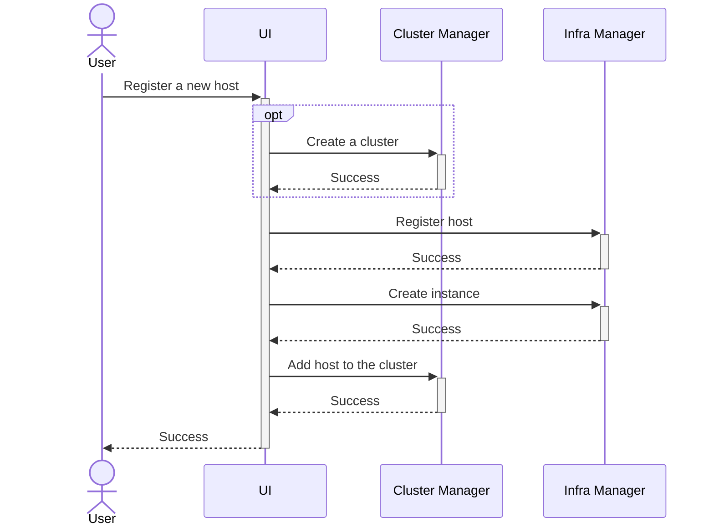

# Design Proposal: Integrating Kubernetes into Edge Microvisor Toolkit

Author(s): Hyunsun Moon

Last updated: 5/2/25

## Abstract

The Edge Microvisor Toolkit (EMT) is an operating system specifically designed for hosting Kubernetes, streamlining traditional general-purpose operating systems by including only the essential components needed to run container-based applications. Our experience from previous releases has demonstrated that EMT's design principles—image-based deployment and immutable root filesystem—enhance the reliability and consistency of cluster creation compared to even well-maintained general-purpose operating systems, such as Ubuntu.

This proposal aims to extend these proven approaches to Kubernetes lifecycle management by integrating Kubernetes directly into EMT. The integration involves two key changes: incorporating Kubernetes into the EMT build process and embedding it within the image. While this does not mean that EMT machines will come with Kubernetes pre-installed and running, users will still need to configure and initialize Kubernetes. Given that turning into a Kubernetes node is the primary and only use case for EMT machines, a new option will be introduced during the host registration step to allow for the automatic installation of Kubernetes with pre-configured default settings. This addition will streamline the process, making edge devices ready for use more efficiently.

With this design change, we anticipate reduced and consistent cluster creation times, enhanced reliability by eliminating third-party dependencies, improved security through faster application of CVEs, and an improved user experience by providing a zero-touch option from device onboarding to a cluster-ready state.

## Proposal

### Building Kubernetes

#### What to build

Cluster Orchestration supports two flavors of Kubernetes distributions: RKE2 and K3s [todo: add link to k3s design proposal]. In the initial implementation, we will focus on K3s, as it is set to be the default Kubernetes distribution in Cluster Orchestration. K3s is simpler to build compared to RKE2 because it integrates Kubernetes into a single binary, making it a preferred choice for quick implementation. RKE2 can be still installed on EMT as before.

The build process will focus on creating the first-level of binary and assets, excluding their dependencies. For instance, the K3s build process involves downloading and building containerd, etcd, and other dependencies from the upstream repositories. We will leverage their existing build process without building these nested dependency separately. For a comprehensive list of dependencies that we are not directly building, refer to the [K3s build script](https://github.com/k3s-io/k3s/blob/master/scripts/version.sh). This decision may evolve based on future needs.

Complete list of assets to build and/or package for K3s installation include the following. 

**K3s**
- k3s (binary)
- k3s-selinux (rpm)
- install.sh (script)

**Addon Container Images**
- klipper-helm
- klipper-lb
- local-path-provisioner
- coredns
- busybox
- traefik
- metrics-server
- pause

The list of addon container images is sourced from https://github.com/k3s-io/k3s/blob/master/scripts/airgap/image-list.txt. In the initial implementation, we will focus on building and packaging the K3s assets only and use pre-built tarball for addon container images.

For simplicity, the K3s version will be limited to the latest stable release, and users will not be able to select a specific version. A new EMT image will be released under two additional conditions: when a new K3s version becomes available or when a critical CVE or security patch is required, supplementing the existing release cadence. This decision may evolve based on future user requirements.

#### How to build

To build and package K3s, we will leverage the existing EMT build pipeline. As an RPM-based distribution, EMT simplifies the process of building and creating new RPM packages that can be installed on EMT. This involves writing a SPEC file that specifies the source location and build commands, and placing it in the SPECS folder of the repository. This approach offers significant advantages, such as eliminating the need to maintain forks of upstream repositories while providing the flexibility to apply patches and standardizing the build process for various software components with diverse build requirements. And of course, the subsequent step of integrating Kubernetes into the EMT image becomes very straightforward.

Here is an example of SPEC file to build and package K3s binary:

```
...
# This is not a complete SPEC and hasn't been tested

Source0: https://github.com/k3s-io/k3s/archive/refs/tags/%{version}.tar.gz
Source1: https://github.com/k3s-io/k3s/releases/download/%{version}/k3s-airgap-images-amd64.tar.zst

BuildRequires: make
BuildRequires: docker

%build
make local-binary

%install
mkdir -p %{buildroot}/usr/local/bin
install -m 0755 bin/k3s %{buildroot}/usr/local/bin/k3s

mkdir %{buildroot}/opt
install -m 0755 install.sh %{buildroot}/opt/install.sh

mkdir -p %{buildroot}/var/lib/rancher/k3s/agent/images
install -m 0644 %{SOURCE1} %{buildroot}/var/lib/rancher/k3s/agent/images/k3s-airgap-images-amd64.tar.zst

%files
/usr/local/bin/k3s
/opt/install.sh
/var/lib/rancher/k3s/agent/images/k3s-airgap-images-amd64.tar.zst
...
```

### Making Kubernetes part of EMT

Once RPM packages for K3s are ready, integrating them into the EMT image is straightforward, as detailed in [customizing the image guide](https://github.com/open-edge-platform/edge-microvisor-toolkit/blob/3.0/docs/developer-guide/get-started/building-howto.md#customizing-an-image). In summary, a new package list file, `toolkit/imageconfigs/packagelists/k3s.json`, containing the k3s and k3s-selinux packages will need to be created and appended to the `PackageLists` section of all edge image configuration files.

[todo: add a proposal to specify K3s version to the image name]

It is important to note that while the K3s binary benefits from the immutability provided by its placement in the read-only partition of EMT, ensuring it cannot be updated without an EMT image update, the same level of immutability is not guaranteed for addon images. Addons, which are essentially Kubernetes Pods, can be updated after their initial creation using images loaded from the embedded tarball.

### Cluster Manager Changes

#### Skip download K3s for EMT

To ensure that K3s on EMT utilizes the binary and images embedded within EMT, rather than downloading them from the Internet, `INSTALL_K3S_SKIP_DOWNLOAD` environment variable should set to true when bootstrapping K3s. This prevents the bootstrap script from attempting to download components externally.

For configurations using CAPI provider for K3s, the equivalent setup involves specifying the airGapped option in the control plane template. Here is an example configuration:

```yaml
apiVersion: controlplane.cluster.x-k8s.io/v1beta2
kind: KThreesControlPlaneTemplate
metadata:
  name: k3s-control-plane
spec:
  template:
    spec:
      kthreesConfigSpec:
        agentConfig:
          airGapped: true
```

The Cluster Manager should implement logic to determine whether the target host is running EMT using host information retrieved from the Infra Manager. If the host is identified as EMT machine, the `airGapped` configuration should be enabled. Since the Cluster Manager internally uses ClusterClass, the airGapped value can be dynamically patched using a variable defined in the Cluster object.

```yaml
apiVersion: cluster.x-k8s.io/v1beta1
kind: ClusterClass
metadata:
  name: k3s
spec:
  controlPlane:
    ref:
      apiVersion: controlplane.cluster.x-k8s.io/v1beta2
      kind: KThreesControlPlaneTemplate
      name: k3s-control-plane
  patches:
  - name: airGapped
    definitions:
    - selector:
        apiVersion: controlplane.cluster.x-k8s.io/v1beta2
        kind: KThreesControlPlaneTemplate
        matchResources:
          controlPlane: true
      jsonPatches:
      - op: add
        path: /spec/template/spec/kthreesConfigSpec/agentConfig/airGapped
        valueFrom:
          variable: airGapped
  variables:
    - name: airGapped
      required: true
      schema:
        openAPIV3Schema:
          type: boolean
          default: false
---
apiVersion: cluster.x-k8s.io/v1beta1
kind: Cluster
metadata:
  name: cluster-on-emt
spec:
  topology:
    ...
    variables:
    - name: airGapped
      value: true
```

For all other cases, including K3s on Ubuntu machine and RKE2 on EMT/Ubuntu machine, this configuration will remain false.

#### Ignore K3s version for EMT

*[todo: need to improve]*

The Kubernetes version specified in the template will be disregarded for EMT deployments. The Cluster Manager (CM) must implement logic to prevent joining of a new EMT machine to a K3s cluster if the major and minor versions of K3s specified in the template do not match those of the K3s version on EMT.

This version check is not required for other scenarios, such as deploying K3s on Ubuntu machines or RKE2 on EMT/Ubuntu machines.

### Workflow Change

Clusters for a specific host can be created in two ways:

**1. Automatically during host registration**: This new option is designed for users with simple use cases who want Kubernetes to be available with default configurations, specifically K3s with default template, minimizing additional interactions to setup a cluster.
**2. Manually through a direct request to the Cluster Manager**: This method allows for more customized cluster configurations and management.

#### Automatic Cluster Creation

The first option introduces a streamlined process for users seeking simplicity. Both the Web UI and CLI will offer a toggle for `Cluster Join Automatically`. When enabled, users can choose to either select an existing cluster to join or create a new one. By default, the system will create a new single-node K3s cluster with default baseline template for the host, requiring no additional inputs from the user.

The sequence diagram below illustrates the API call flow for host registration when `Cluster Join Automatically` is enabled.



*[todo: discuss transaction management and failure handling]*
*[todo: update sequence diagram with failure scenario]*

A new cluster is created only when the user does not provide an existing cluster name and opts for the default action, which is creating a new single-node cluster. In the final step, the host is added to either the user-provided existing cluster or the newly created cluster.

*[todo: add another sequence diagram for host connect, cluster reconciliation pause/unpause]*

#### Manual Cluster Creation

Manual cluster creation is an existing method where users create a cluster by selecting a template and hosts. Before we talk about manual cluster creation workflow, it is important to understand the coupling between EMT image version and cluster template introduced by integrating Kubernetes into EMT. For instance, creating a K3s cluster with a K3s v1.32 template may not work as expected on a EMT machine provisioned with K3s v1.30. Such discrepancies can occur when Edge Orchestration undergoes multiple upgrades, resulting in a mix of multiple versions of cluster templates and EMT machines. While this issue is relevant for K3s on EMT only, given that this combination is the primary use case, it is important to address it properly in our user workflow. There are a few options to mitigate this issue.

**Option 1)** Restrict cluster creation to onboarded hosts only, excluding provisioned hosts. The Cluster Manager automatically selects the appropriate EMT version and requests instance creation from the Infra Manager to install the OS and Kubernetes.

**Option 2)** Implement logic and a new API within the Cluster Manager to check version compatibility and return eligible hosts for the selected cluster template.

**Option 3)** Implement logic within the Cluster Manager to check version compatibility and initiate a request to the Infra Manager for an A/B update to a compatible EMT version before bootstrapping Kubernetes. (A/B update to lower version is allowed?)

*[todo: add decision]*

#### Day-2 Operations

## Rationale

[A discussion of alternate approaches that have been considered and the trade
offs, advantages, and disadvantages of the chosen approach.]

## Affected components and Teams

Edge Microvisor Toolkit
Cluster Orchestration
UX/UI

## Implementation plan

[A description of the implementation plan, who will do them, and when.
This should include a discussion of how the work fits into the product's
quarterly release cycle.]

### Phase 1

### Phase 2

### Phase 3

### Test Plan

## Open issues (if applicable)

[A discussion of issues relating to this proposal for which the author does not
know the solution. This section may be omitted if there are none.]
