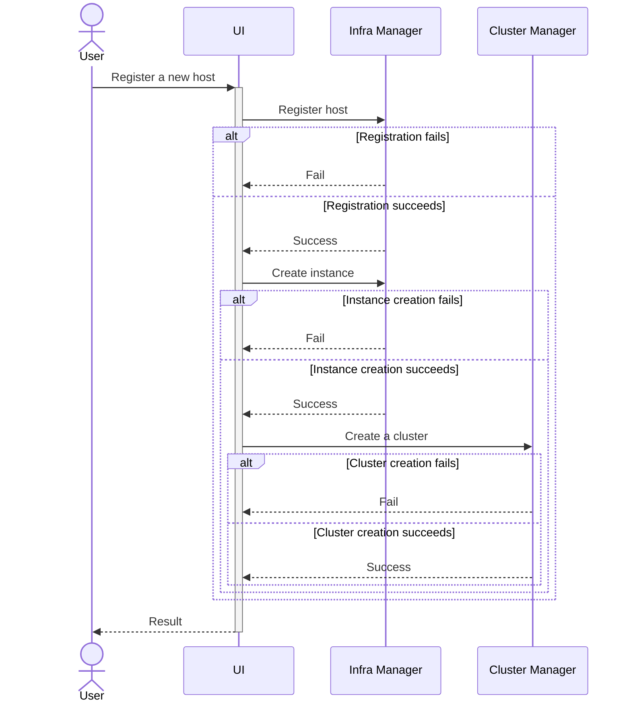

# Design Proposal: Integrating Kubernetes into Edge Microvisor Toolkit

Author(s): Hyunsun Moon

Last updated: 5/2/25

## Abstract

The Edge Microvisor Toolkit (EMT) is an operating system specifically designed for hosting edge workloads, streamlining
traditional general-purpose operating systems by including only the essential components needed to run Kubernetes and
container-based applications. Targeted at developers, operators, and edge infrastructure managers, EMT's design
principles—image-based deployment and immutable root filesystem—enhance the reliability and consistency of cluster
creation compared to even well-maintained general-purpose operating systems, such as Ubuntu.

This proposal seeks to extend these proven approaches to Kubernetes lifecycle management by integrating Kubernetes
directly into EMT. The integration involves two key changes: incorporating the Kubernetes build process into the EMT
build pipeline and embedding the resulting outputs within the image. With this change, we anticipate reduced and
consistent cluster creation times—currently averaging 15 minutes on general-purpose operating systems like Ubuntu, which
we aim to reduce to under 5 minutes. Additionally, this approach enhances reliability by eliminating third-party
dependencies and improves security through faster application of CVEs.

It is important to note that EMT machines will not come with Kubernetes pre-installed and running; users will still need
to configure and initialize Kubernetes as before. However, this design change introduces a degree of coupling between
the host OS and Kubernetes, particularly with regards to Kubernetes versions. This coupling may pose challenges such as
version mismatches, which could lead to compatibility issues or require frequent updates to ensure alignment between the
OS and Kubernetes. This proposal also addresses potential user workflow changes related to this coupling and aims to
further enhance user experience by introducing a new option for automatic Kubernetes installation. This addition will
streamline the cluster creation process for simple but common use cases, enabling edge devices to be ready for use with
minimal intervention.

A key aspect of this proposal is to treat Kubernetes clusters as an integral part of the infrastructure, rather than as
a separate concept. By embedding Kubernetes into EMT, we aim to simplify the operational model, aligning cluster
management with the same principles that govern the underlying OS. This approach ensures that Kubernetes is tightly
coupled with the host OS, enabling a more cohesive and predictable edge environment.

### User Stories

#### User Story 1: Simplified Edge Setup with Automatic Cluster Creation

As an Edge Administrator with Edge Onboarding Manager and Edge Manager/Operator roles, I want to onboard multiple edge
hosts in bulk and automatically create clusters on them with a predefined configuration, so that I can streamline the
onboarding process and ensure a consistent environment to run predefined workloads across multiple locations with
minimal manual intervention.

#### User Story 2: Advanced Edge Setup with Manual Cluster Creation

As an Edge Manager, I want to manually install the operating system and create clusters on edge hosts that are already
available, so that I can customize OS-level system parameters through cloud-init, such as `isolcpus` and `hugepages`, as
well as Kubernetes cluster configurations accordingly through custom cluster template, to meet specific workload
requirements as they are determined.

#### User Story 3: Development Environment to Find Optimal Configuration

As an Application Developer, I want to reset OS-level system parameters and cluster on shared edge hosts with minimal
effort, so that I can validate my application and experiment with different configurations and find the optimal setup
including OS-level system parameters and Kubernetes configuration for my applications.

#### User Story 4: Separation of Responsibilities

As an Edge Onboarding Manager, I want to onboard edge devices using their correct serial numbers and verify their
connection to the Edge Manageability Framework, so that the devices are ready for further configuration and workload
deployment by other roles. As an Edge Manager/Operator, I want to focus solely on deploying and managing edge workloads
without needing to access or troubleshoot the underlying edge infrastructure, ensuring a clear separation of
responsibilities and reducing complexity in my role.

#### User Story 5: Enhanced Security with Embedded Kubernetes

As a security-conscious operator, I want to apply the latest CVE patches for Kubernetes to both existing and new edge
devices faster than upstream, so that I can minimize security vulnerabilities and reduce exposure time.

#### User Story 6: Reliable Cluster Creation

As an Edge Manager/Operator, I want edge devices to be ready for use quickly and reliably, even in environments with
unstable network connectivity.

## Scope

This design change primarily targets the most common edge configuration: K3s on EMT. For other setups, such as K3s on
Ubuntu, RKE2 on EMT, and RKE2 on Ubuntu, Kubernetes will continue to be supported and sourced from external registries
during cluster installation. This decision may evolve as we gain more experience with EMT and K3s.

The table below summarizes the supported operating systems and Kubernetes distributions for each edge type, along with
the available cluster creation methods.

| **Edge Type**          | **Supported OS** | **Supported Kubernetes** | **Cluster Creation Methods**                                                                                                                                                                                                                            |
| ---------------------- | ---------------- | ------------------------ | ------------------------------------------------------------------------------------------------------------------------------------------------------------------------------------------------------------------------------------------------------- |
| **EMF Managed**        | Ubuntu, EMT      | K3s, RKE2                | **Manual**: Via the cluster management page. **Automated**: Via host registration with a selected template (K3s or RKE2). <br> <br> **Note**: For K3s on EMT, the selected template's K3s version must match the K3s version embedded in the EMT image. |
| **Standalone (EMT-S)** | EMT              | K3s                      | **Automated**: Using the EMT-S installer.                                                                                                                                                                                                               |

## Proposal

### Building K3s

#### What to build

Cluster Orchestration supports two flavors of Kubernetes distributions: RKE2 and K3s [todo: add link to k3s design
proposal]. In the initial implementation, we will focus on K3s, as it is set to be the default Kubernetes flavor in
Cluster Orchestration. Also, K3s is easier to integrate into the EMT build pipeline than RKE2, as it consolidates
Kubernetes into a single binary, making it the preferred choice for rapid implementation.

For the K3s build and packaging process integrated into EMT, we will focus on creating the primary binary and assets,
while excluding their dependencies. For instance, the upstream K3s build target involves downloading and compiling
containerd, etcd, and other dependencies. We will utilize this existing build target and will not directly build these
dependencies within the EMT. For a detailed list of dependencies that we are not directly building, please refer to the
[K3s build script](https://github.com/k3s-io/k3s/blob/master/scripts/version.sh). This approach may be adjusted based on
future requirements.

Complete list of assets to build and/or package for K3s installation include the following.

- K3s binary
- [Install script](https://github.com/k3s-io/k3s/blob/master/install.sh)
- [K3s SELinux policies](https://github.com/k3s-io/k3s-selinux) (optional, as EMT operates in SELinux permissive mode)
- Addon container images
- Addon Helm charts

K3s will come with several essential addons by default, such as DNS, CNI and local-path-provisioner. In the initial
implementation, we will utilize pre-built images for these addons rather than building them directly within the EMT
build pipeline. See [todo: add addon ADR link] for more details about essential and optional addons.

A new EMT image will be released under two additional conditions: when a new K3s version becomes available or when a
critical CVE or security patch is required, supplementing the existing release cadence. This decision may evolve based
on future user requirements.

#### How to build

To build and package K3s and addons, we will leverage the existing EMT build pipeline. As an RPM-based distribution, EMT
simplifies the process of building and creating new RPM packages that can be installed on EMT. This involves writing a
SPEC file that specifies the source location and build commands, and placing it in the SPECS folder of the repository.
This approach offers significant advantages, such as eliminating the need to maintain forks of upstream repositories
while providing the flexibility to apply patches and standardizing the build process for various software components
with diverse build requirements. And of course, the subsequent step of integrating Kubernetes into the EMT image becomes
very straightforward.

There will be two new RPMs for packaging K3s:

- **k3s**: Contains the K3s binary and the install script.
- **k3s-selinux**: Includes SELinux policies for K3s (optional for the 3.1 release).

Additionally, several RPMs will be created to package addons for the 3.1 release:

- **calico**: Contains Calico CNI images and Helm chart.
- **network-policy**: Includes the network policy Helm chart.
- **kubevirt-intel**: Packages customized KubeVirt images and Helm chart.
- **cdi**: Contains Containerized Data Importer (CDI) images and Helm chart.
- **gpu-device-plugin**: Includes GPU device plugin images and Helm chart.
- **maverick-flats-device-plugin**: Packages Maverick Flats device plugin images and Helm chart.

Here is an example of SPEC file for k3s:

```text
...
# This is not a complete SPEC and hasn't been tested

Source0: https://github.com/k3s-io/k3s/archive/refs/tags/%{version}.tar.gz

BuildRequires: make
BuildRequires: docker

# Build the K3s binary locally using the upstream Makefile target.
%build
make local-binary

%install
mkdir -p %{buildroot}/usr/local/bin
install -m 0755 bin/k3s %{buildroot}/usr/local/bin/k3s
install -m 0755 install.sh %{buildroot}/usr/local/bin/install.sh

%files
/usr/local/bin/k3s
/usr/local/bin/install.sh
...
```

And here is another example of SPEC file for calico:

```text
...
# This is not a complete SPEC and hasn't been tested

Source0: https://github.com/projectcalico/calico/releases/download/v3.30.1/release-v3.30.1.tgz
Source1: https://github.com/projectcalico/calico/releases/download/v3.30.1/tigera-operator-v3.30.1.tgz

%prep
%setup -T -a 0

%install
mkdir -p %{buildroot}/var/lib/rancher/k3s/agent/images
mkdir -p %{buildroot}/var/lib/rancher/k3s/server/static

install -m 644 ./images/calico-cni.tar %{buildroot}/var/lib/rancher/k3s/agent/images/00-calico/
install -m 644 ./images/calico-node.tar %{buildroot}/var/lib/rancher/k3s/agent/images/00-calico/
install -m 644 ./images/calico-kube-controllers.tar %{buildroot}/var/lib/rancher/k3s/agent/images/00-calico/

%files
/var/lib/rancher/k3s/agent/images/00-calico/calico-cni.tar
/var/lib/rancher/k3s/agent/images/00-calico/calico-node.tar
/var/lib/rancher/k3s/agent/images/00-calico/calico-kube-controllers.tar
/var/lib/rancher/k3s/server/static/tigera-operator-v3.30.1.tgz
...
```

### Making Kubernetes part of EMT

Once RPM packages for K3s are ready, integrating them into the EMT image is
straightforward. This involves creating a new package list files,
`toolkit/imageconfigs/packagelists/k3s-standard.json` and
`toolkit/imageconfigs/packagelists/k3s-maverick-flats.json`. Below is an example
of the JSON structure for the `k3s-standard.json` file:

```json
{
    "packages": [
        "k3s",
        "k3s-addon-essential",
        "k3s-selinux",
    ]
}
```

And here is another example of `k3s-maverick-flats.json`.

```json
{
    "packages": [
        "k3s",
        "k3s-addon-essential",
        "k3s-addon-gpu-device-plugin",
        "k3s-addon-virtualization",
    ]
}
```

This package list file needs to be appended to the `PackageLists` section of all edge image configuration files in EMT
repository.

Also, we propose to add the K3s version information embedded in the EMT image to the `manifest.json` file of the OS
profile. This information can be used by the Cluster Manager to perform version compatibility checks, ensuring that the
Kubernetes version embedded in the EMT image aligns with the cluster templates selected by users.

It is important to note that while the K3s binary benefits from the immutability provided by its placement in the
read-only partition of EMT, ensuring it cannot be updated without an EMT image update, the same level of immutability is
not guaranteed for addon images. Addons, which are essentially Kubernetes Pods, can be updated after their initial
creation using images loaded from the embedded tarball.

Lastly, any user data stored under `/etc/rancher` and `/var/lib/rancher`, including K3s server configuration, container
state, images, and persistent volumes, will reside in a mutable partition. This ensures that user data remains intact
across EMT image updates, preserving cluster configurations and workloads.

### Skip downloading K3s

To ensure that K3s on EMT utilizes the binary and images embedded within EMT, rather than downloading them from the
Internet, `INSTALL_K3S_SKIP_DOWNLOAD` environment variable should set to true when bootstrapping K3s. This prevents the
bootstrap script from attempting to download components externally.

For configurations using CAPI provider for K3s, the equivalent setup involves specifying the airGapped option in the
control plane template. Here is an example configuration:

```yaml
apiVersion: controlplane.cluster.x-k8s.io/v1beta2
kind: KThreesControlPlaneTemplate
metadata:
  name: k3s-control-plane
spec:
  template:
    spec:
      kthreesConfigSpec:
        agentConfig:
          airGapped: true
```

The Cluster Manager should implement logic to determine whether the target host is running EMT using host information
retrieved from the Infra Manager. If the host is identified as EMT machine, the `airGapped` configuration should be
enabled. Since the Cluster Manager internally uses ClusterClass, the airGapped value can be dynamically patched using a
variable defined in the Cluster object.

```yaml
apiVersion: cluster.x-k8s.io/v1beta1
kind: ClusterClass
metadata:
  name: k3s
spec:
  controlPlane:
    ref:
      apiVersion: controlplane.cluster.x-k8s.io/v1beta2
      kind: KThreesControlPlaneTemplate
      name: k3s-control-plane
  patches:
  - name: airGapped
    definitions:
    - selector:
        apiVersion: controlplane.cluster.x-k8s.io/v1beta2
        kind: KThreesControlPlaneTemplate
        matchResources:
          controlPlane: true
      jsonPatches:
      - op: add
        path: /spec/template/spec/kthreesConfigSpec/agentConfig/airGapped
        valueFrom:
          variable: airGapped
  variables:
    - name: airGapped
      required: true
      schema:
        openAPIV3Schema:
          type: boolean
          default: false
---
apiVersion: cluster.x-k8s.io/v1beta1
kind: Cluster
metadata:
  name: cluster-on-emt
spec:
  topology:
    ...
    variables:
    - name: airGapped
      value: true
```

For all other cases, including K3s on Ubuntu machine and RKE2 on EMT/Ubuntu machine, this configuration will remain
false.

### Workflow Change

Clusters for a specific host can be created in two ways:

**1. Automatically during host registration**: This new option is designed for users with simple use cases who want
Kubernetes to be available with a pre-defined template, reducing user interactions during onboarding and cluster
creation.

**2. Manually through a direct request to the Cluster Manager**: This method allows users to create clusters on hosts
that have already been onboarded (or provisioned, depending on the finalized design). It is particularly useful in
scenarios where host onboarding and workload creation occur independently, often managed by different users with
distinct roles or at different times. For example, an Onboarding Manager might register a pool of hosts with only the
auto-onboard option enabled (and potentially auto-provision, based on the final design). Later, Edge Operators or Users
can select an operating system and create clusters using an OS profile, Kubernetes flavor, and template that best align
with specific workload requirements. This approach provides flexibility and adaptability, making it well-suited for
cloud-like edge usage.

Before diving into workflow changes, it is essential to understand the coupling introduced by this design change between
the following components:

- **EMT Image Version**: Specifies the operating system and embedded software, including the K3s version, on the edge
  device.
- **Cluster Template**: Defines the configuration for Kubernetes cluster creation, including the Kubernetes flavor,
  version, and custom control plane settings.

For instance, attempting to create a K3s cluster using a template for K3s v1.32 on an EMT machine embedding K3s v1.30
may result in compatibility issues. Such mismatches can occur when Edge Orchestration undergoes multiple upgrades,
leading to a mix of cluster templates and EMT machines with varying versions. While this issue is specific to the
K3s-on-EMT scenario, it is critical to address it effectively in the user workflow, as this represents the most common
use case for EMF.

#### Automatic Cluster Creation

The first option introduces a streamlined process for users seeking simplicity or bulk registration of hosts, or both.
Both the Web UI and CLI will offer a new toggle for `Create Cluster Automatically` (potentially combined with `Provision
Automatically`, pending final design decisions) during registration. This option is only valid when `Provision
Automatically` is enabled. When enabled, it automatically creates a single-node cluster for each host.

Users can provide a default cluster template for all hosts in the registration request, with the flexibility to override
it for specific hosts if needed. For EMT machines, once a specific OS profile is selected, only cluster templates
compatible with that EMT version will be displayed. This includes all RKE2 templates and K3s templates that match the
K3s version embedded in the selected EMT image.

The Cluster Manager API, which returns the list of cluster templates, will support filtering based on Kubernetes flavor
and version, ensuring users can only select templates that are compatible with their chosen OS profile.

An option to join an existing cluster was also considered to accommodate multi-node cluster scenarios. However, the
decision was made to defer workflow changes related to multi-node clusters to a later phase.



The sequence diagram illustrates the internal process of host registration. Each step in the sequence depends on the
success of the previous step. If a failure occurs at any point, subsequent requests will not be triggered. For example:

- If the `Register host` request to the Infra Manager fails, the process stops, and no further actions (e.g., creating
  an instance or cluster) are attempted.
- Similarly, if the `Create instance` request fails, the `Create a cluster` request will not be triggered.

Any successful requests will remain successful and will not be rolled back, as rollback mechanisms introduce significant
complexity. Instead, the UI will provide feedback to the user, indicating which steps succeeded and which failed, along
with the registration status of the host. This approach ensures transparency and allows users to address partial
failures manually.

While this design avoids rollback complexity, future iterations may explore implementing rollback mechanisms to handle
partial failures more gracefully and make the host registration operation atomic. This could involve introducing
transactional workflows that ensure either all steps succeed or none are applied, reducing the need for manual
intervention in case of partial failures.

#### Manual Cluster Creation

Manual cluster creation enables users to dynamically create a cluster by selecting a template and host. Currently, this
process targets hosts already provisioned with a specific OS. With the proposed design change, the workflow must account
for the fact that the K3s version available on an EMT machine is predefined. Below are three potential approaches to
address this limitation:

**Option 1:** Restrict cluster creation to provisioned hosts only, as in the current implementation. During target host
selection, provide a list of eligible hosts based on the selected cluster template for K3s. This list includes all
Ubuntu machines and EMT machines with a compatible K3s version embedded for the selected cluster template. The UI must
clearly represent this behavior to avoid confusion. The logic for CAPINTEL remains unchanged, creating a Workload and
adding the Instance associated to the host to the Workload. If the K3s version to deploy is incompatible with the
existing EMT version, users must manually re-onboard and re-provision the host. This approach minimizes changes to the
user experience compared to previous releases.

**Option 2:** Similar to Option 1, but allow the selection of EMT machines with incompatible K3s versions. When such a
host is selected, CAPINTEL resolves the mismatch by requesting the Infra Manager to update the EMT version to one
compatible with the selected cluster template. (This assumes that A/B updates to a lower version are supported.)

**Option 3:** Restrict cluster creation to onboarded hosts only, rather than provisioned hosts. Alternatively,
streamline the process by removing the "provisioned" status of hosts, as its purpose is unclear. During cluster
creation, users would select an OS profile, with eligible profiles filtered based on the selected cluster template. This
includes all Ubuntu profiles and EMT profiles with compatible K3s versions for the chosen template. In this approach,
CAPINTEL must request the Infra Manager to create an Instance first to install the OS with the selected profile, before
assigning the Instance to the Workload. While this approach is a breaking change from previous releases, it aligns with
the new design principle of treating Kubernetes as an integral part of the infrastructure. It also supports the purpose
of manual creation, enabling users to configure the edge environment—including both the OS and Kubernetes—based on the
defined workload type.

**Decision for 3.1 Release** The decision for the 3.1 release is to proceed with **Option 1**, as it is less disruptive
and preserves the same user experience as the previous release. This approach minimizes changes while addressing the
immediate requirements from existing users. **Option 3** will be revisited in future releases to accommodate workloads
that require correlation between provisioning-time OS-level configuration via cloud-init and custom Kubernetes-level
configuration via cluster template, for example, RT workload with core pinning configuration, for manual cluster
creation and deletion workflows.

#### Delete Cluster

Cluster deletion can occur in two ways:

**1. Automatically when a host is deauthorized:** Users can enable an option to delete the cluster when the host is
deauthorized. For multi-node clusters, the Cluster Manager deletes the cluster once all associated hosts are
deauthorized.

**2. Manually through a direct request to the Cluster Manager:** Users can
explicitly request cluster deletion via the Cluster Manager API.

For manual deletion, there are two options:

- **Option 1:** When a cluster is deleted, Kubernetes should be cleaned up from the OS, returning the host to the
  provisioned and unassigned state as it was before cluster creation. This ensures the host is ready for reuse for
  another cluster creation without requiring additional user actions. For K3s-on-EMT, cluster deletion should only
  remove mutable configurations of K3s, while immutable components embedded in the EMT image remain intact.

- **Option 2:** Deleting a cluster automatically deauthorizes the associated hosts, requiring users to manually
  re-onboard the host for future use. While reverting the host to its onboarded state prior to cluster creation would be
  ideal, this is technically infeasible. This approach aligns with the principle of treating the OS and Kubernetes as an
  atomic unit. It also simplifies CAPINTEL's implementation by avoiding the complexities of cleaning up Kubernetes from
  the OS.

**Decision for 3.1 Release** For the 3.1 release, the decision is to proceed with **Option 2** for the following
reasons:

- The official uninstall script provided by K3s attempts to clean up assets in the immutable partition, including k3s
  binary and addon image tarball, which can cause the script to fail in the K3s-on-EMT scenario.
- Option 2 ensures a consistent user experience with Option 3 of manual cluster creation, which aligns with the
  direction planned for future releases.
- Option 2 aligns better with CAPI principle that treats machines as immutable entities. This approach simplifies the
  CAPINTEL implementation by avoiding the complexities of reverting the host to its pre-cluster state.

This decision will require updates to the CAPINTEL provider implementation.

#### Upgrade Cluster

For K3s on EMT, upgrading the Kubernetes version will trigger updating the EMT image. This process replaces the
immutable components of K3s—such as the K3s binary, addon image tarball, and install script—with the new version, while
preserving user data stored in the mutable partition, including cluster configurations and existing workloads.

Cluster upgrades must be initiated via Cluster Orchestration, not through the Infra Manager or direct EMT image updates,
for the following reasons:

- **Post-Update Commands**: After an A/B update, additional commands are required to load and install the new addon
  images and manifests. These commands are generated by Cluster Orchestration during the upgrade request. Performing an
  EMT image update without Cluster Orchestration may result in a partial upgrade.

- **Multi-Node Clusters**: For multi-node clusters, Kubernetes version upgrades must be coordinated across all nodes to
  maintain cluster health. Upgrading a single EMT host image independently could disrupt the cluster.

To prevent unintended K3s version updates via EMT image upgrades, a safeguard will block EMT version upgrades if the new
image includes a K3s version with a different major or minor version than the current one. This ensures compatibility
and avoids unexpected disruptions.

It is important to note that Kubernetes version upgrades, including those for K3s on EMT setups, will not be supported
for EMF-managed edges until the [in-place upgrade for
CAPI](https://github.com/kubernetes-sigs/cluster-api/blob/main/docs/proposals/20240807-in-place-updates.md) is
implemented.

## Affected components and Teams

Edge Microvisor Toolkit (EMT)
Cluster Orchestration (CO)
UX/UI

## Phase 1

### Implementation Plan: Foundation and Initial Functionality

Build and Package K3s

- Develop the SPEC file for K3s and its dependencies.
- Integrate the SPEC file into the EMT build pipeline.
- Test the RPM build process to ensure correct packaging.

Embed K3s into EMT

- Create the package list file (`k3s.json`) specifying K3s packages.
- Update EMT image configurations to include the `k3s.json` package list.
- Modify the EMT build pipeline to embed K3s version information into the `manifest.json` file.

Cluster Manager Enhancements

- Implement logic to filter cluster templates based on the Kubernetes version embedded in EMT images.
- Add support for the `airGapped` configuration in the Cluster Manager API for K3s on EMT.

CAPINTEL Provider Updates

- Modify CAPINTEL to handle new workflows for cluster creation and deletion.
- Implement safeguards to block incompatible EMT image upgrades.

UI/UX Improvements

- Add a toggle for `Create Cluster Automatically` during host registration.
- Update the UI to filter cluster templates based on the selected OS profile.

### Test Plan

Unit Tests

- Test the SPEC file for correct RPM packaging of K3s and dependencies.

Integration Tests

- Test the EMT build pipeline to ensure K3s is correctly embedded in the image.

End-to-End Tests

- Test automatic cluster creation during host registration.
- Validate logic for filtering cluster templates based on Kubernetes versions.
- Update [light-weight-enic][light-weight-enic] used in [cluster-tests][cluster-tests] with k3s packages built in and
  use that for end-to-end tests of cluster-orchestration.

### Goals

- Achieve a working integration of K3s into EMT with basic functionality.
- Ensure most of the development is completed in the first phase for CO, UI and
  EMT.
- Ensure documentation is updated to guide users through new workflows.

## Phase 2

### Implementation plan: Enhancements and Optimization

We expect most of the implementation to be completed in the first phase. The second phase will focus on refining the
user experience and optimizing workflows based on feedback from the first phase.

The documentation shall be updated to reflect the new workflows and limitations introduced by this design change. The
following updates are planned:

- Update user documentation to reflect new workflows and limitations.
- Update EMT and EMT-S documentation to include K3s integration details.

<!-- markdownlint-disable MD024 -->
### Test Plan

Integration Tests

- Verify the `airGapped` configuration during cluster creation.

End-to-End Tests

- Test manual cluster creation with compatible and incompatible EMT images.
- Test cluster deletion and ensure proper cleanup of Kubernetes configurations.

Upgrade Tests

- Test upgrading the EMT image with a new K3s version.
- Validate safeguards to block incompatible EMT image upgrades.

UI/UX Tests

- Verify the functionality of the `Create Cluster Automatically` toggle.
- Ensure the UI correctly filters cluster templates based on OS profiles.

Performance Tests

- Measure cluster creation times for K3s on EMT and compare them to existing setups.
- Test scalability of automatic cluster creation for bulk host registration.

Regression Tests

- Ensure existing workflows for K3s on Ubuntu and RKE2 on EMT/Ubuntu remain unaffected.
- Validate that multi-node cluster workflows are not disrupted.

<!-- markdownlint-disable MD024 -->
### Goals

- Enhance functionality and optimize workflows based on feedback from Sprint 1.
- Implement additional features and safeguards to improve reliability and user experience.
- Conduct comprehensive testing to ensure robustness and scalability.

[light-weight-enic]: https://github.com/open-edge-platform/edge-node-agents/tree/lw-enic/cluster-agent  
[cluster-tests]: https://github.com/open-edge-platform/cluster-tests/blob/main/.test-dependencies.yaml#L181
