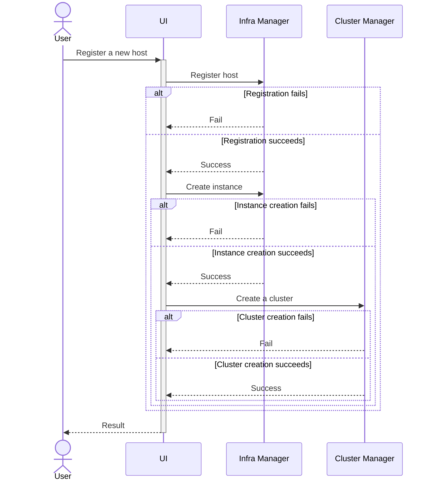

# Design Proposal: Integrating Kubernetes into Edge Microvisor Toolkit

Author(s): Hyunsun Moon

Last updated: 5/2/25

## Abstract

The Edge Microvisor Toolkit (EMT) is an operating system specifically designed for hosting edge workloads, streamlining traditional general-purpose operating systems by including only the essential components needed to run Kubernetes and container-based applications. Targeted at developers, operators, and edge infrastructure managers, EMT's design principles—image-based deployment and immutable root filesystem—enhance the reliability and consistency of cluster creation compared to even well-maintained general-purpose operating systems, such as Ubuntu.

This proposal seeks to extend these proven approaches to Kubernetes lifecycle management by integrating Kubernetes directly into EMT. The integration involves two key changes: incorporating the Kubernetes build process into the EMT build pipeline and embedding the resulting outputs within the image. With this change, we anticipate reduced and consistent cluster creation times—currently averaging 15 minutes on general-purpose operating systems like Ubuntu, which we aim to reduce to under 5 minutes. Additionally, this approach enhances reliability by eliminating third-party dependencies and improves security through faster application of CVEs.

It is important to note that EMT machines will not come with Kubernetes pre-installed and running; users will still need to configure and initialize Kubernetes as before. However, this design change introduces a degree of coupling between the host OS and Kubernetes, particularly with regards to Kubernetes versions. This coupling may pose challenges such as version mismatches, which could lead to compatibility issues or require frequent updates to ensure alignment between the OS and Kubernetes. This proposal also addresses potential user workflow changes related to this coupling and aims to further enhance user experience by introducing a new option for automatic Kubernetes installation. This addition will streamline the cluster creation process for simple but common use cases, enabling edge devices to be ready for use with minimal intervention.

A key aspect of this proposal is to treat Kubernetes clusters as an integral part of the infrastructure, rather than as a separate concept. By embedding Kubernetes into EMT, we aim to simplify the operational model, aligning cluster management with the same principles that govern the underlying OS. This approach ensures that Kubernetes is tightly coupled with the host OS, enabling a more cohesive and predictable edge environment.

## Scope

This design change primarily targets the most common edge configuration: K3s on EMT. For other setups, such as K3s on Ubuntu, RKE2 on EMT, and RKE2 on Ubuntu, Kubernetes will continue to be sourced from external registries during cluster installation. This decision may evolve as we gain more experience with EMT and K3s.

## Proposal

### Building K3s

#### What to build

Cluster Orchestration supports two flavors of Kubernetes distributions: RKE2 and K3s [todo: add link to k3s design proposal]. In the initial implementation, we will focus on K3s, as it is set to be the default Kubernetes flavor in Cluster Orchestration. Also, K3s is easier to integrate into the EMT build pipeline than RKE2, as it consolidates Kubernetes into a single binary, making it the preferred choice for rapid implementation.

For the K3s build and packaging process integrated into EMT, we will focus on creating the primary binary and assets, while excluding their dependencies. For instance, the upstream K3s build target involves downloading and compiling containerd, etcd, and other dependencies. We will utilize this existing build target and will not directly build these dependencies within the EMT. For a detailed list of dependencies that we are not directly building, please refer to the [K3s build script](https://github.com/k3s-io/k3s/blob/master/scripts/version.sh). This approach may be adjusted based on future requirements.

Complete list of assets to build and/or package for K3s installation include the following.

- k3s (binary)
- [install.sh](https://github.com/k3s-io/k3s/blob/master/install.sh) (install script)
- [k3s-selinux](https://github.com/k3s-io/k3s-selinux) (RPM package)
- k3s-airgap-images.tar.zst (pre-built addon images)

K3s includes several essential addons, such as CoreDNS, local-path-provisioner, and ingress controller. In the initial implementation, we will utilize pre-built images for these addons rather than building them directly within the EMT build pipeline.

A new EMT image will be released under two additional conditions: when a new K3s version becomes available or when a critical CVE or security patch is required, supplementing the existing release cadence. This decision may evolve based on future user requirements.

#### How to build

To build and package K3s, we will leverage the existing EMT build pipeline. As an RPM-based distribution, EMT simplifies the process of building and creating new RPM packages that can be installed on EMT. This involves writing a SPEC file that specifies the source location and build commands, and placing it in the SPECS folder of the repository. This approach offers significant advantages, such as eliminating the need to maintain forks of upstream repositories while providing the flexibility to apply patches and standardizing the build process for various software components with diverse build requirements. And of course, the subsequent step of integrating Kubernetes into the EMT image becomes very straightforward.

Here is an example of SPEC file to build and package K3s binary:

```
...
# This is not a complete SPEC and hasn't been tested

Source0: https://github.com/k3s-io/k3s/archive/refs/tags/%{version}.tar.gz
Source1: https://github.com/k3s-io/k3s/releases/download/%{version}/k3s-airgap-images-amd64.tar.zst

BuildRequires: make
BuildRequires: docker

# Build the K3s binary locally using the upstream Makefile target.
%build
make local-binary

%install
mkdir -p %{buildroot}/usr/local/bin
install -m 0755 bin/k3s %{buildroot}/usr/local/bin/k3s

mkdir %{buildroot}/opt
install -m 0755 install.sh %{buildroot}/opt/install.sh

mkdir -p %{buildroot}/var/lib/rancher/k3s/agent/images
install -m 0644 %{SOURCE1} %{buildroot}/var/lib/rancher/k3s/agent/images/k3s-airgap-images-amd64.tar.zst

%files
/usr/local/bin/k3s
/opt/install.sh
/var/lib/rancher/k3s/agent/images/k3s-airgap-images-amd64.tar.zst
...
```

### Making Kubernetes part of EMT

Once RPM packages for K3s are ready, integrating them into the EMT image is straightforward. This involves creating a new package list file, `toolkit/imageconfigs/packagelists/k3s.json`, which includes the k3s and k3s-selinux packages. Below is an example of the JSON structure for the `k3s.json` file:

```json
{
    "packages": [
        "k3s",
        "k3s-selinux"
    ]
}
```

This package list file needs to be appended to the `PackageLists` section of all edge image configuration files in EMT repository.

Also, we propose to add the K3s version information embedded in the EMT image to the `manifest.json` file of the OS profile. This information can be used by the Cluster Manager to perform version compatibility checks, ensuring that the Kubernetes version embedded in the EMT image aligns with the cluster templates selected by users.

Lastly, it is important to note that while the K3s binary benefits from the immutability provided by its placement in the read-only partition of EMT, ensuring it cannot be updated without an EMT image update, the same level of immutability is not guaranteed for addon images. Addons, which are essentially Kubernetes Pods, can be updated after their initial creation using images loaded from the embedded tarball.

### Skip downloading K3s

To ensure that K3s on EMT utilizes the binary and images embedded within EMT, rather than downloading them from the Internet, `INSTALL_K3S_SKIP_DOWNLOAD` environment variable should set to true when bootstrapping K3s. This prevents the bootstrap script from attempting to download components externally.

For configurations using CAPI provider for K3s, the equivalent setup involves specifying the airGapped option in the control plane template. Here is an example configuration:

```yaml
apiVersion: controlplane.cluster.x-k8s.io/v1beta2
kind: KThreesControlPlaneTemplate
metadata:
  name: k3s-control-plane
spec:
  template:
    spec:
      kthreesConfigSpec:
        agentConfig:
          airGapped: true
```

The Cluster Manager should implement logic to determine whether the target host is running EMT using host information retrieved from the Infra Manager. If the host is identified as EMT machine, the `airGapped` configuration should be enabled. Since the Cluster Manager internally uses ClusterClass, the airGapped value can be dynamically patched using a variable defined in the Cluster object.

```yaml
apiVersion: cluster.x-k8s.io/v1beta1
kind: ClusterClass
metadata:
  name: k3s
spec:
  controlPlane:
    ref:
      apiVersion: controlplane.cluster.x-k8s.io/v1beta2
      kind: KThreesControlPlaneTemplate
      name: k3s-control-plane
  patches:
  - name: airGapped
    definitions:
    - selector:
        apiVersion: controlplane.cluster.x-k8s.io/v1beta2
        kind: KThreesControlPlaneTemplate
        matchResources:
          controlPlane: true
      jsonPatches:
      - op: add
        path: /spec/template/spec/kthreesConfigSpec/agentConfig/airGapped
        valueFrom:
          variable: airGapped
  variables:
    - name: airGapped
      required: true
      schema:
        openAPIV3Schema:
          type: boolean
          default: false
---
apiVersion: cluster.x-k8s.io/v1beta1
kind: Cluster
metadata:
  name: cluster-on-emt
spec:
  topology:
    ...
    variables:
    - name: airGapped
      value: true
```

For all other cases, including K3s on Ubuntu machine and RKE2 on EMT/Ubuntu machine, this configuration will remain false.

### Workflow Change

Clusters for a specific host can be created in two ways:

**1. Automatically during host registration**: This new option is designed for users with simple use cases who want Kubernetes to be available with a pre-defined template, reducing user interactions during onboarding and cluster creation.

**2. Manually through a direct request to the Cluster Manager**: This method allows users to create a cluster dynamically on hosts that are already onboarded or provisioned (pending final design decisions). It is particularly useful for scenarios where a pool of hosts is available but not yet assigned specific workloads. Users can register hosts with the auto-onboard option (and potentially auto-provision, depending on the finalized design) and later create clusters using Kubernetes flavors and templates that align with their workload requirements.

Before diving into workflow changes, it is essential to understand the coupling introduced by this design change between the following components:

- **EMT Image Version**: Specifies the operating system and embedded software, including the K3s version, on the edge device.
- **Cluster Template**: Defines the configuration for Kubernetes cluster creation, including the Kubernetes flavor, version, and custom control plane settings.

For instance, attempting to create a K3s cluster using a template for K3s v1.32 on an EMT machine embedding K3s v1.30 may result in compatibility issues. Such mismatches can occur when Edge Orchestration undergoes multiple upgrades, leading to a mix of cluster templates and EMT machines with varying versions. While this issue is specific to the K3s-on-EMT scenario, it is critical to address it effectively in the user workflow, as this represents the most common use case for EMF.

#### Automatic Cluster Creation

The first option introduces a streamlined process for users seeking simplicity or bulk registration of hosts, or both. Both the Web UI and CLI will offer a new toggle for `Create Cluster Automatically` (potentially combined with `Provision Automatically`, pending final design decisions) during registration. This option is only valid when `Provision Automatically` is enabled. When enabled, it automatically creates a single-node cluster for each host.

Users can provide a default cluster template for all hosts in the registration request, with the flexibility to override it for specific hosts if needed. For EMT machines, once a specific OS profile is selected, only cluster templates compatible with that EMT version will be displayed. This includes all RKE2 templates and K3s templates that match the K3s version embedded in the selected EMT image. 

The Cluster Manager API, which returns the list of cluster templates, will support filtering based on Kubernetes flavor and version, ensuring users can only select templates that are compatible with their chosen OS profile.

An option to join an existing cluster was also considered to accommodate multi-node cluster scenarios. However, the decision was made to defer workflow changes related to multi-node clusters to a later phase.



The sequence diagram illustrates the internal process of host registration. Each step in the sequence depends on the success of the previous step. If a failure occurs at any point, subsequent requests will not be triggered. For example:

- If the `Register host` request to the Infra Manager fails, the process stops, and no further actions (e.g., creating an instance or cluster) are attempted.
- Similarly, if the `Create instance` request fails, the `Create a cluster` request will not be triggered.

Any successful requests will remain successful and will not be rolled back, as rollback mechanisms introduce significant complexity. Instead, the UI will provide feedback to the user, indicating which steps succeeded and which failed, along with the registration status of the host. This approach ensures transparency and allows users to address partial failures manually.

While this design avoids rollback complexity, future iterations may explore implementing rollback mechanisms to handle partial failures more gracefully and make the host registration operation atomic. This could involve introducing transactional workflows that ensure either all steps succeed or none are applied, reducing the need for manual intervention in case of partial failures.

#### Manual Cluster Creation

Manual cluster creation enables users to dynamically create a cluster by selecting a template and host. Currently, this process targets hosts already provisioned with a specific OS. With the proposed design change, the workflow must account for the fact that the K3s version available on an EMT machine is predefined. Below are three potential approaches to address this limitation:

**Option 1:** Restrict cluster creation to provisioned hosts only, as in the current implementation. During target host selection, provide a list of eligible hosts based on the selected cluster template for K3s. This list includes all Ubuntu machines and EMT machines with a compatible K3s version embedded for the selected cluster template. The UI must clearly represent this behavior to avoid confusion. The logic for CAPINTEL remains unchanged, creating a Workload and adding the Instance associated to the host to the Workload. If the K3s version to deploy is incompatible with the existing EMT version, users must manually re-onboard and re-provision the host. This approach minimizes changes to the user experience compared to previous releases.

**Option 2:** Similar to Option 1, but allow the selection of EMT machines with incompatible K3s versions. When such a host is selected, CAPINTEL resolves the mismatch by requesting the Infra Manager to update the EMT version to one compatible with the selected cluster template. (This assumes that A/B updates to a lower version are supported.)

**Option 3:** Restrict cluster creation to onboarded hosts only, rather than provisioned hosts. Alternatively, streamline the process by removing the "provisioned" status of hosts, as its purpose is unclear. During cluster creation, users would select an OS profile, with eligible profiles filtered based on the selected cluster template. This includes all Ubuntu profiles and EMT profiles with compatible K3s versions for the chosen template. In this approach, CAPINTEL must request the Infra Manager to create an Instance first to install the OS with the selected profile, before assigning the Instance to the Workload. While this approach is a breaking change from previous releases, it aligns with the new design principle of treating Kubernetes as an integral part of the infrastructure. It also supports the purpose of manual creation, enabling users to configure the edge environment—including both the OS and Kubernetes—based on the defined workload type.

*[Decision pending]*

#### Delete Cluster

Cluster deletion can occur in two ways:

**1. Automatically when a host is deauthorized:** Users can enable an option to delete the cluster when the host is deauthorized. For multi-node clusters, the Cluster Manager deletes the cluster once all associated hosts are deauthorized.

**2. Manually through a direct request to the Cluster Manager:** Users can explicitly request cluster deletion via the Cluster Manager API.

For manual deletion, the handling of cluster nodes depends on the chosen approach for manual creation:

- **Option 1 or Option 2:** When a cluster is deleted, Kubernetes should be cleaned up from the OS, returning the host to the provisioned and not assigned to a workload state as it was before cluster creation. This ensures the host is ready for reuse for another cluster creation without requiring additional user actions. For K3s-on-EMT, cluster deletion should only remove mutable configurations of K3s, while immutable components embedded in the EMT image remain intact.

- **Option 3:** Deleting a cluster automatically deauthorizes the associated hosts. While reverting the host to its onboarded state prior to cluster creation would be ideal, this is technically infeasible. As a result, users must manually re-onboard the host for future use, which is a notable drawback. However, this approach aligns with the principle of treating the OS and Kubernetes as an atomic unit. It also simplifies CAPINTEL's implementation by avoiding the complexities of cleaning up Kubernetes from the OS.

*[Decision pending]*

## Rationale

[A discussion of alternate approaches that have been considered and the trade
offs, advantages, and disadvantages of the chosen approach.]

## Affected components and Teams

Edge Microvisor Toolkit
Cluster Orchestration
UX/UI

## Implementation plan

[A description of the implementation plan, who will do them, and when.
This should include a discussion of how the work fits into the product's
quarterly release cycle.]

### Phase 1

### Phase 2

### Phase 3

### Test Plan

## Open issues (if applicable)

[A discussion of issues relating to this proposal for which the author does not
know the solution. This section may be omitted if there are none.]
