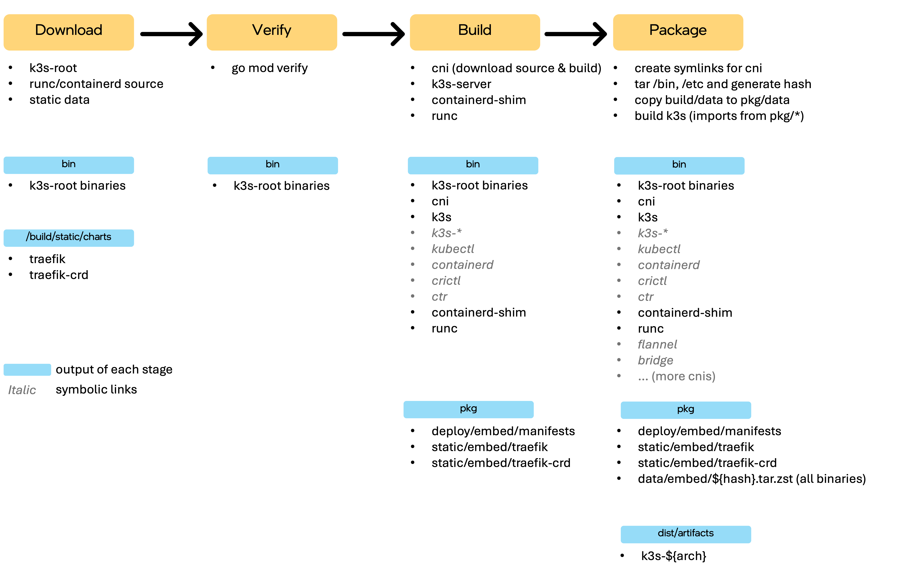

# Design Proposal: Integrating Kubernetes into Edge Microvisor Toolkit

Author(s): Hyunsun Moon

Last updated: 9/1/25

## Abstract

The Edge Microvisor Toolkit (EMT) is a purpose-built operating system for edge environments, optimized to host workloads
with minimal overhead. By streamlining traditional general-purpose operating systems and including only essential
components, EMT delivers improved reliability and consistency for edge deployments. Its image-based deployment model and
immutable root filesystem reduce operational complexity and enhance security, making EMT a robust choice for developers,
operators, and edge infrastructure managers seeking predictable and maintainable edge platforms.

This proposal seeks to extend this proven approach to Kubernetes lifecycle management by integrating Kubernetes directly
into EMT. The integration involves two key changes: incorporating the Kubernetes build process into the EMT build
pipeline and embedding the resulting outputs within the image. With these changes, cluster creation times—currently
averaging 15 minutes on general-purpose operating systems like Ubuntu—are expected to be reduced to under 5 minutes.
This approach also enhances reliability by eliminating dynamic third-party dependencies at runtime and improves security
through faster application of CVEs. Note that EMT will not have Kubernetes configured and running by default; users must
still configure and initialize Kubernetes as part of the setup process.

Embedding Kubernetes binaries and assets directly within the EMT image creates a strong dependency between the EMT base
and the Kubernetes version it contains. This tight coupling means that EMT and Kubernetes updates must be coordinated to
avoid version mismatches, ensuring that clusters are always deployed with compatible versions as defined by both the EMT
image and cluster templates. The proposal addresses these challenges by introducing updated cluster operation workflows
that enforce version compatibility and streamline cluster lifecycle management.

### User Stories

#### User Story 1: Reliable Cluster Creation

As an Edge Manager/Operator, I want edge devices to be ready for use quickly and reliably, even in environments with
unstable network connectivity.

#### User Story 2: Enhanced Security with Embedded Kubernetes

As a security-conscious operator, I want to apply the latest CVE patches for Kubernetes to both existing and new edge
edges faster than upstream, so that I can minimize security vulnerabilities and reduce exposure time.

## Proposal

### Building K3s

#### What to build

The K3s build and packaging process for EMT produces the following essential artifacts:

- **K3s binary**: A statically linked executable that includes all core Kubernetes components and dependencies.
- **Install script**: The official [install.sh](https://github.com/k3s-io/k3s/blob/master/install.sh) used to bootstrap
  K3s on EMT.

To satisfy OSPDT compliance, all components—including `k3s-server` and dependencies such as `containerd`, CNI plugins,
and the `k3s-root` (buildroot) environment—are built entirely from source. Although upstream K3s build scripts compile
most dependencies from source, they currently download pre-built `k3s-root` binaries during the initial build stage (see
diagram below). To achieve full traceability and compliance, the build process must be modified to build `k3s-root` from
source, ensuring all artifacts are verifiable and compliant.



K3s relies on several essential addons (such as CoreDNS, kube-router, and local-path-provisioner) that are deployed as
separate Pods after initialization. There are three options to handling these addon images:

**Option 1:** Exclude addon image building and packaging from this proposal. For air-gapped deployments, users must manually import addon images into EMT following the [K3s documentation](https://docs.k3s.io/import-images#pre-import-images). This approach avoids additional OSPDT compliance but requires users to manage external dependencies or custom image creation for full K3s functionality.

**Option 2:** Build and package essential addon images (such as pause, busybox, coredns, and klipper-helm) and embed them directly in EMT. This makes EMT self-sufficient for running K3s in air-gapped environments and simplifies cluster setup for users. However, it introduces complexity to the EMT build pipeline as it doesn't support container image build and requires OSPDT compliance for these container images.

EMT images will be released regularly and in response to new K3s versions or critical security patches to keep edge
deployments secure and up to date.

#### How to build

To build and package K3s for EMT, leverage EMT’s RPM build pipeline by creating a SPEC file in the repository’s `SPECS`
directory. The SPEC file should reference the official K3s source and invoke upstream build and packaging scripts to
maintain compatibility and reduce maintenance overhead. Any required customizations or patches can be included in the
SRPM, ensuring a reproducible, source-based build for all K3s components within EMT without maintaining forks.

For the `k3s-root` environment, two main approaches are considered:

- **Option 1:** Build `k3s-root` as a standalone RPM package from source. Adapt the upstream containerized build
  (Dapper-based) to run natively in the EMT pipeline, listing all dependencies in the SPEC file. This ensures clear
  separation between EMT and K3s, simplifies maintenance, and enables independent updates.

- **Option 2:** Use the EMT chroot environment as the base for `k3s-root` to minimize OSPDT approval effort. This
  approach reuses the existing EMT build environment, potentially reducing duplication and simplifying compliance, but
  may require additional integration to meet K3s requirements.

##### Comparison: `k3s-root` vs EMT Toolchain Chroot

| Metric              | k3s-root | EMT Toolchain |
| ------------------- | -------- | ------------- |
| Total binaries      | 348      | 603           |
| Direct binaries     | 24       | 517           |
| Symbolic links      | 324      | 86            |
| Overlapped binaries | 139      | 139           |
| Missing in EMT      | 209      | -             |

- 139 out of 348 `k3s-root` binaries overlap with the EMT toolchain (ignoring version differences).
- 209 `k3s-root` binaries are missing from EMT, mostly container/networking and BusyBox utilities.
- EMT covers most standard POSIX utilities but lacks embedded system and container runtime tools required by `k3s-root`.
- Option 1 is preferred for clear separation and maintainability; Option 2 may reduce compliance effort but needs more
  integration.

  ##### Direct Binaries in k3s-root

  The following table summarizes the direct binaries required by `k3s-root`, indicating their presence in EMT, whether a
  SPEC file exists, and the version differences. This helps identify which binaries are already available in EMT and
  which require new packaging or updates.

  | #   | Binary (Package)                | In EMT Chroot | SPEC in EMT | EMT Version | k3s-root Version | Notes / Action Needed                     |
  | --- | ------------------------------- | :-----------: | :---------: | ----------: | ---------------: | ----------------------------------------- |
  | 1   | blkid (util-linux)              |       ❌       |      ✅      |      2.40.2 |           2.40.2 |                                           |
  | 2   | busybox                         |       ❌       |      ✅      |      1.36.1 |           1.37.0 | Version mismatch                          |
  | 3   | conntrack (conntrack-tools)     |       ❌       |      ✅      |       1.4.8 |            1.4.7 | Version mismatch                          |
  | 4   | coreutils                       |       ❌       |      ✅      |         9.4 |              9.5 | Version mismatch                          |
  | 5   | ethtool                         |       ❌       |      ✅      |         6.4 |             6.11 | Version mismatch                          |
  | 6   | find (findutils)                |       ✅       |      ✅      |       4.9.0 |           4.10.0 | Version mismatch                          |
  | 7   | fuse-overlayfs                  |       ❌       |      ❌      |           - |             1.13 | Needs new RPM                             |
  | 8   | ip (iproute2)                   |       ❌       |      ✅      |       6.7.0 |           6.13.0 | Version mismatch                          |
  | 9   | ipset                           |       ❌       |      ✅      |        7.17 |             7.16 | Version mismatch                          |
  | 10  | losetup (util-linux)            |       ❌       |      ✅      |      2.40.2 |           2.40.2 |                                           |
  | 11  | nsenter                         |       ✅       |      ✅      |      2.40.2 |           2.40.2 |                                           |
  | 12  | pigz                            |       ❌       |      ✅      |         2.8 |              2.8 |                                           |
  | 13  | slirp4netns                     |       ❌       |      ❌      |           - |            1.3.1 | Needs new RPM                             |
  | 14  | xargs (findutils)               |       ✅       |      ✅      |       4.9.0 |           4.10.0 | Version mismatch                          |
  | 15  | ebtables-legacy (ebtables)      |       ❌       |      ✅      |      2.0.11 |           2.0.11 |                                           |
  | 16  | ebtablesd (ebtables)            |       ❌       |      ✅      |      2.0.11 |           2.0.11 |                                           |
  | 17  | ebtablesu (ebtables)            |       ❌       |      ✅      |      2.0.11 |           2.0.11 |                                           |
  | 18  | iptables-apply (iptables)       |       ❌       |      ✅      |      1.8.10 |           1.8.11 | Version mismatch                          |
  | 19  | iptables-detect.sh              |       ❌       |      ❌      |           - |           script | Needs new RPM (script from k3s-root repo) |
  | 20  | nft (nftables)                  |       ❌       |      ✅      |       1.0.9 |            1.1.0 | Version mismatch                          |
  | 21  | xtables-legacy-multi (iptables) |       ❌       |      ✅      |      1.8.10 |           1.8.11 | Version mismatch                          |
  | 22  | xtables-nft-multi (iptables)    |       ❌       |      ✅      |      1.8.10 |           1.8.11 | Version mismatch                          |
  | 23  | xtables-set-mode.sh             |       ❌       |      ❌      |           - |           script | Needs new RPM (script from k3s-root repo) |

  Even for binaries with matching versions, non-CVE patches from buildroot or k3s-root may need to be applied for full
  compatibility.

### Making K3s part of EMT

Once the RPM packages for K3s are built, integrating them into the EMT image is straightforward. Create a new package
list file at `toolkit/imageconfigs/packagelists/k3s.json`:

```json
{
  "packages": [
    "k3s"
  ]
}
```

Add this package list to the `PackageLists` section of each edge image configuration file in the EMT repository.

To support version compatibility checks, embed the K3s version information within the EMT OS profile. This allows the
Cluster Manager to ensure that only cluster templates matching the embedded K3s version are used for cluster creation.

The K3s binary and install script reside in EMT’s read-only partition and can only be updated via EMT image upgrades.
All user data—including K3s server configuration, container state, images, and persistent volumes (e.g.,
`/etc/rancher/k3s`, `/var/lib/rancher/k3s`)—is stored in a mutable partition. This separation ensures that user data and
cluster configurations persist across EMT image updates.

### Skip downloading K3s during Initialization

To ensure the K3s installation script uses the embedded K3s binary within EMT (instead of downloading from the
Internet), we need to set the `INSTALL_K3S_SKIP_DOWNLOAD` environment variable to `true` during K3s bootstrap. For the
CAPI K3s provider, this is achieved by specifying the `airGapped` option in the control plane template. Example:

```yaml
apiVersion: controlplane.cluster.x-k8s.io/v1beta2
kind: KThreesControlPlaneTemplate
metadata:
  name: k3s-control-plane
spec:
  template:
    spec:
      kthreesConfigSpec:
        agentConfig:
          airGapped: true
```

It is Cluster Manager's job to detect if the target host is running EMT (using host details from the Infra Manager). If
EMT is present, it must automatically enable the `airGapped` configuration for K3s setup. For other environments (e.g.,
K3s on Ubuntu), the `airGapped` option should remain disabled.

### Workflow Update 

#### Create Cluster

Clusters for a specific host can be created in two ways:

**1. Automatically during host registration:** Kubernetes is provisioned using a pre-defined cluster template,
streamlining onboarding and minimizing manual steps.

**2. Manually via the Cluster Manager:** Clusters are created on manually selected hosts that have already been
onboarded, allowing host onboarding and workload creation to be managed independently—typically by different users with
different roles or at different times.

For both workflows, there is a strong dependency between the EMT image version (which determines the embedded K3s
version) and the cluster template (which specifies the Kubernetes flavor and version). For example, if a user attempts
to create a K3s cluster using a template for K3s v1.32 on an EMT host that contains K3s v1.30, the operation will fail
due to a version mismatch. In this scenario, the cluster would be initialized with v1.30 binary and v1.32
configurations, potentially leading to bootstrap errors or unstable behavior. To prevent such issues, the workflows must
strictly enforce version compatibility between the EMT image and the cluster template.

If a cluster creation request is rejected due to a version mismatch between the K3s version specified in the cluster
template and the version embedded in the EMT OS profile, the Cluster Manager will return an HTTP `409 Conflict` error
code. This response indicates that the operation cannot proceed due to incompatible versions. For hosts running Ubuntu,
this compatibility check is not enforced and will always succeed.

To improve the user experience during cluster creation, the UI should proactively query the Cluster Manager or Infra
Manager to display only cluster templates and hosts that are compatible with the selected host OS or K3s version. By
filtering out incompatible options, users are guided toward valid selections and version mismatch errors are prevented
before the workflow begins.

#### Delete Cluster

Cluster deletion can be performed in two ways:

**1. Automatically upon host deauthorization:** When a host is deauthorized, the Cluster Manager automatically deletes
the associated cluster. For multi-node clusters, deletion occurs only after all related hosts have been deauthorized.

**2. Manually via the Cluster Manager:** Users can explicitly request cluster deletion through the Cluster Manager API.

Since EMT 3.1, deleting a cluster only disconnects the edge cluster from the orchestrator and disables further
management; it does not uninstall K3s or remove cluster resources from the edge host. This behavior is intentional: K3s
binaries and assets are stored in EMT’s read-only partition and cannot be removed except by upgrading or replacing the
EMT image. The 3.1 release introduced this deletion workflow to align with the new design, so no further changes to the
cluster deletion process are required.

#### Upgrade Cluster

Upgrading the K3s version in EMT requires updating the EMT image itself, which replaces the embedded K3s binary and
install script while preserving user data in the mutable partition (such as cluster configurations and workloads).

As of EMT release 3.1, in-place upgrades of Kubernetes clusters are not supported due to limitations in Cluster API.
Efforts are ongoing in the community to enable this functionality (see [Cluster API Proposal: In-Place
Updates](https://github.com/kubernetes-sigs/cluster-api/blob/main/docs/proposals/20240807-in-place-updates.md) and [PR:
Add in-place update hooks to API](https://github.com/kubernetes-sigs/cluster-api/pull/12343)). Until these features are
available, cluster upgrades via Cluster Manager are not supported. Users must provision a new cluster with the desired
Kubernetes version and migrate workloads, which may result in loss of user data.

Upgrading K3s by updating the EMT image is supported, but this can lead to mismatches between the new embedded K3s
version and the configuration specified in the original cluster template, potentially causing upgrade failures. To
address this, two approaches are considered:

- **Option 1:** Allow host OS upgrades to any EMT image version, but require users to manually verify compatibility
  between the cluster template and the upgraded K3s version. This approach provides flexibility but places the
  responsibility for compatibility checks on the user.

- **Option 2:** Restrict host OS upgrades to EMT image versions that embed the same K3s major and minor version as the
  running cluster. Infra Manager would validate K3s version compatibility during upgrade requests, or EMT versioning
  could be aligned with K3s releases. This approach reduces the risk of mismatches but may limit upgrade options.

