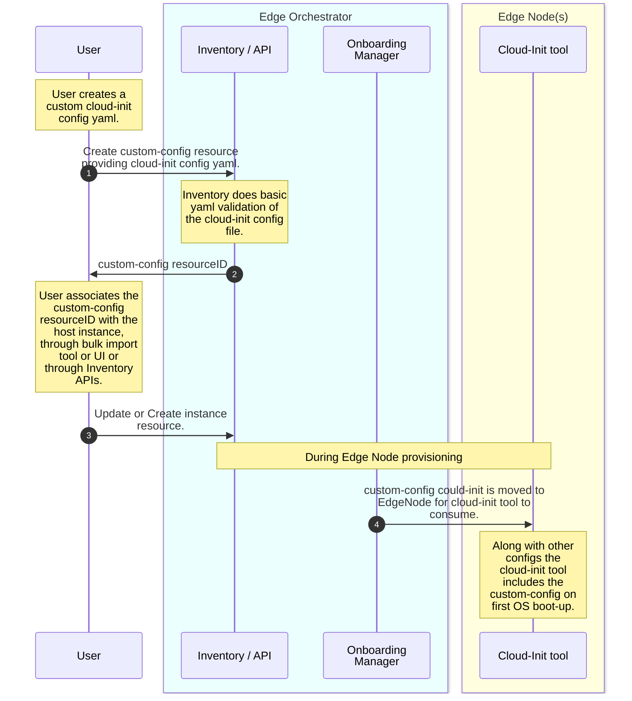

# Design Proposal: Custom EdgeNode Configuration via Cloud-Init

This document outlines the detailed process for incorporating custom configurations specific to each edge node. It also explains how these configurations can be associated with instances, ensuring that they are applied during the provisioning phase. By following the steps provided, users can effectively manage and customize their edge node settings to meet specific requirements at the time of instance creation.

## Current supported mechanism

Currently, all edge node configurations are managed at a global, regional, or site-specific level. There is no existing mechanism to implement custom configurations on a per-edge node basis during the provisioning stage. 

As a result, adjustments such as changes to proxy settings and the configuration of multiple interface IPs are considered day-two operational activities. To perform any configuration updates on an edge node, users are required to manually access the node and apply the changes directly.

This limitation means that any specific customization needed for individual edge nodes cannot be automated during the initial setup. Instead, users must wait until the provisioning process is complete and then manually intervene to make the necessary adjustments. This approach can be time-consuming and may lead to inconsistencies in configuration across different nodes.

## Proposed solution
The proposed solution leverages cloud-init to provide custom configurations or per edge-node configurations. Cloud-init, an open-source application developed by Canonical, is used to bootstrap Linux images in a cloud computing environment. It is a powerful tool for automating the initial setup of cloud instances, including configuring networking, storage, users, and packages. Cloud-init is exposed by hyperscale’s for VM configuration; for instance, AWS provides it as [user data](https://docs.aws.amazon.com/AWSEC2/latest/UserGuide/user-data.html#userdata-linux), while Azure offers it as [custom data](https://learn.microsoft.com/en-us/azure/virtual-machines/linux/using-cloud-init). 

In this solution, the cloud-init configuration will be exposed to EMF users through UI/APIs. EMF users will be able to add their cloud-init YAML files, which will be utilized by the cloud-init tool during edge node provisioning.

**Assumption**:
- The user has validated the cloud-init config that will be added to the custom-config resource.
- The user will associate the custom-config resource before EdgeNode provisioning.
- Failures can only be debugged through logs captured by observability.

**Work flow**
- *Step 1*: The user shall invoke infra-core Inventory APIs to create a custom-config resource using the user-provided cloud-init config YAML.
- *Step 2*: After performing basic YAML validation, the Inventory shall store the custom-config in the database and return a custom-config resource ID.
- *Step 3*: The orchestrator user can associate the custom-config resource ID with the host instance. This association can be done through the Bulk Import Tool, UI, or Inventory instance API. After associating the resource ID, the user updates the Inventory.
- *Step 4*: During the onboarding and provisioning of the EdgeNode, the Onboarding Manager copies the user cloud-init file into the EdgeNode along with the default EdgeNode provisioning cloud-init file. The cloud-init tool then picks up the user/custom cloud-init config during the first boot. 

### Changes required for implementation 
1. #### custom-config resource
1. #### custom-config data-model
1. #### Updates to Bulk Import Tool 

## Limitations

## Open issues