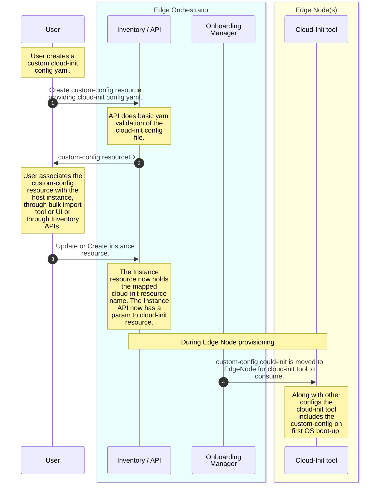
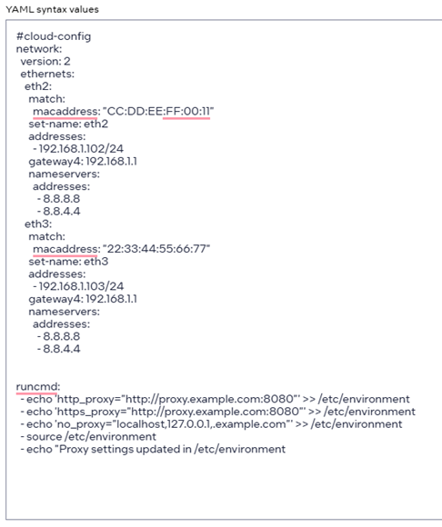

# Design Proposal: Custom EdgeNode Configuration 

This document outlines the detailed process for incorporating custom configurations specific to each edge node. It also explains how these configurations can be associated with instances, ensuring that they are applied during the provisioning phase. By following the steps provided, users can effectively manage and customize their edge node settings to meet specific requirements at the time of instance creation.

## Current supported mechanism

Currently, all edge node configurations are managed at a global, regional, or site-specific level. There is no existing mechanism to implement custom configurations on a per-edge node basis during the provisioning stage. 

As a result, adjustments such as changes to proxy settings and the configuration of multiple interface IPs are considered day-two operational activities. To perform any configuration updates on an edge node, users are required to manually access the node and apply the changes directly.

This limitation means that any specific customization needed for individual edge nodes cannot be automated during the initial setup. Instead, users must wait until the provisioning process is complete and then manually intervene to make the necessary adjustments. This approach can be time-consuming and may lead to inconsistencies in configuration across different nodes.

## Solution options

All options utilize cloud-init to provide custom configurations or per edge-node configurations. There is no doubt that cloud-init is the preferred tool, as the configuration needs to be done only once at bootup. Cloud-init, an open-source application developed by Canonical, is used to bootstrap Linux images in a cloud computing environment. It is a powerful tool for automating the initial setup of cloud instances, including configuring networking, storage, users, and packages. Cloud-init is exposed by hyperscale’s for VM configuration; for instance, AWS provides it as [user data](https://docs.aws.amazon.com/AWSEC2/latest/UserGuide/user-data.html#userdata-linux), while Azure offers it as [custom data](https://learn.microsoft.com/en-us/azure/virtual-machines/linux/using-cloud-init).

The following options where evaluated to configure using cloud-init. 

1. Option 1 : 
    Only exposing the configuration required through a dedicated API to the orchestrator API user. The API's will have list of configurations that the user want to add and call the EIM API. The EIM shall add those configuration to the existing cloud-init curated by onboarding manager. 

    Example of the openAPI with proxy address and ip address address:
    ```yaml
    customConfig:
      type: object
      required:
        - proxy
        - ipaddress
      properties:
        proxy:
          title: proxy
          type: string
        ipaddress:
          title: ip
          type: string
    ```

2. Option 2 : 
    Exposing a template with the configs through a dedicated API to the user. The user shall populated with desired configurations in predefined XML or yaml template form and call the EIM API. The EIM onboarding manager shall add those configuration to the existing or new cloud-init.

    Example of template the openAPI with runcmd for running usear command and adding user:
    ```yaml
    customConfig:
      type: object
      required:
        - runcmd
        - user
      properties:
        runcmd:
          title: runcmd
          type: string
        users:
          title: users in cloud-init
          type: string
        version:
          title: Applicable on OS version
          type: string
        site:
          title: applicable on site 
          type: string
        kernelparam:
          title: Kernel parameter
          type: string
    ```
    There are certain advantages of this option:

      - Templating provides a simpler and more user-friendly method for adding configurations.
        Ex: The user does not have to form the command for setting the kernal parameter, this can be added by onboarding manager in the cloud-init
      - Additionally, templating allows for the verification of certain preconditions before applying cloud-init. Ex: In the above example version control can determine the applicability of cloud-init on specific EdgeNodes by checking the OS version.  

    The *Option 2* should be considered for future implementations when a simpler and more intuitive method is required as it needs carefull templating of parameters.

3. Option 3 :
    The complete cloud-init file will be exposed to the user through a dedicated API. The user can create a cloud-init file, add the desired configurations, and call the EIM API. The EIM onboarding manager will then add this new cloud-init file to the Edge Node, allowing the cloud-init tool to configure the node accordingly.

    Example of template the openAPI with cloud-init file as input parameter for user:
    ```yaml
    customConfig:
      type: object
      required:
        - cloud-init
        - name
      properties:
        cloud-init:
          title: cloud-init file
          type: string
        name:
          title: name of file
          type: string
    ```
  The ***Option 3*** offered more advantages when compared to others. 

  *Scalability*: As new configurations or policies are defined, they can be seamlessly integrated into the existing setup with out changing to EIM API or Inventory. But with Option 1 changes will be needed in EIM. We might have to update the template in Option 2 if more conditions or fields are needed for example region is required. 

  *Flexibility*: Cloud-init supports a wide range of configuration options, including user data scripts, cloud-config directives, and more. This flexibility allows users to customize their instances extensively without being limited by predefined templates. Extending the Template or parameters (Option 1, 2) in API was be additional effort in furture maintenance. 

  *Integration and Reusability*: Cloud-init integrates seamlessly with various cloud platforms and services, ensuring that configurations are applied consistently across different environments. If the user have there existing cloud-init it can be *re-used* in EMF for custom configuration. This is not possible with Option 1 and 2.

  *Industry Standard*: Cloud-init is widely recognized and used in the industry for initializing cloud instances. It has extensive documentation and community support, making it a reliable choice. More parameter validation type check more documentation  etc will be required in EIM to handle it.

## Proposed solution

In this solution, the cloud-init configuration will be exposed to EMF users through UI/APIs. EMF users will be able to add their cloud-init YAML files, which will be utilized by the cloud-init tool during edge node provisioning.

The interfaces proposed shall not restrict it to only cloud-init file yaml format, in future the solution can be extented to different type of file formats such as bash script or json file format.


**Assumption**:
- The user has validated the cloud-init config that will be added to the custom-config resource.
- The user will associate the custom-config resource before EdgeNode provisioning.
- Failures can only be debugged through logs captured by observability.

**Work flow**
- *Step 1*: The user shall invoke infra-core Inventory APIs to create a custom-config resource using the user-provided cloud-init config YAML.
- *Step 2*: After performing basic YAML validation, the Inventory shall store the custom-config in the database and return a custom-config resource ID.
- *Step 3*: The orchestrator user can associate the custom-config resource ID with the host instance. This association can be done through the Bulk Import Tool, UI, or Inventory instance API. After associating the resource ID, the user updates the Inventory.
- *Step 4*: During the onboarding and provisioning of the EdgeNode, the Onboarding Manager copies the user cloud-init file into the EdgeNode along with the default EdgeNode provisioning cloud-init file. The cloud-init tool then picks up the user/custom cloud-init config during the first boot. 

### Changes required for implementation 

#### 1. New custom-config resource and data model
A new custom-config resource will be added to the Infra-core data model, which captures information needed for a creating config on the edge node. The custom-config resource will contain the following fields:

- custom-config-file : The config file is the user provided configuration file. The file can be of different supported format specified in config-type. Below is the data-model of the custom-config-file. 


- custom-config-type : The configuration can be of different type such as cloud-init, bash file or json. The custom-config-type bash file or json can be for future use.

***Data-Model*** example of custom-config :

  ```yaml
  // Custom configuration type
  // CustomConfigResource describes custom configuration 
  message CustomConfigResource {
    // configuration file.
    string config = 1 [
      (ent.field) = {
        optional: false
        immutable: true
      },

      (buf.validate.field).string = {
        min_len: 1
        max_len: 16384
        pattern: "^[A-Za-z0-9-/_\\[\\]\\.\\\\]*$"
      },
      (buf.validate.field).ignore = IGNORE_IF_UNPOPULATED
    ];

    // name provided by admin
    string name = 2 [
      (ent.field) = {
        optional: false
        immutable: true
      },
      (buf.validate.field).string = {
        pattern: "^[a-z][a-z0-9-]{0,31}$"
        max_bytes: 32
      },
      (buf.validate.field).ignore = IGNORE_IF_UNPOPULATED
    ];
  }
  ```
  The instance resource data-model has to be updated to include custom-config resource.

  The relationship between an instance and its custom configuration shall be one-to-many. Each instance can be associated with one or more than one pre-created custom configuration. The onboarding manager will create cloud-init file based on number of cloud-init files added by user. We can ristrict the number of cloud-init file that canbe associated to a instance to 5. 

#### 2. EIM API enahncement

A new set of APIs will be added to support custom-config resource handling. These APIs should enable Create, Read, and Delete operations on custom-config resources. 

Additionally, the instance resource APIs must be extended to support the addition and updating of custom-config resources. Custom-config resources shall not be permitted to be deleted while the instance is active or associated. 

#### 3. Changes in Onboarding Manager 
During provisioning, the Onboarding Manager shall check the instance. If the custom-config contains the cloud-init file, it will be copied along with the existing default EMF EdgeNode cloud-init. Since the custom-config is optional, no action is required if the cloud-init file is not present. There will be no error handling for user cloud-init failures. 

#### 4. Updates to Bulk Import Tool 
The Bulk Import Tool has to be enhances to :
- Include custom-config resourceID in .csv file

  Ex: Here cc-8s150fg1 is the resource ID of custom-config
  ```csv
  Serial,UUID,OSProfile,Site,Secure,RemoteUser,CustomConfigNameMetadata,Error - do not fill
  2500JF3,4c4c4544-2046-5310-8052-cac04f515233,os-7d650dd1,site-08c1e377,true,localaccount-9dfb57cb,custom-config-1,key1=value1&key2=value2,
  ```
- Update Bulk Import Tool to check and include custom-config resource ID into the instance creation API. 

#### 5. UI enhancements
The UI should provide an option for users to create custom configurations cloud-init data. This feature can be designed similarly to the application profile YAML edit text input block under Deployments.
To assist users, sample helper templates can be included. 

Here is a sample UI with cloud-init configuration for updating IP address and proxy settings.

  

The UI shall provide interface to the user during Host registration page to associate or Map the earlier created custom-config. The UI can be similar to that of LocalAccount Page were it shows the list of LocalAccount to associate.

Once the provisioning is completed, the cloud-init data should be immutable; no edit or delete options should be available. Users should only be able to view the cloud-init configuration under host details.

#### Examples:
1. Add user proxy address on the edgenode. 

  ```yaml
  
#cloud-config
write_files:
  - path: /etc/environment
    permissions: '0644'
    owner: root:root
    content: |
      http_proxy="http://proxy.example.com:8080"
      https_proxy="http://proxy.example.com:8080"
      ftp_proxy="http://proxy.example.com:8080"
      no_proxy="localhost,127.0.0.1,localaddress,.localdomain.com"
      HTTP_PROXY="http://proxy.example.com:8080"
      HTTPS_PROXY="http://proxy.example.com:8080"
      FTP_PROXY="http://proxy.example.com:8080"
      NO_PROXY="localhost,127.0.0.1,localaddress,.localdomain.com"

  ```

2. Update the kernel parameter by modifying the GRUB configuration file. 

  ```yaml
  
  #cloud-config
  write_files:
    - path: /etc/default/grub
      permissions: '0644'
      owner: root:root
      content: |
        GRUB_DEFAULT=0
        GRUB_TIMEOUT=5
        GRUB_DISTRIBUTOR=`lsb_release -i -s 2> /dev/null || echo Debian`
        GRUB_CMDLINE_LINUX_DEFAULT="quiet splash"
        GRUB_CMDLINE_LINUX="your_kernel_parameter=value"
  runcmd:
    - update-grub

  ```

3. Setting IP address using MAC address

  ```yaml
  #cloud-config
  network:
    version: 2
    ethernets:
      eth0:
        match:
          macaddress: "00:11:22:33:44:55"
        set-name: eth0
        addresses:
          - 192.168.1.100/24
        gateway4: 192.168.1.1
        nameservers:
          addresses:
            - 8.8.8.8
            - 8.8.4.4

  ```

## Opens
1. Do we need to support more than one file format.