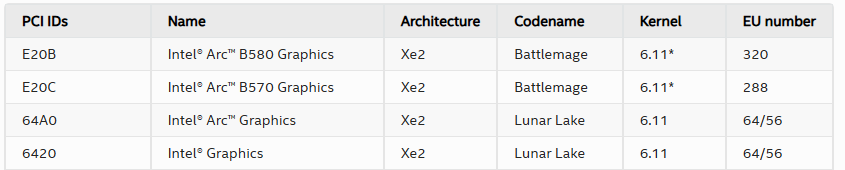
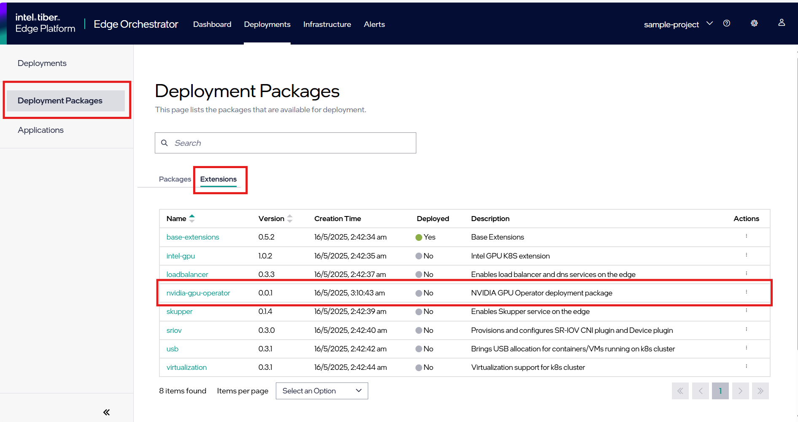

# Design Proposal: Support for dGPU

Author(s): Rajeev Ranjan, Sandeep Sharma, Jagrat Acharya

Last updated: 2025-05-16

## Abstract

This design proposal outlines a plan to enhance discrete GPU (dGPU) support, addressing current limitations and introducing new functionalities. Key issues identified include inadequate support for newer dGPUs like Intel Battlemage, reliance on out-of-tree drivers, challenges with Secure Boot due to unsigned i915 drivers, and inefficiencies from redundant OSProfiles for GPU-equipped systems. The proposal aims to streamline driver integration as extensions, enable Single Root I/O Virtualization (SRIOV), and improve overall system compatibility and user efficiency for GPU workloads on EdgeNodes.

## Limitations and Debt of The Current Design

In the earlier release (3.0), a key issue was the inability to activate Secure Boot for GPU-based workloads. This limitation arose because the i915 drivers, crucial for Intel's integrated and discrete GPUs, lacked signatures from a trusted package distributor like Canonical. Consequently, Secure Boot, which mandates that all kernel modules be signed by an authorized entity, couldn’t be engaged without compromising or circumventing this security feature. This created a substantial challenge for users who needed both GPU acceleration and a secure boot environment.

### Goals/Requirements (release 3.1 onwards)

1. **Support for additional GPUs**
   * Intel Battlemage B580
   * NVIDIA P100
2. **OSProfile agnostic GPU enablement**: This aims to simplify deployment by not requiring separate OS profiles for systems with GPUs.
3. **One-click enablement/installation of GPUs**:Streamlining the GPU setup process for users
4. **Component-Platform compatibility metrics**:

| GPU           | OS           | Kernel  | Platform    | Priority |SB/FDE | SRIOV    | DevicePlugin | Operator  |
|---------------|--------------|---------|-------------|----------|-------|----------|--------------|-----------|
| Intel iGPU    | EMT 3.0      | -       | Xeon, Core  | P0(3.1)  | Yes   | Required | Required     | -         |
| Intel iGPU    | Ubuntu 22.04 | >6.8    | Xeon, Core  | P0(3.1)  | No    | Required | Required     | -         |
| Intel B580    | EMT 3.0      | -       | Xeon        | P0(3.1)  | Yes   | 3.2      | Required     | -         |
| Intel B580    | Ubuntu 24.04 | >6.11   | Xeon        | P2(3.2)  | Yes   | 3.2      | Required     | -         |
| NVIDIA P100   | EMT 3.0      | -       | Xeon        | P2(3.2)  | Yes   | Required | -            | Required  |
| NVIDIA P100   | Ubuntu 22.04 | >6.11   | Xeon        | P1(3.1)  | No    | -        | -            | Required  |

Note that NVIDIA P100 shall also be supported on Ubuntu 24.04 but in the 3.2 release cycle. For the current 3.1 release, technical readiness is targetted even if there are manual steps involved for Ubuntu 22.04.

### Proposed changes

1. **Avoid OSProfile for GPU Support**:
   * The plan is to eliminate the need for dedicated OSProfiles for Intel and NVIDIA GPUs. Instead, the system will rely on in-tree GPU drivers available in kernel versions greater than 6.11 with Ubuntu 24.04. This is expected to simplify deployment and reduce maintenance.

1. **Ensure in-tree drivers (critical for secure boot)**:
   Ubuntu 24.04, featuring kernel versions later than 6.11, is expected to include in-tree GPU drivers, enhancing overall usability. If in-tree driver support cannot be achieved, utilizing Intel Graphics Preview from Canonical, while beneficial during development cycles, will not be feasible for the official release. Given the priority of enablement, the continuation of day-2 procedures remains essential.

1. **Edge Microvisor Toolkit (EMT) Support**:
   * For EMT, Intel GPU drivers and prerequisites for the NVIDIA GPU Operator (including drivers, SR-IOV settings, and kernel command line parameters) will be included in the immutable OS image.

1. **ITEP Application Extensions**:

   Develop/update the cluster extensions supported by the platform to ease the consumption of GPUs.
   <https://github.com/open-edge-platform/cluster-extensions/blob/main/README.md>
   * **Intel**
     * Intel Arc B580 Graphics is compatible with the Xe2 driver architecture.
     * Upgrading the kernel to version 6.11 or its minor variations enables Xe2 driver support.
     * The DEB package will be installed during node onboarding.

        
        <https://dgpu-docs.intel.com/devices/hardware-table.html>
     * Refer to the official documentation for driver installation. DEB package install GPU drivers as part of rolling updates.

       <https://dgpu-docs.intel.com/driver/installation-rolling.html>

     * **Ubuntu-22.04**
         * Ubuntu 22.04 officially supports the 6.8 Linux kernel, whereas the B580 requires the 6.11 Linux kernel. To install the driver for the B580, a custom 6.11 kernel is required.
         * The driver installation instructions for Ubuntu 22.04 were ineffective for B580, resulting in a failed card enumeration.

     * **Ubuntu-24.04 Desktop**
         * Ubuntu Desktop 24.04.2 includes the xe driver by default.
         * For Any additional compute and media package intel provide PPA, can be installed from the official Intel site.

           <https://dgpu-docs.intel.com/driver/client/overview.html>

     * **Ubuntu-24.04 Server:**
         * Make sure prerequisites to add repository access are available.

            ```
            sudo apt update
            sudo apt install -y gpg-agent wget
            ```

         * Add the online network package repository.

            ```
            . /etc/os-release
            if [[ ! " jammy noble " =~ " ${VERSION_CODENAME} " ]]; then
               echo "Ubuntu version ${VERSION_CODENAME} not supported"
            else
               wget -qO - https://repositories.intel.com/gpu/intel-graphics.key | \
               sudo gpg --yes --dearmor --output /usr/share/keyrings/intel-graphics.gpg
               echo "deb [arch=amd64 signed-by=/usr/share/keyrings/intel-graphics.gpg] https://repositories.intel.com/gpu/ubuntu ${VERSION_CODENAME} unified" | \
               sudo tee /etc/apt/sources.list.d/intel-gpu-${VERSION_CODENAME}.list
               sudo apt update
            fi
            ```

         * Install kernel and Intel® XPU System Management Interface (XPU-SMI) packages on  a bare metal system. Installation on the host is sufficient for hardware management and support of the runtimes in containers and bare metal.

            ```
            sudo apt install -y \
            linux-headers-$(uname -r) \
            linux-modules-extra-$(uname -r) \
            flex bison \
            intel-fw-gpu intel-i915-dkms xpu-smi
            sudo reboot
            ```

         * Install packages responsible for computing and media runtimes.

            ```
            sudo apt install -y \
            intel-opencl-icd libze-intel-gpu1 libze1 \
            intel-media-va-driver-non-free libmfx-gen1 libvpl2 \
            libegl-mesa0 libegl1-mesa-dev libgbm1 libgl1-mesa-dev libgl1-mesa-dri \
            libglapi-mesa libgles2-mesa-dev libglx-mesa0 libigdgmm12 libxatracker2 mesa-va-drivers \
            mesa-vdpau-drivers mesa-vulkan-drivers va-driver-all vainfo hwinfo clinfo
             ```

         * Install development packages.

            ```
            sudo apt install -y \
            libigc-dev intel-igc-cm libigdfcl-dev libigfxcmrt-dev libze-dev
            ```

         * List the group assigned ownership of the render nodes and the groups you are a member of.There are specific groups that users must be a part of to access certain functionalities of the GPU. The render group specifically allows access to GPU resources for rendering tasks without giving full access to display management or other potentially more sensitive operations.

            ```
            stat -c "%G" /dev/dri/render*
            groups ${USER}
            ```

         * If you are not a member of the same group used by the DRM render nodes, add your user to the render node group.

            ```
            sudo gpasswd -a ${USER} render
            ```

         * Change the group ID of the current shell.

           ```
           newgrp render
           ```

     * Existing extensions, such as the device-operator and gpu-plugin, will be updated. The Intel GPU device plugin for Kubernetes facilitates access to Intel discrete and integrated GPUs, registering resources like gpu.intel.com/i915 and gpu.intel.com/xe within a Kubernetes cluster
     * **For EMT** : EMT should be build with 6.11* linux kernel.
     * **For Ubuntu** : Ubuntu Server 24.04.2, equipped with the 6.11 kernel, has been validated with BMG GPU drivers. DEB packages are available as rolling updates in the official documentation.

   * **NVIDIA**
     * A new extension will be created to configure and install the NVIDIA GPU Operator using its Helm chart. The NVIDIA GPU Operator automates the management of all NVIDIA software components required to provision GPUs in Kubernetes, including drivers, the Kubernetes device plugin, the NVIDIA Container Runtime, and monitoring tools.
        
     * **For EMT** : pre-installed drivers in the immutable OS will be utilized by the GPU Operator.
     * **For Ubuntu** : the extension package will configure the GPU Operator to detect the OS and install optimal drivers automatically.

1. **SRIOV support**:

   Single Root I/O Virtualization (SRIOV) support is a key enhancement
   * EMT will include SRIOV support alongside the drivers.
   * Kubernetes device plugins or operators will be used to enable SRIOV. The SR-IOV Network Device Plugin for Kubernetes can discover and manage SR-IOV capable network devices . NVIDIA also provides an SR-IOV Network Operator  and documentation for using SR-IOV in Kubernetes.
   * Virtual machines will leverage KubeVirt to access SR-IOV capabilities. Intel offers an "Intel Graphics SR-IOV Enablement Toolkit" with components to facilitate Graphics SR-IOV for applications using KubeVirt, allowing VMs direct access to partitioned GPU resources.

1. **Documentation**:

   Updated documentation will be provided, including:
   * Instructions for deploying the NVIDIA GPU Operator.
   * Revised guidelines for running GPU workloads on Kubernetes.

1. **Monitoring and Metrics**:

   GPU monitoring will be integrated into the observability stack:
   * Tools like the NVIDIA DCGM Exporter and Intel GPU metrics will be incorporated. The NVIDIA Data Center GPU Manager (DCGM) Exporter allows for the collection of GPU metrics in Prometheus format and can be deployed in Kubernetes, often via a Helm chart . It can also be deployed as part of the NVIDIA GPU Operator . dcgm-exporter collects metrics for all GPUs on a node and can associate these metrics with specific Kubernetes pods.
   * Dashboards will be provided for monitoring GPU usage and health.

1. **Testing Across Workloads**:

   The proposed dGPU support will be tested using workloads such as
   * Geti
   * Pallet Defect Detection(PDD)

## Implementation plan

The implementation is planned in two phases:

### Phase 1 (for EMF 3.1 release)

1. Maintain support for Intel® Arc™ iGPU and dGPU on Ubuntu 22.04
1. Intel® Arc™ iGPU support on EMT
1. Intel Battlemage B580 dGPU support on EMT
1. NVIDIA P100 dGPU support on Ubuntu 22.04

### Phase 2 (for EMF 3.2 release)

1. NVIDIA P100 dGPU support on EMT
1. NVIDIA P100 dGPU support on Ubuntu 24.04
1. Intel Battlemage B580 dGPU support on Ubuntu 24.04

## Open issues

1. Does Ubuntu in-tree kernel 6.11++ support Battlemage B580 as well?

   Yes Ubuntu desktop 24.04.2 and 24.10 has 6.11* kernel support Battlemage B580.

2. Gpu driver are not enable in ubuntu 24.04 server edition eith 6.11* kernel.

   DEB packages are included in the rolling updates outlined in the official graphics driver installation documentation.

3. No requirement for iGPU & dGPU together at the moment
