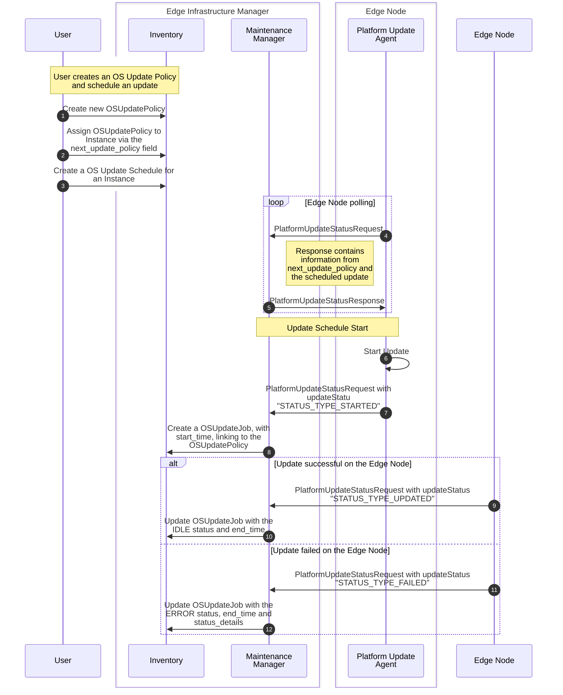
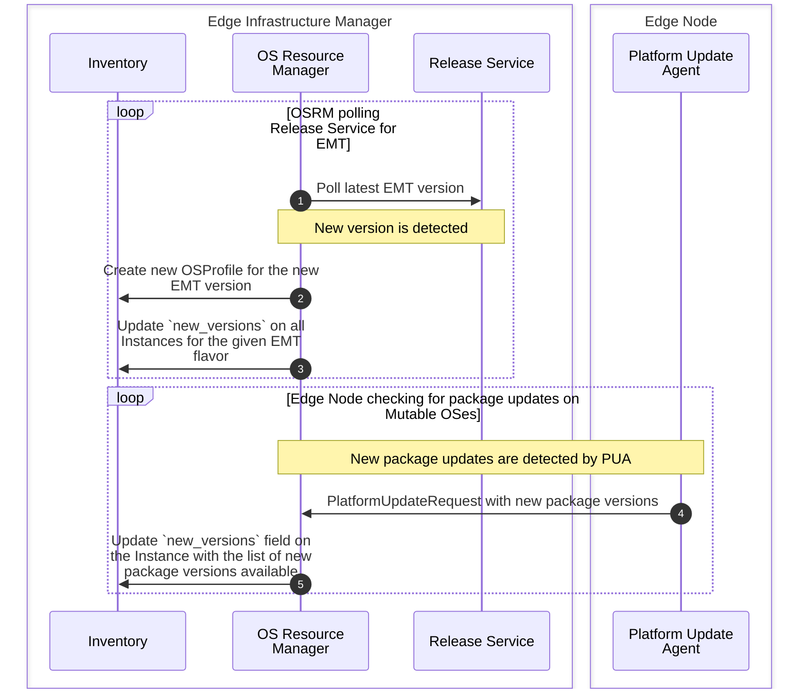
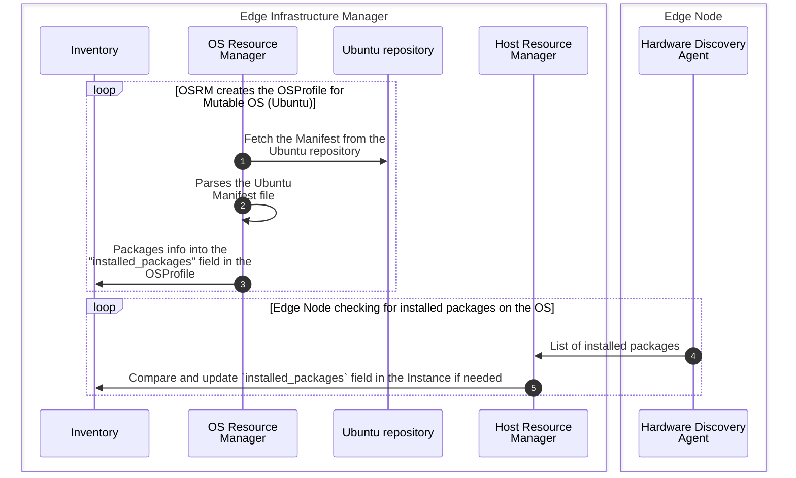

# Design Proposal: Edge Infrastructure Manager Day 2 Improvements

Author(s): Daniele Moro, Tomasz Osinski

Last updated: 2025-05-08

## Abstract

This proposals describes a set of improvements to the Edge Infrastructure Manager (EIM) Day 2
operations. The goal is to enhance the user experience and streamline the process of managing
Day 2 operations on a fleet of Edge Nodes, including both mutable (Ubuntu) and 
immutable (Edge Microvisor Toolkit - EMT) operating systems.

## Proposal

Day 2 journey in EIM is a complex process, with separate workflows for 
Mutable and EMT OS Profiles.  
Also, new requirements have been identified to improve the user experience 
and to track the day 2 operations, such as the versions of EMT a EN 
passed through its lifecycle.

### Requirements:

- Improve UX for day 2 operations
- Unify day 2 workflows between Mutable and Immutable OSes
- Track all the day 2 operations that happened to a given Edge Node
- Track packages installed into an Edge Node in both Mutable and Immutable OSes

### Limitations and Debt of The Current Design

The day 2 workflow for Mutable and EMT OSs are very different see
[Day2 Updates](https://github.com/open-edge-platform/edge-manage-docs/blob/d8b6ecf2c7bf2ad9341e219f9f9bb90f85e784ff/docs/developer_guide/infra_manager/arch/day2_flow.rst).

Day 2 updates for mutable OSes are currently driven via the same OS resource 
that is used for Day0 (provisioning). 
As a consequence all Instances using a given OS profile will be updated 
if covered by a schedule.

The list of installed packages is available only for EMT OS, and it is 
based on the Manifest file available in the Release Service. We don't have 
any mechanism to track the installed packages for mutable OSes.

There is not unified approach to provide information about availability of 
an OS update. The current approach is based on the Current/Desired OS and 
relies on the Operating System Resource Manager (OSRM) automatic override 
of the Desired OS.

The current design does not provide a mechanism to track the Day2 
operations that happened in the past.

There is no mechanism to Update OS Profiles when new EMT versions are 
available in the Release Service.

### Proposed changes

The proposal is to create dedicated resources into the Inventory schema to 
explicitly handle day 2 operations, and to track the history of the Edge Node.
Also, the OSProfile becomes a resource used for Day 0 operation only, and 
contains static information about the OS itself. Updates of the OSProfile 
are not allowed anymore from the REST APIs.
Instances instead handles all the runtime information of the software 
running on the Edge Node, including the installed packages (that could 
change during the lifecycle of the Edge Node), and information about 
available updates for the Edge Node.

The following represents the schema changes to be applied to EIM schema to 
fulfill the above requirements:

Changes:
- **OS Profile**:
  - `installed_packages`: field is used to track only packages installed at 
    day 0, for Immutable those comes from the Manifest file published 
    together with the EMT image. For Mutable, those are filled using the 
    Ubuntu manifest file. For Mutable, this won't include Bare Metal Agents 
    packages, since those are installed during Day 0, but they are not part 
    of the Ubuntu manifest.
  - `update_sources`: the field is deprecated, and should not be used anymore.
  - The resource now supports only Create, Read and Delete operations. Update 
    is not allowed anymore. The resource is now read-only from the 
    Northbound APIs perspective.
- **Instance**:
  - `desired_os`: field is removed, we don't drive the Immutable OS day 2 
    workflow from this field anymore.
  - `current_os`: the field can now be changed from EIM northbound APIs 
    (REST), only before the EN is provisioned. After that, the field is 
    handled internally by EIM, and will be updated based on the current OS 
    installed.
  - `installed_packages`: this field is used to track packages that are 
    actually installed in the Edge Node at runtime. For Immutable OSes, we 
    expect this to be equal to the content of `installed_packages` in the 
    OS Profile. For Mutable OSes, this could change during the lifetime of 
    the Edge Node.
  - `new_versions`: signals that new updates are available. This field doesn't 
    tell anything about the fact that the update will be done in the next 
    scheduled maintenance. The field is a string.
    - mutable: list of packages ready to be upgraded on the Edge Node, 
      empty if no new versions are available.
    - immutable: latest EMT version, empty if the version is already latest.
  - `next_update_policy`: The update policy that is applied during the 
    maintenance schedule.
  
New Resources:

- **OS Update Policy**: defines the Policy that must be applied during an 
  update. This resource can be linked to multiple Instances, Regions and or 
  Sites. Some fields and edges are valid for Mutable or Immutable OSes.
  - `install_packages`: list of packages to be installed during the update. 
    This field is used only for Mutable OSes.
  - `update_sources`: 'DEB822 Source Format' for Debian style OSs, contains 
    the sources of the packages to be installed during the update, if new 
    sources needs to be added.
  - `update_policy`: enum field, defines which policy to use:
    - `UPDATE_POLICY_LATEST`: upgrade to latest version. 
      - mutable: upgrade all packages to latest versions.
      - immutable: upgrade the OS version to the latest.
    - `UPDATE_POLICY_TARGET`: upgrade to a specific version.
      - mutable: upgrade all packages to the specified version defined in 
        the `install_package` list.
      - immutable: upgrade the OS version to OS Version linked by the 
        `target_os` edge.
  - `target_os`: edge to the OS Profile that must be installed during the 
    update. This field is used only for Immutable OSes.

- **OS Update Job**: stores the information about the update job that run 
  on the Edge Node. This resource is created when the update is started, 
  and stores information about what happened in the Edge Node during the 
  Update.
  - `status`: stores the short description of what happened during the update.
  - `status_indicator`: enum field, moder status indicator:
    - `STATUS_INDICATION_ERROR`: an error happened during the update.
    - `STATUS_INDICATION_IN_PROGRESS`: unused, the progress about the 
      update is kept into the `update_status` field of the Instance.
    - `STATUS_INDICATION_IDLE`: the update was successful.
  - `status_timestamp`: timestamp of the last status update. Overlaps with 
    the `end_time`, but it's kept for consistency with Modern Status. Also, 
    could be used in the future, if we deprecate the Instance `update_status`.
  - `status_details`: detailed description of what happend during the 
    update. For example, the list of packages that were installed or 
    updated, or the reason why the Immutable OS update failed.
  - `start_time`: timestamp of when the update job started.
  - `end_time`: timestamp of when the update job ended.
  - `applied_policy`: the policy that was applied during the update. 
    Provides information of what was the target Update Policy for this update.

Resource and Field Handling:

- **OS Profile**:
  - `installed_packages`: this field is handled and filled by OSRM also for 
    Mutable OSes.
- **Instance**:
  - `current_os`: after provisioning, this field is handled internally by 
    EIM. The Maintenance Manager (MM) keeps it updated after the 
    maintenance schedule happened.
  - `installed_packages`: this field is handled by Host Resource Manager (HRM)
    that received the information about installed package by the Hardware 
    Discovery Manager (HDA).
  - `new_versions`: this field is handled by the OSRM, that will update 
    it when new updates are available. 
- **OS Update Policy**: this resource is completely handled by the User of 
  the orchestrator. The creation is done through Northbound REST APIs. EIM 
  won't change the content of this resource. Default OS Update Policies 
  could be agreed and created upon Tenant creation (for example, update to 
  latest policy). OS Update Policies cannot be updated after creation, and 
  cannot be deleted if any OS Update Job or any Instances refers to it.
- **OS Update Job**: this resource is created by the OSRM when the update 
  job is started. The content of this resource is filled by the OSRM, and 
  it will be updated with the status of the update job. It is read-only 
  from Northbound REST APIs.

#### Day 2 Workflows:

Day2 update workflow for Mutable and Immutable OSes:

Automatic Update of the Instance `new_versions` field:

Installed packages filling is OSProfile and Instances:

## Rationale

[A discussion of alternate approaches that have been considered and the trade
offs, advantages, and disadvantages of the chosen approach.]

## Affected components and Teams

Edge Infrastructure Manager:
- **Inventory (inv)**: changes to the schema 
  1. OSProfile updates
  2. Instance updates
  3. New OSUpdatePolicy resource
  4. New OSUpdateJob resource
- **API**: API needs to be updated according to the schema changes.
  1. OperatingSystem resource update
  2. Instance resource update
  3. New OSUpdatePolicy APIs (Create, Read, Delete)
  4. New OSUpdateJob APIs (Read, Delete)
- **Maintenance Manager (MM)**: The MM needs to be updated to handle the new 
  OSUpdatePolicy and OSUpdateJob resources.
  1. Update southbound APIs to allow PUA to provide packages ready to be 
     updated
  2. Handle OSUpdatePolicy
  3. Create and Update OSUpdateJob
- **OS Resource Manager (OSRM)**: OSRM adds support for new EMT versions, 
  notice 
  of new updates for EMT, and fill package info from Ubuntu manifest.
  1. Polling of new EMT versions from Release Service and create new 
     OSprofiles accordingly
  2. Update `new_versions` field in the Instances
  3. Fetch Ubuntu Manifest referenced into the OSProfile from Release 
     Service. Parse it and fill the information into the OSProfile in 
     Inventory.
- **Host Resource Manager (HRM)**: HRM updates the installed packaged on 
  per-instance basis
  1. Update Southbound API to allow HDA to provide list of installed 
     packages with versions.
  2. Fill the installed packages information into the Instance resource.

Edge Node:
- **Platform Update Agent (PUA)**:
  1. For mutable OSes, PUA needs to poll and check for new update to 
     already installed packages, and reports back to the MM the new 
     versions available.
- **Hardware Discovery Agent (HDA)**:
  1. For both mutable and immutable OSes, HDA should report the list of 
     installed packages to the HRM with versions.

UI/CLI:
1. Support for creation of OSUpdatePolicy.
2. Support to show History of the Instance, via the OSUpdateJob resources.

## Implementation plan

The implementation plan is divided into 3 phases.

### Phase 1 (for EMF 3.1 release)

1. schema and REST API changes (inv.\*, API.\*)
2. Update to Maintenance Manager (MM) to handle OSUpdatePolicy, and create
   and update OSUpdateJob (MM.ii, MM.iii)
3. UI/CLI support for OSUpdatePolicy (UI/CLI.1)
4. CLI support for OSUpdateJob (CLI.2)
5. New Integration tests
6. Update to documentation for the new Day2 operations

### Phase 2 (for EMF 3.2 release)

1. OSRM to support immutable OSes notice for new versions (OSRM.i, OSRM.ii)
2. New Integration tests
3. Update to documentation

### Phase 3 (for EMF.next release)

1. MM update to SBI APIs (MM.i)
2. OSRM fetch Ubuntu Manifest (OSRM.iii)
3. HRM update to SBI APIs (HRM.i, HRM.ii)
4. PUA update to check for new packages (PUA.i)
5. HDA update to report installed packages (HDA.i)
6. New Integration tests
7. Update to documentation

## Open issues (if applicable)

- How to handle OSProfile updates from OSRM? Do we need a compatibility 
  matrix or a way to accept a OSProfile into a running orch from a Project 
  admin?
