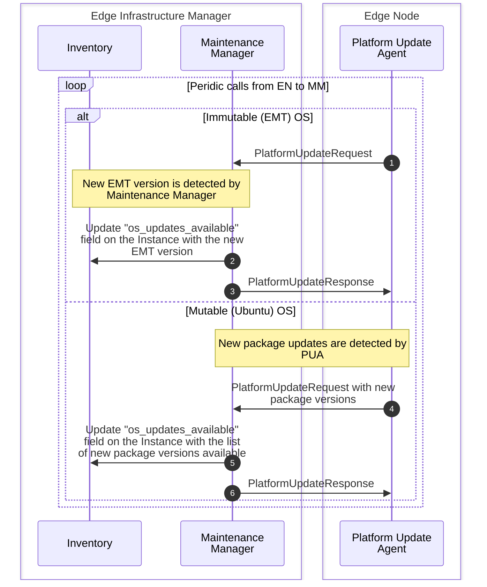
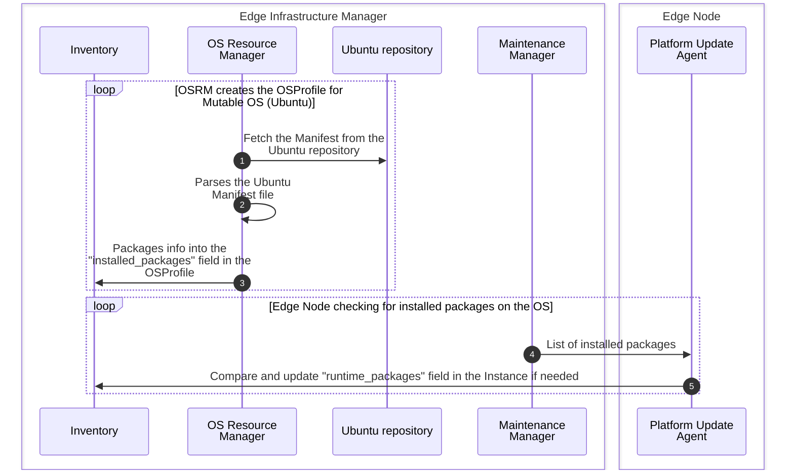
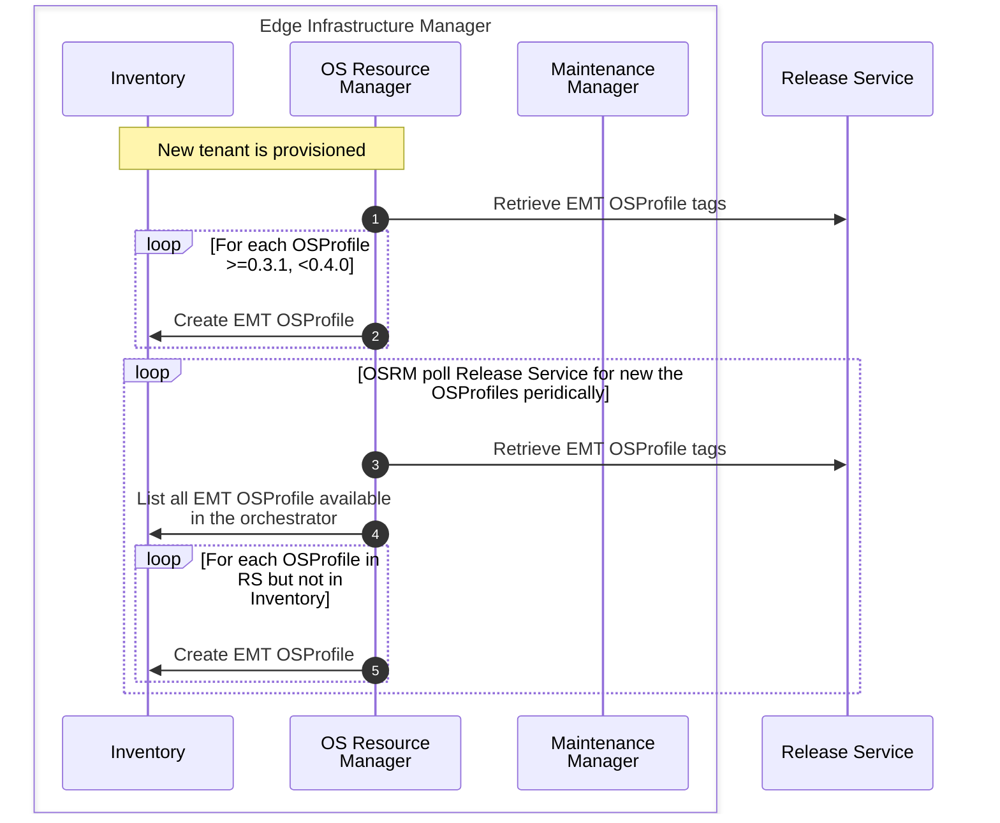

# Design Proposal: Edge Infrastructure Manager Day 2 Improvements

Author(s): Daniele Moro, Tomasz Osinski

Last updated: 2025-05-08

## Abstract

This proposals describes a set of improvements to the Edge Infrastructure
Manager (EIM) operations to update a node (Day 2). The goal is to enhance the
user experience and streamline the process of managing Day 2 operations on a
fleet of Edge Nodes, including both mutable (Ubuntu) and immutable (Edge
Microvisor Toolkit - EMT) operating systems.

## Proposal

Day 2 journey for a device in EIM is a complex process, with separate workflows
for Mutable and Immutable Operating systems (e.g. Edge Microvisor Toolkit, EMT),
currently defined in OS Profiles. Also, new requirements have been identified to
improve the user experience and to track the day 2 operations, such as the
versions of EMT a EN passed through its lifecycle.

### Requirements:

- Improve UX for day 2 operations
- Unify day 2 workflows between Mutable and Immutable OSes
- Track all the day 2 operations that happened to a given Edge Node
- Track packages installed into an Edge Node in both Mutable and Immutable OSes
- New OSProfiles for EMT created in EIM at runtime, without orchestrator upgrade
- Provide an easy way to the UI to signal that an update is available for an
  Edge Node

### Limitations and Debt of The Current Design

The day 2 workflow for Mutable and EMT OSs are very different see [Day2
Updates](https://github.com/open-edge-platform/edge-manage-docs/blob/d8b6ecf2c7bf2ad9341e219f9f9bb90f85e784ff/docs/developer_guide/infra_manager/arch/day2_flow.rst).

Day 2 updates for mutable OSes are currently driven via the same OS resource
that is used for Day0 (provisioning). As a consequence all Instances using a
given OS profile will be updated if covered by a schedule.

The list of installed packages is available only for EMT OS, and it is based on
the Manifest file available in the Release Service. We don't have any mechanism
to track the installed packages for mutable OSes.

There is not unified approach to provide information about availability of an OS
update. The current approach is based on the Current/Desired OS and relies on
the Operating System Resource Manager (OSRM) automatic override of the Desired
OS.

The current design does not provide a mechanism to track the Day2 operations
that happened in the past.

There is no automatic mechanism to Update OS Profiles when new EMT versions are
available in the Release Service, unless an orchestrator update is performed.

### Proposed changes

The proposal is to create dedicated resources into the Inventory schema to
explicitly handle day 2 operations, and to track the history of the Edge Node.
Also, the OSProfile becomes a resource that contains static information about
the OS itself, and won't contain specific information related to Day 2
operations. OSProfiles are still used for Day 2 operations for immutable OSes,
but they will be used only to track the target EMT version, and the current
installed EMT version. Interaction with OSProfile APIs are now reserved for
advanced use case only, users should not interact with them during Day 2
operations. Instances instead handles all the runtime information of the
software running on the Edge Node, including the installed packages (that could
change during the lifecycle of the Edge Node), and information about available
updates for the Edge Node.

The following represents the schema changes to be applied to EIM schema to
fulfill the above requirements:

> Notes on Region and Sites edges: that is a proposal for advanced feature to
> support hierarchical Update Policies, but it won't be described into this
> Design Proposal.

Changes:
- **OS Profile**:
  - `installed_packages`: field is used to track only packages installed at day
    0, for Immutable these come from the Manifest file published together with
    the EMT image. For Mutable, those are filled using the Ubuntu manifest file.
    For Mutable, this won't include Bare Metal Agents packages, since those are
    installed during Day 0, but they are not part of the Ubuntu manifest.
  - `update_sources`: the field is deprecated, and should not be used anymore.
  - `kernel_commands`: the field is deprecated, and should not be used anymore.
- **Instance**:
  - `desired_os`: field is deprecated and won't be used in the next release, we
    don't drive the Immutable OS day 2 workflow from this field anymore.
  - `current_os`: the field can now be changed from EIM northbound APIs (REST),
    only before the EN is provisioned. After that, the field is handled
    internally by EIM, and will be updated based on the current OS installed.
  - `runtime_packages`: this field is used to track packages that are actually
    installed in the Edge Node at runtime. For Immutable OSes, we expect this to
    be equal to the content of `installed_packages` in the OS Profile. For
    Mutable OSes, this could change during the lifetime of the Edge Node.
  - `os_updates_available`: signals that new updates are available. This field
    doesn't tell anything about the fact that the update will be done in the
    next scheduled maintenance. The field is a string.
    - mutable: list of packages ready to be upgraded on the Edge Node, empty if
      no new versions are available.
    - immutable: latest EMT version, empty if the version is already latest.
  - `update_policy`: The update policy that is applied during the maintenance
    schedule.
  - `update_status_detail`: The field can be deprecated, the details about the
    update will be available in the OS Update Run. It will be kept for backward
    compatibility for UI.
  
New Resources:

- **OS Update Policy**: defines the Policy that must be applied during an
  update. This resource can be linked to multiple Instances, Regions and or
  Sites. Some fields and edges are valid for Mutable or Immutable OSes.
  - `install_packages`: list of packages to be installed during the update. This
    field is used only for Mutable OSes.
  - `update_sources`: 'DEB822 Source Format' for Debian style OSs, contains the
    sources of the packages to be installed during the update, if new sources
    needs to be added.
  - `kernel_commands`: list of kernel commands to be used during the update.
    This field is used only for Mutable OSes.
  - `update_policy`: enum field, defines which policy to use:
    - `UPDATE_POLICY_LATEST`: upgrade to latest version. 
      - mutable: upgrade all packages to latest versions, currently not
        supported, could be supported in the future.
      - immutable: upgrade the OS Profile version to the latest.
    - `UPDATE_POLICY_TARGET`: upgrade to a specific version.
      - mutable: upgrade all packages to the specified version defined in the
        `install_package` list.
      - immutable: upgrade the OS Profile to OS Profile linked by the
        `target_os` edge.
  - `target_os`: edge to the OS Profile that must be installed during the
    update. This field is used only for Immutable OSes, and when the
    `update_policy` is `UPDATE_POLICY_TARGET`. This can not be used to upgrade a
    Ubuntu distribution (e,g. from 22.04 to 24.04), for such update we should
    implement it via a new OS Update Policy. Currently, this feature will not be
    supported.
  
- **OS Update Run**: stores the information about the update job that run on the
  Edge Node. This resource is created when the update is started, and stores
  information about what happened in the Edge Node during the Update. If there
  are concerns about the size of this table, we can add retention policies for
  this resource.
  - `status`: stores the short description of what happened during the update.
  - `status_indicator`: enum field, moder status indicator:
    - `STATUS_INDICATION_ERROR`: an error happened during the update.
    - `STATUS_INDICATION_IN_PROGRESS`: unused, the progress about the update is
      kept into the `update_status` field of the Instance.
    - `STATUS_INDICATION_IDLE`: the update was successful.
  - `status_timestamp`: timestamp of the last status update. Overlaps with the
    `end_time`, but it's kept for consistency with Modern Status. Also, could be
    used in the future, if we deprecate the Instance `update_status`.
  - `status_details`: detailed description of what happend during the update.
    For example, the list of packages that were installed or updated, or the
    reason why the Immutable OS update failed.
  - `start_time`: timestamp of when the update job started.
  - `end_time`: timestamp of when the update job ended.
  - `applied_policy`: the policy that was applied during the update. Provides
    information of what was the target Update Policy for this update.

Resource and Field Handling:

- **OS Profile**:
  - `installed_packages`: this field is handled and filled by OSRM also for
    Mutable OSes.
  - A standard user using the orchestrator should not interact with OSProfile
    APIs anymore. Still APIs are accessible for advanced users who want to
    create custom OSProfiles.
- **Instance**:
  - `current_os`: after provisioning, this field is handled internally by EIM.
    The Maintenance Manager (MM) keeps it updated after the maintenance schedule
    happened.
  - `runtime_packages`: this field is handled by Maintenance Manager (MM) that
    receives the information about installed packages at runtime by the Platform
    Update Agent (PUA) For Immutable OS, this field could be filled with info
    from the OSProfile directly, without EN providing these information at
    runtime.
  - `os_updates_available`: this field is handled by the MM, that will update it
    when new updates are available.
- **OS Update Policy**: this resource is completely handled by the User of the
  orchestrator. The creation is done through Northbound REST APIs. EIM won't
  change the content of this resource. Default OS Update Policies could be
  agreed and created upon Tenant creation (for example, update to latest
  policy). OS Update Policies is immutable and cannot be updated after creation.
  Also, it cannot be deleted if any OS Update Run or any Instances refers to it.
- **OS Update Run**: this resource is created by the MM when the update job is
  started on the Edge Node. The content of this resource is filled by the MM,
  and it will be updated with the status of the update job. It is read-only from
  Northbound REST APIs. An OS Update Run is created even if the Edge Node hasn't
  done any update. This is useful to track any false positives during updates.

#### Retention policy for "OS Update Run"

Since a OS Update Run resource will be created every time an update is triggered
on the Edge Node, even if the update is a no-op. The size of the table can
easily grow. To avoid this, we can implement a retention policy for the
resources. The following retention policy is proposed:
- User can delete OS Update Run resources via Northbound REST APIs.
- By default, OS Update Run resources are kept for 30 days after the update is
  finished
- A configuration flag, at orchestrator level (cross tenant configuration) can
  be provided to change the retention policy.

#### Day 2 Workflows:

Day2 update workflow for Mutable and Immutable OSes:

Automatic Update of the Instance `os_updates_available` field:

Installed packages filled in OSProfile and runtime packages in Instances:

### Orchestrator Update and Migrations

Given the above schema changes, we need to consider how we are going to support
orchestrator updates and data migrations in the database.

**Mutable OS** 
- Any Mutable OSProfile with `update_sources`, `kernel_commands` or
  `installed_packages` fields set, needs to be migrated to the new schema by
  creating OSUpdatePolicy, filling the `install_packages`, `update_sources` and
  `kernel_command` fields with the one coming from the OSprofile and linking it
  to the related Instances. 
- In any Mutable OSProfile the `update_sources`, `kernel_commands` and
  `installed_packages` fields must be cleaned, since the fields are either
  deprecated or change their meaning. This should happen after the creation of
  the OSUpdatePolicy.

> Note: The `installed_packages` field for Mutable OSProfile won't be populated
> for OSProfile migrated from old orchestrator versions.

**Immutable OSes**
  - For any Instance with a `desired_os` set that is different from the
    `current_os`, we must create a OSUpdatePolicy of type `POLICY_TARGET` with
    `target_os` equal to the `desired_os` and link it to the Instance.

We don't expect to create OSUpdateRun for past updates, since we don't have
information about what happened during updates in the past.

New fields in the Instance resource, such as `runtime_packages`,
`os_update_available`, won't be populated during migration, but will be
eventually populated by the Maintenance Manager.

### EMT versioning and automatic creation of OSProfiles

OSRM, upon provisioning of a new tenant, it fetches OSProfiles for the given
version set as orchestrator configuration. Currently, this configuration is
changed only during orchestrator upgrade. The proposal is to support automatic
update of OSProfiles, by creating new OSProfiles when new versions are available
in the Release Service.

However, we should consider that there is a need to maintain compatibility
between orchestrator and OSProfiles. For example, Bare Metal Agents must be
compatible with the orchestrator version. To avoid, creating complex
compatibility matrix between orchestrator and OSProfile, the proposal is to only
support patch release update of the OSProfiles within a given minor release of
the orchestrator. This can be achieved using the tilde range comparisons (~),
that is supported by the
[Masterminds/semver](https://github.com/Masterminds/semver?tab=readme-ov-file#tilde-range-comparisons-patch)
library. To achieve this, we allow users to set the `osProfileRevision` in the
configuration of the OS Resource manager, by either setting a precise version of
the OSProfile or with a `~` prefix. For example, if the orchestrator is
configured with `0.3.1`, only OSProfile version `0.3.1` will be allowed in the
orchestrator. If, instead, `~0.3.1` is set, all versions in the range will be
picked `>=0.3.1, <0.4.0`.

The following sequence diagram consider only one single OSProfile (EMT), the
same approach applies to all other enabled OSProfiles. The `osProfileRevision`
in the orchestrator is set to `~0.3.1`:

## Affected components and Teams

Edge Infrastructure Manager:
- **Inventory (inv)**: changes to the schema 
  1. OSProfile updates
  2. Instance updates
  3. New OSUpdatePolicy resource
  4. New OSUpdateRun resource
- **API**: API needs to be updated according to the schema changes.
  1. OperatingSystem resource update
  2. Instance resource update
  3. New OSUpdatePolicy APIs (Create, Read, Delete)
  4. New OSUpdateRun APIs (Read, Delete)
- **Maintenance Manager (MM)**: The MM needs to be updated to handle the new
  OSUpdatePolicy and OSUpdateRun resources.
  1. Handle OSUpdatePolicy
  2. Create and Update OSUpdateRun
  3. Handle `os_updates_available` for Immutable OSes
  4. Update southbound APIs to allow PUA to provide packages ready to be
     updated, and handle `os_updates_available` for Mutable OSes
  5. Update southbound APIs to allow PUA to provide the list of packages
     installed on the EN (could be merged with point iv above).
  6. Handle OS Update Run retention policy, and delete resources older than the
     retention policy.
- **OS Resource Manager (OSRM)**: OSRM adds support for new EMT versions, notice
  of new updates for EMT, and fill package info from Ubuntu manifest.
  1. Polling of new EMT versions from Release Service and create new OSProfiles
     accordingly
  2. Fetch Ubuntu Manifest referenced into the OSProfile from Release Service.
     Parse it and fill the information into the OSProfile `installed_packages`
     in Inventory.

Edge Node:
- **Platform Update Agent (PUA)**:
  1. For mutable OSes, PUA needs to poll and check for new update to already
     installed packages, and reports back to the MM the new versions available
  2. Propagate installed packaged on the EN to the maintenance manager to
     populate runtime packages on the Instance resource

UI/CLI:
1. Support for creation of OSUpdatePolicy via dedicated page to handle these
   resources
2. Show History of the Instance, via the OSUpdateRun resources
3. Update to support the `os_updates_available` field in the Instance resource,
   instead of using `desired_os` to support update badge
4. Update to properly show runtime packages from the Instance instead of
   OSProfile

## Implementation plan

The implementation plan is divided into 3 phases.

### Phase 1 (for EMF 3.1 release)

Goal: streamline day 2 workflows and support EN history. Keeping the notice of
updates for EMT backward compatible, with MM that updates the Instance
desired_os.

1. Schema and REST API changes (inv.\*, API.\*) with deprecated fields
2. Update to Maintenance Manager (MM) to handle OSUpdatePolicy, and create and
   update OSUpdateRun (MM.i, MM.ii)
3. UI/CLI support for OSUpdatePolicy (UI/CLI.1) - UI work is Tentative 
4. OSRM to poll Ubuntu Manifest (OSRM.ii)
5. CLI support for OSUpdateRun (CLI.2) 
6. New Integration tests
7. Update to documentation for the new Day2 operations

### Phase 2 (for EMF 3.2 release)

Goal: automatically create new OSProfile, notice of new updates for both mutable
and immutable automatically done.

1. Remove deprecated fields from the schema and REST APIs
2. OSRM to automatically populate new OSProfiles (OSRM.i)
3. PUA update to check for new updates available (PUA.i)
4. MM to populate `os_updates_available` for Mutable and Immutable OSes (MM.
   iii, MM.iv)
5. UI to support new `os_updates_available` field (UI/CLI.3)
6. New Integration tests
7. Update to documentation

### Phase 3 (for EMF.next release)

Goal: installed_packages available for both mutable and immutable, and implement
OS Update Run retention policy.

1. MM update to SBI APIs (MM.v)
2. PUA update to report runtime packages (PUA.ii)
3. UI to support runtime packages from Instance (UI.4)
4. MM to handle OS Update Run retention policy (MM.vi)
5. New Integration tests
6. Update to documentation

## Open issues (if applicable)
