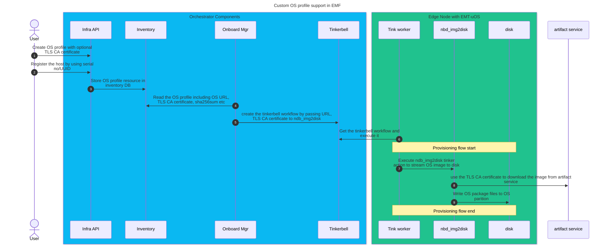

# Design Proposal: Custom OS profile creation in EMF

Author(s): Edge Infrastructure Manager Team

Last updated: 09/22/2025

## Abstract

Provide option to user to create a custom OS profile based on EMT and Ubuntu OS.
Feature should support to create custom Ubuntu OS profile with desired kernel version which is compatible iGPU/dGPU and platform features.
Create a custom EMT OS profile with new OS image version(immutable).
User should be able to host custom Ubuntu or EMT OS images in the internal artifact service with internal CA and OS profile should take into
CA certificate as an input to profile and user is able to provision and use it seemlessly.

## Proposal

1. OS profile should have parameter to pass the TLS CA certificate if OS image is hosted in 
internal artifact service where public CA is not used

2. User should be able to create Custom OS profile using orch-cli in addition to TLS CA certificate

3. Onboard manager should read the CA certificate from the OS profile if user specified in the OS profile.

4. Onboard manager should create tinkerbell workflow by passing ENV variable to nbd_image2disk tinker action.

5. ndb_image2disk tinker action should expose the ENV variable as an argument to pass the TLS CA certificate

