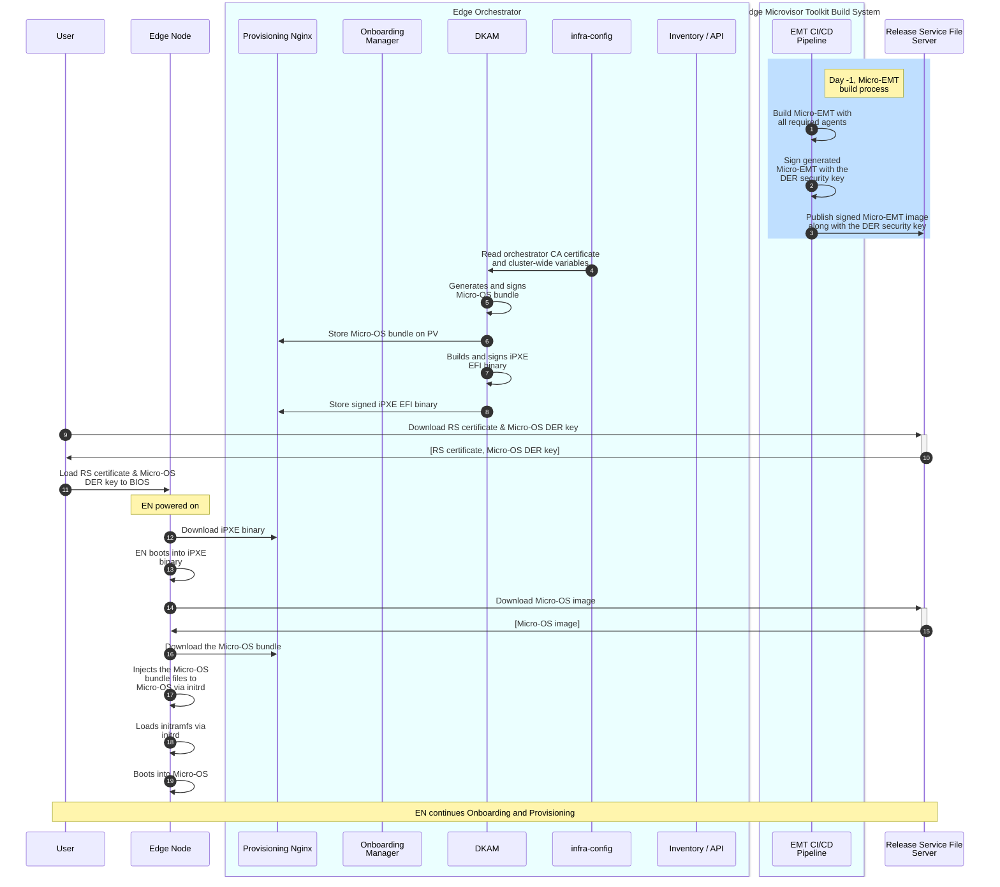

# Design Proposal: Decouple MicroOS storage from the orchestrator

Author(s): Tomasz Osiński

Last updated: 24.04.2025

## Abstract

Currently, the MicroOS (HookOS) image is stored on the Kubernetes PV and exposed via the Provisioning Nginx server
for Edge Nodes to download the image via iPXE during EN provisioning. This poses the following issues:

- There is a strong coupling between control plane (the Edge Orchestrator) and storage layer. We should isolate them.
- In a remote, distributed environment the Edge Orchestrator may be far from Edge Nodes, causing high delays and possibly low bandwidth.
  Moreover, the access to PV is rate-limited and may be slow (it can have even bigger impact when onboarding multiple nodes in parallel).
  All of these impacts the provisioning time significantly and we already know that the MicroOS download step takes the biggest portion of time during provisioning.

This proposal aims at solving the above issues by decoupling the MicroOS storage from the orchestrator, i.e. removing a dependency on PV for MicroOS.
This should significantly improve the EN provisioning time.

## Proposal

### Challenge

At a high-level, this design proposal moves the MicroOS image storage from the orchestrator to an external storage, such as Release File Server (e.g., S3 bucket)
or a local storage (e.g., a local, on-prem file server). The orchestrator will no longer be responsible for storing the MicroOS image.
Instead, it will only provide a URL to the image stored in an external storage.

Currently, the HookOS image is curated by DKAM and stored on the PV. The curation includes the following operations:

1. Downloads the pre-built HookOS image from the Release Service 
2. Prepares the HookOS configuration file, that contains a set of orchestrator-specific configuration parameters (e.g., proxy settings, URLs, extra hosts), 
3. Generates secure keys and signs all the components of the image (vmlinuz, initramfs)
4. Compresses the HookOS image into the .tar.gz archive 
5. Reads orchestrator CA certificates and injects into the Micro-OS image during build
6. Injects environment variables into the Micro-OS image during build
7. Re-signs the Micro-OS image after CA certificates and environment variables were injected

The solution proposed in this document assumes that the Micro-OS image is stored **outside** of the orchestrator. It means that
DKAM should not do any of the steps above. Therefore, the main challenge to solve is how to provide CA certs and environment variables to the Micro-OS image downloaded from an external source,
without sacrificing the security.

### Solution

The solution assumes the following:

- The MicroOS image is stored in an external storage (e.g., S3 bucket) and the orchestrator provides a URL to the image. The Micro-OS image can be stored on any other external or local server.
  It could be a Release Service (S3 bucket) or any other HTTPS file server.
- The Micro-OS image should be signed and the signing keys (DER keys) should be stored along with the Micro-OS image.
- The image stored externally is a generic image, without any orchestrator-specific files embedded.
- The orchestrator (DKAM) will have to provide orchestrator-specific files to ENs. The files package contains orchestrator CA certificate and
  environment files that are needed for Micro-OS to work with the given Edge Orchestrator instance. The files package will be called a "Micro-OS bundle" hereinafter.
- The Micro-OS bundle is a signed archive. It is signed by the same keychain as iPXE script.
- iPXE script along with the Micro-OS bundle are still stored on the orchestrator PV. Since these are small files, the provisioning time would not be impacted.
- ENs will download the Micro-OS bundle and the Micro-OS image during the iPXE phase and inject the Micro-OS bundle to the Micro-OS image (via `initrd`), similarly to how the initramfs is loaded.
  For example, the CA certificate may be inserted under `/etc/pki/ca-trust/source/anchors/`, while the environment variables can be injected to `/etc/hook/env_config`.
- The services running inside Micro-OS (e.g., device discovery, tink worker) should read from these files to retrieve certificate, env variales, and other required files.

The workflow is presented below. Note that this workflow uses an example of Micro-EMT and RS file server to store Micro-EMT.
The RS file server could be easily replaced by any other HTTPS-based local server that stores Micro-EMT. 

Note that a similar design can be achieved with the current Hook-OS that we can store on the RS file server.

Steps 1-3: The CI/CD pipeline of Micro-EMT build the image and publishes it to the Release Service (S3 bucket), along with the signing key.
The process is the same as currently used for the EMT image.

Steps 4-8: At deployment time, DKAM reads the orchestrator CA certificate and cluster-wide variables,
and generates two artifacts: 1) the signed Micro-OS bundle, and 2) the signed iPXE script that downloads 
the Micro-OS image and the Micro-OS bundle.
We assume that both artifacts are signed with the same key that is generated by DKAM.
Note that iPXE includes standard public certificates (like Microsoft or AWS) so we don't need to embed
these certificates, as long as it's not trusted by iPXE or a self-signed certificate that is used by a local storage.

Steps 9-11: User needs to download a set of certificates and signing keys and upload them to BIOS. The set should include:
- the orchestrator CA certificate (uploaded now)
- the secure key used to sign iPXE and orchestrator bundle (uploaded now)
- the secure key used to sign EMT (uploaded now) - only if EMT is used
- the secure key used to sign Micro-OS image (new). This key is downloaded from the external storage.

Steps 12-19: EN powers on and boots into the iPXE binary. The iPXE script downloads the Micro-OS from the
URL that is provided by orchestrator and injected to the iPXE script by DKAM. Next, the iPXE script downloads
the Micro-OS bundle from the Provisioning Nginx. Both initramfs of Micro-OS and Micro-OS bundle are loaded to
the in-memory OS via initrd and the vmlinuz is used to boot into the Micro-OS. Once the Micro-OS is booted,

## Rationale

[A discussion of alternate approaches that have been considered and the trade
offs, advantages, and disadvantages of the chosen approach.]

## Affected components and Teams

## Implementation plan

**Targeted release: 3.1.**

**Phase 1**: Work on a PoC by storing the current non-curated HookOS on the RS file server. The HookOS image is currently distributed as OCI artifact.
The PoC would require to store it as non-OCI on the S3 bucket. The PoC should give an answer if the solution described in this proposal is feasible.
It should also include basic KPI measurements to evaluate gains in terms of the provisioning time.
The PoC should take ~1-2 WW.

**Phase 2**: The implementation of the target solution will include:
- The EMF repo and infra-charts to define/generate the URL to Micro-OS image and pass it to DKAM
- Modifications to DKAM:
  - modify the iPXE script
  - merge chain.ipxe and boot.ipxe into one iPXE script
  - extend the curation logic to enhance the iPXE script with the Micro-OS bundle download and injection
  - refactoring & code hardening
- The HookOS/Micro-EMT team may need to make required modifications to Micro-OS services to consume the Micro-OS bundle.
- Testing and validation, including KPI measurements
- Changes to documentation

## Open issues (if applicable)

1. How to handle authentication to external storage? It must be an HTTPS endpoint and TLS certificates must be embedded into
   the iPXE binary, but if an external storage requires some additional authentication (e.g., JWT like the internal RS)
   iPXE is not able to support that.
2. The design doesn't assume that the trust CA certifcates can be rotated/refreshed.
