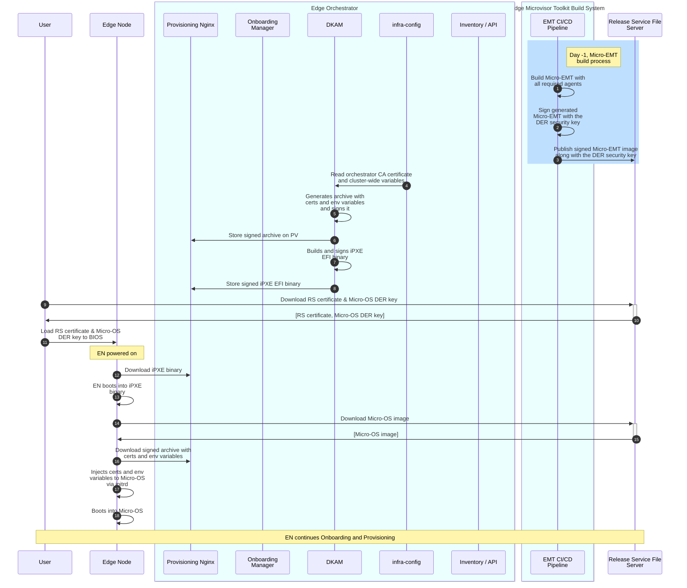

# Design Proposal: Decouple MicroOS storage from the orchestrator

Author(s): Tomasz Osiński

Last updated: 23.04.2025

## Abstract

[A short summary of the proposal with an introduction and the problem being
solved by the proposed change. Include useful persona flows.]

Currently, the MicroOS (HookOS) image is stored on the Kubernetes PV and exposed via the Provisioning Nginx server
for Edge Nodes to download the image via iPXE during EN provisioning. This poses the following issues:

- There is a strong coupling between control plane (the Edge Orchestrator) and storage layer. We should isolate them.
- In a remote, distributed environment the Edge Orchestrator may be far from Edge Nodes, causing high delays and possibly low bandwidth.
  Moreover, the access to PV is rate-limited and may be slow (it can have even bigger impact when onboarding multiple nodes in parallel).
  All of these impacts the provisioning time significantly and we already know that the MicroOS download step takes the biggest portion of time during provisioning.

This proposal aims at solving the above issues by decoupling the MicroOS storage from the orchestrator, i.e. removing a dependency on PV for MicroOS.
This should significantly improve the EN provisioning time.

## Proposal

> **NOTE:** This proposal assumes that HookOS is replaced with a minimal Edge Microvisor Toolkit flavor that is used as a Micro-OS for provisioning.

### Challenge

At a high-level, this design proposal moves the MicroOS image storage from the orchestrator to an external storage, such as Release File Server (e.g., S3 bucket)
or a local storage (e.g., a local, on-prem file server). The orchestrator will no longer be responsible for storing the MicroOS image.
Instead, it will only provide a URL to the image stored in an external storage.

Currently, the HookOS image is curated by DKAM and stored on the PV. The curation includes the following operations:

1. Downloads the pre-built HookOS image from the Release Service 
2. Prepares the HookOS configuration file, that contains a set of orchestrator-specific configuration parameters (e.g., proxy settings, URLs, extra hosts), 
3. Generates secure keys and signs all the components of the image (vmlinuz, initramfs)
4. Compresses the HookOS image into the .tar.gz archive 
5. Reads orchestrator CA certificates and injects into the Micro-OS image during build
6. Injects environment variables into the Micro-OS image during build
7. Re-signs the Micro-OS image after CA certificates and environment variables were injected

The solution proposed in this document assumes that the Micro-OS image is stored **outside** of the orchestrator. It means that
DKAM should not do any of the steps above. Therefore, the main challenge to solve is how to provide environment variables to the Micro-OS image downloaded from an external source,
without sacrificing the security.

### Solution

The solution assumes the following:

- iPXE script along with some configuration files (e.g., CA certificates) are still stored on the orchestrator PV. Since these are small files, the provisioning time would not be impacted.
- The MicroOS image is stored in an external storage (e.g., S3 bucket) and the orchestrator provides a URL to the image. The Micro-OS image can be stored on any other external or local server.
- HookOS is replaced with a minimal Edge Microvisor Toolkit flavor that is used as a Micro-OS for provisioning.

In this solution, the Micro-OS based on EMT (Micro-EMT) is stored in the Release Service (S3 bucket) or any other HTTPS file server.
The Micro-OS image should be signed and the signing keys (DER keys) should be stored along with the Micro-OS image.

The Provisioning Nginx server and DKAM will still be used to provide the curated iPXE script,
orchestrator CA certificate and environment variables. The iPXE script will be exposed as signed EFI binary,
while CA certificate and environment variables will be packaged as a signed archive, downloaded from iPXE script, 
and loaded to the Micro-OS image similarly as initramfs is loaded (via `initrd` command). For example,
the CA certificate may be inserted under `/etc/pki/ca-trust/source/anchors/`, while the environment variables can be
injected to `/etc/hook/env_config`.

The services running in the Micro-OS image should read from these paths if they have to use the orchestrator CA certificate or environment variables.

Steps 1-3: The CI/CD pipeline of Micro-EMT build the image and publishes it to the Release Service (S3 bucket), along with the signing key.
The process is the same as currently used for the EMT image.

Steps 4-8: At deployment time, DKAM reads the orchestrator CA certificate and cluster-wide variables,
and generates two artifacts: 1) the signed archive containing the CA certificate and environment file (called orchestrator bundle), 
and 2) the signed iPXE script that downloads the Micro-OS image and the signed archive with CA certificates and environment variables.
We assume that both artifacts are signed with the same key that is generated by DKAM.

> NOTE: At this point, DKAM may also need to take the public certificate and embed it into the iPXE script, so that
> the download of Micro-OS image is trusted.

Steps 9-11: User needs to download a set of certificates and signing keys and upload them to BIOS. The set should include:
- the orchestrator CA certificate (uploaded now)
- the secure key used to sign iPXE and orchestrator bundle (uploaded now)
- the secure key used to sign Micro-OS image (new). This key is downloaded from the external storage.
- the secure key used to sign EMT (uploaded now) - only if EMT is used

### Security implications

The iPXE script doesn't include any public certificates, so that if we want to validate trust of the downloaded Micro-OS image,
we should provide the TLS certificate used to protect the Micro-OS storage during the iPXE build time (done by DKAM).

## Rationale

[A discussion of alternate approaches that have been considered and the trade
offs, advantages, and disadvantages of the chosen approach.]

## Affected components and Teams

## Implementation plan

[A description of the implementation plan, who will do them, and when.
This should include a discussion of how the work fits into the product's
quarterly release cycle.]

## Open issues (if applicable)

[A discussion of issues relating to this proposal for which the author does not
know the solution. This section may be omitted if there are none.]
