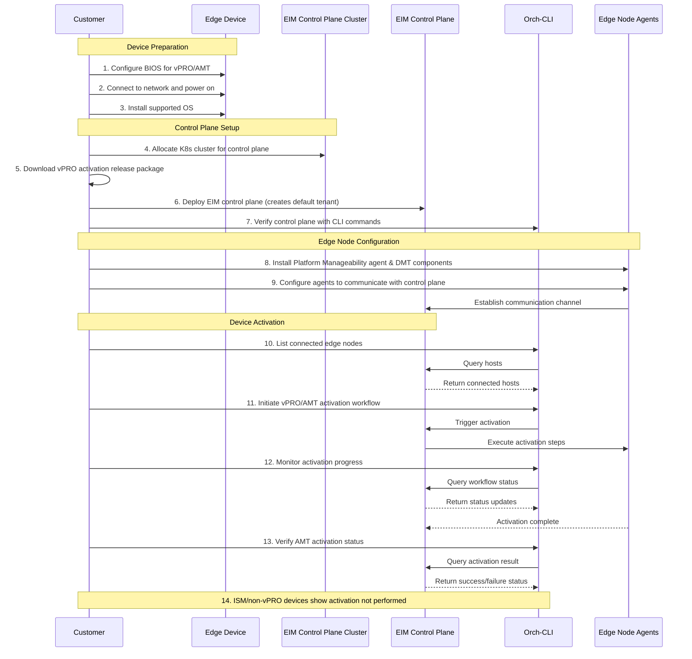

# Design Proposal: Edge Infrastructure Manager Modular Decomposition

Author(s): Edge Manageability Architecture Team

Last updated: 2025-09-29

## Abstract

As part of the Edge Infrastructure Manager (EIM) modularization initiative described in
[this ADR](../eim-modular-decomposition.md), we aim to decompose the tightly coupled EIM monolith into a set of modular,
independently deployable components. This will enable customers to consume only the functionality they need, while still
allowing for full-stack deployments when desired. In 2026.00 release, we will focus on delivering modular workflows for
Intel vPRO/AMT-based out-of-band device management and Device provisioning. This design proposal outlines the
objectives, scope, and user workflows that will guide the modular decomposition effort.

## Requirements

Following are the key requirements for the EIM modular decomposition in 2026.00:

1. Requirement 1 - Out-of-band Device Management: (Customers OSVs and Edge stack vendors)
  a. As an ISV or edge solution vendor, I want an End-to-end reference solution to automated vPRO/AMT based out-of-band
  device management activation, so that I can manage fleets of edge devices efficiently and securely.
  b. As an ISV or edge solution vendor, I want an End-to-end reference solution to automated vPRO/AMT based out-of-band
  device power management, so that I can manage fleets of edge devices efficiently and securely.
2. Requirement 2 - Automated Edge Device Commissioning: (System Integrators and OEMs)
  a. As an OEM, I want to manage device OS provisioning, Kubernetes and application deployment across warehouse fleets
  with optional QA validation, so that production readiness stays consistent at scale.

## Requirement 1.a

One of the key value propositions of Intel EIM in the context of vPRO/AMT device activation is its ability to provide
full zero-touch automation of OS provisioning, installation of required edge agents, setting up of credentials for
agents to talk to the control plane that hosts both EIM and Intel DMT. Without this automation customers will have the
ownership burden of manually activating each device, which is not feasible at scale and adds to CAPEx cost.

### Scope 1.a

In this modular workflow EIM device onboarding, OS provisioning will be left to the customer. The focus will be on
implementing and delivering the minimum steps required for automated vPRO/AMT based out-of-band device activation. If
the customer intends to get the reference for device onboarding and OS provisioning, they can refer to the full EMF
Day-0 workflow.

### Workflow 1.a

1. Customer prepared the Edge node and configures the BIOS for vPRO/AMT/ISM as per the user documentation. Customer
   has a choice of using vPRO/AMT, vPRO/ISM or non-vPRO devices.
2. Edge device is connected to the network and powered on.
3. Customer installs the supported OS on to the edge device.
4. Customer allocates a kubernetes cluster that will be used to run the EIM control plane. This can be a VM. The
   requirements for the OS + cluster will be part of the user documentation.
5. Customer downloads the vPRO device activation release package from the Intel Release service.
6. Customer using the automated installer for EIM control plane deploys the EIM control plane on the allocated
control plane cluster. This steps should already create the default tenant.
7. Customer should be able to use the Orch-CLI to run sample commands to verify the control plane is up. This will be
part of the user documentation.
8. Customer using the automated installer for Edge node installs the Platform manageability agent and Device
manageability toolkit edge node components like rpc-go, rpc etc.
9. Automated edge node installer also configures the agents to communicate with the control plane. This includes setting
up the channel for the agents to talk to the control plane. The configuration includes provisioning credentials and
password to setup the required CIRA (Client initiated remote access) channel.
10. Customer using CLI is able to list the connected edge node from the control plane as part of listing hosts.
11. Customer using CLI initiate the vPRO/AMT device activation workflow on the connected edge node. This step should support for ACM (Admin Control Mode) and CCM (Client Control Mode) activation modes. It should also support.
12. Customer using CLI is able to monitor the progress of the vPRO/AMT device activation workflow.
13. Upon successful completion of the workflow, the edge node is now activated and ready for out-of-band
 management using Intel DMT. Customer can verify this using the CLI command.
14. Customer should also be able to see the status of AMT activation not performed on ISM and non-vPRO devices.

### Deliverables 1.a

- **Foundational services**
  - ArgoCD that uses EMF repos for git ops based deployment
  - ArgoCD application definitions for required minimal foundational services, EIM control plane and DMT services
  - Simplified Multi-tenancy manager that can create a default tenant
  - Orch-CLI with commands to List and get host and initiate and monitor vPRO/AMT device activation workflow
- **Service bundles**
  - EIM control plane services charts and image reference for inventory, tenant-controller, Host resource manger,
    OOB device activation resource manager
  - DMT services charts and image references
  - Configuration manifest for EIM control plane and DMT services
  - EIM edge node components installer and configuration (e.g. Ansible) that downloads, installs and configures
    Platform Manageability agent and DMT Edge node components
- **Integration adapters**
  - None for this release

## Requirement 1.b

With out-of-band device management activated on the edge device, customers can now perform the first and the basic OOB
operation of power management operations. vPRO/AMT and vPRO/ISM devices can leverage the following
[power states](https://device-management-toolkit.github.io/docs/2.28/Reference/powerstates/#out-of-band). It should be
noted that activation is not needed for vPRO/ISM devices.

### Scope 1.b

In this modular workflow EIM device onboarding, OS provisioning will be left to the customer. The focus will be on
implementing and delivering the minimum steps required for automated vPRO/AMT based out-of-band device activation. If
the customer intends to get the reference for device onboarding and OS provisioning, they can refer to the full EMF
Day-0 workflow.

### Workflow 1.b

user documentation. Customer has a choice of using vPRO/AMT, vPRO/ISM or non-vPRO devices.
2. Edge device is connected to the network and powered on.
3. Customer installs the supported OS on to the edge device.
4. Customer allocates a kubernetes cluster that will be used to run the EIM control plane. This can be a VM. The
requirements for the OS + cluster will be part of the user documentation.
5. Customer downloads the vPRO device activation release package from the Intel Release service.
6. Customer using the automated installer for EIM control plane deploys the EIM control plane on the allocated
control plane cluster. This steps should already create the default tenant.
7. Customer should be able to use the Orch-CLI to run sample commands to verify the control plane is up. This will be
part of the user documentation.
8. Customer using the automated installer for Edge node installs the Platform manageability agent and Device
manageability toolkit edge node components like rpc-go, rpc etc.
9. Automated edge node installer also configures the agents to communicate with the control plane. This includes setting
up the channel for the agents to talk to the control plane.
10. Customer using CLI is able to list the connected edge node from the control plane as part of listing hosts.
11. Customer using CLI initiate the vPRO/AMT device activation workflow on the connected edge node.
12. Customer using CLI is able to monitor the progress of the vPRO/AMT device activation workflow.
13. Upon successful completion of the workflow, the edge node is now activated and ready for out-of-band
 management using Intel DMT. Customer can verify this using the CLI command.
14. Customer should also be able to see the status of AMT activation not performed on ISM and non-vPRO devices.
