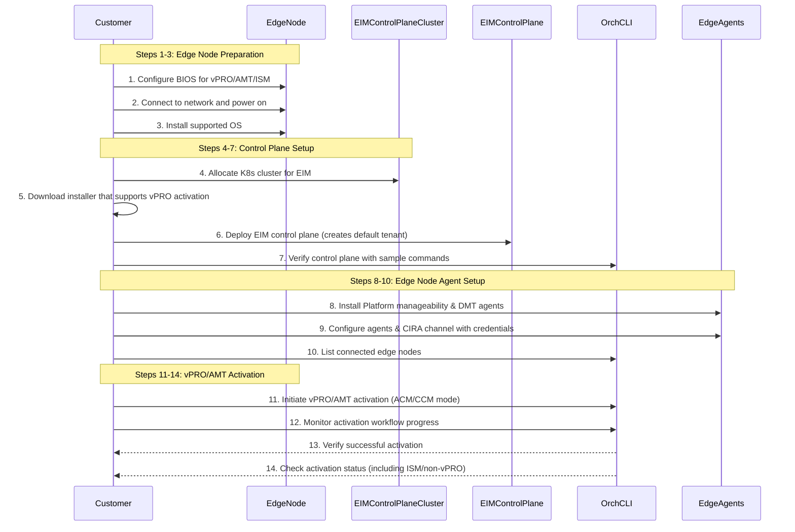
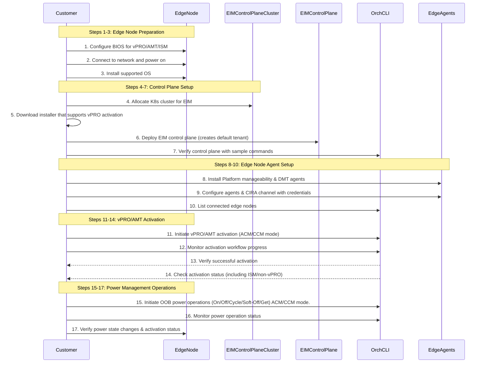
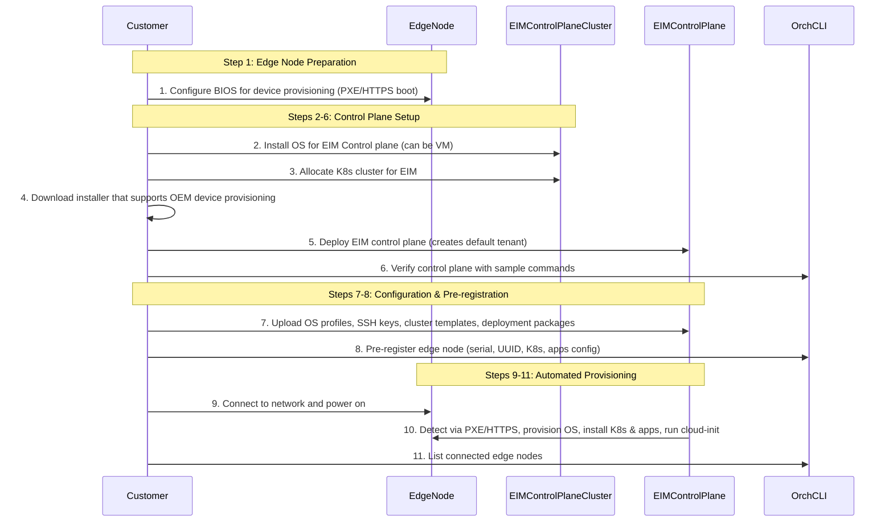

# Design Proposal: Edge Infrastructure Manager Modular Decomposition

Author(s): Edge Manageability Architecture Team

Last updated: 10th Nov 2025

## Abstract

As part of the Edge Infrastructure Manager (EIM) modularization initiative described in
[this ADR](../eim-modular-decomposition.md), we aim to decompose the tightly coupled EIM monolith into a set of modular,
independently deployable components. This will enable customers to consume only the functionality they need, while still
allowing for full-stack deployments when desired. In 2026.00 release, we will focus on delivering modular workflows for
Intel vPRO/AMT-based out-of-band device management and Device provisioning. This design proposal outlines the
objectives, scope, and user workflows that will guide the modular decomposition effort.

## Requirements

Following are the key requirements for the EIM modular decomposition in 2026.00:

1. Requirement 1 - Out-of-band Device Management: (Customers OSVs and Edge stack vendors)
  a. As an ISV or edge solution vendor, I want an End-to-end reference solution to automated vPRO/AMT based out-of-band
  device management activation, so that I can manage fleets of edge devices efficiently and securely.
  b. As an ISV or edge solution vendor, I want an End-to-end reference solution to automated vPRO/AMT based out-of-band
  device power management, so that I can manage fleets of edge devices efficiently and securely.
2. Requirement 2 - Automated Edge Device Commissioning: (System Integrators and OEMs)
  a. As an OEM, I want to manage device OS provisioning, Kubernetes and application deployment across warehouse fleets
  with optional QA validation, so that production readiness stays consistent at scale.

## Requirement 1.a

One of the key value propositions of Intel EIM in the context of vPRO/AMT device activation is its ability to provide
full zero-touch automation of OS provisioning, installation of required edge agents, setting up of credentials for
agents to talk to the control plane that hosts both EIM and Intel DMT. Without this automation customers will have the
ownership burden of manually activating each device, which is not feasible at scale and adds to CAPEx cost.

### Scope 1.a

In this modular workflow EIM device onboarding, OS provisioning will be left to the customer. The focus will be on
implementing and delivering the minimum steps required for automated vPRO/AMT based out-of-band device activation. If
the customer intends to get the reference for device onboarding and OS provisioning, they can refer to the full EMF
Day-0 workflow.

The installer that will be used by the customer to deploy the EIM control plane can be a common installer that can
install full EMF or any modular workflow. A dedicated modular installer is required for the edge node that can be based
of ansible.

- Supported OS: Ubuntu 24.04 LTS
- Supported hardware: Intel Core based vPRO/AMT devices, vPRO/ISM devices and non-vPRO devices.
- Supported activation modes: ACM (Admin Control Mode) and CCM (Client Control Mode)
- Supported network environment: Devices connected to the internet with direct access to Intel Release service for
  downloading vPRO activation packages.
- Supported deployment environment for EIM control plane: RKE2 based Kubernetes cluster (can be a VM based cluster)
- Upgrades are only supported within the same modular workflow. E.g. modular workflow 1.a can be upgraded to a future
  release of modular workflow 1.a but not to full EMF workflow.

### Workflow 1.a

1. Customer prepared the Edge node and configures the BIOS for vPRO/AMT/ISM as per the user documentation. Customer
  has a choice of using vPRO/AMT, vPRO/ISM or non-vPRO devices.
2. Edge device is connected to the network and powered on.
3. Customer installs the supported OS on to the edge device.
4. Customer allocates a kubernetes cluster that will be used to run the EIM control plane. This can be a VM. The
  requirements for the OS + cluster will be part of the user documentation.
5. Customer downloads the vPRO device activation release package from the Intel Release service.
6. Customer using the automated installer for EIM control plane deploys the EIM control plane on the allocated
control plane cluster. This steps should already create the default tenant.
7. Customer should be able to use the Orch-CLI to run sample commands to verify the control plane is up. This will be
part of the user documentation.
8. Customer using the automated installer for Edge node installs the Platform manageability agent and Device
manageability toolkit edge node components like rpc-go, rpc etc.
9. Automated edge node installer also configures the agents to communicate with the control plane. This includes setting
up the channel for the agents to talk to the control plane. The configuration includes provisioning credentials and
password to setup the required CIRA (Client initiated remote access) channel.
10. Customer using CLI is able to list the connected edge node from the control plane as part of listing hosts.
11. Customer using CLI initiate the vPRO/AMT device activation workflow on the connected edge node. This step should support for ACM (Admin Control Mode) and CCM (Client Control Mode) activation modes. It should also support.
12. Customer using CLI is able to monitor the progress of the vPRO/AMT device activation workflow.
13. Upon successful completion of the workflow, the edge node is now activated and ready for out-of-band
 management using Intel DMT. Customer can verify this using the CLI command.
14. Customer should also be able to see the status of AMT activation not performed on ISM and non-vPRO devices.

### Deliverables 1.a

- **Foundational services**
  - ArgoCD that uses EMF repos for git ops based deployment
  - ArgoCD application definitions for required minimal foundational services, EIM control plane and DMT services
  - Simplified Multi-tenancy manager that can create a default tenant
  - Orch-CLI with commands to List and get host and initiate and monitor vPRO/AMT device activation workflow
- **Service bundles**
  - EIM control plane services charts and image reference for inventory, tenant-controller, Host resource manger,
    OOB device activation resource manager
  - DMT services charts and image references
  - Configuration manifest for EIM control plane and DMT services
  - EIM edge node components installer and configuration (e.g. Ansible) that downloads, installs and configures
    Platform Manageability agent and DMT Edge node components
- **Integration adapters**
  - None for this release

KPIs

- Customer able to deploy control plane and activate vPRO/AMT devices using the modular workflow in less than 20min
- Modular workflow can support at minimum 50 devices in parallel with clear resource requirement documentation

## Requirement 1.b

With out-of-band device management activated on the edge device, customers can now perform the first and the basic OOB
operation of power management operations. vPRO/AMT and vPRO/ISM devices can leverage the following
[power states](https://device-management-toolkit.github.io/docs/2.28/Reference/powerstates/#out-of-band).

### Scope 1.b

It is assumed that customer has already activated the vPRO devices using the modular workflow 1.a or the full EMF Day-0
as detailed in the user documentation. Device power management operations will be supported only on vPRO/AMT and
vPRO/ISM devices.

The installer that will be used by the customer to deploy the EIM control plane can be a common installer that can
install full EMF or any modular workflow. A dedicated modular installer is required for the edge node that can be based
of ansible.

- Supported OS: Ubuntu 24.04 LTS
- Supported hardware: Intel Core based vPRO/AMT devices, vPRO/ISM devices and non-vPRO devices.
- Supported activation modes: ACM (Admin Control Mode) and CCM (Client Control Mode)
- Supported network environment: Devices connected to the internet with direct access to Intel Release service for
  downloading vPRO activation packages.
- Supported deployment environment for EIM control plane: RKE2 based Kubernetes cluster (can be a VM based cluster)
- Upgrades are only supported within the same modular workflow. E.g. modular workflow 1.b can be upgraded to a future
  release of modular workflow 1.b but not to full EMF workflow.

### Workflow 1.b

1. Customer prepared the Edge node and configures the BIOS for vPRO/AMT/ISM as per the user documentation. Customer
  has a choice of using vPRO/AMT, vPRO/ISM or non-vPRO devices.
2. Edge device is connected to the network and powered on.
3. Customer installs the supported OS on to the edge device.
4. Customer allocates a kubernetes cluster that will be used to run the EIM control plane. This can be a VM. The
  requirements for the OS + cluster will be part of the user documentation.
5. Customer downloads the vPRO device activation release package from the Intel Release service.
6. Customer using the automated installer for EIM control plane deploys the EIM control plane on the allocated
  control plane cluster. This steps should already create the default tenant.
7. Customer should be able to use the Orch-CLI to run sample commands to verify the control plane is up. This will be
  part of the user documentation.
8. Customer using the automated installer for Edge node installs the Platform manageability agent and Device
  manageability toolkit edge node components like rpc-go, rpc etc.
9. Automated edge node installer also configures the agents to communicate with the control plane. This includes setting
  up the channel for the agents to talk to the control plane. The configuration includes provisioning credentials and
  password to setup the required CIRA (Client initiated remote access) channel.
10. Customer using CLI is able to list the connected edge node from the control plane as part of listing hosts.
11. Customer using CLI initiate the vPRO/AMT device activation workflow on the connected edge node. This step should
   support for ACM (Admin Control Mode) and CCM (Client Control Mode) activation modes.
12. Customer using CLI is able to monitor the progress of the vPRO/AMT device activation workflow.
13. Upon successful completion of the workflow, the edge node is now activated and ready for out-of-band
   management using Intel DMT. Customer can verify this using the CLI command.
14. Customer should also be able to see the status of AMT activation not performed on ISM and non-vPRO devices.
15. Customer using CLI initiate out-of-band power management operations on the activated edge node. Supported
   operations include Power On, Power Off, Power Cycle, Soft Power Off, and Get Power State.
16. Customer using CLI is able to monitor the status and result of the power management operations on the edge node.
17. Customer verifies the power state changes on the edge node as per the requested operations in ACM and CCM mode.
    There should be no impact to the vPRO activation status.

### Deliverables 1.b

Since EMF control plane components are not involved directly in the device power management control other than having
the device power state in the inventory this work flow can leverage the release package supported as part of the vPRO
activation as listed in the deliverables for 1.a.

This workflow in future releases can be enhanced to include more advanced power management operations (combining more
than one operation) and scheduling capabilities. This might require a dedicated OOB power management service in the
-control plane and updates to the edge node agents.

- **Foundational services**
  - ArgoCD that uses EMF repos for git ops based deployment
  - ArgoCD application definitions for required minimal foundational services, EIM control plane and DMT services
  - Simplified Multi-tenancy manager that can create a default tenant
  - Orch-CLI with commands to List and get host and initiate and monitor vPRO/AMT device activation workflow
- **Service bundles**
  - EIM control plane services charts and image reference for inventory, tenant-controller, Host resource manger,
    OOB device activation resource manager
  - DMT services charts and image references
  - Configuration manifest for EIM control plane and DMT services
  - EIM edge node components installer and configuration (e.g. Ansible) that downloads, installs and configures
    Platform Manageability agent and DMT Edge node components
- **Integration adapters**
  - None for this release

KPIs

- Customer able to deploy control plane and activate vPRO/AMT devices using the modular workflow in less than 20min
- Modular workflow can support at minimum 50 devices in parallel with clear resource requirement documentation

## Requirement 2

A key capability that is required from an Edge device OEM vendor is the ability at scale to provision OS, kubernetes,
applications,  configure and test before shipping to the installation location. This requirements is does not include
day 2 manageability but focuses on the day 0 commissioning of the edge devices. This workflow is already supported as
part of the "OXM profile" based full EMF Day-0 workflow. The requirement here is to modularize and deliver this workflow
as a standalone modular workflow that can be consumed by OEMs and system integrators.

### Scope 2

This modular workflow assumes that customer would like to perform automated OS provisioning, Kubernetes and application
and customize it using cloud-init based approach. Automation of running QA like test is not in the scope of
this release.

The installer that will be used by the customer to deploy the EIM control plane can be a common installer that can
install full EMF or any modular workflow. A dedicated modular installer is required for the edge node that can be based
of ansible.

- Supported OS: Ubuntu 24.04 LTS and EMT
- Supported hardware: Intel Core based devices
- Supported network environment: Edge Devices connected to the internet with direct access to Intel Release service or
  indirectly via a proxy running on the EIM control plane cluster network for downloading required OS images and
  packages.
- Supported deployment environment for EIM control plane: RKE2 based Kubernetes cluster (can be a VM based cluster)
- Upgrades are only supported within the same modular workflow. E.g. modular workflow 2 can be upgraded to a future
  release of modular workflow 2 but not to full EMF workflow.

### Workflow 2

1. Customer prepared the Edge node and configures the BIOS for for device provisioning as per the user documentation.
  For scale deployment customer can use PXE boot or HTTPs boot methods.
2. Customer installs the OS for the EIM Control plane. This can also be a VM instance.
3. Customer allocates a kubernetes cluster that will be used to run the EIM control plane. This can be a VM. The
  requirements for the OS + cluster will be part of the user documentation.
4. Customer downloads the OEM device provisioning release package from the Intel Release service.
5. Customer using the automated installer for EIM control plane deploys the EIM control plane on the allocated
  control plane cluster. This steps should already create the default tenant.  
6. Customer using the Orch-CLI tests the working of the control plane by running sample commands to verify the control
  plane is up. This will be part of the user documentation.
7. Customer ensure the required OS profiles, SSH keys needed to access edge node, Edge node Cluster template,
  Deployment packages  are available in the EIM.
8. Customer using the Orch-CLI pre-registers the edge node to the inventory using the information like serial number
  and, UUID. The pre-registration step also configures the kubernetes cluster, addons details and the applications to
  be pre-installed on the edge node are available on the control plane.
9. Edge device is connected to the network and powered on.
10. The control plane detects the new edge node via PXE/HTTPs boot and provisions the OS as per the profile
   configured during pre-registration. It then goes ahead to install kubernetes and the required applications as per
   the deployment package configured during pre-registration. Upon reboot the customer configured cloud-init is
   executed to complete the configuration.
11. Customer using CLI is able to list the connected edge node from the control plane as part of listing hosts.

### Deliverables 2

- **Foundational services**
  - ArgoCD that uses EMF repos for git ops based deployment
  - ArgoCD application definitions for required minimal foundational services, EIM control plane
  - Simplified Multi-tenancy manager that can create a default tenant
  - Orch-CLI with commands supporting pre-registration of edge nodes, configuring ssh and cloud-init profiles,
    cluster templates and deployment packages
- **Service bundles**
  - EIM control plane services charts and image reference for inventory, tenant-controller, Host resource manger, 
    Onboarding manager, OS profile manager, DKAM and Tinker bell services.
  - Configuration manifest for EIM control plane.
  
- **Integration adapters**
  - None for this release
  