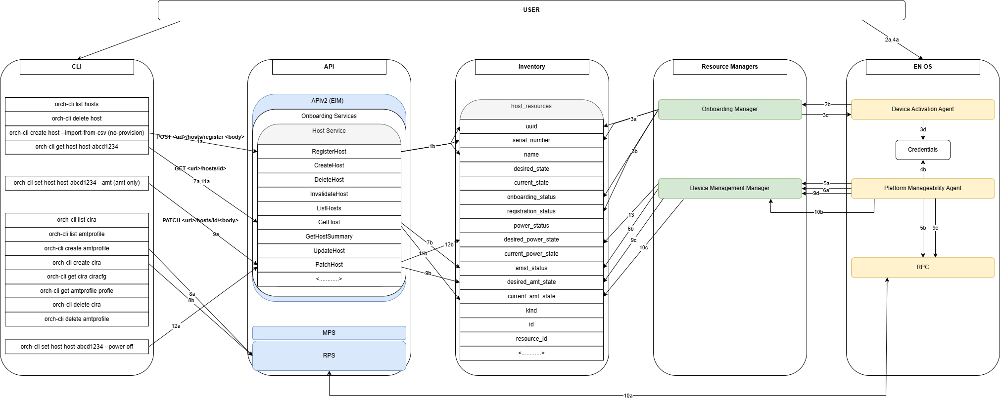
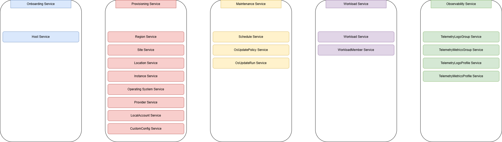
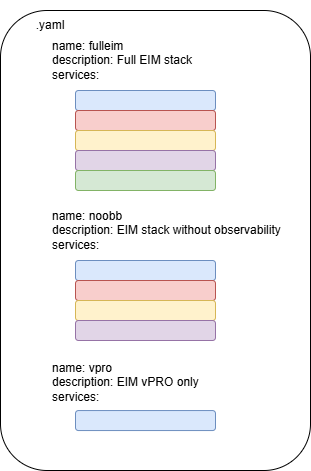

# Design: Modularized EIM API in context of modular EMF deployments in 2026.02 release

Author(s): Edge Infrastructure Manager Team

Last updated: 22/12/2025

## Abstract

In 2026.2 release of the EMF the requirement is to decompose the EIM API to deliver multiple streamlined
workflows. This design follows up the
[Scenario-Specific Northbound APIs and CLI Commands for EIM Decomposition ADR](https://github.com/open-edge-platform/edge-manageability-framework/blob/57f234a08eb83b320b31cd8db34c7c7ea4837973/design-proposals/eim-nbapi-cli-decomposition.md)
created for this specific topic with a more detailed design considering specific workflows.

## Workflows

### Full EMF/Standalone full EIM (2026.0)

This is the standard deployment of EIM, in both cases, that is if the full EMF is deployed (EIM/CO/AO) or if
the full EIM is deployed without the CO/AO in standalone, the full set of EIM APIs is exposed.

The modular EIM will be deployed with the following services:

- Onboarding service APIs
- Provisioning service APIs
- Maintenance service APIs
- Workload service APIs*
- Observability APIs

In both cases there will be a microservice running on the Orchestrator exposing the list of available features.
In the case of full EMF this microservice will report all features related to all APIs, in the case of full EIM in
standalone the microservice will report only the EIM features and the full list of services exposed by the EIM API.

### EIM - Observability (2026?)

This is a scenario where observability stack is subtracted from standard EIM deployment. All other EIM APIs are exposed.

The modular EIM will be deployed with the following services:

- Onboarding service APIs
- Provisioning service APIs
- Maintenance service APIs
- Workload service APIs*

### EIM - vPRO only (2026.0)

In this deployment only the minimum viable EIM API stack will be deployed along with the vPRO related APIs and
resource managers and agents. In this scenario the EIM API will only expose the host services used to manage the
host resource - since only the host resource is needed to onboard the EN, activate vPRO and do power management
of the EN via vPRO.

This version of modular EIM API will be deployed with the following service:

- Onboarding service APIs

It is assumed that provisioning/instance creation and creation of associated resources related to provisioning is
not needed.

API and Inventory interactions (Non CLI steps/flows subject to change /implementation - this flow is only to
demonstrate the interactions between API/Inventory/CLI).

1. User pre-registers host via the orch-cli using the *host service* EIM API (by providing the UUID and/or
   Serial No.) - there is no need to create an instance, or allocate EN to site since there is no EN management
   outside of vPRO related actions.
2. User provisions own OS onto the EN manually and installs the Device Activation Agent (DAA), the agent
   communicates with the scaled back version of Onboarding Manager.
3. If the information from ENs DAA matches the information provided at pre-registration (Serial/UUID) the scaled
   back version of the Onboarding Manager changes the status of the EN to onboarded in the *host resource*
   (host_status) in the inventory and creates/responds to the DAA on the EN with credentials for the PMA agent.
4. User installs the PMA agent, and PMA agent waits for credentials. Remote Provisiong Client (RPC) is also
   installed.
5. Once the PMA receives credentials it establishes connection with the Device Management Manager (DMM) on the
   EN. The PMA checks the device support status with RPC.
6. PMA shares the RPC device support status to DMM, the DMM updates the status of the device in inventory, the
   status is updated in the *host resource* (amt_status* (double check if that the right field)).
7. At this stage via the orch-cli the EIM API *host service* can be queried to see the AMT/vPRO information for
   the host if the EN supports vPRO (amt_status* (double check if that the right field)).
8. User will create CIRA configuration and Domain profile via the orch-cli using the Remote Provisioning Server
   APIs. This information is stored within the Out-Of-Band service (RPS/MPS)
9. User activates the AMT/vPRO via the orch-cli once again using the *host service* EIM API (desired_amt_state).
   The DMM observes the *host resource* (desired_amt) for the activation details, the PMA on EN periodically
   checks in with DMM to obtain the same status. Once the status is obtained by PMA it sends activation command
   to RPC.
10. RPC on the EN starts the device activation by reaching out to RPS. RPS and and RPC exchange information
    (including the previously created CIRA config and Domain Profile). Once activated the PMA on the EN reports
    the status back to the DMM, the DMM changes the status in the *host_resource* in the inventory
    (current_amt_state).
11. At this stage via the orch-cli the EIM API *host service* can be queried to see the AMT/vPRO activation
    status.
12. Once the EN's AMT/vPRO is activated the user can power cycle the EN via the orch-cli using the EIM API "host
    service" by toggling the desired_power_state. The power status can be queried via the orch-cli by using the
    *host service's* power_status.
13. The DMM watches the power state and updated through RPS, once updated the RPS/PRC manages the power cycle

*NOTE:* Not all relationships between CLI/API/Inventory are shown in diagram above for the sake of keeping it
readable. I.e assume that anything to do with listing/getting/deleting a host is in place and the relevant
path/APIs/fields in inventory are used.

## EIM API modularity

The EIM APIv2 modularity will be achieved by enabling only necessary
services based on required functionality by registering only necessary service handlers.
Services are grouped
together in combination to make up API sets tailored for a given workflow.

The services/APIs will be categorized into the following buckets:

The APIv2 will then be built based on a manifest files calling out the required services. Once built it will be
composed into a docker image that can be used to deploy the APIv2 for a given workflow.

## Opens

- In EIM + vPRO only workflow, is there any sort of onboarding? If not how does the EN get involved with the
  orchestrator?
  - The vPRO only ADR does not include onboarding from Orchestrator PoV or any agent that would do this from EN
    side:
    [vpro-eim-modular-decomposition](https://github.com/open-edge-platform/edge-manageability-framework/blob/557752e210cf0a34fd8fddef3f2a07b8c9206728/design-proposals/vpro-eim-modular-decomposition.md)
  - The onboarding/provisioning decomposition assumes that the device activation agent is moved from uOS to Agent
    and that the provisioning phase is split - ie. the OS provisioning does not happen and Agent provisioning is
    manual - but in each case there is still onboarding manager on the Orchestrator and all the resources must be
    available in API:
    [separation-of-onboard-and-provisioning](https://github.com/open-edge-platform/edge-manageability-framework/blob/6889486cb05cbc6ffee3fc370b519ab30fbe34e0/design-proposals/separation-of-onboard-and-provisioning.md)
  - In essence vPRO ADR does not consider onboarding at all, and the second ADR considers that the API/Inventory
    will always be overloaded with resources that are not needed for vPRO only scenario.

**Answer**: There will be some sort of onboarding, should be minimal, we should not have the overload of API with
provisioning related resources in this workflow.

- What is the goal of the EIM+vPRO only workflow, is it only to enable vPRO activation and power management and
  the Edge Node will not be provisioned inside the Orchestrator?

**Answer**: Yes, the goal is to onboard the EN - manually install the Agents on EN and establish communication,
then activate vPRO and power cycle the machine, we do not expect any Orchestrator management of the device apart
from vPRO/powercycle - therefore we do not need to have APIs related to any instance and instance related
resources.

- What is the look and feel of a vPRO only EN when enrolled to the Orchestrator?
  - Is it supposed to show up as a register or onboarded node?
  - Can the user decide to install their own OS and manually provision by installing agents?
  - Should the user be able to assign the vPRO only EN to a site? Or we do not care about locations in this workflow?
  - If the provisioning is not a part of this workflow can we assume instance creation and anything associated
    with the instance is not needed (osprofile,localaccount,customconfig)?

**Answer**: EN is onboarded, user must install their own OS to install DAA and PMA, there is no need to assign
the ENs to sites as we can assume they are managed outside of EMF, anything to do with provisioning can be
disregarded in this scenario
