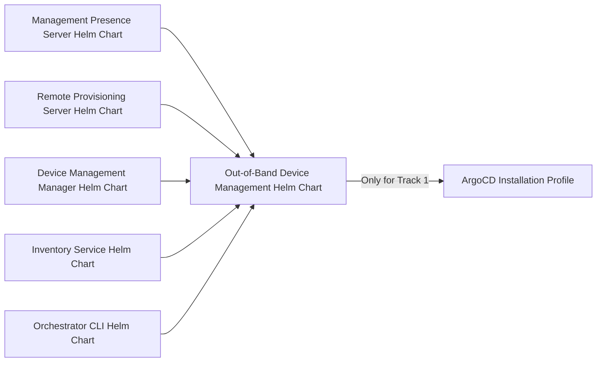
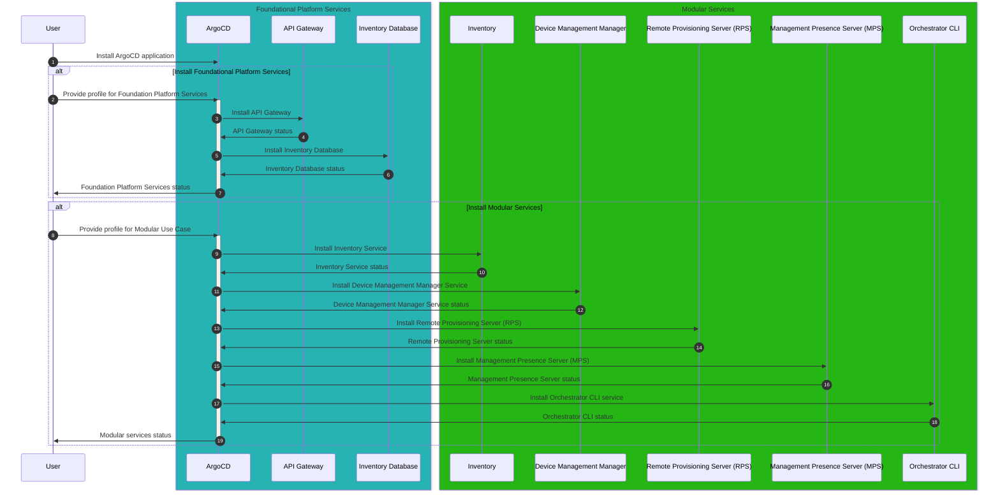
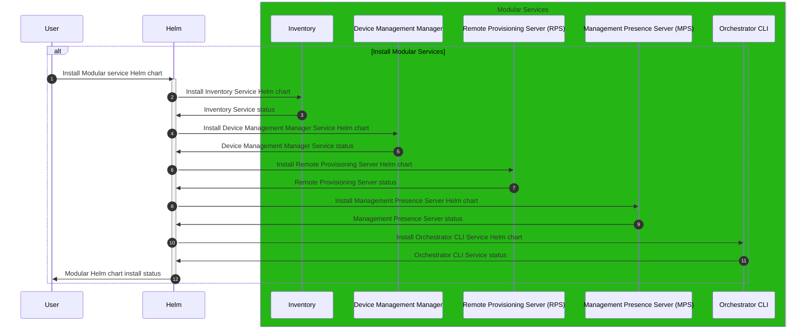
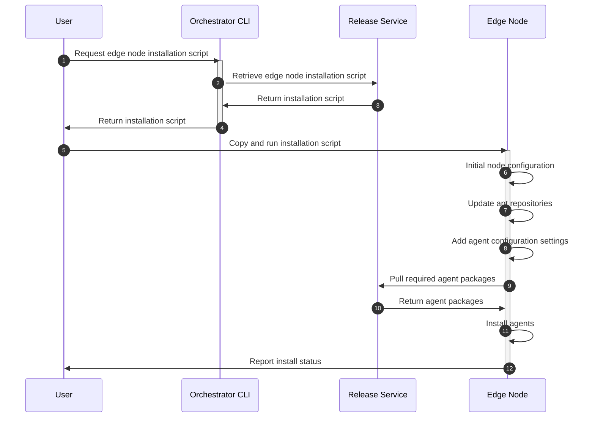

# Design Proposal: Installer and Release Packaging for Edge Infrastructure Manager Modular Workflows

Author(s): Edge Infrastructure Manager Team

Last Updated: 2025-11-27

## Abstract

The current Edge Infrastructure Manager (EIM) implementation included the current Edge Manageability Framework (EMF)
release is a tightly coupled series of workflows and services deployed together in the Orchestrator. A significant
downside to this implementation is that, if a customer only requires a subset of the EIM services, it is currently not
possible to deploy only the required services due to the dependencies in EIM. To address this, a modular implementation
of EIM, where different profiles and services can be deployed based on the use case required, will be created. To
support this modular implementation of EIM, there needs to be new packaging and installer methods created to support
deployment of modular EIM services. This proposal outlines how these release packages can be created for different use
cases that have been identified for EIM. It also outlines the installation methods that will enable deployments of the
modular EIM packages for customers that do not require the full EMF deployment.

## Background

The focus of EIM is on the lifecycle management of edge node systems that are connected to EMF. This includes OS
provisioning, device activiation and power management, edge node maintenance and version updates for edge node services.
It also interacts with other services such as identity, tenant management and observability that are shared with other
domains in EMF. These are all tightly coupled together and require the deployment of the EMF as a full stack, regardless
of the use case.

As outlined in the [EIM Modular Decomposition proposal](./eim-modular-decomposition.md), to support deployment of
subsets of EIM services based on the use case of a deployment, the current EIM implementation will be decomposed. This
involves removing the coupling between different workflows to allow them to be deployed independently of each other.
This also includes creating new installation profiles for each supported use case in EIM that will install only the
required EIM services onto an Orchestrator as well as installing the required services and agents for the edge nodes.

## Proposal

### Scope

- This proposal will cover only EIM services
- The release package design will be generic and will cover all use cases outlined in the
  [EIM Modular Decomposition proposal](./eim-modular-decomposition.md).
- Only changes to support Track 1 and Track 2 outlined in the document above will be covered in this proposal.
  Changes for Track 3 will be proposed at a later date.
- All implementations and designs listed below that relate to the Edge Node installation are with the assumption
  that the Edge Node has been manually configured by a customer without using the current onboarding workflow in EIM.
- Proposal also assumes that customer has configured the required foundational services (identity, storage, Kubernetes,
  etc.) either using the EMF stack or their own infrastructure environment.
- The Edge Node design considerations outlined in this proposal are scoped to Ubuntu OS environments only.
- The packaging and installation methods described herein are intended for on-premises deployment environments.

### Architectural Design

#### Platform Components Packaging

The current EMF deployment utilizes installation scripts and Debian packages for on-premises environment provisioning.
With the introduction of modular EIM capabilities, the packaging strategy for platform components requires modification
to align with the new architecture. As part of the modular decomposition, certain Debian packages that were previously
required for full EMF deployments will no longer be necessary for all use cases. Specifically, packages such as the RKE2
installer, configuration installer, orchestrator installer will be excluded from modular EIM installations, as these
components are part of the foundational infrastructure layer that may already be provided by the customer's environment
in Track 2 scenarios.

For Track 1 deployments, the essential platform components—including Gitea for repository management and ArgoCD for
application lifecycle management—will be integrated into the Orchestrator installation script. This approach streamlines
the installation process while maintaining the necessary tooling to support GitOps-based deployment workflows for
modular EIM services.

The Edge Node agent installation scripts will be included as part of the EMF deployment package scripts.

#### EIM Modular Service Packaging and Installation

Currently, each service and manager in EIM includes its own Helm chart, with these then being added as a sub-chart
dependency to the main [EIM Helm charts](https://github.com/open-edge-platform/infra-charts). These are then
deployed using a GitOps flow in the
[EMF Repository](https://github.com/open-edge-platform/edge-manageability-framework).

For modular EIM services, each identified use case will have a single high level Helm chart. Each Helm chart will
include a dependency list of the Helm charts for all EIM services that are required to support this use case as well as
a top level configuration file. This top level configuration file will be the primary location to provide the
configuration settings needed to deploy each service in the use case to the customer Orchestrator environment.

To install the Helm chart for a specific use case, there are two options depending on the Track being used:

- For Track 1, the customer will have already deployed the EMF foundational services, which includes ArgoCD for
  application management on the Orchestrator cluster. To deploy the required Helm chart for the use case, an ArgoCD
  profile will be created for each use case. When deploying the Orchestrator, the customer can specify the use case, or
  use cases if more than one, during the install stage. This will trigger ArgoCD to retrieve the profile for the use
  case and use it to install the Helm chart and configure the services as required.

- For Track 2, since the infrastructure being used will not be the current EMF foundational services but the customer's
  own infrastructure, the Helm chart for the required use case can be downloaded by the customer and manually installed
  using Helm commands.

#### Edge Node Agent Packaging and Installation

When deploying an edge node using the current EMF deployment stack, the edge node is installed with all agents and
configured using the onboarding manager and provisioning workflow. The agents are released as Debian packages and are
installed using the installation script in the
[EIM onboarding repository](https://github.com/open-edge-platform/infra-onboarding).

To support modular EIM services, a new installation script will need to be created for each use case that will install
the required agents onto an edge node environment that has already had an Ubuntu OS installed. For both tracks, the
new installation scripts can be pulled down onto the edge node and run directly. This will perform any required
configuration of the OS to enable communication with the Orchestrator as well as pulling down the required agent Debian
packages from the release apt repository using standard apt commands. It will also perform any configuration of the
agents that is needed to support the use case deployment.

Below is an outline of the installation flow for the edge node agents:

## Implementation Plan

- Modular installer for Foundational Platform Services (FPS).
  - Identify required FPS components for Track 1 installations.
  - Create new Helm chart for FPS components.
    - New Helm chart should be top level chart with a list of subcharts for all components.
  - Test deployment of FPS Helm chart.
  - Create new ArgoCD profile for installing only the FPS component Helm chart.
    - Options for profile:
      - New profile.
      - Modify current EMF stack profile to make it configurable to install only required services.
    - Either a new profile can be created or the current ArgoCD profile for full EMF stack deployment can be
    modified to include configurable settings to support installing only the FPS component.
  - Extend the CI workflows to push the new FPS Helm chart and ArgoCD profile to the release service.
  - Test full installation flow of FPS components using new ArgoCD profile.
  - Add new documentation to deployment and user guides outlining deployment steps for the FPS chart.
- Modular installer for Edge Infrastructure Manager (EIM).
  - **Requirement 1:** Out-of-band Device Management.
    - Identify required services for Out-of-band Device Management workflow.
    - Create new Helm chart for Out-of-band Device Management services.
      - Helm chart should be a top level chart.
      - Helm chart will have a list of subcharts for all of the required services.
    - Test deployment of the Helm chart to confirm all services deploy.
    - Create ArgoCD profile for installing Out-of-band Device Management Helm chart.
      - Options for profile:
        - New profile, will be extension onto FPS individual profile.
        - Modify current EMF stack profile to make it configurable to install only required services.
    - Test workflow installation flow with new ArgoCD profile.
  - **Requirement 2:** Automated Edge Device Commissioning.
    - Identify required services for Automated Edge Device Commissioning workflow.
    - Create new Helm chart for Automated Edge Device Commissioning services.
      - Helm chart should be a top level chart.
      - Helm chart will have a list of subcharts for all of the required services.
    - Test deployment of the Helm chart to confirm all services deploy.
    - Create ArgoCD profile for installing Automated Edge Device Commissioning Helm chart.
      - Options for profile:
        - New profile, will be extension onto FPS individual profile.
        - Modify current EMF stuck profile to make it configurable to install only required services.
    - Test workflow installation flow with new ArgoCD profile.
  - Update Orchestrator CLI commands.
    - Add new commands for generating an environment file containing the required FQDNs and other configuration
    settings needed for the edge node agents for the workflows.
  - Update CI to push and store the Helm charts and ArgoCD profiles to the Release Service.
  - Test full deployment of the ArgoCD profiles for both requirements.
    - Should include installation of the FPS services.
  - Test the deployment of the individual EIM workflow charts with non-FPS deployed services.
  - Add new documentation to deployment and user guides outlining deployment steps for the EIM modular workflows.
    - Should cover deployments for both Track 1 and Track 2 use cases.
- Modular installer for Edge Node
  - **Requirement 1:** Out-of-band Device Management.
    - Identify the required agents and edge node services needed for the modular workflow.
    - Create new installation script for modular workflow.
      - Options:
        - Create new script to install required agents.
        - Modify current installation script to allow for modular installation based on provided settings.
    - Add option to install environment file with agent FQDN settings onto edge node.
    - Modify agent service configurations to retrieve service FQDNs from environment file.
    - Test installation of agents using installation script.
    - Test E2E workflow with installed Orchestrator services.
      - Test with services installed on Orchestrator using Track 1 and Track 2 installation methods.
  - **Requirement 2:** Automated Edge Device Commissioning.
    - Identify the required agents and edge node services needed for the modular workflow.
    - Create new installation script for modular workflow.
      - Options:
        - Create new script to install required agents.
        - Modify current installation script to allow for modular installation based on provided settings.
    - Add option to install environment file with agent FQDN settings onto edge node.
    - Modify agent service configurations to retrive service FQDNs from environment file.
    - Test installation of agents using installation script.
    - Test E2E workflow with installed Orchestrator services.
      - Test with services installed on Orchestrator using Track 1 and Track 2 installation methods.

## Opens

- Single installer script for Orchestrator, including installer script for edge node, which installs all services needed
  for the required use case.
  - Can also cover installation of the current full EMF stack.
