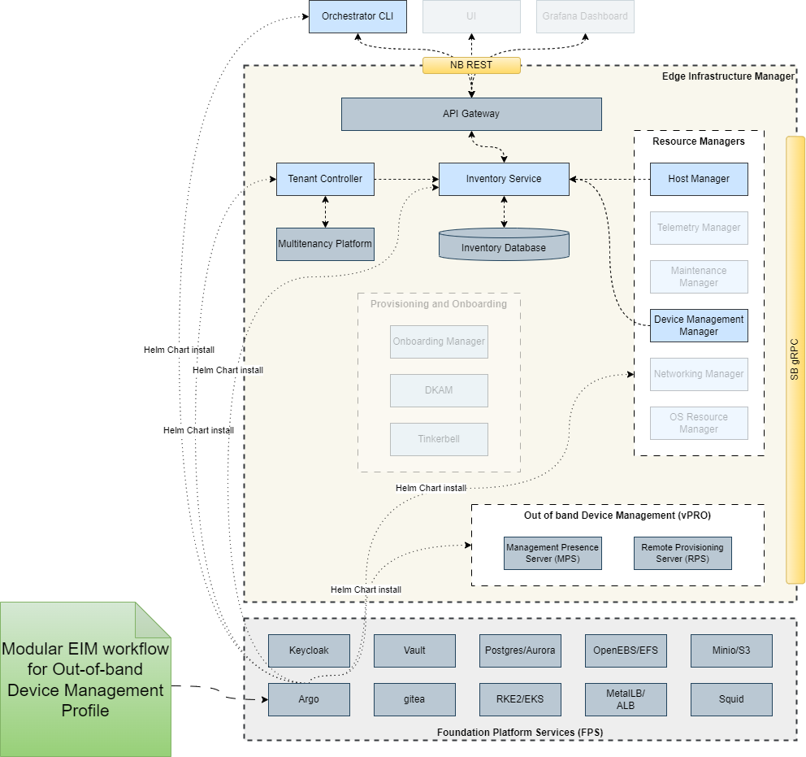
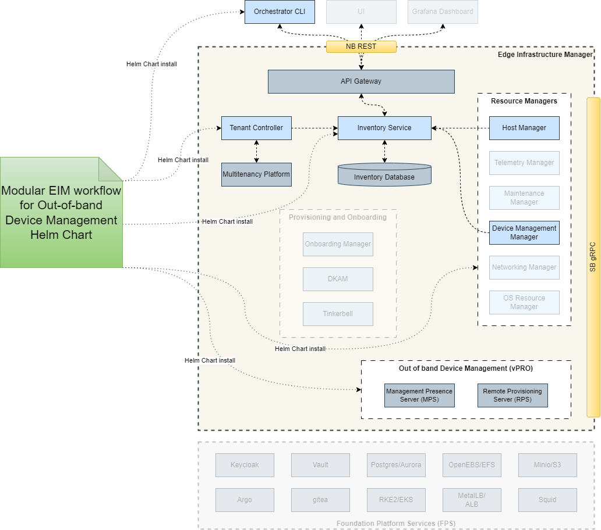

# Design Proposal: Installer and Release Packaging for Edge Infrastructure Manager Modular Workflows

Author(s): Edge Infrastructure Manager Team

Last Updated: 2025-11-07

## Abstract

The current Edge Infrastructure Manager (EIM) implementation included the current Edge Manageability Framework (EMF) release
is a tightly coupled series of workflows and services deployed together in the Orchestrator. A significant downside to this
implementation is that, if a customer only requires a subset of the EIM services, it is currently not possible to deploy
only the required services due to the dependencies in EIM. To address this, a modular implementation of EIM, where different
profiles and services can be deployed based on the use case required, will be created. To support this modular implementation
of EIM, there needs to be new packaging and installer methods created to support deployment of modular EIM services. This
proposal outlines how these release packages can be created for different use cases that have been identified for EIM. It
also outlines the installation methods that will enable deployments of the modular EIM packages for customers that do not
require the full EMF deployment.

## Background

The focus of EIM is on the lifecycle management of edge node systems that are connected to EMF. This includes OS
provisioning, device activiation and power management, edge node maintenance and version updates for edge node services.
It also interacts with other services such as identity, tenant management and observability that are shared with other
domains in EMF. These are all tightly coupled together and require the deployment of the EMF as a full stack, regardless
of the use case.

As outlined in the [EIM Modular Decomposition proposal](./eim-modular-decomposition.md), to support deployment of subsets of
EIM services based on the use case of a deployment, the current EIM implementation will be decomposed. This involves removing
the coupling between different workflows to allow them to be deployed independently of each other. This also includes
creating new installation profiles for each supported use case in EIM that will install only the required EIM services
onto an Orchestrator as well as installing the required services and agents for the edge nodes.

## Proposal

### Scope

- This proposal will cover only EIM services
- The release package design will be generic and will cover all use cases outlined in the
  [EIM Modular Decomposition proposal](./eim-modular-decomposition.md).
- Only changes to support Track 1 and Track 2 outlined in the document above will be covered in this proposal.
  Changes for Track 3 will be proposed at a later date.
- All implementations and designs listed below that relate to the Edge Node installation are with the assumption
  that the Edge Node has been manually configured by a customer without using the current onboarding workflow in EIM.
- Proposal also assumes that customer has configured the required foundational services (identity, storage, Kubernetes, etc.)
  either using the EMF stack or their own infrastructure environment.
- Edge Node design considerations cover installation onto Ubuntu OS environments only.

### Architectural Design

#### EIM Modular Service Packaging and Installation

Currently, each service and manager in EIM includes its own Helm chart, with these then being added as a sub-chart
dependency to the main [EIM Helm charts](https://github.com/open-edge-platform/infra-charts). These are then
deployed using a GitOps flow in the [EMF Repository](https://github.com/open-edge-platform/edge-manageability-framework).

For modular EIM services, each identified use case will have a single high level Helm chart. Each Helm chart will
include a dependency list of the Helm charts for all EIM services that are required to support this use case as well as
a top level configuration file. This top level configuration file will be the primary location to provide the configuration
settings needed to deploy each service in the use case to the customer Orchestrator environment.

To install the Helm chart for a specific use case, there are two options depending on the Track being used by a customer:

- For Track 1, the customer will have already deployed the EMF foundational services, which includes ArgoCD for application
  management on the Orchestrator cluster. To deploy the require Helm chart for the use case, an ArgoCD profile will be
  created for each use case. When deploying the Orchestrator, the customer can specify the use case, or use cases if more
  than one, during the install stage. This will trigger ArgoCD to retrieve the profile for the use case and use it to
  install the Helm chart and configure the services as required.

- For Track 2, since the infrastructure being used will not be the current EMF foundational services but the customer's own
  infrastructure, the Helm chart for the required use case can be downloaded by the customer and manually installed using
  Helm commands.

#### Edge Node Agent Packaging and Installation

When deploying an edge node using the current EMF deployment stack, the edge node is installed with all agents and
configured using the onboarding manager and provisioning workflow. The agents are released as Debian packages and are
installed using the installation script in the [EIM onboarding repository](https://github.com/open-edge-platform/infra-onboarding).

To support modular EIM services, a new installation script will need to be created for each use case that will install
the required agents onto an edge node environment that has already had an Ubuntu OS installed. For both tracks, the
new installation scripts can be pulled down onto the edge node and run directly. This will perform any required
configuration of the OS to enable communication with the Orchestrator as well as pulling down the required agent Debian
packages from the release apt repository using standard apt commands. It will also perform any configuration of the agents
that is needed to support the use case deployment.
