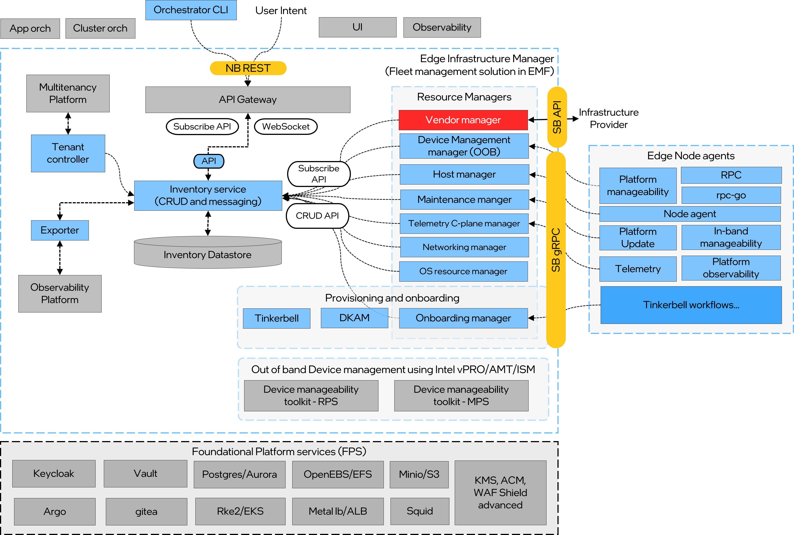
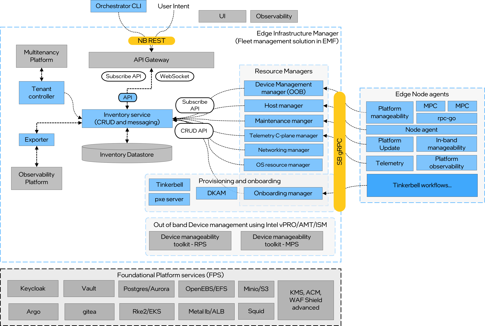
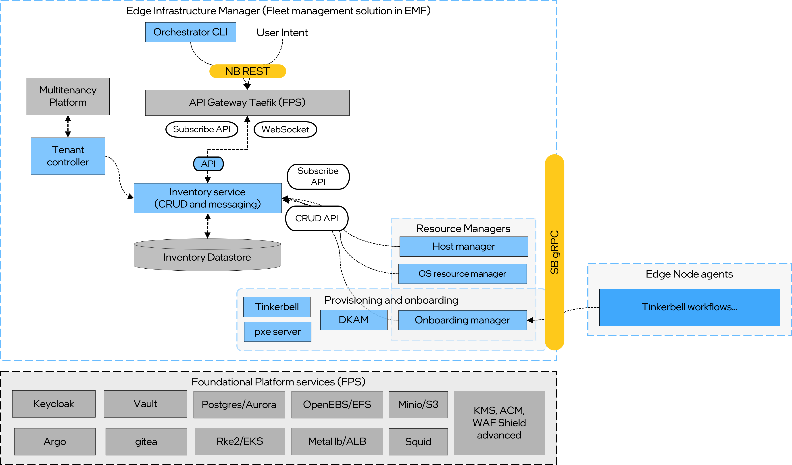
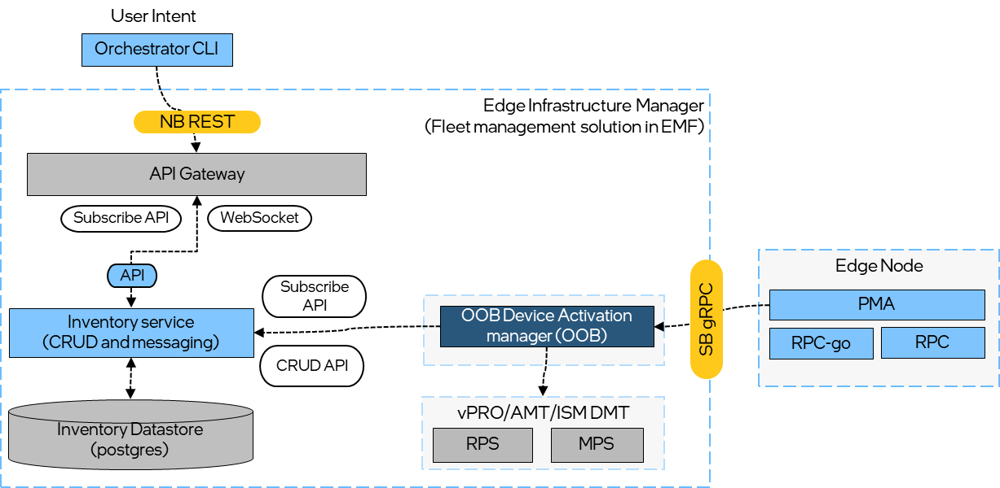
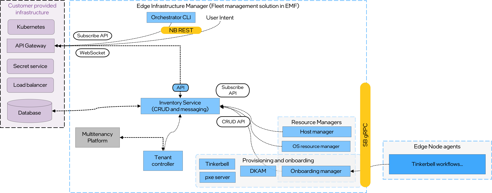
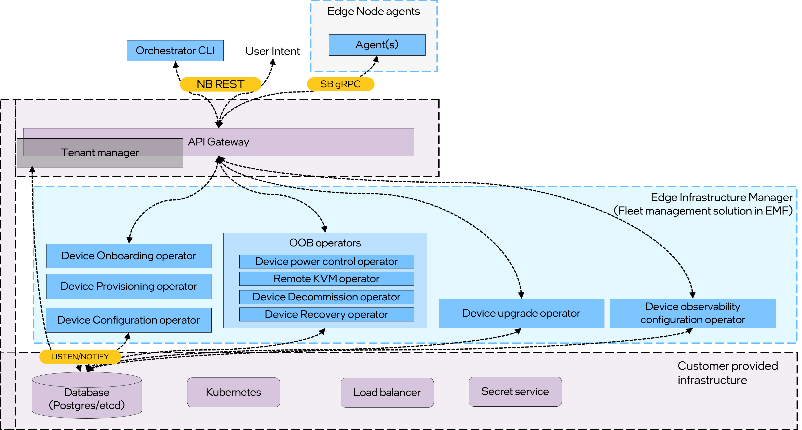
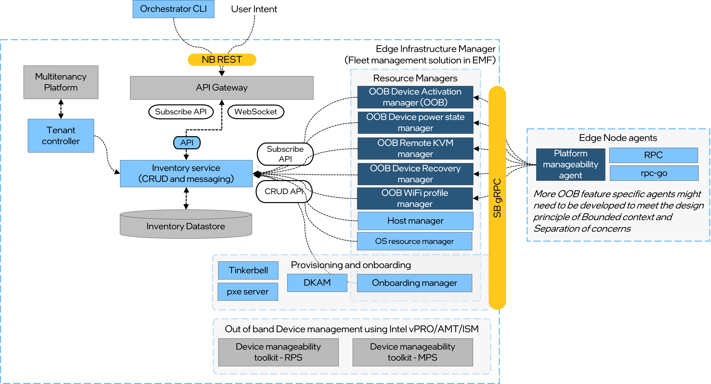

# Design Proposal: Edge Infrastructure Manager Modular Decomposition

Author(s): Edge Manageability Architecture Team

Last updated: 2025-09-29

## Abstract

Edge Infrastructure Manager (EIM) the device manageability solution in EMF today ships as an integrated collection
of services that are deployed together by Argo CD as part of overall EMF. EIM's core workflows share a tightly
coupled dependency graph. Day-2 upgrade flows, for example, require the JWT credentials created by the Onboarding
Manager during Day-0 operations. Resource Managers, inventory reconciliation, and observability exporters assume
the presence of shared infrastructure (PostgreSQL schemas, Keycloak realms, Foundation Platform Service) delivered
by the monolithic chart. This coupling makes it difficult for customers to consume only a subset—such as Day-2
upgrades—without deploying onboarding or adding bespoke credential bootstrapping. To enable diverse user persona
it is desirable for users having ability to consume only the subsets of functionality they need—such as device
onboarding or out-of-band device management—without inheriting the full solution footprint. This proposal defines
how to decompose EIM into modular building blocks with clear consumables (Helm charts, container images, APIs,
scripts) while still enabling a full-stack deployment for customers that want the entire framework.

## Background and Context

Edge Manageability Framework (EMF) spans seven domains that are orchestrated through Argo CD
and Helm charts: Edge Infrastructure Manager, Edge Cluster Orchestration, Edge Application Orchestration,
UI, CLI, Observability, and Platform Services. Each domain is composed of microservices that are
deployed via a GitOps flow rooted in
[this repository](https://github.com/open-edge-platform/edge-manageability-framework). Within that
ecosystem, EIM focuses on policy-driven lifecycle management of distributed edge fleets and collaborates
with adjacent domains for shared services such as identity, telemetry, and higher-layer orchestration.

Key API specifications are published in the `orch-utils` repository: [EIM northbound APIs](https://github.com/open-edge-platform/orch-utils/blob/main/tenancy-api-mapping/openapispecs/generated/amc-infra-core-edge-infrastructure-manager-openapi-all.yaml)

The EIM software supply chain spans multiple repositories

- [infra-core](https://github.com/open-edge-platform/infra-core): Core services for the Edge Infrastructure Manager
  including inventory, APIs, tenancy and more.
- [infra-managers](https://github.com/open-edge-platform/infra-managers): Provides life-cycle management services for
  edge infrastructure resources via a collection of resource managers.
- [infra-onboarding](https://github.com/open-edge-platform/infra-onboarding): A collection of services that enable
  remote onboarding and provisioning of Edge Nodes.
- [infra-external](https://github.com/open-edge-platform/infra-external): Vendor extensions for the Edge
  Infrastructure Manager allowing integration with 3rd party software
- [infra-charts](https://github.com/open-edge-platform/infra-charts): Helm charts for deploying Edge Infrastructure
  Manager services.

Following are the high-level EIM Value propositions:

### Fleet management spanning Day 0, 1 and 2 of device lifecycle

- Organizing devices into projects/regions/sites.
- Support for workflows at site/region level (multiple ENs).  
- Scale support: Provisioning, onboarding, upgrades, decommissioning and observability.
- User Interface: UI, CLI, OpenAPI
- Deployment: Cloud and OnPrem support
- Hardware: Support Atom, Core and Xeon CPU. Intel and Nvidia GPU.
- Scalability: Day 0 (100s of ENs), Day 1: 10k, Day 2: 1k.

### Secure and at scale Device onboarding and OS Provisioning [Day 0]

- Standalone Device provisioning support for OXMs
- Device onboarding - installing credentials for centralized management.
- Full disk encryption and Secure boot (Si specific)

### Out-of-Band device management, Device customization and Observability [Day 1]

- Support for Intel vPRO AMT/ISM based out-of-band management at fleet level.
  More details in the [section](#out-of-band-device-management).
- Per Edge node OS environment configuration using standards like cloud-init.
  - GPU, NPU, Network and Storage configuration
- Exposing APIs to Cluster, App management and Trusted Compute services.
- Device health, H/W and S/W Telemetry and logging.
- Telemetry and logging profiles for amount of data transfer.
- Edge node resource usage and Alert management.
- Remote edge node access and user management.

### Secure and at scale Device upgrades [Day 2]

- Mutable and immutable OS update along with CVE tracking
- Secure device de-authorization and decommissioning.

### Third-party integration

- Interfacing with 3rd party device or fleet manager (Lenovo LOCA) enabling Device
  manageability and Edge AI usecases on 3rd party edge solutions.

## Objectives

Typically, EIM customers fall into three personas:

- Independent Software Vendors (ISVs) or OS Vendors
- Original Equipment Manufacturers (OEMs)
- End Customers or Systems Integrators.

Each persona has distinct needs that can be better served through modular consumption of EIM capabilities.

### User stories

Before diving into the proposal, here are some representative user stories that illustrate the need for modular
decomposition:

**Independent Software Vendor/Edge solution vendor** can leverage as a reference EIM design and implementation of
the following workflows

- **Out-of-band Device Management:** As an ISV or edge solution vendor, I want a End-to-end reference solution to
  automate out-of-band device management using Intel vPRO AMT and ISM, so that I can manage fleets of edge devices
  efficiently and securely

> **Note:** Out-of-band management has multiple unique usecases and work flows. e.g. device power management,
> remote KVM access, Boot control, hardware and software inventory etc. Each of these capabilities can be
> of consumed by customer as an independent workflow.

- **Hardware and Software Observability:** As an ISV or edge solution vendor, I want to access hardware and software
  observability for Intel Architecture devices, so that higher management stacks can schedule workloads and monitor
  fleet health using key silicon metrics.
- **Automated Edge Device Configuration:** As an ISV or edge solution vendor, I want to automate edge device
  configuration, including BIOS and firmware settings, so that I can achieve zero-touch management of edge devices.
- **Secure Device Onboarding and OS Provisioning:** As an ISV or edge solution vendor, I want to securely onboard
  and provision operating systems on edge devices using technologies like HTTPS boot, full-disk encryption, and
  secure boot, so that device deployments are protected from unauthorized access.
- **Day-Two Device Lifecycle Management:** As an ISV or edge solution vendor, I want to manage day-two device
  lifecycle operations, including immutable OS updates, firmware updates, and CVE remediation, so that edge devices
  remain secure and up-to-date.
- **Custom Hardware Resource Configuration:** As an ISV or edge solution vendor, I want to customize device
  configuration for Intel CPU, GPU, and NPU resources during day-one lifecycle management, so that applications can
  be allocated appropriate hardware resources.
- **Partner Vendor Orchestration Validation:** As an ISV or edge solution vendor, I want to validate our Device
  management and Edge orchestration solution against new Intel Silicon with BIOS, firmware, CPU, and GPU platforms
  using EIM, so that our Edge orchestration solution is ready earlier in the development lifecycle and ready at
  the same time of Intel Silicon launch.
- **Reference Data model and APIs:** As an ISV or edge solution vendor, I want to use data model and APIs of EIM
  as reference to understand what information was used to implement the higher layer service such as
  trusted compute and cluster orchestration, so that my solutions can integrate seamlessly with
  existing platforms.
  > Note: customer might not adopt our APIs (There are no industry standards for Infra APIs) but us the schema and
  > the data structure to understand what information was used to implement the higher layer services.

**Original Equipment manufacturer** can leverage as a reference EIM design and implementation of the following
workflows

- **Automated Edge Device Commissioning:** As an OEM, I want to orchestrate device onboarding, OS provisioning,
  Kubernetes and application deployment across warehouse fleets with optional QA validation, so that production
  readiness stays consistent at scale.
- **Fleet-wide Firmware and OS Upgrades:** As an OEM, I want to run automated OS and firmware upgrades across field
  fleets, so that devices remain current without manual intervention.
- **Out-of-band Activation and Control:** As an OEM, I want to automate device activation and manage fleets using
  Intel vPro AMT and ISM, so that field operations stay secure and responsive.

**End customer or Systems integrator** can leverage the complete EIM stack as a reference achieve following
workflows

- **Multi-tenant Day-0 Onboarding and Provisioning:** As an end customer or systems integrator, I want to onboard
  devices and provision any (not just Ubuntu or EMT) operating systems across tenants on-premises or in the cloud so
  that deployments remain consistent from the start.
- **Multi-tenant Day-1 Configuration and Operations:** As an end customer or systems integrator, I want to configure
  and operate edge devices per tenant across on-prem and cloud environments so that ongoing management stays
  streamlined and isolated.
- **Multi-tenant Day-2 Lifecycle Management:** As an end customer or systems integrator, I want to manage device
  updates and lifecycle tasks for each tenant wherever the solution is deployed so that fleets remain secure and
  compliant.

### Deliverables

1. **Modular consumption** – Customers must be able to deploy the whole EIM stack or any subset of modules (for
   example, Device Onboarding, vPro device management) with minimal dependency drag.
2. **Clear consumables** – Each module publishes:
   - A Helm chart (with documented values, dependencies, and upgrade paths).
   - Versioned container images stored in the public registry.
   - API specifications (OpenAPI) and usage samples.
   - Optional scripts or Terraform modules that automate prerequisite configuration.
3. **Build flexibility** – CI/CD pipelines must produce artifacts for the whole stack and for each module. Consumers
   can build locally or pull pre-built images.
4. **Operational coherence** – Observability, IAM, and shared services must remain pluggable so that partial
   deployments still receive security and monitoring coverage.
5. **Backward compatibility** – Existing full-stack deployment flows continue to work (Argo Application of
   Applications) with new composable sub-charts.
6. **Upgrades** - Each module must support independent versioning and upgrade paths while maintaining
   compatibility with the overall EIM stack.

## Proposal

### Scope

- The proposal covers only the Edge Infrastructure Manager domain of the Edge Manageability Framework.
- Edge Cluster Orchestration, Edge Application Orchestration, UI, CLI, Observability, and Platform Services are
  included only where they integrate with EIM modules (for example, shared identity or telemetry connectors).
- Changes are limited to packaging, deployment flows, API surfacing, and build processes; no core business logic
  changes are in-scope unless explicitly required to achieve modular boundaries.

### Definition of Decomposition

Decomposition in this context is the process of slicing EIM into bounded domains that expose stable interfaces and
can be built, deployed, and life-cycled independently. Each module is defined by:

- A clear domain responsibility (e.g., Inventory, Resource Managers, Onboarding, Device Management Toolkit).
- Explicit upstream and downstream dependencies declared via Helm chart requirements, API contracts, and event
  topics.
- A versioned interface surface (OpenAPI, gRPC, message schemas) that allows consumers to integrate without
  depending on internal implementation details.
- Independent release cadence that can iterate without forcing upgrades in sibling modules, provided interface
  contracts are respected.

The modular blueprint introduces three tiers:

1. **Foundational services** – Identity, tenancy, inventory database, common event bus.
2. **Service bundles** – Device Onboarding, Resource Management, Observability exporters, Device Management Toolkit.
3. **Integration adapters** – External integrations (e.g., infra-external, partner connectors)
that can be plugged in based on customer needs.

### Architectural Design Pattern

The proposal adopts a **Domain-Driven, Helm-Packaged Microservice Mesh** pattern:

- **Domain-driven design (DDD)** provides bounded contexts that map to Helm sub-charts and release artifacts.
  Here are some example contexts:
  - Onboarding Context: Handles secure enrollment, certificate issuance, tenant binding.
  - Observability Context: Collects metrics, heartbeats, logs, exposes to monitoring
    stack.
  - OOB Management Context: Provides remote power control, KVM access, watchdog reset.
  - Upgrades Context: Manages OS, container runtime, agent upgrades in a safe manner.
  - Configuration Context: Applies tenant-defined desired state to node agents.
- **Strangler Fig modernization** approach is used to gradually peel existing monolithic Helm definitions into
  independent sub-charts while keeping the legacy entry points alive until migration is complete.

### Reference Solutions in the Industry

- **Red Hat Advanced Cluster Management (RHACM)** exposes modular operators (cluster lifecycle, application
  lifecycle, policy) packaged as discrete Helm/OLM operators, enabling customers to install only what they need.
- **VMware Edge Compute Stack** provides optional services (device onboarding, secure access, observability) that
  can be deployed individually via Helm charts and APIs.
- **Azure Arc-enabled services** shows a pattern where core control plane is optional and capabilities such as
  Kubernetes configuration, data services, or VM management can be onboarded
  independently.

These solutions demonstrate that modular edge management platforms rely on clear packaging,
API-first integration, and layered observability—the same principles applied here.

### Current Complexity

EIM’s core workflows share a tightly coupled dependency graph. Day-2 upgrade flows, for example,
require the JWT credentials created by the Onboarding Manager during Day-0 operations. Resource Managers,
inventory reconciliation, and observability exporters assume the presence of shared infrastructure
(PostgreSQL schemas, Keycloak realms, Foundation Platform Service) delivered by the monolithic chart.
This coupling makes it difficult for customers to consume only a subset—such as Day-2 upgrades—without
deploying onboarding or adding bespoke credential bootstrapping.

The current high-level architecture of EMF is illustrated below with an extended depiction of EIM components
and shared infrastructure.

- **Inventory**: State store and reconciliation service. Exposes NB API.
- **Host manager**: Updating Host hardware information of the fleet of Edge nodes and maintains the heartbeat
- **Onboarding manager**: Provides mechanism to associate OS profile and onboarding workflow to be executed on the
  Edge node
- **Device management manager**: Provides interface to Out-of-band Device management services and platform
  manageability agent to support Intel vPRO AMT/ISM.
- **Maintenance manger**: Provides interface for scheduling updates (OS) on fleet of Edge nodes
- **Networking manager**: Reconciles the state of the IP Address resource in inventory by Validating its
  uniqueness on a per Site basis.
- **Telemetry manager**: control plane to configure metrics/log collection from the Edge Nodes
- **OS resource manger**: Provides mechanism to manage the OSs supported by the EIM (Does not interface with EN)
- **LOCA manager**: Provides Lenovo Fleet manager to onboard edge nodes. Vendor manager are optional.
- **DKAM**: Provides curation of Edge node OS and post OS install agents on Ubuntu only. Signing of ipxe and
  uOS.
- **CDN NGINX**: Hosts Boot artefact for EN in case of HTTPs boot and other OS artefact.
- **Tinker bell**: Open-source component supporting OS provisioning
- **Tenant controller**: Interfaces with Tenant manger and Inventory to enable multi-tenancy in EIM.
- **API**: EIM Open API definition

EMF also supports OXM deployment profile targeted at Equipment Manufacturers for scale provisioning of edge
devices in factory or warehouse environments. This profile leverages the same EIM services but with a reduced
footprint of not deploying Application and Cluster orchestration. The OXM architecture is illustrated below. It is
apparent that the all EIM components are deployed even though the usecase only requires device OS provisioning.
Also the deployment should EIM deployment is tightly coupled with each other and share dependencies on common
infrastructure services such as PostgreSQL, Redis, Keycloak, and Foundation Platform Service.

### Modular Evolution Tracks

To unlock incremental modularity without disrupting existing customers, three tracks of work are proposed:

- **Track #1 (Status Quo + Use Case Enablement)**
  - Continue leveraging the existing Argo CD Application-of-Applications pattern and our inventory plus
    Foundation Platform Service (FPS) stack.
  - Package “use-case specific” overlays that expose Day-0 onboarding, Day-1 configuration, and Day-2 upgrade
    workflows via API, CLI, resource manager, and (where applicable) edge node agent bundles. The usecase
    specific overlays will be a release and deployment package build system that bundle the necessary artifacts
    for the centralized control plane (Helm charts, container images, manifest files, scripts) and edge node agents
    (Debian or RPM binaries of the agents, configuration files, optionally EMT image) specific to the usecase.
    Helm charts for each module (Onboarding, Resource Managers, Observability, Device Management
  - Provide prescriptive automation (Helm values, scripts) that stitches together required modules while
    documenting cross-service credential dependencies (for example, onboarding-issued tokens for upgrade services).
    - EIM `infra-charts` will be updated to support deployment of managers that are required for the usecase. For
    example, for OXM deployment profile only onboarding and OS resource manager will be deployed.
    - Clear ArgoCD profiles will be made available to deploy EIM for specific usecase supporting following workflows:
      - Out-of-band Device Management
      - Hardware and Software Observability
      - Automated Edge Device Configuration
      - Secure Device Onboarding and OS Provisioning
      - Day-Two Device Lifecycle Management
      - Custom Hardware Resource Configuration
      - Complete EIM stack supporting day-0, day-1 and day-2 workflows.

The updated OXM profile architecture supporting Secure Device Onboarding and OS Provisioning is illustrated below.

> Note: Device onboarding workflow installs the edge device credentials, These credentials in the from of JWT token is
> used by other workflows. This means that with track #1 device onboarding is a prerequisite for other workflows.
> To avoid this we can leverage and automate the device credentials injection and bootstrapping mechanism used by EIM
> scale testing framework where EIM agents are running in docker containers simulating edge nodes.

Here is another example of **Track #1 (Status Quo + Use Case Enablement)** with Out-of-Band Device Management workflow
for device vPRO/AMT activation management.

- **Track #2 (Bring-Your-Own Infrastructure)**
  - Introduce configuration surfaces that allow customers to plug in third-party identity and secrets backends such
    as Keycloak, Vault, load balancers, Kubernetes clusters, or database services mirroring the flexibility
    currently offered by the Device Management Toolkit (DMT).
  - Refactor services to tolerate absent EMF-managed infrastructure by supporting pluggable credential providers,
    externalized storage endpoints, and configurable messaging backbones.
  - Deliver migration helpers that map existing Helm values to third-party equivalents, enabling gradual adoption
    without rewriting downstream integrations.

Track #2 can be delivered in parallel with Track #1 to enable customers to consume specific workflows leveraging
the Foundational platform services decomposition activity. This track further reduces the dependency coupling
between EIM services and the shared infrastructure services such as PostgreSQL, Redis, Keycloak and Foundation
Platform Service.

The updated Track #2 of OXM profile architecture supporting Secure Device Onboarding and OS Provisioning is
illustrated below.

- **Track #3 (Reimagined Data Model + Kubernetes-Native Controllers)**
  - Evolve the inventory schema and contract so that Resource Managers can persist state through an abstraction
    layer capable of targeting multiple database providers or CRD-backed stores.
  - Recast managers as Kubernetes Operators/CRDs, enabling declarative reconciliation, native lifecycle hooks, and
    alignment with platform SRE practices.
  - Provide adapters for database and identity integration so operators can authenticate using cluster or external
    credentials, drastically reducing prerequisites for partial deployments.
  - Existing database objects needs to be decouple.

Design principles for Track #3 include:

- Bounded Contexts per Operator: Each operator owns its slice of the domain (Onboarding, Config, Observability,
  OOB, Upgrades).
  - Onboarding Context: Handles secure enrollment, certificate issuance, tenant binding.
  - Provisioning Context: Handles secure installation of Operating System.
  - Observability Context: Collects metrics, heartbeats, logs, exposes to monitoring stack.
  - OOB Management Context: Provides remote power control, KVM access, watchdog reset.
  - Upgrades Context: Manages OS, container runtime, agent upgrades in a safe manner.
Configuration Context: Applies tenant-defined desired state to node agents.
- Event-Driven Integration: Prefer LISTEN/NOTIFY or Kafka over polling the DB.
- Idempotent Reconciliations: Operators must retry safely without side effects.
- Compensating Actions: Instead of distributed transactions, use rollback workflows.
- Multi-Tenancy and RLS: Use Postgres Row Level Security for isolation between tenants.
- Edge-Initiated Connectivity: Edge agents always connect out to operators (never inbound).
Each successive track reduces infrastructure coupling, increases module portability, and lowers the barrier for
consuming targeted workflows.

The high-level architecture of Track #3 is illustrated below with EIM components implemented as Kubernetes-native
operators and pluggable infrastructure.

The re-architected resource managers to device inventory can be implemented in multiple ways.

- EIM operators can communicate directly with with a SQL Datastore like PostgreSQL using an
  ORM library retaining the current data model.
- EIM operators can communicate directly with with a non-SQL Datastore like etcd or Consul using their native APIs.
  This would have impact on the current data model and would require a migration path.
- EIM operators can leverage native Kubernetes-API server and the etcd as the device inventory. This would have impact
  on the current data model and also might have side effect on the EMF/EIM cluster instance because of
  sharing the same etcd instance.
- It is also possible to have a dedicated instance of API server and etcd for EIM operators to manage the device
  inventory.

The updated Track #3 of OXM profile architecture supporting Secure Device Onboarding and OS Provisioning is
illustrated below.

## Out-of-band Device Management

Edge Infrastructure Manager provides a reference end-to-end automated fleet management solution
using [Intel Device manageability toolkit](https://github.com/device-management-toolkit/docs) (DMT). E.g. EIM provides
a reference cloud or OnPremises Fleet management solution that can be deployed by customer Similar to Intel managed
vPRO fleet solution. ISVs and Edge stack vendors can leverage EIM as a reference implementation and software
components to integrate vPRO device management capabilities into their edge solution stack.

Here are some of the **value additions EIM provides on top of the core Intel DMT**.

- Unified provisioning that chains PXE/HTTPS boot, OS imaging, and DMT agent activation
  into a single zero-touch workflow, shrinking factory floor and field deployment effort.
- Vendor-neutral policy engine that detects device-specific vPRO/ISM capabilities at runtime
  and drives conditional actions (power, KVM, remediation) without custom scripting.
- Managed upgrade pipelines that coordinate firmware, OS, and DMT service rollouts with
  staged approvals, compliance gating, and automated CVE closure reporting.
- Policy based support for vPRO Device management in both Admin (Admin control mode) and
  Client control mode (CCM) across fleet of devices.  
- Multi-tenant governance model with regional/site hierarchies, granular RBAC, and per-tenant
  secrets isolation that scales DMT beyond single-customer environments.
- Automated recovery playbooks that restore OS, agents, credentials, and application payloads
  end-to-end, giving operations a deterministic “return-to-known-good” button.
- Cross-layer Inventory and telemetry lake that fuses hardware counters, OS health,
  Kubernetes state, and application metrics to expose Intel silicon insights alongside fleet KPIs.
- Secure device retirement workflows that orchestrate de-authorization, cryptographic wipe,
  audit evidence capture, and re-inventory of reclaimed assets.
- Integrated secure remote operations combining audited KVM, just-in-time SSH, and policy-bound
  break-glass controls to keep remediation compliant.
- Edge-aware reliability features that prevent repeated vPRO activations on lossy or intermittent networks.

### Fine grained E2E vPRO workflows

As stated earlier, out-of-band management has multiple unique usecases and work flows. e.g. device power
management, remote KVM access, Boot control, hardware and software inventory etc. Each of these capabilities can be
of consumed by customer as an independent workflow. In the current-architecture this can be implemented by
developing multiple unique resources managers that are specific to the out-of-band workflow.

The diagram below illustrates feature out-of-band specific resource managers that can be developed to support
the various out-of-band management workflows. Each of these resource managers can be packaged as an independent module
that can be consumed by the customer as per their requirements. In the current architecture the customer would still
need to have basic Inventory and OS provisioning as these capabilities are required for vPRO device activation.

## Executive Summary

This design proposal addresses a critical need for modular consumption of Edge Infrastructure Manager (EIM)
capabilities within the Edge Manageability Framework. Currently, customers must deploy the entire EIM stack even
when they only need specific functionality like device onboarding or out-of-band management, creating unnecessary
infrastructure overhead and operational complexity.

### Key Problem Statement

EIM's current full stack architecture creates tight coupling between components, forcing customers to deploy:

- Full PostgreSQL, Redis, and Keycloak infrastructure for any EIM capability
- All resource managers and services regardless of actual needs
- Complete observability and telemetry stack even for simple use cases
- Synchronized upgrade windows across all services, increasing deployment risk

### Proposed Solution

The proposal introduces a **three-track modular evolution strategy** that enables incremental adoption:

#### Track #1: Status Quo + Use Case Enablement

- Maintains existing infrastructure while adding use-case-specific deployment profiles
- Provides targeted overlays for Day-0 onboarding, Day-1 configuration, and Day-2 upgrade workflows
- Enables customers to deploy only required resource managers for specific scenarios (e.g., OXM profile for
  OS provisioning)

#### Track #2: Bring-Your-Own Infrastructure

- Introduces pluggable infrastructure backends allowing customers to use existing identity, secrets, and database
  services
- Reduces dependency on EMF-managed PostgreSQL, Redis, and Keycloak instances
- Provides migration helpers for gradual adoption without breaking downstream integrations

#### Track #3: Kubernetes-Native Operators

- Transforms resource managers into Kubernetes operators with CRD-based state management.
- Enables declarative reconciliation and native lifecycle hooks aligned with platform SRE practices.
- Dramatically reduces infrastructure prerequisites for partial deployments.

#### Complexity and high-level estimate

**Track #1** can be delivered with moderate effort by leveraging existing Helm charts, deployment patterns and
the current EIM architecture. The primary complexity lies in defining clear use-case boundaries and ensuring
consistent behavior across different deployment profiles.

**Track #2** will require significant effort to implement the necessary abstractions and integration points for
pluggable infrastructure backends. This includes developing a robust API layer and migration tools to support
customer-specific configurations.

**Track #3** represents the ambitious transformation, necessitating a complete re-architecture of resource
managers as Kubernetes operators. This will involve substantial engineering effort to align with Kubernetes
best practices and ensure seamless integration with existing workflows.
