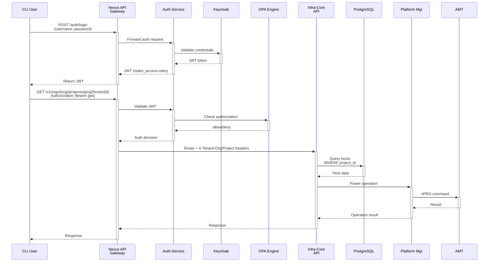

# ADR-002: Minimal Multi-Tenancy Components for Modular EIM Decomposition

**Status:** Proposed

**Date:** 2025-11-17

**Author(s):** Edge Manageability Architecture Team

## Context

The [eim-modular-decomposition.md](https://github.com/open-edge-platform/edge-manageability-framework/blob/main/design-proposals/eim-modular-decomposition.md) design proposal defines a strategy to decompose Edge Infrastructure Manager (EIM) into independently consumable modules for specific workflows:

- **Workflow 1.a**: vPRO/AMT device activation
- **Workflow 1.b**: Out-of-band power management  
- **Workflow 2**: Automated device commissioning and OS provisioning

The [eim-modular-2600-workflows.md](https://github.com/open-edge-platform/edge-manageability-framework/blob/main/design-proposals/eim-modular-2600-workflows.md) specification details deliverables for 2026.00 release focused on modular consumption without full-stack deployment overhead.

### Current Architecture

Current Full EMF architecture enforces tight coupling between multi-tenancy orchestration and core workflows:

**Full EIM Multi-Tenancy Stack:**
- Nexus Multi-Tenancy Orchestrator
- Nexus API Gateway
- Auth-Service
- OPA Policy Engine
- Keycloak Tenant Controller
- Hierarchical API structure (`/v1/orgs/{org}/projects/{project}/...`)
- Infra Tenant Controller

In Full EMF deployments, EIM services depend on the following multi-tenancy components for tenant isolation and access control:

1. **Nexus Multi-Tenancy Orchestrator**
   - Full tenant lifecycle management (CRUD operations for orgs, projects, folders)
   - Hierarchical tenant organization with unlimited nesting depth
   - User and role assignment workflows
   - Tenant quota and resource limit enforcement
   - RESTful API for tenant administration (`/v1/tenants/*`)
   - Persistent runtime service (always running)

2. **Nexus API Gateway**
   - Central ingress for all EIM API requests
   - Extracts tenant context from URL paths: `/v1/orgs/{org}/projects/{proj}/*`
   - Routes requests to Auth-Service for authentication and authorization
   - Adds tenant headers (`X-Tenant-Org`, `X-Tenant-Project`) for downstream services
   - Request/response transformation and protocol translation
   - Persistent runtime service

3. **Auth-Service**
   - Centralized authentication gateway
   - JWT token validation (signature, expiration, issuer verification)
   - Queries OPA Engine for authorization decisions
   - Manages tenant context propagation to backend services
   - Token introspection and refresh workflows
   - Persistent runtime service

4. **OPA (Open Policy Agent) Engine**
   - Policy-based authorization engine
   - Evaluates complex RBAC policies written in Rego
   - Checks user roles against required permissions for each endpoint
   - Returns allow/deny decisions to Auth-Service
   - Policy versioning and dynamic reloading
   - Persistent runtime service

5. **Keycloak Tenant Controller**
   - Event-driven service watching PostgreSQL for tenant changes
   - Creates Keycloak realm roles: `{org-uid}_project-read-role`, `{project-uid}_en-agent-rw`
   - Creates Keycloak groups: `{project-uid}_Edge-Manager-Group`
   - Assigns roles to users based on project membership
   - Synchronizes tenant RBAC state between database and Keycloak
   - Persistent runtime service

6. **Infra Tenant Controller**
   - Event-driven service creating Kubernetes CRDs for tenant runtime projects
   - Synchronizes tenant state between PostgreSQL and Kubernetes cluster
   - Manages tenant-scoped namespace isolation
   - Handles RuntimeProject lifecycle events
   - Persistent runtime service

**Total Runtime Components:** 6 persistent services

### API Flow

### Complete EIM Pod Communication with Multi-Tenancy Services

| **EIM Pod/Component** | **Namespace** | **Replicas** | **nexus-api-gw** `orch-iam:8082` | **tenancy-manager** `orch-iam` | **tenancy-datamodel** `orch-iam` | **tenancy-api-mapping** `orch-iam` | **tenancy-init** `orch-iam` | **platform-keycloak** `orch-platform:8080` | **vault** `orch-platform:8200` | **Communication Details** |
|----------------------|---------------|-------------|-------------------------------------|----------------------------------|-------------------------------------|--------------------------------------|-------------------------------|---------------------------------------------|----------------------------------|--------------------------|
| **api** (v1) | `orch-infra` | 1 | ✓ HTTP REST Backend registered | ✗ | ✗ | ✓ Indirect via nexus-api-gw | ✗ | ✓ OIDC JWT validation `enforceMultiTenancy: true` | ✗ | **REST API v1**: Legacy hierarchical API (`/v1/orgs/{org}/projects/{project}/*`). Extracts tenant from JWT, validates with Keycloak. Nexus-api-gw uses tenancy-api-mapping for route resolution. Internal dependency: queries inventory with tenant filter. Pod: `api-*` |
| **apiv2** | `orch-infra` | 1 | ✓ HTTP REST Backend registered | ✗ | ✗ | ✓ Indirect via nexus-api-gw | ✗ | ✓ OIDC JWT validation `enforceMultiTenancy: true` | ✗ | **REST API v2 + gRPC Proxy**: Flat API (`/v2/*`). JWT validation in-service, tenant extraction from roles. Nexus-api-gw uses tenancy-api-mapping for route resolution. Internal dependency: dual proxy (HTTP+gRPC) to inventory service. Pod: `apiv2-*` |
| **inventory** | `orch-infra` | 1 | ✓ HTTP REST Registered backend | ✗ | ✗ | ✓ Indirect Backend mapping | ✗ | ✗ | ✓ HTTP Secret storage | **Central resource database**: Stores all EIM resources with `project_id` foreign key. Enforces `WHERE project_id = $1` on all queries. PostgreSQL backend with tenant isolation. Registered in tenancy-api-mapping as backend service. **Internal EIM dependency**. Pod: `inventory-*` |
| **tenant-controller** | `orch-infra` | 1 | ✓ HTTP REST Tenant project mgmt | ✓ Indirect via nexus-api-gw | ✓ Direct Go import v1.2.2 K8s CRD watch | ✓ Indirect Route resolution | ✗ | ✓ OIDC JWT validation | ✓ HTTP `vault.orch-platform.svc.cluster.local:8200` | **Tenant lifecycle controller**: Watches tenancy-datamodel CRDs, creates RuntimeProject resources, syncs tenant state between PostgreSQL and K8s cluster. Internal dependency: gRPC to inventory. Pod: `tenant-controller-*` |
| **exporter** | `orch-infra` | 1 | ✗ | ✗ | ✗ | ✗ | ✗ | ✗ | ✗ | **Metrics exporter**: Exports EIM metrics to Prometheus. No direct multi-tenancy communication (metrics aggregation only). No inventory dependency. Pod: `exporter-*` |
| **host-manager** | `orch-infra` | 1 | ✓ HTTP REST API routing | ✗ | ✗ | ✓ Indirect Backend in API mapping | ✗ | ✓ OIDC JWT validation `enforceMultiTenancy: true` | ✗ | **Host/device resource manager**: Manages vPRO/AMT devices, host hardware info. Validates JWT, extracts tenant from roles. Nexus-api-gw routes requests using tenancy-api-mapping. Internal dependency: gRPC to inventory with `project_id` filter. Traefik route: `Host(\`en-agent.{domain}\`)`. Pod: `host-manager-*` |
| **maintenance-manager** | `orch-infra` | 1 | ✓ HTTP REST API routing | ✗ | ✗ | ✓ Indirect Backend in API mapping | ✗ | ✓ OIDC JWT validation `enforceMultiTenancy: true` | ✗ | **Software update manager**: Manages maintenance tasks, OS updates. Tenant-aware scheduling. Nexus-api-gw uses tenancy-api-mapping for routing. Internal dependency: gRPC to inventory with filtering. Traefik route: `Host(\`update-node.{domain}\`)`. Pod: `maintenance-manager-*` |
| **networking-manager** | `orch-infra` | 1 | ✗ | ✗ | ✗ | ✗ | ✗ | ✗ | ✗ | **Network config manager**: Verifies IP uniqueness, network configuration. Internal service (no external API). Internal dependency: queries inventory with tenant context from internal calls. Pod: `networking-manager-*` |
| **telemetry-manager** | `orch-infra` | 1 | ✓ HTTP REST API routing | ✗ | ✗ | ✓ Indirect Backend in API mapping | ✗ | ✓ OIDC JWT validation `enforceMultiTenancy: true` | ✗ | **Telemetry config manager**: Manages telemetry collection on edge nodes. JWT-based tenant isolation. Nexus-api-gw uses tenancy-api-mapping for routing. Internal dependency: gRPC to inventory with `project_id` filter. Traefik enabled. Pod: `telemetry-manager-*` |
| **os-resource-manager** | `orch-infra` | 1 | ✗ | ✗ | ✗ | ✗ | ✗ | ✓ OIDC JWT validation `enforceMultiTenancy: true` | ✗ | **OS profile manager**: Manages OS resources, plans edge node updates. Tenant-aware OS profile assignment. Supports version constraints (`osProfileRevision: ~0.8.11`). Internal dependency: gRPC to inventory. Pod: `os-resource-manager-*` |
| **attestationstatus-manager** | `orch-infra` | 1 | ✓ HTTP REST API routing | ✗ | ✗ | ✓ Indirect Backend in API mapping | ✗ | ✓ OIDC JWT validation `enforceMultiTenancy: true` | ✗ | **Attestation manager**: Validates device trust, stores attestation reports. Tenant-scoped attestation data. Nexus-api-gw routes using tenancy-api-mapping. Internal dependency: gRPC to inventory. Traefik route: `Host(\`attest-node.{domain}\`)`. Pod: `attestationstatus-manager-*` |
| **onboarding-manager** | `orch-infra` | 1 | ✓ HTTP REST API routing | ✗ | ✗ | ✓ Indirect Backend in API mapping | ✗ | ✓ OIDC JWT validation `enforceMultiTenancy: true` Bypass: `cdn-boots` | ✓ HTTP Credentials `vault.orch-platform.svc.cluster.local:8200` | **Device discovery & onboarding**: Discovers/registers new devices. Assigns to tenant projects. Integrates with Keycloak for user credentials, Vault for secrets. Nexus-api-gw uses tenancy-api-mapping for routing. Internal dependency: gRPC to inventory. Traefik gRPC stream enabled. Pod: `onboarding-manager-*` |
| **dkam** | `orch-infra` | 1 | ✗ | ✗ | ✗ | ✗ | ✗ | ✓ OIDC JWT validation | ✗ | **DKAM (Device Key & AMT Manager)**: Manages device keys for attestation. Uses OIDC for auth. Proxies to RS-Proxy for registry access (`rs-proxy.orch-platform.svc.cluster.local:8081`). No inventory dependency. Pod: `dkam-*` |
| **tink** (Tinkerbell) | `orch-infra` | 1 | ✗ | ✗ | ✗ | ✗ | ✗ | ✗ | ✗ | **Tinkerbell workflow engine**: Bare-metal provisioning workflows. Manages templates, hardware, workflows. Internal service (no multi-tenancy integration directly). No inventory dependency. Pod: `tink-*` |
| **hegel** | `orch-infra` | 1 | ✗ | ✗ | ✗ | ✗ | ✗ | ✗ | ✗ | **Tinkerbell metadata service**: Provides metadata to provisioning nodes via HTTP. No authentication (accessed during early boot by PXE clients). No multi-tenancy or inventory dependency. Pod: `hegel-*` |
| **smee** | `orch-infra` | 1 | ✗ | ✗ | ✗ | ✗ | ✗ | ✗ | ✗ | **Tinkerbell DHCP/TFTP server**: DHCP and TFTP services for PXE boot. Network-level service (no HTTP API, no multi-tenancy). No inventory dependency. Pod: `smee-*` |
| **loca-manager** | `orch-infra` | 1 | ✗ | ✗ | ✗ | ✗ | ✗ | ✓ OIDC Keycloak URL config | ✓ HTTP `vault.orch-platform.svc.cluster.local:8200` Role: `orch-svc` | **Local OS Cache Manager**: Manages local OS image caching. `enforceMultiTenancy: true`. Accesses Vault for credentials. Internal dependency: queries inventory for cache allocation per tenant. Pod: `loca-manager-*` |
| **loca-metadata** | `orch-infra` | 1 | ✗ | ✗ | ✗ | ✗ | ✗ | ✗ | ✓ HTTP `vault.orch-platform.svc.cluster.local:8200` Role: `orch-svc` | **LOCA Metadata Manager**: Manages metadata for cached OS images. `enforceMultiTenancy: true`. ServiceAccount: `orch-svc`. Internal dependency: gRPC to inventory. Pod: `loca-metadata-*` |
| **loca-templates-manager** | `orch-infra` | 1 | ✗ | ✗ | ✗ | ✗ | ✗ | ✗ | ✗ | **LOCA Templates Manager**: Manages OS provisioning templates. ServiceAccount: `orch-svc`. No direct OIDC (relies on internal service calls). Internal dependency: gRPC to inventory. Pod: `loca-templates-manager-*` |
| **mps** (Intel MPS) | `orch-infra` | 1 | ✓ HTTP REST API routing Traefik enabled | ✗ | ✗ | ✓ Indirect Backend in API mapping | ✗ | ✗ | ✗ | **Intel Management Presence Server**: WebSocket server for vPRO/AMT remote KVM, SOL. Traefik route enabled, TLS termination. Nexus-api-gw uses tenancy-api-mapping for routing. PostgreSQL backend (separate from inventory). No inventory dependency. Pod: `mps-*` |
| **rps** (Intel RPS) | `orch-infra` | 1 | ✓ HTTP REST API routing Traefik enabled | ✗ | ✗ | ✓ Indirect Backend in API mapping | ✗ | ✗ | ✗ | **Intel Remote Provisioning Server**: Activates AMT devices, configures vPRO profiles. Traefik route enabled. Nexus-api-gw uses tenancy-api-mapping for routing. PostgreSQL backend. Integrates with MPS for device management. No inventory dependency. Pod: `rps-*` |
| **dm-manager** (Device Manager - AMT) | `orch-infra` | 1 | ✓ HTTP REST API routing Traefik enabled | ✗ | ✗ | ✓ Indirect Backend in API mapping | ✗ | ✓ OIDC JWT validation `oidc_tls_insecure_skip_verify: true` | ✗ | **Device Manager (AMT/MPS/RPS)**: Orchestrates AMT device operations via MPS/RPS. Password policy config: `static` or `dynamic`. OIDC auth enabled. Nexus-api-gw uses tenancy-api-mapping for routing. Traefik route: TLS, gateway namespace. No inventory dependency. Pod: `dm-manager-*` |

**Legend:**
- ✓ = Direct communication/dependency with protocol/purpose
- ✗ = No direct communication
- **Communication Protocols**: HTTP REST (API calls), gRPC (service-to-service), OIDC (authentication), K8s CRD (Kubernetes API)
- **Tenant Context**: All managers with `enforceMultiTenancy: true` extract tenant from JWT roles using regex: `([a-f0-9-]+)_(en-agent-rw|tc-r|tc-rw)` → captures `project-uid`
- **RBAC Enforcement**: JWT role suffixes: `en-agent-rw` (read-write), `tc-r` (read-only), `tc-rw` (read-write tenant controller)
- **Inventory (Internal EIM Dependency)**: All EIM managers communicate with inventory service (`inventory.orch-infra.svc.cluster.local:50051`) via gRPC for resource CRUD operations. All queries include `WHERE project_id = {extracted_project_id}` for tenant isolation. This is an internal EIM dependency, not a multi-tenancy service.

## Challenge

Modular workflows (For example, vPRO activation, power management, OS Provisioning) don't require:
- Multiple organizations or project hierarchies
- Complex tenant lifecycle operations (create/update/delete tenants)
- Centralized policy-based authorization across dozens of services
- Tenant-aware API routing through dedicated gateway

Yet current architecture forces full deployment of multi-tenancy stack for single-tenant use cases.

## Solution

### New Architecture Proposal

- Keep Tenant Manager and Keycloak controller as is to handle tenant provisioning​

- Repurpose Nexus API gateway as NB API for tenant manager:​

   - Nexus API gateway is still required to provide /v1/orgs and /v1/projects endpoints​

- Remove hierarchical API

   - Remove internal APIs and directly support external APIs from each EMF services​

   - Remove API mapping configs for completed services from tenancy-api-mapping  the goal is to remove all configs​

- Make it modular​

   - Each service takes care of API gateway role - tenant aware AuthX, project ID resolution, (and /openapi & /swagger endpoints)​

   - Share middleware implementation in orch-lib to minimize duplicate work​

- Make multi-tenancy turn on/off feature from AO, CO and EIM components​

   - Enable/disable setting should be globally consistent across enabled services​

   - When disabled:​

      - Use pre-defined default tenant to minimize internal logic/data model change in the services​

      - Each service (AO, CO, EIM) are responsible for default tenant provisioning during the service initialization​

      - Tenant Manager (including nexus-api-gateway), Keycloak Controller, Tenant Controller for AO/EIM will be disabled​

- Internal NB API updates only​

   - No/Minimum changes to UI, CLI or external integrated components