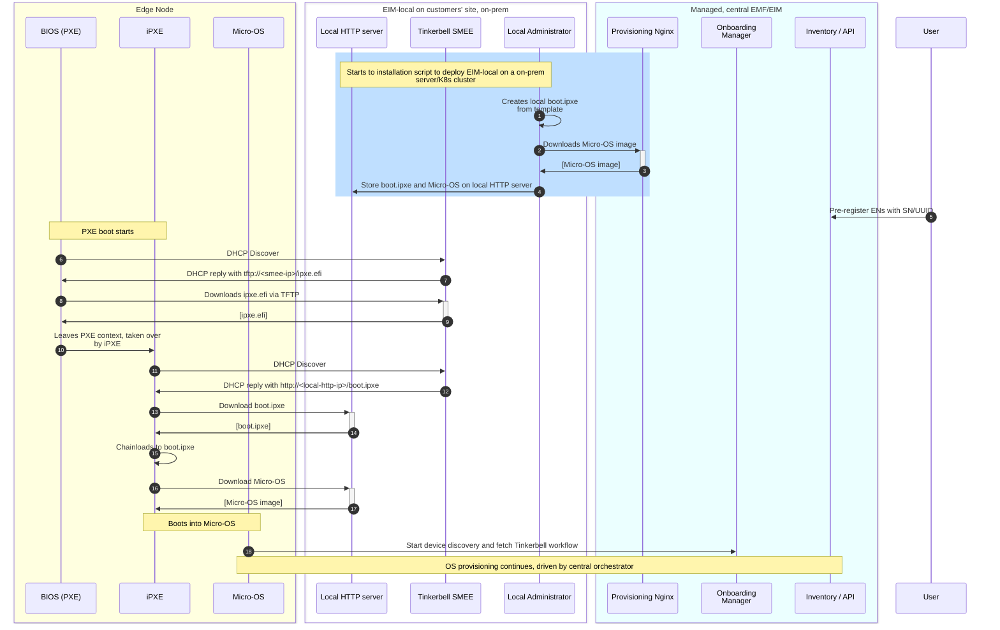

# Design Proposal: Support PXE-based provisioning with cloud-based EMF

Author(s): EIM team

## Abstract

The ADR on EMT-S scale provisioning proposes adding a DHCP/TFTP server to support PXE-based OS provisioning.
It assumes that the EIM part of EMF orchestrator is deployed locally, on-prem.

In some cases it may be desirable for users to scale EMT-S provisioning via legacy PXE, but the EMF (or EIM) is deployed in a central location.

This design proposal enables provisionins ENs via PXE when the entire EMF (or EIM Standalone) is deployed as remote, cloud-based, managed solution (not on-prem).

## Proposal

The solution assumes there is only a small local piece of EIM (called "EIM-local" hereinafter) deployed on site (via installation script provided by EIM team).
The EIM-local assists in the initial PXE boot and make possible for ENs to initiate boot via PXE. Once booted into Micro-OS, the provisioning process is taken over by the cloud-based orchestrator.

The EIM-local consists of the following components:
1. **Standalone Tinkerbell SMEE** providing DHCP/TFTP server to support legacy PXE boot.
2. **Local HTTP server** (e..g, Nginx) storing mirrors of `boot.ipxe` and Micro-OS image.
3. (OPTIONAL) **K8s cluster with dedicated network configuration** to make Standalone SMEE's DHCP/TFTP servers accessible from a local network. Only needed if EIM-local is deployed on top of Kubernetes.
   Note that the EIM-local can also be deployed as a standalone systemd service or Docker container with `--network=host`.

**NOTE1:** Local HTTP server providing `boot.ipxe` and Micro-OS image is needed to overcome the TLS certificate validation issue when using HTTPS as
SMEE's built-in iPXE doesn't include EMF's CA certificate. This design assumes no modifications to Tinkerbell SMEE, for simplicity.
However, an EIM-owned `signed_ipxe.efi` with EMF's CA certificate embedded may also be provided by local TFTP server, removing the need for local HTTP server.
This effectively requires creating a fork of Tinkerbell SMEE to enable serving EIM iPXE. If we decide to follow this path it gives clear advantages:
1. Simplifies deployment and solves HTTPS issue
2. Give us more control over default iPXE script (i.e., for instrumentation purposes, non-standard customer requirements)
3. TFTP/DHCP servers are Go-based, so we can "catch" per-EN provisioning KPIs or status at the earlier stage than we do now. For instance, provisioning status can give early feedback to user that PXE boot was initiated successfully. This can be useful when no monitor is connected to EN.
4. Tinkerbell project is not actively developed anymore.

This design proposal doesn't pursue this option, but the idea is left for further discussion.

**NOTE2**: This alternative workflow assumes that all ENs have access to Internet and the cloud-based orchestrator.

The alternative workflow with managed EMF is presented below:

The workflow starts by customers deploying the EIM-local on their sites with installation scripts (**Steps 1-4**).
The goal of the installation script is to bootstrap Tinkerbell SMEE and local HTTP server (storing boot.ipxe) on a local bare-metal server or K8s cluster.
It downloads all necessary artifacts from the Release Service and starts deployment of EIM-local. The Tinkerbell SMEE is configured to point to `boot.ipxe` on the local HTTP server.
The script also downloads Micro-OS image from the central orchestrator. The `boot.ipxe` is customized to point to a local HTTP server for Micro-OS download. Both `boot.ipxe` and Micro-OS are stored on local HTTP server.

In **Steps 6-9** the EN starts PXE boot with assistance of DHCP and TFTP servers.

Once the process is taken over by iPXE (Step 10), the `boot.ipxe` is downloaded by iPXE from the local HTTP server and chain-loaded (**Steps 11-15**).
The `boot.ipxe` script downloads Micro-OS from the local HTTP server and boots into it (**Steps 16-17**).
The Micro-OS has all necessary certificates to communicate with the central orchestrator. Micro-OS services start device discovery and Tinkerbell workflow to provision target OS.
From this point, EN goes through standard provisioning process.

## Rationale

TBD

## Open issues (if applicable)

TBD
