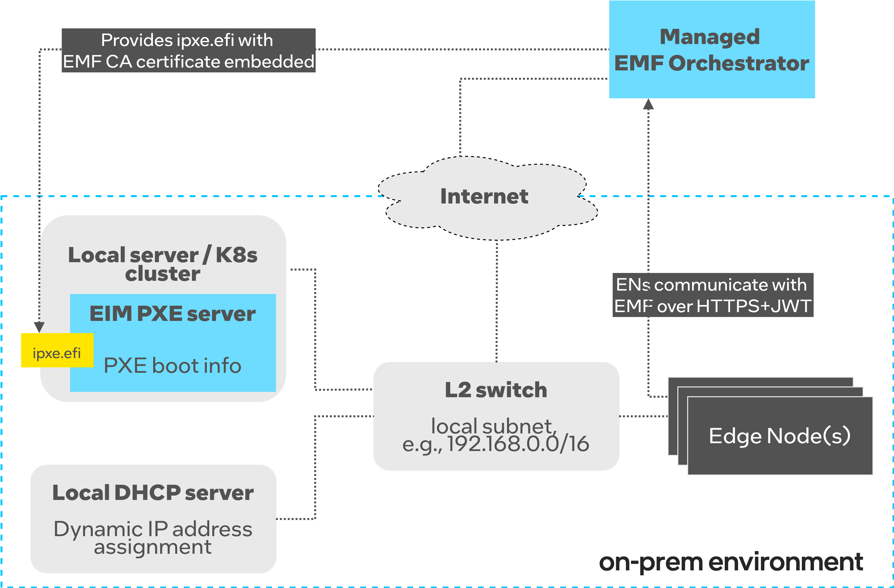
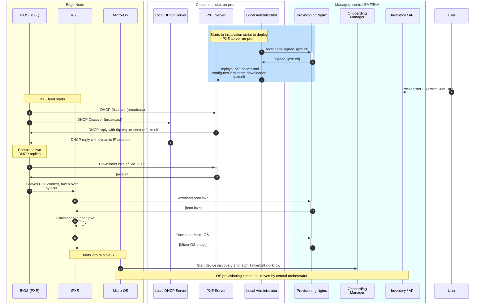

# Design Proposal: Support PXE-based provisioning with cloud-based EMF

Author(s): Edge Infrastructure Manager and App orchestration teams.

## Abstract

The design on [EMT-S scale provisioning](./emts-scale-provisioning.md) proposes adding a DHCP/TFTP server to support
PXE-based OS provisioning. It assumes that the EIM part of EMF orchestrator is deployed locally, on OXM premises.

In some cases it is mandatory  for users to bootstrap edge nodes via legacy PXE, but the EMF is deployed in a remote
cloud-based solution (either native k8s or a VM but not on on-prem).

This design proposal addresses the needs of the users that cannot adopt the HTTPs boot because not supported on low-end
budgeted device and when the USB boot does not provide a scalable solution for thousands of nodes.

## Proposal

Similarly to [EMT-S scale provisioning](./emts-scale-provisioning.md), the solution that legacy PXE boot is used to
scale OS provisioning process for low-budget devices that do not support HTTPS-based boot.

Unlike the [EMT-S scale provisioning for OXMs](./emts-scale-provisioning.md), this proposal elaborates on
scenario where the entire EMF orchestrator is NOT deployed locally, on-prem. Instead, the remote, cloud-based
EMF orchestrator is used. In the scenario, only a small piece of EIM (called PXE server) is deployed locally to drive PXE boot.
Given its small footprint it is possible to deploy PXE server on site using several solutions:

- directly on bare metal server, as Docker container or on a VM, via installation script
- on an edge K8s cluster deployed as EMF's Deployment Package
- on an edge K8s cluster deployed as a standalone Helm chart via installation script

In this solution, the PXE server only stores the `ipxe.efi` binary (that is downloaded from the remote orchestrator),
and serves it to local Edge Nodes attempting the PXE boot. During the PXE boot, ENs download `ipxe.efi` and boot into it.
The iPXE script includes a logic to fetch IP address from a local DHCP server and download Micro-OS from the remote EMF orchestrator.
Once booted into Micro-OS, the provisioning process is taken over by the cloud-based orchestrator. From now on, ENs
communicate with the remote EMF orchestrator to complete OS provisioning. The secure channel is ensured by using HTTPS communication with JWT authorization.

**NOTE:** This workflow assumes that all ENs have access to Internet and the cloud-based orchestrator.

The high-level solution's architecture is depicted below:

## Rationale

An alternative solution is to deploy entire EMF on-prem with the OXM profile, but it is an overhead in terms of
resources that need to be wasted to host the entire EMF instance, just to support PXE boot.

## Affected components and Teams

We report hereafter the affected components and Teams:

- Edge Infrastructure Manager team
- App orchestration team

The support from app-orchestration will be mainly necessary to convert the EMF OXM profile or the PXE server into
deployment-package solutions.

## Implementation plan

This design proposal will leverage the implementation done as part of [EMT-S scale provisioning](./emts-scale-provisioning.md).
On top of that implementation, we will just enable running PXE server as standalone piece (or Deployment Package)
and provide all necessary documentation for customers to set up the local environment.

### Test Plan

In terms of tests, we don't expect a lot of changes, maybe some minimal changes in the **Unit tests** to account
other variations in the curation and artifacts publishing logic.

If a new component will be introduced, definetely it will be covered with **Unit tests**. Changes will be made to
the hardware tests to verify these hierarchical scenario.

All the aforementioned tests should include negative and failure scenarios such as failed provisioning, unsupported
operations.

## Open issues (if applicable)

N/A
