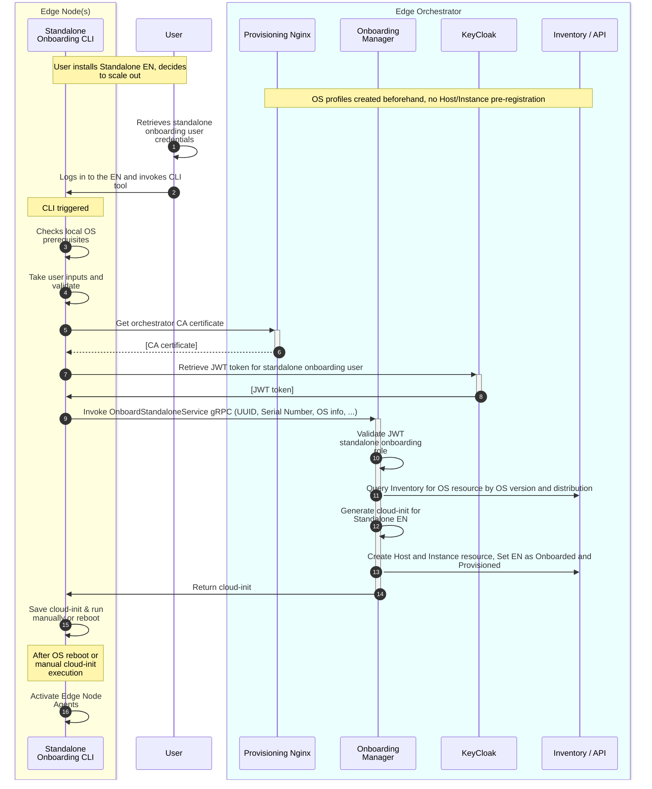

# Design Proposal: Convert Standalone Edge Nodes to Managed Edge Nodes

Author(s): Tomasz Osiński

Last updated: 29.04.2025

## Abstract

A Customer Journey for Open Edge Platform assumes that customers can manually deploy a set of Standalone
Edge Nodes (SEN) that can be onboarded to the Edge Orchestrator at later stage, once a customer is ready to scale their deployment.
SENs are converted to managed Edge Nodes which, once onboarded, are fully owned by the Edge Orchestrator - customers
can manage them (e.g., install clusters, applications or perform Day2 OS updates) through the Edge Orchestrator UI and API.

The Customer Journey is as follows:

1. A customer installs one or more Standalone Edge Nodes following the user guides.
2. The customer uses the SEN to deploy K8s clusters, applications, etc.
3. The customer decides to scale out their deployment and onboard the SENs to the Edge Orchestrator.
4. Once SENs are onboarded, the customer starts to use the Edge Orchestrator to manage the SENs. 
   The customer can now use the Edge Orchestrator to manage the SENs, including installing clusters, applications, and performing Day2 OS updates.
5. The customer can now provision additional Edge Nodes via remote provisioning or manually create additional SENs and follow the same workflow to onboard them.

This document describes the design of the onboarding process of Standalone Edge Nodes to managed Edge Nodes (step 3) to allow for all further steps. 

> NOTE: Converting standalone K8s clusters and applications to managed clusters and applications is out of scope for this document. 

## Proposal

### Design goals

This design aims at:

- Providing a solution for onboarding Edge Nodes in a fully automated way, with minimal manual steps.
- Keeping the solution OS-independent, i.e., the solution should work on any OS that is supported by the Edge Orchestrator.
- Reducing the user interaction (i.e., logging into the OS, injecting USB sticks, etc.) with Edge Node machines.
- Enabling the onboarding process at scale, i.e., the design should enable onboarding of multiple machines at once.

The proposed solution is an MVP approach - some of the above goals may not be fully achieved in the first version of the design,
but the design doesn't preclude achieving them in the future. 

### Assumptions

- Customers will drive the onboarding process from a local developer machine, with desktop, keyboard and mouse.
- The local developer machine will have direct access to ENs via local subnet. Customers can SSH into the ENs.
- SENs being onboarded won't be equipped with desktop, keyboard or mouse. The only machine equipped with peripherals will be
  the local developer/admin machine.
- The design will re-use the current APIs of Onboarding Manager to drive IO/NIO-based onboarding.
  We may just require small modifications to the Onboarding Manager and the gRPC interface.

### Solution

**Step 0.** A user already provisioned a set of Standalone ENs following the user guides and decides to scale out.
They don't need to have direct access to the Edge Orchestrator UI/API (could be different personas on-site vs. remote administrator).
Users don't need to perform any configuration on the Edge Orchestrator beforehand, but we assume that the Edge Orchestrator supports
the OS version of the Standalone ENs. The remote administrator configures a special user/role for SEN onboarding.

1. An on-site user retrieves user credentials for SEN onboarding from the remote administrator.
2. An on-site user logs into the node and invokes the CLI tool that should already be installed on the EMT image.
   The user enters into the interactive session with the CLI tool. 
3. The CLI tool performs initial OS prerequisites checks - for instance, it can check if the UUID and SN are properly set on the OS. 
4. A user is prompted for inputs. The user will be asked for the orchestrator FQDN, proxy settings (the already set proxy settings should be presented to the user),
   and SEN onboarding user credentials. The CLI tool should validate that all required parameters are set and the orchestrator should be reachable at this point.
   Moreover, the CLI tool can ask for additional input from the user such as which Local Accounts, Site or metadata to configure for a given EN (user must select a configuration that
   already exists on the orchestrator and OM should be responsible for validating if that configuration exists in the Inventory).
   Also, the CLI tool retrieves hardware info (UUID, Serial Number), OS info (OS version and distro from `/etc/os-release`), current the Secure Boot and Full-Disk Encryption settings,
   MAC/IP address of the management interface.
5. The CLI tool downloads the CA certificate from the Edge Orchestrator.
   Note that it may be less secure, but more automated to download it via CLI. We can revisit this step and require
   users to provide certificate as a user input. Also, this step is only required when the orchestrator uses self-signed certificate.
6. The CA certificate is downloaded and saved to the local filesystem for the future use.
7. The CLI tool communicates with the southbound Keycloak endpoint to retrieve JWT token based on SEN onboarding user credentials.
8. The JWT token is provided to the CLI tool and used in subsequent calls to the Onboarding Manager's gRPC endpoint.
9. At this point, the CLI tool gathered all user inputs (and validated them) and HW/OS info. It invokes the
    Onboarding Manager's gRPC endpoint to trigger the onboarding process.
    Note that the CLI tool should retry if any step above fails on the orchestrator side and the Onboarding Manager should be able to
    handle partial states.
10. Onboarding Manager validates the JWT role as it currently does for all gRPC APIs.
11. Onboarding Manager reads the OS info and queries OS profile from Inventory based on the OS version and OS distro.
    OS version should uniqely identify the OS profile. Note that this is true for EMT OS profiles, but may not be true for mutable OSes.
    See open issues for more considerations on the support of mutable OSes.
12. The Onboarding Manager creates a dedicated cloud-init configuration for SEN. The current cloud-init library can be used.
    Note that the SEN will only require a subset of current cloud-init that is generated for remote provisioning.
13. Once OS profile is found and matched, all required HW/OS info provided and cloud-init generated, the OM creates Host and Instance resources.
    The statuses should be set to Onboarded and Provisioned. Host's desired and current state should be set to `ONBOARDED`.
    The Instance desired state should be set to `RUNNING`, while the current state to `UNSPECIFIED` (until BM agents are up and running).
14. Once the onboarding is completed, the CLI tool receives the generated cloud-init configuration.
15. The CLI tool saves the cloud-init under the standard path that is used by EIM.
    The user can either run the cloud-init manually or reboot the system to trigger the cloud-init.
16. The cloud-init would provide all necessary configs for BM agents to start. Once they boot, they should start
    communicating with the orchestrator and the EN status should be changed to Running.

## Rationale

### Considerations on how to trigger SEN onboarding

The design choice is to use a simple CLI that will be invoked by local on-site admin to trigger SEN onboarding.
We discussed the following alternatives:

1. **SEN onboarding triggered by injecting a USB stick with a configuration file.**
2. **SEN onboarding triggered by copying a configuration file under a well-defined OS path**

Both approaches require having a local daemon scanning for USB sticks or on-disk config files. A local daemon is more
"heavy" solution as it would require special security permissions and a more complex lifecycle management via systemd.
It is also less interactive, so that possible intermediate errors may be harder to debug (on the contrary the CLI tool guides users through process).

Both options are still valid for future releases, but for now we decided to go with the CLI tool as the MVP solution.

### Considerations on the user workflow

There are two major workflows we support - bottom-up (IO) and top-down (NIO, requires EN pre-registration).

In this ADR we selected to use the bottom-up approach as it requires less manual steps - user logs in to EN and
run the entire workflow from the EN itself, without the need to access the Edge Orchestrator UI/API.

Also, the IO flow doesn't require any modifications to UI.

### Considerations on scaling the SEN onboarding

The current design assumes that the user will SSH into a Standalone EN and trigger onboarding one by one (it can still be automated by a script).
Depending on the customers' requirements we can provide a kind of a "Bulk Onboarding Tool" that will allow to onboard multiple ENs at once.

### How to map local OS users to Local Accounts?

For now, we won't import existing OS users as local accounts. If we support NIO in the future,
we can add support for defining local accounts that should be configured on the pre-provisioned SEN that is onboarded.

## Affected components and Teams

### Impact on OS profiles

The design assumes that the same OS profile, that is used by SEN, is already created in the Edge Orchestrator.
Therefore, we will provide a user guide on how to create OS profiles before scaling out SEN deployment. No UI support is planned for now.

However, this can have the following limitations: 1) OS profile must always be supported by the Edge Orchestrator,
but this can be a customized OS image that is not supported by the Edge Orchestrator,
2) it requires additional step for users to go and create OS profiles in the Edge Orchestrator before onboarding (if they don't exist).

See open issues for more considerations on this topic.

### Impact on Multi-Tenancy and IAM

There should be a dedicated IAM role that is only allowed to onboard standalone Edge Nodes to the Edge Orchestrator.
It should be a different role than the current onboarding role that is used for remote onboarding.

### Impact on the Edge Microvisor Toolkit

The design will require a new CLI tool that will be baked into the EMT image.

## Implementation plan

The implementation targets 3.1. The implemention will include:
- Modifications to the Onboarding Manager to support onboarding of Standalone ENs
- New CLI tool that is developed as part of infra-onboarding or integrated with EMF CLI tool
- New SPEC file to the Edge Microvisor Toolkit to bake the new CLI tool into the OS image

The implementation will be done by the EIM team.

## Open issues (if applicable)

- The OS version of Standalone ENs deployed by customers may not have a corresponding OS Profile in the Edge Orchestrator.
  For instance, the customer may have deployed a Standalone EN with custom EMT image that never existed in the Edge Orchestrator.
  Another example is a customer that has deployed a Standalone EN with an old OS image that is not supported by the Edge Orchestrator 
  (which has already been upgraded to use newer versions). Yet another issue is that the OS version from `/etc/os-release`
  will not uniquely identify the OS image if that's a mutable OS (Ubuntu case) and Onboarding Manager is unable to query or validate mutable OS profile
  based on info provided from SENs.
  There are possible solutions to this:
  - Users should be able to create their own OS Profiles that uses a custom OS image that was used for Standalone ENs.
    This will allow them to scale out with any custom OS image they used, but requires additional steps from the user to "prepare"
    the Edge Orchestrator. Also, there might be a problem of lack of compatibility of new OS Profiles with the old OS images from the same OS family,
    resulting in, for example, failed A/B updates.
  - Relax the scope of OS Profile. Currently, OS Profiles define the exact version of OS image. We could relax that
    and make OS Profile define "the OS family" - possible A/B updates would only be possible within the same OS family.
    Users may also be able to create their own OS Profiles that define the OS family. In this way, the Standalone EN will only
    be registered to a broad OS family, allow for any OS version within that family. However, it won't allow
    users to provision new ENs with the same OS image that they used for Standalone Edge Node.
  - Relax the OS profile even more and make it a Day0 construct only. This means that the OS profile will be used
    at Day0 to provision ENs, but all OS info will be retrieved from running OS and reported to the orchestrator.
    This will help easily support any OS distro in the future, but requires refactoring of immutable OS A/B update workflow as
    it heavily relies on the OS profiles' versioning now.
