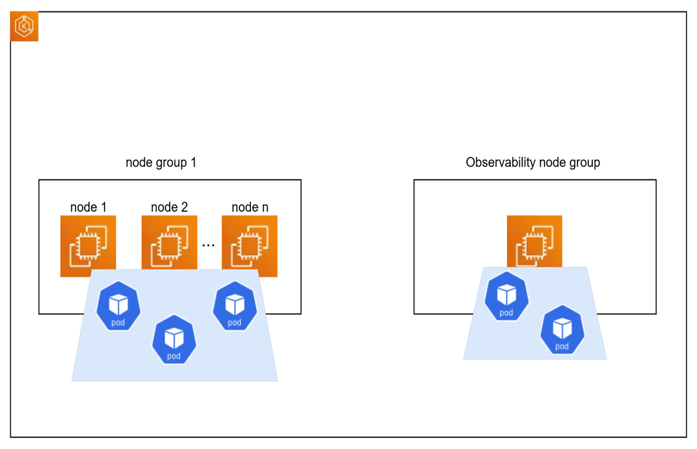
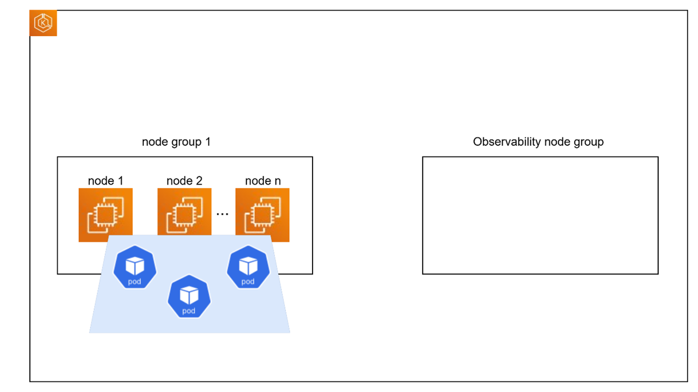

# Design Proposal: Introduce Scaling policies for EKS nodegroup

Author(s): Pankaj Goyal

Last updated: 2026-01-08

## Abstract

This document talks about introducing scaling policies for `Node Groups` in EKS ASG.
This also states the necessity of have this.

## Problem Statement

EMF cloud deployment, the EKS nodegroup size is fixed always. Sometimes there is not enough capacity left for
application pods to get deployed. Also, with proposal given in [platform-installer-simplification][emf-repo]
states that, users can have custom installer options like with/without observability, and combinations of EIM, AO & CO.
It makes sense to have dynamic scaling up/down of nodegroup size depending on some conditions.

Additionally, pod count has been seen to dynamically fluctuate in an Orchestrator, and we have observed
long-running Orchestrators deploy additional pods and hit the pod limit. When this happens, new pods will
fail to deploy, and/or existing pods that are restarted may fail to deploy. Similarly, when an upgrade from
one EMF version to another occurs, there is a need to temporarily increase the pod limit as Kubernetes will often
deploy a new version of a pod before decommissioning the old pod.

## Proposal

There are multiple scenarios that users can choose to deploy the cloud orchestrator and applications.

- `Scenario 1`: Subsystem selections with observability

  - EIM + Observability
  - EIM + CO + Observability
  - EIM + CO + AO + Observability

- `Scenario 2`: Subsystem selections without observability

  - EIM
  - EIM + CO
  - EIM + CO + AO

As can be seen in above 2 scenarios, first scenario targets combination of subsystems with observability.
So, observability node group has a node created and those applications will run on that node. And on subsystems
side, node group1 will scale its size depending on the need. If more applications need to be deployed and there
is not enough capacity left, it will spin up a new node.

In scenario 2 above, it targets combination of subsystems without observability. So, observability node group
doesn’t have any node in it.

<!-- markdownlint-disable MD060 -->
| Configuration                          | Node Group 1                                                  | Observability Node Group                  |
|----------------------------------------|---------------------------------------------------------------|-------------------------------------------|
| **EIM + AO and/or CO**                 | `eks_desired_size: 3` `eks_min_size: 1` `eks_max_size: 5` | `eks_desired_size: 0` `eks_min_size: 0` `eks_max_size: 0` |
| **EIM + AO and/or CO + observability** | `eks_desired_size: 3` `eks_min_size: 1` `eks_max_size: 5` | `eks_desired_size: 1` `eks_min_size: 1` `eks_max_size: 1` |
<!-- markdownlint-enable MD060 -->

## Scaling Policy

if ((average no of running pods on existing nodes >= eks_max_pods) && (any pod is in pending state):

- spin up a new node

## Upgrade scenario

Upgrading already running cluster with fixed node group size to dynamic node group size with scaling policies,
this needs to be tested. It might be a breaking change and upgrading might not be possible. This needs to be tested.

...

[emf-repo]: https://github.com/open-edge-platform/edge-manageability-framework/blob/main/pod-configs/module/eks/main.tf
