# EMF System Architecture - Kubernetes Pods Overview

This document provides an overview of the Kubernetes pods running in the EMF system, grouped by namespace.

## Pod Distribution by Namespace

| **Namespace** | **Pod Count** | **Functionality** |
| --------------- | --------------- | ------------------- |
| **argocd** | 6 | GitOps continuous delivery for Kubernetes application deployment and lifecycle management |
| **calico-system** | 3 | Container networking and security policy enforcement for pod-to-pod communication |
| **capi-operator-system** | 1 | Cluster API operator for managing Kubernetes cluster lifecycle automation |
| **capi-system** | 1 | Core Cluster API controller for declarative Kubernetes cluster management |
| **capk-system** | 2 | K3s bootstrap and control plane management for lightweight Kubernetes clusters |
| **capr-system** | 2 | RKE2 bootstrap and control plane management for Rancher Kubernetes clusters |
| **cattle-fleet-system** | 3 | Multi-cluster GitOps deployment and management for edge and distributed environments |
| **cert-manager** | 3 | Automated TLS certificate provisioning and renewal for cluster workloads |
| **gitea** | 3 | Self-hosted Git service for source code repository management |
| **istio-system** | 6 | Service mesh for traffic management, security, and observability of microservices |
| **kube-system** | 12 | Core Kubernetes system components including API server, scheduler, and DNS |
| **kyverno** | 9 | Policy engine for Kubernetes admission control, validation, and governance |
| **metallb-system** | 2 | Load balancer implementation for bare-metal Kubernetes clusters |
| **ns-label** | 2 | Namespace labeling automation and Istio integration initialization |
| **openebs** | 5 | Container-attached storage for persistent volumes and storage management |
| **orch-app** | 8 | Application orchestration including deployment, catalog, tenancy, and resource management |
| **orch-boots** | 2 | Bootstrap services and ingress controller for initial cluster configuration |
| **orch-cluster** | 7 | Cluster lifecycle management, connectivity gateway, and infrastructure provider integration |
| **orch-database** | 2 | PostgreSQL database cluster for persistent data storage |
| **orch-gateway** | 4 | API gateway with authentication, certificate management, and traffic routing |
| **orch-harbor** | 8 | Container image registry with security scanning and artifact management |
| **orch-iam** | 4 | Identity and access management including tenancy and API gateway |
| **orch-infra** | 63 | Infrastructure management including edge nodes, monitoring, alerts, device provisioning, and observability |
| **orch-platform** | 30 | Platform services including observability, logging, metrics, secrets management, and Keycloak identity |
| **orch-secret** | 4 | External secrets synchronization and token management for secure credential handling |
| **orch-sre** | 1 | Site reliability engineering metrics exporter for system health monitoring |
| **orch-ui** | 6 | Web-based user interfaces for admin, application, cluster, infrastructure, and root management |
| **postgresql-operator** | 1 | CloudNative-PG operator for automated PostgreSQL database management |
| **tigera-operator** | 1 | Operator for managing Calico networking and security components |

## Summary

The EMF system consists of **212 pods** across **29 namespaces**, providing comprehensive orchestration for:

- **Edge Infrastructure Management**: Device provisioning, onboarding, and maintenance
- **Application Deployment**: Multi-tenant application orchestration and lifecycle management
- **Cluster Management**: Kubernetes cluster provisioning and connectivity across distributed environments
- **Observability**: Comprehensive logging, metrics, and monitoring with Grafana, Loki, Mimir, and Prometheus
- **Security**: Policy enforcement, certificate management, secrets handling, and identity/access management
- **Networking**: Service mesh, load balancing, and traffic routing
- **Storage**: Persistent volume management and container image registry

---

## Individual Pod Details

| **Pod Name** | **Namespace** | **Functionality** |
| -------------- | --------------- | ------------------- |
| argocd-application-controller | argocd | Manages application resources and reconciles desired state with actual cluster state |
| argocd-applicationset-controller | argocd | Generates and manages multiple ArgoCD applications from templates |
| argocd-notifications-controller | argocd | Sends notifications about application deployment status and events |
| argocd-redis | argocd | Caching layer for ArgoCD configuration and application state |
| argocd-repo-server | argocd | Clones and manages Git repositories containing application manifests |
| argocd-server | argocd | API server and web UI for ArgoCD continuous delivery platform |
| calico-kube-controllers | calico-system | Watches Kubernetes API and updates Calico resources accordingly |
| calico-node | calico-system | Runs on each node to enforce network policies and provide networking |
| calico-typha | calico-system | Fanout proxy for Calico to reduce load on Kubernetes datastore |
| capi-operator-cluster-api-operator | capi-operator-system | Manages lifecycle of Cluster API providers and components |
| capi-controller-manager | capi-system | Core controller for Cluster API infrastructure management |
| capi-k3s-bootstrap-controller-manager | capk-system | Manages bootstrap configuration for K3s cluster nodes |
| capi-k3s-control-plane-controller-manager | capk-system | Manages K3s control plane lifecycle and configuration |
| rke2-bootstrap-controller-manager | capr-system | Manages bootstrap configuration for RKE2 cluster nodes |
| rke2-control-plane-controller-manager | capr-system | Manages RKE2 control plane lifecycle and configuration |
| fleet-agent | cattle-fleet-system | Executes GitOps deployments on target clusters |
| fleet-controller | cattle-fleet-system | Orchestrates multi-cluster GitOps deployments |
| gitjob | cattle-fleet-system | Executes jobs based on Git repository changes |
| cert-manager | cert-manager | Core certificate management controller |
| cert-manager-cainjector | cert-manager | Injects CA bundles into webhooks and API services |
| cert-manager-webhook | cert-manager | Validates and mutates cert-manager resources |
| trusted-workload | f6e04a77-0fb4-4950-b08b-8aa0c9bbb14a | Workload with trusted execution environment validation |
| gitea | gitea | Self-hosted Git service for repository management |
| gitea-init-edge-manageability-framework | gitea | Initialization job for edge manageability framework repositories |
| gitea-postgresql | gitea | PostgreSQL database for Gitea data persistence |
| istiod | istio-system | Istio control plane for service mesh configuration and certificate management |
| kiali | istio-system | Service mesh observability console for visualizing traffic |
| etcd | kube-system | Distributed key-value store for Kubernetes cluster state |
| helm-install-rke2-calico-crd | kube-system | Installs Calico custom resource definitions via Helm |
| helm-install-rke2-calico | kube-system | Installs Calico networking via Helm |
| helm-install-rke2-coredns | kube-system | Installs CoreDNS for cluster DNS resolution via Helm |
| helm-install-rke2-metrics-server | kube-system | Installs metrics server for resource metrics via Helm |
| helm-install-rke2-runtimeclasses | kube-system | Installs runtime class definitions via Helm |
| helm-install-rke2-snapshot-controller-crd | kube-system | Installs volume snapshot CRDs via Helm |
| kube-apiserver | kube-system | Kubernetes API server exposing cluster API |
| kube-controller-manager | kube-system | Runs core Kubernetes controllers for resource management |
| kube-proxy | kube-system | Network proxy running on each node for service networking |
| kube-scheduler | kube-system | Schedules pods to nodes based on resource requirements |
| rke2-coredns-rke2-coredns | kube-system | DNS server for service discovery within the cluster |
| rke2-coredns-rke2-coredns-autoscaler | kube-system | Auto-scales CoreDNS replicas based on cluster size |
| rke2-metrics-server | kube-system | Collects resource metrics from kubelets |
| kyverno-admission-controller | kyverno | Enforces policies during resource admission |
| kyverno-background-controller | kyverno | Applies policies to existing resources in background |
| kyverno-cleanup-controller | kyverno | Removes resources based on cleanup policies |
| kyverno-reports-controller | kyverno | Generates and manages policy compliance reports |
| metallb-controller | metallb-system | Allocates IP addresses for LoadBalancer services |
| metallb-speaker | metallb-system | Announces service IPs via ARP/BGP protocols |
| namespace-label | ns-label | Applies labels to namespaces based on policies |
| wait-istio-job | ns-label | Waits for Istio components to be ready |
| openebs-localpv-provisioner | openebs | Provisions local persistent volumes dynamically |
| openebs-ndm-cluster-exporter | openebs | Exports cluster-level storage metrics |
| openebs-ndm | openebs | Node disk manager for discovering and managing block devices |
| openebs-ndm-node-exporter | openebs | Exports node-level storage metrics |
| openebs-ndm-operator | openebs | Manages node disk manager lifecycle |
| app-deployment-api | orch-app | API for application deployment operations |
| app-deployment-manager | orch-app | Manages application deployment lifecycle |
| app-interconnect-manager | orch-app | Manages inter-application connectivity and networking |
| app-orch-catalog | orch-app | Application catalog service for available applications |
| app-orch-tenant-controller | orch-app | Manages multi-tenancy for application orchestration |
| app-resource-manager | orch-app | Manages compute and storage resources for applications |
| app-service-proxy | orch-app | Proxies application service requests |
| vnc-proxy-app-resource-manager | orch-app | VNC proxy for remote desktop access to applications |
| ingress-nginx-controller | orch-boots | NGINX ingress controller for HTTP/HTTPS routing |
| secret-wait-tls-boots | orch-boots | Waits for TLS secrets to be available during bootstrap |
| cluster-connect-gateway-controller | orch-cluster | Controls gateway connections to managed clusters |
| cluster-connect-gateway-gateway | orch-cluster | Gateway for secure connectivity to edge clusters |
| cluster-manager | orch-cluster | Manages Kubernetes cluster lifecycle and provisioning |
| cluster-manager-credentials-script | orch-cluster | Generates and manages cluster access credentials |
| cluster-manager-template-controller | orch-cluster | Manages cluster templates for consistent provisioning |
| intel-infra-provider-manager | orch-cluster | Manages Intel infrastructure provider integration |
| intel-infra-provider-southbound | orch-cluster | Southbound interface for Intel infrastructure hardware control |
| postgresql-cluster | orch-database | PostgreSQL database cluster for persistent data |
| postgresql-cluster-initdb | orch-database | Initializes PostgreSQL database cluster |
| auth-service | orch-gateway | Authentication and authorization service |
| certificate-file-server | orch-gateway | Serves certificate files for secure communications |
| secret-wait-tls-orch | orch-gateway | Waits for TLS secrets during orchestrator initialization |
| traefik | orch-gateway | Reverse proxy and load balancer for HTTP routing |
| harbor-oci-core | orch-harbor | Core service for Harbor container registry |
| harbor-oci-database | orch-harbor | PostgreSQL database for Harbor metadata |
| harbor-oci-jobservice | orch-harbor | Manages asynchronous jobs like image replication |
| harbor-oci-nginx | orch-harbor | NGINX frontend for Harbor registry |
| harbor-oci-portal | orch-harbor | Web UI portal for Harbor container registry |
| harbor-oci-redis | orch-harbor | Redis cache for Harbor session and job queue |
| harbor-oci-registry | orch-harbor | Docker registry v2 implementation for image storage |
| harbor-oci-trivy | orch-harbor | Container vulnerability scanner integration |
| nexus-api-gw | orch-iam | API gateway for identity and access management |
| tenancy-api-mapping | orch-iam | Maps API resources to tenant contexts |
| tenancy-datamodel | orch-iam | Initializes multi-tenancy data model |
| tenancy-manager | orch-iam | Manages tenant lifecycle and isolation |
| alerting-monitor | orch-infra | Prometheus server for monitoring and alerting |
| alerting-monitor-alertmanager | orch-infra | Manages and routes alerts from Prometheus |
| alerting-monitor-management | orch-infra | Management interface for alerting configuration |
| amt-dbpassword-secret-job | orch-infra | Creates database password secrets for AMT |
| amt-vault-job | orch-infra | Syncs AMT credentials with Vault |
| api | orch-infra | Infrastructure management API service |
| apiv2 | orch-infra | Version 2 of infrastructure management API |
| attestationstatusmgr | orch-infra | Manages device attestation status and validation |
| dkam | orch-infra | Device key and attestation manager |
| dm-manager | orch-infra | Device management lifecycle manager |
| edgenode-observability-grafana | orch-infra | Grafana dashboards for edge node metrics visualization |
| edgenode-observability-loki-chunks-cache | orch-infra | Caches Loki log chunks for faster queries |
| edgenode-observability-loki-gateway | orch-infra | Gateway for Loki log aggregation system |
| edgenode-observability-loki-results-cache | orch-infra | Caches Loki query results |
| edgenode-observability-mimir-compactor | orch-infra | Compacts Mimir metrics blocks for storage efficiency |
| edgenode-observability-mimir-distributor | orch-infra | Distributes incoming metrics to Mimir ingesters |
| edgenode-observability-mimir-gateway | orch-infra | Gateway for Mimir metrics system |
| edgenode-observability-mimir-ingester | orch-infra | Ingests and stores time-series metrics data |
| edgenode-observability-mimir-make-minio-buckets | orch-infra | Creates MinIO storage buckets for Mimir |
| edgenode-observability-mimir-querier | orch-infra | Queries metrics from Mimir storage |
| edgenode-observability-mimir-query-frontend | orch-infra | Frontend for Mimir query optimization and caching |
| edgenode-observability-mimir-ruler | orch-infra | Evaluates recording and alerting rules for Mimir |
| edgenode-observability-mimir-store-gateway | orch-infra | Serves metrics from long-term storage |
| edgenode-observability-minio | orch-infra | Object storage for observability data |
| edgenode-observability-opentelemetry-collector | orch-infra | Collects and processes telemetry data from edge nodes |
| exporter | orch-infra | Exports infrastructure metrics to monitoring systems |
| host-manager | orch-infra | Manages physical host lifecycle and configuration |
| init-amt-vault-job | orch-infra | Initializes Vault for AMT credential storage |
| inventory | orch-infra | Maintains inventory of infrastructure resources |
| loki-backend | orch-infra | Backend storage and processing for Loki logs |
| loki-read | orch-infra | Read path for querying Loki logs |
| loki-write | orch-infra | Write path for ingesting logs into Loki |
| maintenance-manager | orch-infra | Schedules and manages maintenance windows |
| mps | orch-infra | Intel Management Presence Server for AMT activation |
| networking-manager | orch-infra | Manages network configuration for infrastructure |
| onboarding-manager | orch-infra | Manages device onboarding and provisioning workflow |
| os-resource-manager | orch-infra | Manages operating system resources and updates |
| rps | orch-infra | Intel Remote Provisioning Server for AMT configuration |
| setup-databases-mps | orch-infra | Initializes MPS database schema |
| setup-databases-rps | orch-infra | Initializes RPS database schema |
| telemetry-manager | orch-infra | Collects and processes device telemetry data |
| tenant-controller | orch-infra | Manages tenant resources in infrastructure namespace |
| tinkerbell | orch-infra | Bare metal provisioning workflow engine |
| tinkerbell-tink-controller | orch-infra | Controller for Tinkerbell workflow execution |
| tinkerbell-tink-server | orch-infra | gRPC server for Tinkerbell provisioning |
| adm-secret | orch-platform | Creates admin secrets for platform services |
| keycloak-tenant-controller-set | orch-platform | StatefulSet for Keycloak tenant management |
| loki-backend | orch-platform | Backend storage for platform logs |
| loki-read | orch-platform | Read path for platform log queries |
| loki-write | orch-platform | Write path for platform log ingestion |
| observability-tenant-controller | orch-platform | Manages observability resources per tenant |
| orchestrator-observability-grafana | orch-platform | Grafana for orchestrator metrics visualization |
| orchestrator-observability-loki-chunks-cache | orch-platform | Caches Loki chunks for orchestrator logs |
| orchestrator-observability-loki-gateway | orch-platform | Gateway for orchestrator log aggregation |
| orchestrator-observability-loki-results-cache | orch-platform | Caches query results for orchestrator logs |
| orchestrator-observability-mimir-compactor | orch-platform | Compacts orchestrator metrics blocks |
| orchestrator-observability-mimir-distributor | orch-platform | Distributes orchestrator metrics to ingesters |
| orchestrator-observability-mimir-gateway | orch-platform | Gateway for orchestrator metrics system |
| orchestrator-observability-mimir-ingester | orch-platform | Ingests orchestrator time-series metrics |
| orchestrator-observability-mimir-make-minio-buckets | orch-platform | Creates storage buckets for orchestrator metrics |
| orchestrator-observability-mimir-querier | orch-platform | Queries orchestrator metrics from storage |
| orchestrator-observability-mimir-query-frontend | orch-platform | Frontend for orchestrator metric queries |
| orchestrator-observability-mimir-store-gateway | orch-platform | Serves orchestrator metrics from long-term storage |
| orchestrator-observability-minio | orch-platform | Object storage for orchestrator observability data |
| orchestrator-observability-opentelemetry-collector | orch-platform | Collects orchestrator telemetry data |
| orchestrator-prometheus-ag-operator | orch-platform | Operator for Prometheus agent deployment |
| orchestrator-prometheus-agent-kube-state-metrics | orch-platform | Exports Kubernetes object state metrics |
| platform-keycloak | orch-platform | Keycloak identity and access management server |
| prometheus-orchestrator-prometheus-ag-prometheus | orch-platform | Prometheus agent for orchestrator metrics collection |
| reloader-reloader | orch-platform | Automatically reloads pods when ConfigMaps/Secrets change |
| rs-proxy | orch-platform | Reverse shell proxy for remote access |
| rs-proxy-files | orch-platform | File server for reverse shell proxy |
| secrets-config | orch-platform | Configures secrets for platform services |
| vault | orch-platform | HashiCorp Vault for secrets management |
| vault-agent-injector | orch-platform | Injects Vault secrets into pods |
| external-secrets | orch-secret | Syncs secrets from external secret stores |
| external-secrets-cert-controller | orch-secret | Manages certificates for external secrets |
| external-secrets-webhook | orch-secret | Validates external secret resources |
| token-fs | orch-secret | File system service for token management |
| sre-exporter | orch-sre | Exports SRE metrics for reliability monitoring |
| metadata-broker-orch-metadata-broker | orch-ui | Metadata broker for UI backend services |
| web-ui-admin | orch-ui | Admin portal web interface |
| web-ui-app-orch | orch-ui | Application orchestration web interface |
| web-ui-cluster-orch | orch-ui | Cluster management web interface |
| web-ui-infra | orch-ui | Infrastructure management web interface |
| web-ui-root | orch-ui | Root landing page and navigation portal |
| postgresql-operator-cloudnative-pg | postgresql-operator | CloudNative-PG operator for PostgreSQL management |
| tigera-operator | tigera-operator | Manages Tigera Calico components lifecycle |

---

## EMF System Architecture

```mermaid
graph TB
    subgraph "User Interfaces"
        UI_ROOT[web-ui-root<br/>Landing Portal]
        UI_ADMIN[web-ui-admin<br/>Admin Portal]
        UI_APP[web-ui-app-orch<br/>App Management]
        UI_CLUSTER[web-ui-cluster-orch<br/>Cluster Management]
        UI_INFRA[web-ui-infra<br/>Infrastructure Management]
        UI_META[metadata-broker<br/>UI Backend]
    end

    subgraph "API Gateway & Authentication"
        TRAEFIK[traefik<br/>Reverse Proxy]
        AUTH[auth-service<br/>Authentication]
        CERT_SERVER[certificate-file-server<br/>Certificate Distribution]
        NEXUS_GW[nexus-api-gw<br/>IAM Gateway]
    end

    subgraph "Identity & Access Management"
        KEYCLOAK[platform-keycloak<br/>Identity Provider]
        TENANCY[tenancy-manager<br/>Multi-tenancy]
        VAULT[vault<br/>Secrets Management]
        VAULT_INJ[vault-agent-injector<br/>Secret Injection]
    end

    subgraph "Application Orchestration"
        APP_API[app-deployment-api<br/>Deployment API]
        APP_MGR[app-deployment-manager<br/>Lifecycle Manager]
        APP_CAT[app-orch-catalog<br/>App Catalog]
        APP_RES[app-resource-manager<br/>Resource Manager]
        APP_PROXY[app-service-proxy<br/>Service Proxy]
        VNC[vnc-proxy<br/>Remote Access]
    end

    subgraph "Cluster Management"
        CLUSTER_MGR[cluster-manager<br/>Lifecycle Manager]
        CLUSTER_GW[cluster-connect-gateway<br/>Secure Gateway]
        CAPI[capi-controller<br/>Cluster API]
        FLEET[fleet-controller<br/>Multi-cluster GitOps]
    end

    subgraph "Infrastructure Management"
        HOST_MGR[host-manager<br/>Host Lifecycle]
        ONBOARD[onboarding-manager<br/>Device Onboarding]
        INVENTORY[inventory<br/>Resource Inventory]
        MAINT[maintenance-manager<br/>Maintenance Windows]
        NET_MGR[networking-manager<br/>Network Config]
        OS_MGR[os-resource-manager<br/>OS Management]
        TINKER[tinkerbell<br/>Bare Metal Provisioning]
        MPS[mps<br/>Intel AMT Activation]
        RPS[rps<br/>Intel AMT Config]
    end

    subgraph "Observability & Monitoring"
        GRAFANA_EDGE[edgenode-observability-grafana<br/>Edge Metrics Dashboards]
        GRAFANA_ORCH[orchestrator-observability-grafana<br/>Orchestrator Dashboards]
        PROMETHEUS[prometheus<br/>Metrics Collection]
        ALERTMGR[alertmanager<br/>Alert Routing]
        LOKI[loki<br/>Log Aggregation]
        MIMIR[mimir<br/>Time-Series DB]
        OTEL[opentelemetry-collector<br/>Telemetry Collection]
        TELEMETRY[telemetry-manager<br/>Device Telemetry]
    end

    subgraph "GitOps & CD"
        ARGOCD[argocd-server<br/>GitOps Platform]
        ARGOCD_REPO[argocd-repo-server<br/>Git Repository Manager]
        GITEA[gitea<br/>Git Service]
    end

    subgraph "Container Registry"
        HARBOR[harbor-oci-core<br/>Registry Core]
        HARBOR_UI[harbor-oci-portal<br/>Registry UI]
        TRIVY[harbor-oci-trivy<br/>Security Scanner]
    end

    subgraph "Service Mesh & Networking"
        ISTIO[istiod<br/>Service Mesh Control Plane]
        KIALI[kiali<br/>Service Mesh Console]
        CALICO[calico<br/>Network Policy & CNI]
        METALLB[metallb<br/>Load Balancer]
        INGRESS[ingress-nginx<br/>Ingress Controller]
    end

    subgraph "Policy & Security"
        KYVERNO[kyverno<br/>Policy Engine]
        CERT_MGR[cert-manager<br/>Certificate Management]
        EXT_SECRET[external-secrets<br/>Secret Sync]
        ATTEST[attestationstatusmgr<br/>Device Attestation]
    end

    subgraph "Storage & Databases"
        POSTGRES_MAIN[postgresql-cluster<br/>Main Database]
        POSTGRES_HARBOR[harbor-oci-database<br/>Harbor DB]
        POSTGRES_GITEA[gitea-postgresql<br/>Gitea DB]
        OPENEBS[openebs<br/>Storage Management]
        MINIO[minio<br/>Object Storage]
    end

    subgraph "Core Kubernetes"
        K8S_API[kube-apiserver<br/>API Server]
        K8S_SCHED[kube-scheduler<br/>Scheduler]
        K8S_CTL[kube-controller-manager<br/>Controllers]
        ETCD[etcd<br/>Cluster State]
        COREDNS[coredns<br/>DNS]
    end

    %% User Interface Connections
    UI_ROOT --> TRAEFIK
    UI_ADMIN --> TRAEFIK
    UI_APP --> TRAEFIK
    UI_CLUSTER --> TRAEFIK
    UI_INFRA --> TRAEFIK
    UI_META --> TRAEFIK

    %% Gateway Connections
    TRAEFIK --> AUTH
    TRAEFIK --> APP_API
    TRAEFIK --> CLUSTER_MGR
    AUTH --> KEYCLOAK
    AUTH --> NEXUS_GW

    %% IAM Connections
    KEYCLOAK --> TENANCY
    KEYCLOAK --> POSTGRES_MAIN
    VAULT --> POSTGRES_MAIN
    VAULT_INJ --> VAULT

    %% Application Layer
    APP_API --> APP_MGR
    APP_MGR --> APP_RES
    APP_MGR --> APP_CAT
    APP_API --> K8S_API

    %% Cluster Management
    CLUSTER_MGR --> CAPI
    CLUSTER_MGR --> FLEET
    CLUSTER_GW --> CLUSTER_MGR
    FLEET --> ARGOCD

    %% Infrastructure Layer
    ONBOARD --> HOST_MGR
    ONBOARD --> INVENTORY
    HOST_MGR --> TINKER
    TINKER --> MPS
    TINKER --> RPS
    NET_MGR --> CALICO
    OS_MGR --> INVENTORY

    %% Observability Flow
    OTEL --> MIMIR
    OTEL --> LOKI
    PROMETHEUS --> MIMIR
    PROMETHEUS --> ALERTMGR
    TELEMETRY --> PROMETHEUS
    GRAFANA_EDGE --> MIMIR
    GRAFANA_EDGE --> LOKI
    GRAFANA_ORCH --> MIMIR
    GRAFANA_ORCH --> LOKI

    %% GitOps Flow
    ARGOCD --> ARGOCD_REPO
    ARGOCD_REPO --> GITEA
    ARGOCD --> K8S_API
    FLEET --> GITEA

    %% Registry Flow
    HARBOR --> HARBOR_UI
    HARBOR --> TRIVY
    APP_MGR --> HARBOR

    %% Service Mesh
    ISTIO --> CALICO
    KIALI --> ISTIO
    INGRESS --> ISTIO

    %% Security & Policy
    KYVERNO --> K8S_API
    CERT_MGR --> VAULT
    EXT_SECRET --> VAULT
    ATTEST --> ONBOARD

    %% Storage Connections
    OPENEBS --> K8S_API
    MINIO --> LOKI
    MINIO --> MIMIR
    POSTGRES_MAIN --> OPENEBS
    POSTGRES_HARBOR --> OPENEBS
    POSTGRES_GITEA --> OPENEBS

    %% Kubernetes Core
    K8S_API --> ETCD
    K8S_SCHED --> K8S_API
    K8S_CTL --> K8S_API
    COREDNS --> K8S_API

    style UI_ROOT fill:#e1f5ff
    style UI_ADMIN fill:#e1f5ff
    style UI_APP fill:#e1f5ff
    style UI_CLUSTER fill:#e1f5ff
    style UI_INFRA fill:#e1f5ff
    
    style TRAEFIK fill:#fff3e0
    style AUTH fill:#fff3e0
    
    style KEYCLOAK fill:#f3e5f5
    style VAULT fill:#f3e5f5
    
    style APP_MGR fill:#e8f5e9
    style CLUSTER_MGR fill:#e8f5e9
    
    style PROMETHEUS fill:#fff9c4
    style GRAFANA_EDGE fill:#fff9c4
    style GRAFANA_ORCH fill:#fff9c4
    
    style K8S_API fill:#ffebee
    style ETCD fill:#ffebee
```



### Architecture Overview

The EMF system follows a **layered architecture** with clear separation of concerns:

#### **1. User Interface Layer** (orch-ui namespace)

- Five specialized web interfaces for different management functions
- Unified metadata broker for backend communication
- All traffic routes through the API gateway

#### **2. Gateway & Security Layer** (orch-gateway, orch-iam namespaces)

- Traefik reverse proxy for HTTP routing and load balancing
- Centralized authentication and authorization via Keycloak
- Certificate management and TLS termination
- Multi-tenancy support with tenant isolation

#### **3. Application Management Layer** (orch-app namespace)

- Complete application lifecycle management (deploy, scale, update)
- Application catalog for available services
- Resource allocation and management
- VNC proxy for remote desktop access to applications

#### **4. Cluster Management Layer** (orch-cluster namespace)

- Kubernetes cluster provisioning and lifecycle management
- Secure connectivity gateway to edge clusters
- Multi-cluster GitOps deployment via Fleet
- Cluster API integration for declarative cluster management

#### **5. Infrastructure Management Layer** (orch-infra namespace)

- Device onboarding and provisioning workflow
- Bare metal provisioning via Tinkerbell
- Intel AMT out-of-band management (MPS/RPS)
- Host, network, and OS resource management
- Device attestation and security validation

#### **6. Observability Layer** (orch-infra, orch-platform namespaces)

- Dual observability stacks (edge nodes + orchestrator)
- Prometheus for metrics collection and alerting
- Loki for log aggregation and querying
- Mimir for long-term metrics storage
- Grafana dashboards for visualization
- OpenTelemetry for distributed tracing

#### **7. GitOps & CI/CD Layer** (argocd, gitea namespaces)

- ArgoCD for continuous delivery
- Gitea for Git repository hosting
- Fleet for multi-cluster deployment orchestration
- Automated application deployment from Git

#### **8. Container Registry Layer** (orch-harbor namespace)

- Harbor for private container image storage
- Integrated Trivy security scanning
- Image replication and artifact management

#### **9. Service Mesh & Networking** (istio-system, calico-system namespaces)

- Istio service mesh for traffic management
- Calico for network policies and CNI
- MetalLB for bare-metal load balancing
- NGINX ingress for HTTP routing

#### **10. Policy & Security** (kyverno, cert-manager namespaces)

- Kyverno for admission control and policy enforcement
- cert-manager for automated certificate provisioning
- External secrets synchronization
- Device attestation validation

#### **11. Data Layer** (orch-database, orch-platform namespaces)

- PostgreSQL clusters for persistent data
- OpenEBS for container-native storage
- MinIO for object storage (logs, metrics, backups)

#### **12. Kubernetes Foundation** (kube-system namespace)

- Core Kubernetes control plane components
- etcd for cluster state storage
- CoreDNS for service discovery
- Scheduler and controller manager

---

## Architecture Diagrams

### Visual Architecture Diagram

A detailed SVG architecture diagram


## Data Source

### Pods

Pod information extracted from onprem-system November 17, 2025.

```bash
NAMESPACE                              NAME                                                              READY   STATUS             RESTARTS          AGE
argocd                                 argocd-application-controller-0                                   1/1     Running            0                 14d
argocd                                 argocd-applicationset-controller-564dcdbf7f-2fwxx                 1/1     Running            0                 14d
argocd                                 argocd-notifications-controller-684c5b7665-9vn56                  1/1     Running            0                 14d
argocd                                 argocd-redis-76b79b79f6-vnsq2                                     1/1     Running            0                 14d
argocd                                 argocd-repo-server-5b6d495f4f-4n2x6                               1/1     Running            0                 14d
argocd                                 argocd-server-5f89bf77c9-74tmf                                    1/1     Running            0                 14d
calico-system                          calico-kube-controllers-6c4bb7c5b-5mb47                           1/1     Running            0                 14d
calico-system                          calico-node-6pk9b                                                 1/1     Running            0                 14d
calico-system                          calico-typha-86684976d8-5vzr6                                     1/1     Running            0                 14d
capi-operator-system                   capi-operator-cluster-api-operator-6474ccf674-7mj5h               1/1     Running            0                 14d
capi-system                            capi-controller-manager-557f4b7dbb-hwjtf                          2/2     Running            0                 14d
capk-system                            capi-k3s-bootstrap-controller-manager-757d4649c9-jsskr            3/3     Running            0                 14d
capk-system                            capi-k3s-control-plane-controller-manager-fd94899d-cfbkm          3/3     Running            0                 14d
capr-system                            rke2-bootstrap-controller-manager-7bd7d7d88c-nff2n                2/2     Running            0                 14d
capr-system                            rke2-control-plane-controller-manager-6c9568c995-v64hx            2/2     Running            0                 114s
cattle-fleet-system                    fleet-agent-85d5d44fd8-mllpk                                      1/1     Running            0                 14d
cattle-fleet-system                    fleet-controller-fb89c6765-h6rx9                                  3/3     Running            0                 14d
cattle-fleet-system                    gitjob-84546697df-57mpd                                           1/1     Running            0                 14d
cert-manager                           cert-manager-69845dbfb8-xmwgz                                     1/1     Running            0                 14d
cert-manager                           cert-manager-cainjector-6d78f455b4-s2s42                          1/1     Running            0                 14d
cert-manager                           cert-manager-webhook-6fbcf44649-gjq9l                             1/1     Running            0                 14d
f6e04a77-0fb4-4950-b08b-8aa0c9bbb14a   trusted-workload-fbd4ef08-f37d-42ba-9ba5-8f8577bf21da-6323qp2rc   0/1     Init:Error         0                 7d11h
gitea                                  gitea-78dc887985-cghcq                                            1/1     Running            0                 14d
gitea                                  gitea-init-edge-manageability-framework-2tbnj                     0/1     Completed          0                 14d
gitea                                  gitea-postgresql-0                                                1/1     Running            0                 14d
istio-system                           istiod-6bb9b66584-5d4pr                                           1/1     Running            0                 14d
istio-system                           istiod-6bb9b66584-d7c2d                                           1/1     Running            0                 14d
istio-system                           istiod-6bb9b66584-rfkkx                                           1/1     Running            0                 14d
istio-system                           istiod-6bb9b66584-tk2nh                                           1/1     Running            0                 14d
istio-system                           istiod-6bb9b66584-zjvf8                                           1/1     Running            0                 14d
istio-system                           kiali-89c5f8f7c-msqs6                                             1/1     Running            0                 14d
kube-system                            etcd-esi136                                                       1/1     Running            0                 14d
kube-system                            helm-install-rke2-calico-crd-kxk22                                0/1     Completed          0                 14d
kube-system                            helm-install-rke2-calico-m2bdq                                    0/1     Completed          2                 14d
kube-system                            helm-install-rke2-coredns-pb5sd                                   0/1     Completed          0                 14d
kube-system                            helm-install-rke2-metrics-server-pq9qt                            0/1     Completed          0                 14d
kube-system                            helm-install-rke2-runtimeclasses-z6bfs                            0/1     Completed          0                 14d
kube-system                            helm-install-rke2-snapshot-controller-crd-92p2l                   0/1     Completed          0                 14d
kube-system                            kube-apiserver-esi136                                             1/1     Running            0                 14d
kube-system                            kube-controller-manager-esi136                                    1/1     Running            0                 14d
kube-system                            kube-proxy-esi136                                                 0/1     CrashLoopBackOff   4244 (3m3s ago)   14d
kube-system                            kube-scheduler-esi136                                             1/1     Running            0                 14d
kube-system                            rke2-coredns-rke2-coredns-74cf8ffff9-28t6g                        1/1     Running            0                 14d
kube-system                            rke2-coredns-rke2-coredns-autoscaler-54d9db4d7f-tfx2l             1/1     Running            0                 14d
kube-system                            rke2-metrics-server-6b956496d6-fnphk                              1/1     Running            0                 14d
kyverno                                kyverno-admission-controller-67ffbcd98f-cgmz8                     1/1     Running            0                 14d
kyverno                                kyverno-admission-controller-67ffbcd98f-rht6z                     1/1     Running            0                 14d
kyverno                                kyverno-admission-controller-67ffbcd98f-vz7lx                     1/1     Running            0                 14d
kyverno                                kyverno-background-controller-5f5f85764b-5bgfg                    1/1     Running            0                 14d
kyverno                                kyverno-background-controller-5f5f85764b-pbkq8                    1/1     Running            0                 14d
kyverno                                kyverno-cleanup-controller-779b54bcd7-4mm5k                       1/1     Running            0                 14d
kyverno                                kyverno-cleanup-controller-779b54bcd7-vtzzl                       1/1     Running            0                 14d
kyverno                                kyverno-reports-controller-7d46464b7f-69jfq                       1/1     Running            0                 14d
kyverno                                kyverno-reports-controller-7d46464b7f-dtq9n                       1/1     Running            0                 14d
metallb-system                         metallb-controller-78f7f649b6-tbqvx                               1/1     Running            0                 14d
metallb-system                         metallb-speaker-7vt4v                                             1/1     Running            0                 14d
ns-label                               namespace-label-78321e26-bkmnv                                    0/1     Completed          0                 14d
ns-label                               wait-istio-job-77372bdf-6fscv                                     0/1     Completed          0                 14d
openebs                                openebs-localpv-provisioner-5457467df4-f46kq                      1/1     Running            0                 14d
openebs                                openebs-ndm-cluster-exporter-6679596779-5fqlr                     1/1     Running            0                 14d
openebs                                openebs-ndm-k55n9                                                 1/1     Running            0                 14d
openebs                                openebs-ndm-node-exporter-ww7vq                                   1/1     Running            0                 14d
openebs                                openebs-ndm-operator-74dd46fd6c-jrdj2                             1/1     Running            0                 14d
orch-app                               app-deployment-api-75697b9448-gs2zj                               4/4     Running            0                 14d
orch-app                               app-deployment-manager-6cd7c88544-fr44d                           2/2     Running            0                 14d
orch-app                               app-interconnect-manager-6fdcf99985-wtsfw                         2/2     Running            0                 14d
orch-app                               app-orch-catalog-7576bbb54f-2d7j9                                 4/4     Running            0                 14d
orch-app                               app-orch-tenant-controller-7757466bf6-h5t97                       2/2     Running            0                 14d
orch-app                               app-resource-manager-54b755956c-qx8gs                             4/4     Running            0                 14d
orch-app                               app-service-proxy-7694f5c8cd-86m2q                                3/3     Running            0                 14d
orch-app                               vnc-proxy-app-resource-manager-5fdb45fb6f-q8gkj                   3/3     Running            0                 14d
orch-boots                             ingress-nginx-controller-75d45bb559-4k7q6                         2/2     Running            0                 14d
orch-boots                             secret-wait-tls-boots-f65c8d0352-wtv9f                            0/1     Completed          0                 14d
orch-cluster                           cluster-connect-gateway-controller-fcd95c85f-x568h                2/2     Running            0                 14d
orch-cluster                           cluster-connect-gateway-gateway-65d6f54647-qsz85                  3/3     Running            0                 14d
orch-cluster                           cluster-manager-7b8bf55699-9ljn7                                  3/3     Running            0                 14d
orch-cluster                           cluster-manager-credentials-script-n9jff                          0/2     Completed          0                 168m
orch-cluster                           cluster-manager-template-controller-5755877d76-jpf5b              2/2     Running            1 (7d13h ago)     14d
orch-cluster                           intel-infra-provider-manager-7878fd9887-tsksb                     2/2     Running            0                 14d
orch-cluster                           intel-infra-provider-southbound-78b5bc9477-rcrhl                  2/2     Running            0                 14d
orch-database                          postgresql-cluster-1                                              2/2     Running            0                 14d
orch-database                          postgresql-cluster-1-initdb-jvr9q                                 0/1     Completed          0                 14d
orch-gateway                           auth-service-6b6b567c88-jj9kz                                     2/2     Running            0                 14d
orch-gateway                           certificate-file-server-56ccf76584-qp5zz                          2/2     Running            0                 14d
orch-gateway                           secret-wait-tls-orch-f65c8d0352-9vg4h                             0/1     Completed          0                 14d
orch-gateway                           traefik-ff856c695-77wlk                                           2/2     Running            0                 14d
orch-harbor                            harbor-oci-core-74c98bf58f-rrk7f                                  2/2     Running            2 (14d ago)       14d
orch-harbor                            harbor-oci-database-0                                             2/2     Running            0                 14d
orch-harbor                            harbor-oci-jobservice-64cb69dd74-tp68b                            2/2     Running            3 (14d ago)       14d
orch-harbor                            harbor-oci-nginx-7bc65786bf-p7b4m                                 2/2     Running            0                 14d
orch-harbor                            harbor-oci-portal-59b588f7b-ttrk8                                 2/2     Running            0                 14d
orch-harbor                            harbor-oci-redis-0                                                2/2     Running            0                 14d
orch-harbor                            harbor-oci-registry-9cb77f894-q97x7                               3/3     Running            0                 14d
orch-harbor                            harbor-oci-trivy-0                                                2/2     Running            0                 14d
orch-iam                               nexus-api-gw-c87ddfc69-gpdll                                      2/2     Running            0                 14d
orch-iam                               tenancy-api-mapping-d5tkz                                         0/1     Completed          0                 36s
orch-iam                               tenancy-datamodel-dxqhh                                           0/1     Completed          0                 9m3s
orch-iam                               tenancy-manager-6b8f6bcb66-cg7ch                                  2/2     Running            0                 14d
orch-infra                             alerting-monitor-548ffd4799-6h52g                                 3/3     Running            0                 14d
orch-infra                             alerting-monitor-548ffd4799-pdmcp                                 3/3     Running            0                 14d
orch-infra                             alerting-monitor-548ffd4799-sc9rx                                 3/3     Running            0                 14d
orch-infra                             alerting-monitor-548ffd4799-sgt7h                                 3/3     Running            0                 14d
orch-infra                             alerting-monitor-548ffd4799-vwqx8                                 3/3     Running            0                 14d
orch-infra                             alerting-monitor-alertmanager-0                                   3/3     Running            0                 14d
orch-infra                             alerting-monitor-alertmanager-1                                   3/3     Running            0                 14d
orch-infra                             alerting-monitor-management-dd8bbd7b7-v6jpx                       2/2     Running            0                 14d
orch-infra                             amt-dbpassword-secret-job-jlwjx                                   0/1     Completed          0                 14d
orch-infra                             amt-vault-job-29390150-qspzg                                      0/1     Completed          0                 67m
orch-infra                             amt-vault-job-29390160-rj44j                                      0/1     Completed          0                 57m
orch-infra                             amt-vault-job-29390210-fmqgm                                      0/1     Completed          0                 7m47s
orch-infra                             api-9cc4b7b6d-nhgmm                                               2/2     Running            2 (14d ago)       14d
orch-infra                             apiv2-5b48cf487d-gsr99                                            3/3     Running            2 (14d ago)       14d
orch-infra                             attestationstatusmgr-6794c6b684-vcrhf                             2/2     Running            0                 14d
orch-infra                             dkam-5fcd8c86-54xgb                                               2/2     Running            0                 14d
orch-infra                             dm-manager-748f89cb95-955qn                                       2/2     Running            3 (14d ago)       14d
orch-infra                             edgenode-observability-grafana-7c9bbb475-zs6wz                    4/4     Running            0                 14d
orch-infra                             edgenode-observability-loki-chunks-cache-0                        3/3     Running            0                 14d
orch-infra                             edgenode-observability-loki-gateway-59659fd947-cvcnk              2/2     Running            0                 14d
orch-infra                             edgenode-observability-loki-results-cache-0                       3/3     Running            0                 14d
orch-infra                             edgenode-observability-mimir-compactor-0                          2/2     Running            0                 14d
orch-infra                             edgenode-observability-mimir-distributor-67664fddd7-97vzb         2/2     Running            0                 14d
orch-infra                             edgenode-observability-mimir-gateway-5c6975c988-zpzk2             2/2     Running            0                 14d
orch-infra                             edgenode-observability-mimir-ingester-0                           2/2     Running            0                 14d
orch-infra                             edgenode-observability-mimir-ingester-1                           2/2     Running            0                 14d
orch-infra                             edgenode-observability-mimir-make-minio-buckets-5.4.0-x472z       0/1     Completed          0                 14d
orch-infra                             edgenode-observability-mimir-querier-86744cddf8-4sjjh             2/2     Running            0                 14d
orch-infra                             edgenode-observability-mimir-querier-86744cddf8-d9bn9             2/2     Running            0                 14d
orch-infra                             edgenode-observability-mimir-querier-86744cddf8-zpsf5             2/2     Running            0                 14d
orch-infra                             edgenode-observability-mimir-query-frontend-6c9796b48f-rkpkq      2/2     Running            0                 14d
orch-infra                             edgenode-observability-mimir-ruler-65d6554487-4zrd6               2/2     Running            0                 14d
orch-infra                             edgenode-observability-mimir-ruler-65d6554487-7kfj2               2/2     Running            0                 14d
orch-infra                             edgenode-observability-mimir-store-gateway-0                      2/2     Running            0                 14d
orch-infra                             edgenode-observability-minio-85b6f89577-vgs49                     2/2     Running            0                 14d
orch-infra                             edgenode-observability-opentelemetry-collector-7c6db5bf4c-28nq7   2/2     Running            0                 14d
orch-infra                             exporter-67b6b75d86-njckk                                         2/2     Running            2 (14d ago)       14d
orch-infra                             host-manager-9c5b75f8c-sph2m                                      2/2     Running            0                 14d
orch-infra                             init-amt-vault-job-97dvk                                          0/1     Completed          0                 14d
orch-infra                             inventory-5666f8b8ff-pc64p                                        2/2     Running            0                 14d
orch-infra                             loki-backend-0                                                    3/3     Running            2 (14d ago)       14d
orch-infra                             loki-backend-1                                                    3/3     Running            2 (14d ago)       14d
orch-infra                             loki-backend-2                                                    3/3     Running            2 (14d ago)       14d
orch-infra                             loki-read-5884cf78cf-6g5ns                                        2/2     Running            0                 14d
orch-infra                             loki-read-5884cf78cf-dqjs2                                        2/2     Running            0                 14d
orch-infra                             loki-read-5884cf78cf-w5qh9                                        2/2     Running            0                 14d
orch-infra                             loki-write-0                                                      2/2     Running            0                 14d
orch-infra                             loki-write-1                                                      2/2     Running            0                 14d
orch-infra                             loki-write-2                                                      2/2     Running            0                 14d
orch-infra                             maintenance-manager-5874d84df5-hk4f9                              2/2     Running            0                 14d
orch-infra                             mps-7dbf78548c-xc6x5                                              2/2     Running            0                 7m46s
orch-infra                             networking-manager-5d95998bdf-xjr9l                               2/2     Running            0                 14d
orch-infra                             onboarding-manager-56cd74cd95-ngqcb                               2/2     Running            0                 14d
orch-infra                             os-resource-manager-b8cfd7975-z8ghf                               2/2     Running            0                 14d
orch-infra                             rps-5c8bd9bb45-2h5zg                                              2/2     Running            0                 7m47s
orch-infra                             setup-databases-mps-h659h                                         0/1     Completed          0                 14d
orch-infra                             setup-databases-rps-hh5xr                                         0/1     Completed          0                 14d
orch-infra                             telemetry-manager-6dbb787574-r8ccd                                2/2     Running            0                 14d
orch-infra                             tenant-controller-6c789df797-r9pms                                2/2     Running            2 (14d ago)       14d
orch-infra                             tinkerbell-8495bbb554-mfxgp                                       2/2     Running            0                 14d
orch-infra                             tinkerbell-tink-controller-867b9b9f44-rnpzh                       2/2     Running            0                 14d
orch-infra                             tinkerbell-tink-server-6d545d5fb6-c5glw                           2/2     Running            0                 14d
orch-platform                          adm-secret-e729a3776d-r7g6b                                       0/1     Completed          0                 14d
orch-platform                          keycloak-tenant-controller-set-0                                  2/2     Running            0                 14d
orch-platform                          loki-backend-0                                                    3/3     Running            2 (14d ago)       14d
orch-platform                          loki-backend-1                                                    3/3     Running            2 (14d ago)       14d
orch-platform                          loki-backend-2                                                    3/3     Running            2 (14d ago)       14d
orch-platform                          loki-read-547bbf84dd-cwdcc                                        2/2     Running            0                 14d
orch-platform                          loki-read-547bbf84dd-hn5vc                                        2/2     Running            0                 14d
orch-platform                          loki-read-547bbf84dd-rdrc9                                        2/2     Running            0                 14d
orch-platform                          loki-write-0                                                      2/2     Running            0                 14d
orch-platform                          loki-write-1                                                      2/2     Running            0                 14d
orch-platform                          observability-tenant-controller-c5b65cb6b-blwnf                   2/2     Running            0                 14d
orch-platform                          orchestrator-observability-grafana-7898b4b5bc-wpvdw               4/4     Running            0                 14d
orch-platform                          orchestrator-observability-loki-chunks-cache-0                    3/3     Running            0                 14d
orch-platform                          orchestrator-observability-loki-gateway-6dd9f67b65-zxc8l          2/2     Running            0                 14d
orch-platform                          orchestrator-observability-loki-results-cache-0                   3/3     Running            0                 14d
orch-platform                          orchestrator-observability-mimir-compactor-0                      2/2     Running            0                 14d
orch-platform                          orchestrator-observability-mimir-distributor-6b94446776-dswsl     2/2     Running            0                 14d
orch-platform                          orchestrator-observability-mimir-gateway-fd49674c7-cc9dj          2/2     Running            0                 14d
orch-platform                          orchestrator-observability-mimir-ingester-0                       2/2     Running            0                 14d
orch-platform                          orchestrator-observability-mimir-ingester-1                       2/2     Running            0                 14d
orch-platform                          orchestrator-observability-mimir-make-minio-buckets-5.4.0-c4ttb   0/1     Completed          0                 14d
orch-platform                          orchestrator-observability-mimir-querier-546987bcd4-nmx5r         2/2     Running            0                 14d
orch-platform                          orchestrator-observability-mimir-query-frontend-7d4459db65xk827   2/2     Running            0                 14d
orch-platform                          orchestrator-observability-mimir-store-gateway-0                  2/2     Running            0                 14d
orch-platform                          orchestrator-observability-minio-74466d8fcb-tpnlh                 2/2     Running            0                 14d
orch-platform                          orchestrator-observability-opentelemetry-collector-6f97f76hwpj8   2/2     Running            0                 14d
orch-platform                          orchestrator-observability-opentelemetry-collector-daemonswvlpg   2/2     Running            0                 14d
orch-platform                          orchestrator-prometheus-ag-operator-7c6fc64956-jpbwr              2/2     Running            0                 14d
orch-platform                          orchestrator-prometheus-agent-kube-state-metrics-5564859474mg6w   2/2     Running            0                 14d
orch-platform                          platform-keycloak-0                                               2/2     Running            1 (14d ago)       14d
orch-platform                          prometheus-orchestrator-prometheus-ag-prometheus-0                3/3     Running            0                 14d
orch-platform                          reloader-reloader-7b794c4485-kqpxn                                1/1     Running            0                 14d
orch-platform                          rs-proxy-59b7bdbdc8-r9vhd                                         2/2     Running            1 (7d13h ago)     14d
orch-platform                          rs-proxy-files-8d48bc57-frqtm                                     2/2     Running            4 (5d13h ago)     14d
orch-platform                          secrets-config-xdel4fd0-xxdjg                                     0/2     Completed          0                 48m
orch-platform                          vault-0                                                           2/2     Running            0                 14d
orch-platform                          vault-agent-injector-58447dfdcc-cv5cz                             2/2     Running            0                 14d
orch-secret                            external-secrets-5bbf6c7cc4-n9jh4                                 1/1     Running            0                 14d
orch-secret                            external-secrets-cert-controller-76f7b6fd98-w6swj                 1/1     Running            0                 14d
orch-secret                            external-secrets-webhook-59cd66f8c9-7wf5s                         1/1     Running            0                 14d
orch-secret                            token-fs-8459869b97-jd67n                                         2/2     Running            0                 14d
orch-sre                               sre-exporter-5ddcbc9b9d-pfrmc                                     4/4     Running            0                 14d
orch-ui                                metadata-broker-orch-metadata-broker-679947fb5b-5mtjb             3/3     Running            0                 14d
orch-ui                                web-ui-admin-6d9dc6dcf4-95sdh                                     2/2     Running            0                 14d
orch-ui                                web-ui-app-orch-856875859-44tql                                   2/2     Running            0                 14d
orch-ui                                web-ui-cluster-orch-8cbc88864-rzk5z                               2/2     Running            0                 14d
orch-ui                                web-ui-infra-5698fdf8fb-9wrbd                                     2/2     Running            0                 14d
orch-ui                                web-ui-root-66c7db4cd4-6pcfh                                      2/2     Running            0                 14d
postgresql-operator                    postgresql-operator-cloudnative-pg-fb96fb68c-t67w4                1/1     Running            0                 14d
tigera-operator                        tigera-operator-69786c6bb8-qp6jq                                  1/1     Running            0                 14d
```

### Applications

```bash
NAMESPACE   NAME                               SYNC STATUS   HEALTH STATUS
onprem      alerting-monitor                   Synced        Healthy
onprem      app-deployment-crd                 Synced        Healthy
onprem      app-deployment-manager             Synced        Healthy
onprem      app-deployment-manager-secret      Synced        Healthy
onprem      app-interconnect-manager           Synced        Healthy
onprem      app-orch-catalog                   Synced        Healthy
onprem      app-orch-tenant-controller         Synced        Healthy
onprem      app-resource-manager               Synced        Healthy
onprem      app-service-proxy                  Synced        Healthy
onprem      auth-service                       Synced        Healthy
onprem      capi-operator                      Synced        Healthy
onprem      capi-operator-pre                  Synced        Healthy
onprem      capi-providers-config              Synced        Healthy
onprem      cert-manager                       Synced        Healthy
onprem      certificate-file-server            Synced        Healthy
onprem      cluster-connect-gateway            Synced        Healthy
onprem      cluster-manager                    Synced        Healthy
onprem      copy-app-gitea-cred-to-fleet       Synced        Healthy
onprem      copy-ca-cert-boots-to-gateway      Synced        Healthy
onprem      copy-ca-cert-boots-to-infra        Synced        Healthy
onprem      copy-ca-cert-gateway-to-cattle     Synced        Healthy
onprem      copy-ca-cert-gateway-to-infra      Synced        Healthy
onprem      copy-ca-cert-gitea-to-app          Synced        Healthy
onprem      copy-ca-cert-gitea-to-cluster      Synced        Healthy
onprem      copy-cluster-gitea-cred-to-fleet   Synced        Healthy
onprem      copy-keycloak-admin-to-infra       Synced        Healthy
onprem      edgenode-dashboards                Synced        Healthy
onprem      edgenode-observability             Synced        Healthy
onprem      external-secrets                   Synced        Healthy
onprem      fleet-controller                   Synced        Healthy
onprem      fleet-crd                          Synced        Healthy
onprem      fleet-rs-secret                    Synced        Healthy
onprem      harbor-oci                         Synced        Healthy
onprem      infra-core                         Synced        Healthy
onprem      infra-external                     Synced        Healthy
onprem      infra-managers                     Synced        Healthy
onprem      infra-onboarding                   Synced        Healthy
onprem      ingress-nginx                      Synced        Healthy
onprem      intel-infra-provider               Synced        Healthy
onprem      istio-base                         Synced        Healthy
onprem      istio-policy                       Synced        Healthy
onprem      istiod                             Synced        Healthy
onprem      keycloak-tenant-controller         Synced        Healthy
onprem      kiali                              Synced        Healthy
onprem      kyverno                            Synced        Healthy
onprem      kyverno-extra-policies             Synced        Healthy
onprem      kyverno-istio-policy               Synced        Healthy
onprem      kyverno-traefik-policy             Synced        Healthy
onprem      metadata-broker                    Synced        Healthy
onprem      metallb                            Synced        Healthy
onprem      metallb-config                     Synced        Healthy
onprem      namespace-label                    Synced        Healthy
onprem      nexus-api-gw                       Synced        Healthy
onprem      nginx-ingress-pxe-boots            Synced        Healthy
onprem      observability-tenant-controller    Synced        Healthy
onprem      orchestrator-dashboards            Synced        Healthy
onprem      orchestrator-observability         Synced        Healthy
onprem      orchestrator-prometheus-agent      Synced        Healthy
onprem      platform-autocert                  Synced        Healthy
onprem      platform-keycloak                  Synced        Healthy
onprem      postgresql-cluster                 Synced        Healthy
onprem      postgresql-operator                Synced        Healthy
onprem      postgresql-secrets                 Synced        Healthy
onprem      prometheus-crd                     Synced        Healthy
onprem      reloader                           Synced        Healthy
onprem      root-app                           Synced        Healthy
onprem      rs-proxy                           Synced        Healthy
onprem      secret-wait-tls-boots              Synced        Healthy
onprem      secret-wait-tls-orch               Synced        Healthy
onprem      secrets-config                     Synced        Healthy
onprem      self-signed-cert                   Synced        Healthy
onprem      sre-exporter                       Synced        Healthy
onprem      tenancy-api-mapping                Synced        Healthy
onprem      tenancy-datamodel                  Synced        Healthy
onprem      tenancy-manager                    Synced        Healthy
onprem      token-fs                           Synced        Healthy
onprem      traefik                            Synced        Healthy
onprem      traefik-extra-objects              Synced        Healthy
onprem      traefik-pre                        Synced        Healthy
onprem      vault                              Synced        Healthy
onprem      wait-istio-job                     Synced        Healthy
onprem      web-ui-admin                       Synced        Healthy
onprem      web-ui-app-orch                    Synced        Healthy
onprem      web-ui-cluster-orch                Synced        Healthy
onprem      web-ui-infra                       Synced        Healthy
onprem      web-ui-root                        Synced        Healthy
```
