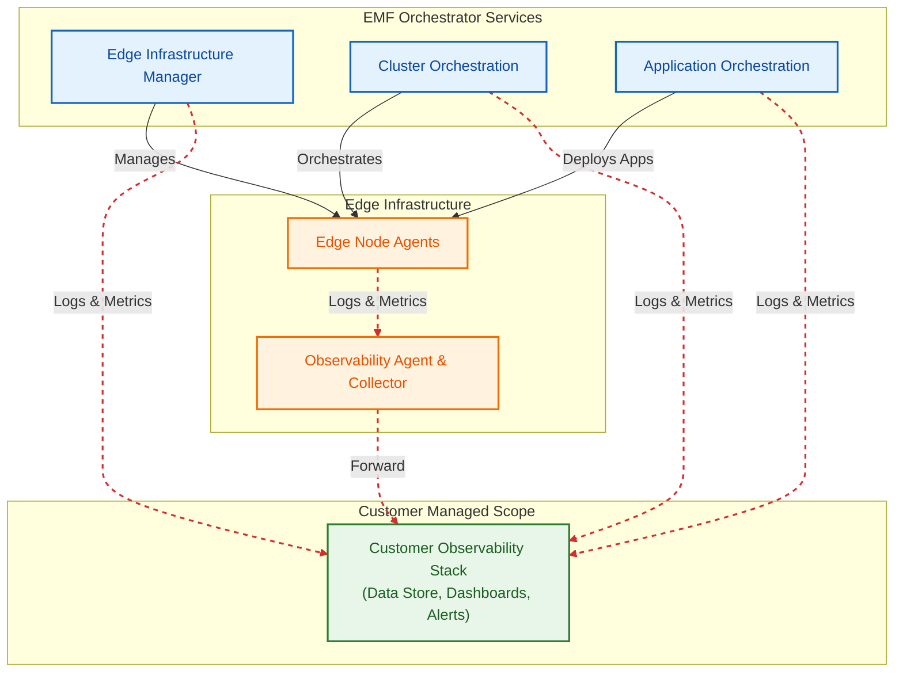
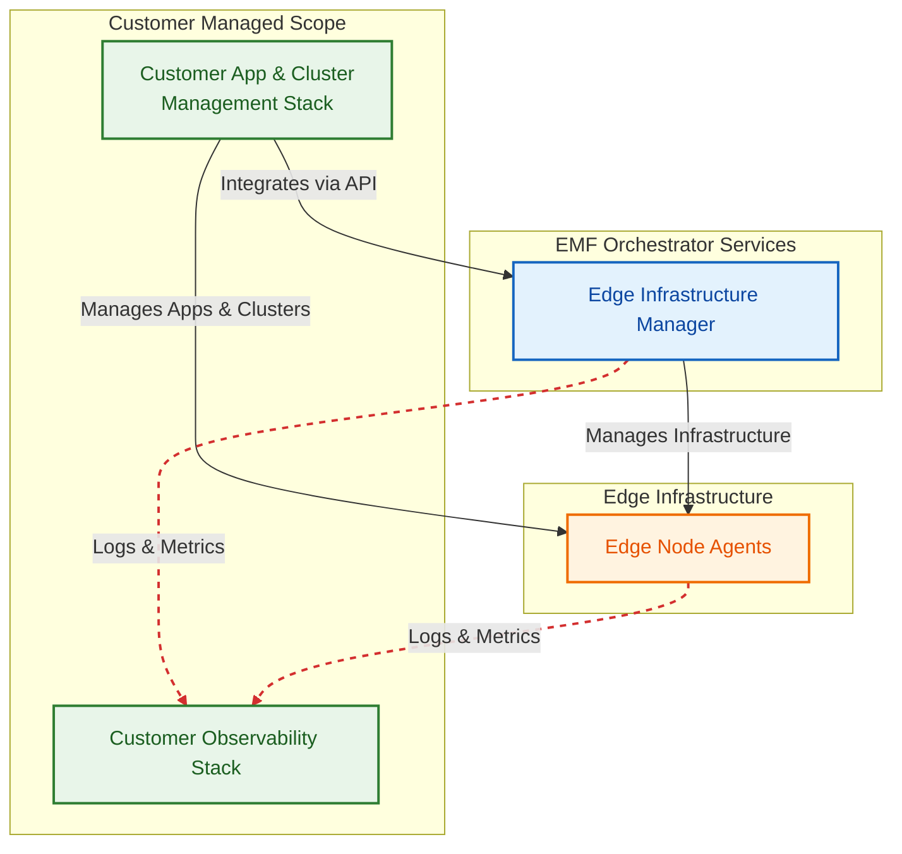

# Design Proposal: Edge Manageability Framework Modular Use Case

Author(s): Edge Manageability Framework Architecture Team

Last updated: 2025-12-02

## Abstract

Starting 2025.02 release EMF will support capability for users to deploy full EMF or turnoff certain domains to deploy
a modular EMF instance. This design proposal outlines the customer usecases for modular EMF deployment. This document
will not address the full EMF usecase as it is already well established.

## Supported Modular Use Cases

The following modular use cases will be supported in EMF starting 2025.02 release along with the full EMF deployment.:

- **EIM+CO+AO** Modular deployment with Edge infrastructure manager, Cluster Orchestration and Application
   orchestration without Edge node and Orchestrator observability.
- **EIM** Modular deployment with Edge infrastructure manager only.
- **EIM+CO** Modular deployment with Edge infrastructure manager and Cluster Orchestration only.
- **EIM+OB** Modular deployment with Edge infrastructure manager with Edge node and Orchestrator observability.
- **EIM+CO+OB** Modular deployment with Edge infrastructure manager, Cluster Orchestration with Edge node
   and Orchestrator observability.

In all the above modular usecases only CLI and API based interfaces will be supported. GUI based interfaces will not
be supported in modular usecases.

Following EMF domains will not be supported in any of the modular usecases: AO only, CO only, OB only and AO+CO+OB.

## User Stories for the EMF Modular Use Cases

In this section we will outline the user stories for each of the modular use cases supported in EMF. These user stories
will help define the requirements and validation tests for each modular use case.

### EIM+CO+AO User Stories

EIM+CO+AO modular deployment is targeted for full EMF customers who want to manage their own observability stack but
use EIM, CO and AO from EMF. For customers to use their own observability stack, they will need setup the required data
store, dashboard and observability control plane services. The Edge node and orchestrator services will be emitting the
logs and metrics to the customer provided observability stack. The current implementation of the edge node observability
agents and collectors on the orchestrator should be flexible enough to support this use case.

**User story 1:** As a admin-user, I want to deploy EMF with EIM, CO and AO domains only so that I can manage my own
observability stack and configure the edge node agents, collectors, orchestrator services and collectors to use the
observability stack deployed by me.

**User story 2:** As a developer-user, I want to deploy EMF with EIM, CO and AO domains only as i am only
interested in logs i would like detailed instructions on how to get the edge node agents logs and orchestrator
services logs directly logging into the system.

### EIM User Stories

EIM modular deployment is targeted for customers who want to use EMF for edge infrastructure management only. The
customer will be responsible for managing cluster and applciation life cycle management. It might be ideal for customer
deployed application and cluster management stack might need to leverage EIM APIs to link the managed edge node
instances with their own stack. It is also possible to use EIM as a standalone edge node management solution.

**User story 1:** As a admin-user, I want to deploy EMF with standalone EIM domain only for device lifecycle
management at fleet level. I can manage my own Application, Cluster and observability management stack without
integrating with the EIM state using the EIM APIs.  

**User story 2:** As a developer-user, I want to deploy EMF with EIM domain only for device lifecycle management
at fleet. I can manage my own Application, Cluster and observability management stack. I will integrate my application,
cluster and observability stack with the Infrastructure state maintained by EIM. For this I need detailed instructions
on how to use EIM APIs for integrating with my own stack.
