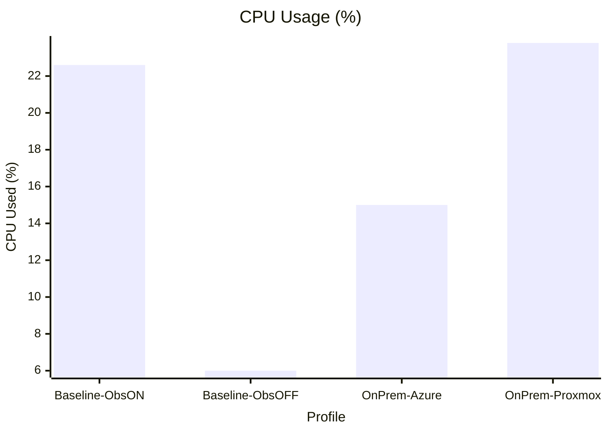
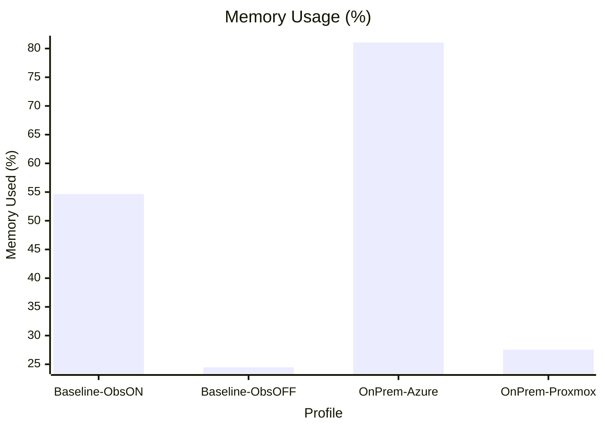
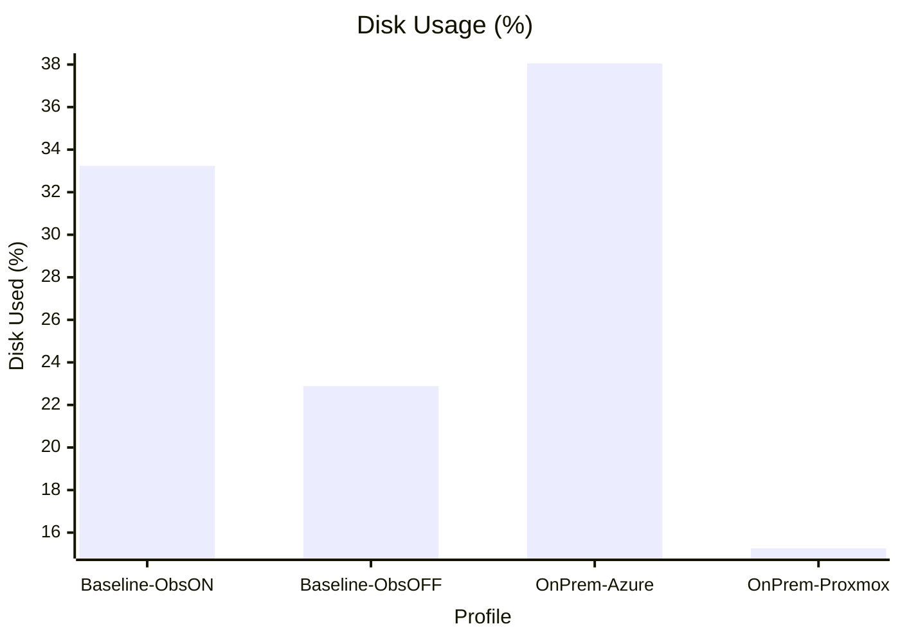
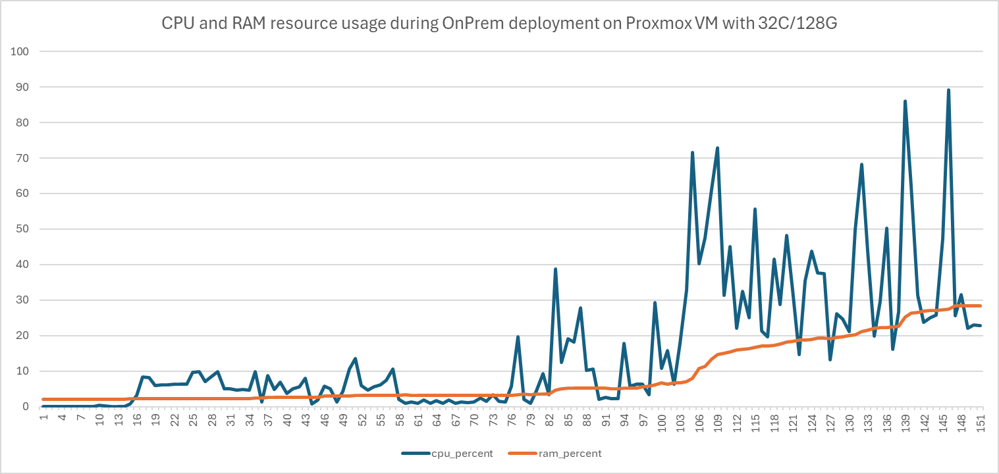

# EMF profiling: Analyze the timing and resource consumption of EMF with various profiles

Author(s): EMF-EIM team

Last updated: 05.06.2025

## Abstract

The objective of this exercise is to capture the timing and resource consumption of EMF under various deployment types and profiles. This will help in understanding the timing and resource consumption and guide future optimizations.

Environment used for analysis

- Coder based EMF deployment support baseline `autocert` profile with observability turned ON.
- Coder based EMF deployment support baseline `autocert` profile with observability turned OFF.
- Azure based default OnPrem EMF deployment. In this case EMF is deployed in another ubuntu VM on Azure VM.
- Proxmox VM based default OnPrem EMF deployment.

## Key Learnings and Optimization Proposals

### 1. Resource Requirements for Default EMF Deployment

- **Learning:** EMF deployments with default capabilities require significant CPU, memory, and storage resources (minimum: 16 cores, 64 GB RAM, 140 GB storage).
- **Proposals:**
  - Provide a standalone edge node like experience for EMF to reduce resource footprint.
  - Enable deployment of EMF via Helm charts for customers not using GitOps.
  - Support minimal deployments with CLI-only interaction.

### 2. Deployment Time

- **Learning:** Best deployment time is 25 minutes (with images cached); worst case exceeds 1 hour. A portion time is spent on system configuration, RKE2, Gitea, ArgoCD, and orchestrator installer, with significant delays during syncwave/sync until root-app readiness.
- **Proposals:**
  - Set a target deployment time KPI of 5–8 minutes for OnPrem deployments.
  - Instrument timing to distinguish between artifact download and service startup times.
  - Analyze and optimize repeated syncwaves and identify bottleneck applications (e.g., postgresql, secrets-config).

### 3. Kubernetes distro in Single-Node OnPrem Deployments

- **Learning:** Most OnPrem deployments use single-node clusters on VMs, not bare metal. RKE2 consumes more resources and time than necessary.
- **Proposals:**
  - Evaluate and support alternative Kubernetes distributions (e.g., k3s) for smaller footprints in reference architectures.

### 4. Platform Services in Default Profile

- **Learning:** The default profile deploys 85 ArgoCD apps, 199 pods, and 362 containers, including services like ISTIO and Kiali.
- **Proposals:**
  - Review and minimize the set of platform services in the default OnPrem configuration.
  - Assess the necessity and scope of each deployed service.

### 5. Deployment Configuration complexity

- **Learning:** EMF uses multiple concepts—presets, profiles, and configurations—which increases deployment complexity.
- **Proposals:**
  - Streamline and simplify EMF deployment configuration to improve user experience.

### 6. Observability Services Impact Resource Consumption

- **Learning:** Observability services (e.g., Grafana) significantly increase memory and CPU usage.
- **Proposals:**
  - Allow customers to integrate their own observability systems for metrics and logging.
  - Provide options to disable or minimize the built-in observability subsystem to reduce resource consumption.

### 7. Resource Requests and Limits configuration

- **Learning:** Actual CPU and memory usage is often much lower than the minimum configuration. For example, max CPU request is 3.2 cores, but usage can reach 6.7 cores; max memory request is ~7.5 GB, but usage can reach 37 GB (with observability enabled).
- **Proposals:**
  - Audit and adjust resource requests and limits for all components, including Kubernetes control plane and OSS/upstream dependencies.
  - Ensure supported deployment types can configure resource requests and limits appropriately.
  - Tune resource allocations based on deployment type and observed usage.

The rest of the document will has details tools, codebase used and the profiling data captured during the exercise.

## Tools used

- `kubectl top node` : Shows current real-time usage of CPU and memory.Data is fetched from the Metrics Server, which collects usage stats from kubelet.
- `kubectl describe node` : Shows the requested and allocatable resources, and also total capacity. This includes the sum of CPU and memory requests and limits from all pods on the node.
- Linux commands (instantaneous resource usage):
  - CPU: `top -bn1 | grep "Cpu(s)" | awk '{print "CPU Used: " $2 + $4 "%, CPU Free: " $8 "%"}'`
  - Memory: `free | awk '/Mem:/ {used=$3; total=$2; printf "Memory Used: %.2f%%, Memory Free: %.2f%%\n", used/total*100, $4/total*100}'`
  - Storage: `df --total -k | awk '/^total/ {used=$3; total=$2; free=$4; printf "Disk Used: %.2f%%, Disk Free: %.2f%%\n", used/total*100, free/total*100}'`
  - Process level CPU usage: `ps -eo pid,comm,%cpu --sort=-%cpu | head -n 7`
  - Process level Memory usage: `ps -eo comm,rss --sort=-rss | awk 'NR==1 {print $1, "MEM(MiB)"} NR>1 {printf "%-20s %6.1f\n", $1, $2/1024}' | head -n 7`
- instrumentation in the EMF code base

## Codebase and configuration

3.0 tag of EMF codebase is used for this exercise. EMF supports pre-defined deployment presets, which can be used to deploy the EMF instance with different profiles. The following profiles are used for this exercise: `dev-internal-coder-autocert.yaml` as baseline. Changes made to the presets will be captured as part of the profiling data.

## Profiling data

Two coder instance are deployed with same overall resource configuration

- CPU: 16 cores
- Memory: 64G
- Storage: 140G

OnPrem deployed on Azure VM

- CPU Cores     : 16
- Physical RAM  : 64 GB
- Total Disk    : 176G

OnPrem deployed on Proxmox VM (most typical deployment type)

- CPU Cores     : 32
- Physical RAM  : 128 GB
- Total Disk    :  213G

### Comparing `dev-internal-coder-autocert.yaml` with `enableObservability` set to `false`

#### Resource Allocation Comparison

```mermaid
xychart-beta
    title "CPU and Memory Resource Allocation (%)"
    x-axis "Profile" ["Baseline-ObsON", "Baseline-ObsOFF", "OnPrem-Azure", "OnPrem-Proxmox"]
    y-axis "Percentage"
    bar "CPU Usage" [29, 9, 27, 20]
    bar "Memory Usage" [60, 30, 79, 28]
```



#### Resource Requests Comparison

```mermaid
xychart-beta
    title "CPU and Memory Requests (m/mi)"
    x-axis "Profile" ["Baseline-ObsON", "Baseline-ObsOFF", "OnPrem-Azure", "OnPrem-Proxmox"]
    y-axis "Value"
    bar "CPU (m)" [2466, 1823, 3296, 3280]
    bar "Memory (Mi)" [4603, 2169, 7070, 7378]
```



#### Kubernetes Resource allocation

Baseline profile `dev-internal-coder-autocert.yaml` with `enableObservability` set to `true`:

```sh
  Resource           Requests     Limits
  --------           --------     ------
  cpu                2466m (15%)  14957550m (93484%)
  memory             4603Mi (7%)  15308700Mi (24200%)  
```

```sh
NAME                 CPU(cores)   CPU%   MEMORY(bytes)   MEMORY%
kind-control-plane   4719m        29%    38049Mi         60%
```

Baseline profile `dev-internal-coder-autocert.yaml` with `enableObservability` set to `false`:

```sh
  Resource           Requests     Limits
  --------           --------     ------
  cpu                1823m (11%)  8646800m (54042%)
  memory             2169Mi (3%)  8850844Mi (13991%)
```

```sh
NAME                 CPU(cores)   CPU%   MEMORY(bytes)   MEMORY%
kind-control-plane   1507m        9%     19023Mi         30%
```

Baseline profile for OnPrem deployed on Azure VM

```sh
 Resource           Requests      Limits
 --------           --------      ------
 cpu                3296m (20%)   16697600m (104359%)
 memory             7070Mi (14%)  17091840Mi (35482%)
```

```sh
NAME      CPU(cores)   CPU%   MEMORY(bytes)   MEMORY%
orch-tf   4414m        27%    38305Mi         79%    
```

Baseline profile for OnPrem deployed on Proxmox

```sh
 Resource           Requests     Limits                      
 --------           --------     ------                      
 cpu                3280m (10%)  15548300m (48588%)  
 memory             7378Mi (5%)  15913878Mi (12354%) 
```

```sh
NAME                  CPU(cores)   CPU%   MEMORY(bytes)   MEMORY%  
coder-proxmox-20008   6704m        20%    37160Mi         28%      
```

#### Linux Resource allocation

Baseline profile `dev-internal-coder-autocert.yaml` with `enableObservability` set to `true`:

```sh
CPU Used: 22.6%, CPU Free: 76.3%
Memory Used: 54.66%, Memory Free: 17.65%
Disk Used: 33.24%, Disk Free: 64.32%
~19.3G used for container images
```

Baseline profile `dev-internal-coder-autocert.yaml` with `enableObservability` set to `false`:

```sh
CPU Used: 6%, CPU Free: 94.0%
Memory Used: 24.48%, Memory Free: 62.97%
Disk Used: 22.89%, Disk Free: 74.31%
~16G used for container images
```

Baseline profile for OnPrem deployed on Azure VM

```sh
CPU Used: 15%, CPU Free: 84.0%
Memory Used: 81.05%, Memory Free: 7.33%
Disk Used: 38.05%, Disk Free: 60.98%
```

Baseline profile for OnPrem deployed Proxmox VM

```sh
CPU Used: 23.8%, CPU Free: 75.5%
Memory Used: 27.55%, Memory Free: 45.49%
Disk Used: 15.26%, Disk Free: 84.73%
~26.3G used for container images
```

#### Resource Consumption Comparison

**CPU Usage (%)**



**Memory Usage (%)**



**Disk Usage (%)**



Top processes consuming CPU and memory

##### Baseline profile `dev-internal-coder-autocert.yaml` with `enableObservability` set to `true`

```sh
COMMAND         %CPU
otelcol-contrib 47.7
kubelet         24.3
argocd-applicat 20.6
kube-apiserver  18.8
mimir            7.3
containerd       7.0 
```

```sh
COMMAND MEM(MiB)
kube-apiserver       1796.7
prometheus           1194.4
java                  797.8
mimir                 691.4
mimir                 690.0
argocd-applicat       658.2
```

##### Baseline profile `dev-internal-coder-autocert.yaml` with `enableObservability` set to `false`

```sh
COMMAND         %CPU
kubelet         15.9
kube-apiserver  13.3
argocd-applicat 12.6
etcd             5.2
containerd       4.5
BESClient        2.1
```

```sh
COMMAND MEM(MiB)
kube-apiserver       1575.5
java                  819.5
argocd-applicat       651.2
etcd                  256.1
containerd            238.7
api-gw                229.4
```

##### Baseline profile for OnPrem deployed on Azure VM

In case of Azure deployment the topology is deploying VM inside Azure VM that run EMF.

##### Baseline profile for OnPrem deployed on Proxmox VM

```sh
COMMAND         %CPU
kubelet         69.3
otelcol-contrib 68.5
argocd-applicat 52.3
kube-apiserver  35.4
mimir           18.4
prometheus      14.6 
```

```sh
COMMAND MEM(MiB)            
kube-apiserver       2041.4 
prometheus           1535.8 
java                  861.3 
argocd-applicat       829.9 
mimir                 808.4 
mimir                 779.7 
```

### Timing analysis

The timing analysis was done using the kubernetes events captured during the deployment of the EMF. It is recommended to run the following commands within an hour of deploying the EMF as the retention policy might overwrite the events captured during the deployment.

```bash
mkdir -p kind-diagnostics
kubectl get pods -o wide -A | tee kind-diagnostics/pods-list.txt
kubectl describe pods -A | tee kind-diagnostics/pods-describe.txt
mage logutils:collectArgoDiags | tee kind-diagnostics/argo-diag.txt
kubectl get applications -o yaml -A | tee kind-diagnostics/argocd-applications.yaml
kubectl get events -o yaml -A | tee kind-diagnostics/events.yaml
```

Following data was generated for the Coder deployment with `dev-internal-coder-autocert.yaml`, [OnPrem deployment on Azure VM](https://github.com/open-edge-platform/edge-manage-docs/blob/main/docs/developer_guide/set_up_dev_env/index.rst), and [Proxmox VM](https://docs.openedgeplatform.intel.com/edge-manage-docs/dev/deployment_guide/on_prem_deployment/on_prem_get_started/on_prem_install.html)

#### Argo applications Durations `dev-internal-coder-autocert.yaml`

| Section | Start | End | Duration (sec) [min] |
|---------|---------------------|---------------------|:----------------------:|
| root-app | 2025-06-09 11:15:43 | 2025-06-09 11:39:31 | **1428 [23.8 min]** 🔴 |
| postgresql-secrets | 2025-06-09 11:17:23 | 2025-06-09 11:38:47 | **1284 [21.4 min]** 🔴 |
| secrets-config | 2025-06-09 11:21:42 | 2025-06-09 11:38:48 | **1026 [17.1 min]** 🔴 |
| tenancy-api-mapping | 2025-06-09 11:28:02 | 2025-06-09 11:39:31 | **689 [11.48 min]** 🔴 |
| tenancy-datamodel | 2025-06-09 11:28:02 | 2025-06-09 11:38:39 | **637 [10.62 min]** 🔴 |
| app-deployment-crd | 2025-06-09 11:31:32 | 2025-06-09 11:35:57 | **265 [4.42 min]** 🔴 |
| fleet-crd | 2025-06-09 11:25:16 | 2025-06-09 11:29:25 | **249 [4.15 min]** 🔴 |
| platform-autocert | 2025-06-09 11:18:02 | 2025-06-09 11:21:41 | **219 [3.65 min]** 🔴 |
| alerting-monitor | 2025-06-09 11:30:12 | 2025-06-09 11:32:56 | **164 [2.73 min]** 🔴 |
| orchestrator-observability | 2025-06-09 11:22:28 | 2025-06-09 11:24:50 | **142 [2.37 min]** 🟠 |
| edgenode-observability | 2025-06-09 11:22:27 | 2025-06-09 11:24:48 | **141 [2.35 min]** 🟠 |
| harbor-oci | 2025-06-09 11:22:27 | 2025-06-09 11:24:16 | **109 [1.82 min]** 🟠 |
| platform-keycloak | 2025-06-09 11:18:02 | 2025-06-09 11:19:40 | **98 [1.63 min]** 🟠 |
| kyverno | 2025-06-09 11:16:08 | 2025-06-09 11:17:42 | **94 [1.57 min]** 🟠 |
| prometheus-crd | 2025-06-09 11:16:12 | 2025-06-09 11:17:43 | **91 [1.52 min]** 🟠 |
| nexus-api-gw | 2025-06-09 11:28:02 | 2025-06-09 11:29:32 | 90 [1.5 min] |
| infra-core | 2025-06-09 11:31:32 | 2025-06-09 11:32:54 | 82 [1.37 min] |
| infra-external | 2025-06-09 11:34:28 | 2025-06-09 11:35:49 | 81 [1.35 min] |
| orchestrator-prometheus-agent | 2025-06-09 11:22:28 | 2025-06-09 11:23:48 | 80 [1.33 min] |
| ingress-nginx | 2025-06-09 11:25:33 | 2025-06-09 11:26:41 | 68 [1.13 min] |
| cluster-manager | 2025-06-09 11:31:34 | 2025-06-09 11:32:41 | 67 [1.12 min] |
| cert-manager | 2025-06-09 11:16:07 | 2025-06-09 11:17:13 | 66 [1.1 min] |
| infra-onboarding | 2025-06-09 11:34:28 | 2025-06-09 11:35:30 | 62 [1.03 min] |
| app-deployment-manager | 2025-06-09 11:34:28 | 2025-06-09 11:35:19 | 51 [0.85 min] |
| cluster-connect-gateway | 2025-06-09 11:31:34 | 2025-06-09 11:32:22 | 48 [0.8 min] |
| external-secrets | 2025-06-09 11:16:07 | 2025-06-09 11:16:55 | 48 [0.8 min] |
| istiod | 2025-06-09 11:17:01 | 2025-06-09 11:17:48 | 47 [0.78 min] |
| metadata-broker | 2025-06-09 11:31:32 | 2025-06-09 11:32:18 | 46 [0.77 min] |
| intel-infra-provider | 2025-06-09 11:34:29 | 2025-06-09 11:35:14 | 45 [0.75 min] |
| sre-exporter | 2025-06-09 11:31:32 | 2025-06-09 11:32:17 | 45 [0.75 min] |
| tenancy-manager | 2025-06-09 11:28:02 | 2025-06-09 11:28:47 | 45 [0.75 min] |
| capi-operator | 2025-06-09 11:22:27 | 2025-06-09 11:23:11 | 44 [0.73 min] |
| app-resource-manager | 2025-06-09 11:34:28 | 2025-06-09 11:35:11 | 43 [0.72 min] |
| app-orch-catalog | 2025-06-09 11:27:20 | 2025-06-09 11:28:00 | 40 [0.67 min] |
| infra-managers | 2025-06-09 11:34:28 | 2025-06-09 11:35:05 | 37 [0.62 min] |
| istio-base | 2025-06-09 11:16:07 | 2025-06-09 11:16:42 | 35 [0.58 min] |
| postgresql | 2025-06-09 11:17:25 | 2025-06-09 11:18:00 | 35 [0.58 min] |
| k8s-metrics-server | 2025-06-09 11:16:07 | 2025-06-09 11:16:41 | 34 [0.57 min] |
| app-orch-tenant-controller | 2025-06-09 11:25:32 | 2025-06-09 11:26:04 | 32 [0.53 min] |
| vault | 2025-06-09 11:21:41 | 2025-06-09 11:22:13 | 32 [0.53 min] |
| kiali | 2025-06-09 11:18:01 | 2025-06-09 11:18:32 | 31 [0.52 min] |
| botkube | 2025-06-09 11:28:02 | 2025-06-09 11:28:30 | 28 [0.47 min] |
| app-service-proxy | 2025-06-09 11:34:28 | 2025-06-09 11:34:55 | 27 [0.45 min] |
| app-interconnect-manager | 2025-06-09 11:38:31 | 2025-06-09 11:38:57 | 26 [0.43 min] |
| web-ui-admin | 2025-06-09 11:39:01 | 2025-06-09 11:39:26 | 25 [0.42 min] |
| web-ui-app-orch | 2025-06-09 11:39:01 | 2025-06-09 11:39:26 | 25 [0.42 min] |
| web-ui-cluster-orch | 2025-06-09 11:39:01 | 2025-06-09 11:39:26 | 25 [0.42 min] |
| web-ui-root | 2025-06-09 11:39:01 | 2025-06-09 11:39:26 | 25 [0.42 min] |
| fleet-controller | 2025-06-09 11:25:18 | 2025-06-09 11:25:39 | 21 [0.35 min] |
| keycloak-tenant-controller | 2025-06-09 11:29:34 | 2025-06-09 11:29:55 | 21 [0.35 min] |
| namespace-label | 2025-06-09 11:15:45 | 2025-06-09 11:16:06 | 21 [0.35 min] |
| reloader | 2025-06-09 11:17:01 | 2025-06-09 11:17:22 | 21 [0.35 min] |
| web-ui-infra | 2025-06-09 11:39:01 | 2025-06-09 11:39:22 | 21 [0.35 min] |
| nginx-ingress-pxe-boots | 2025-06-09 11:28:02 | 2025-06-09 11:28:18 | 16 [0.27 min] |
| kyverno-traefik-policy | 2025-06-09 11:25:32 | 2025-06-09 11:25:47 | 15 [0.25 min] |
| cert-synchronizer | 2025-06-09 11:21:42 | 2025-06-09 11:21:56 | 14 [0.23 min] |
| traefik | 2025-06-09 11:25:33 | 2025-06-09 11:25:47 | 14 [0.23 min] |
| app-deployment-manager-secret | 2025-06-09 11:31:32 | 2025-06-09 11:31:44 | 12 [0.2 min] |
| token-fs | 2025-06-09 11:29:57 | 2025-06-09 11:30:08 | 11 [0.18 min] |
| self-signed-cert | 2025-06-09 11:21:42 | 2025-06-09 11:21:52 | 10 [0.17 min] |
| observability-tenant-controller | 2025-06-09 11:34:18 | 2025-06-09 11:34:27 | 9 [0.15 min] |
| auth-service | 2025-06-09 11:34:18 | 2025-06-09 11:34:26 | 8 [0.13 min] |
| certificate-file-server | 2025-06-09 11:39:01 | 2025-06-09 11:39:08 | 7 [0.12 min] |
| rs-proxy | 2025-06-09 11:22:14 | 2025-06-09 11:22:21 | 7 [0.12 min] |
| secret-wait-tls-boots | 2025-06-09 11:29:57 | 2025-06-09 11:30:04 | 7 [0.12 min] |
| secret-wait-tls-orch | 2025-06-09 11:22:14 | 2025-06-09 11:22:20 | 6 [0.1 min] |
| wait-istio-job | 2025-06-09 11:17:01 | 2025-06-09 11:17:07 | 6 [0.1 min] |
| copy-ca-cert-gateway-to-cattle | 2025-06-09 11:22:22 | 2025-06-09 11:22:25 | 3 [0.05 min] |
| capi-providers-config | 2025-06-09 11:25:32 | 2025-06-09 11:25:34 | 2 [0.03 min] |
| copy-ca-cert-boots-to-infra | 2025-06-09 11:30:09 | 2025-06-09 11:30:11 | 2 [0.03 min] |
| traefik-extra-objects | 2025-06-09 11:28:02 | 2025-06-09 11:28:04 | 2 [0.03 min] |
| copy-app-gitea-cred-to-fleet | 2025-06-09 11:28:01 | 2025-06-09 11:28:02 | 1 [0.02 min] |
| copy-ca-cert-boots-to-gateway | 2025-06-09 11:30:09 | 2025-06-09 11:30:10 | 1 [0.02 min] |
| copy-ca-cert-gateway-to-infra | 2025-06-09 11:22:22 | 2025-06-09 11:22:23 | 1 [0.02 min] |
| copy-ca-cert-gitea-to-app | 2025-06-09 11:22:22 | 2025-06-09 11:22:23 | 1 [0.02 min] |
| copy-ca-cert-gitea-to-cluster | 2025-06-09 11:22:22 | 2025-06-09 11:22:23 | 1 [0.02 min] |
| copy-cluster-gitea-cred-to-fleet | 2025-06-09 11:28:01 | 2025-06-09 11:28:02 | 1 [0.02 min] |
| copy-keycloak-admin-to-infra | 2025-06-09 11:22:22 | 2025-06-09 11:22:23 | 1 [0.02 min] |
| fleet-rs-secret | 2025-06-09 11:28:02 | 2025-06-09 11:28:03 | 1 [0.02 min] |
| kyverno-istio-policy | 2025-06-09 11:25:32 | 2025-06-09 11:25:33 | 1 [0.02 min] |
| traefik-pre | 2025-06-09 11:22:26 | 2025-06-09 11:22:27 | 1 [0.02 min] |
| capi-operator-pre | 2025-06-09 11:22:24 | 2025-06-09 11:22:24 | 0 [0.0 min] |
| edgenode-dashboards | 2025-06-09 11:22:27 | 2025-06-09 11:22:27 | 0 [0.0 min] |
| istio-policy | 2025-06-09 11:18:02 | 2025-06-09 11:18:02 | 0 [0.0 min] |
| kyverno-extra-policies | 2025-06-09 11:16:59 | 2025-06-09 11:16:59 | 0 [0.0 min] |
| orchestrator-dashboards | 2025-06-09 11:22:27 | 2025-06-09 11:22:27 | 0 [0.0 min] |

---

#### Gantt Chart `dev-internal-coder-autocert.yaml`

```mermaid
gantt
    dateFormat  YYYY-MM-DDTHH:mm:ss
    axisFormat  %H:%M:%S
    section Provisioning Timeline
    root-app (1428s [23.8 min]) :crit, 2025-06-09T11:15:43, 2025-06-09T11:39:31
    namespace-label (21s [0.35 min]) : 2025-06-09T11:15:45, 2025-06-09T11:16:06
    cert-manager (66s [1.1 min]) : 2025-06-09T11:16:07, 2025-06-09T11:17:13
    external-secrets (48s [0.8 min]) : 2025-06-09T11:16:07, 2025-06-09T11:16:55
    istio-base (35s [0.58 min]) : 2025-06-09T11:16:07, 2025-06-09T11:16:42
    k8s-metrics-server (34s [0.57 min]) : 2025-06-09T11:16:07, 2025-06-09T11:16:41
    kyverno (94s [1.57 min]) :active, 2025-06-09T11:16:08, 2025-06-09T11:17:42
    prometheus-crd (91s [1.52 min]) :active, 2025-06-09T11:16:12, 2025-06-09T11:17:43
    kyverno-extra-policies (0s [0.0 min]) : 2025-06-09T11:16:59, 2025-06-09T11:16:59
    istiod (47s [0.78 min]) : 2025-06-09T11:17:01, 2025-06-09T11:17:48
    reloader (21s [0.35 min]) : 2025-06-09T11:17:01, 2025-06-09T11:17:22
    wait-istio-job (6s [0.1 min]) : 2025-06-09T11:17:01, 2025-06-09T11:17:07
    postgresql-secrets (1284s [21.4 min]) :crit, 2025-06-09T11:17:23, 2025-06-09T11:38:47
    postgresql (35s [0.58 min]) : 2025-06-09T11:17:25, 2025-06-09T11:18:00
    kiali (31s [0.52 min]) : 2025-06-09T11:18:01, 2025-06-09T11:18:32
    platform-autocert (219s [3.65 min]) :crit, 2025-06-09T11:18:02, 2025-06-09T11:21:41
    platform-keycloak (98s [1.63 min]) :active, 2025-06-09T11:18:02, 2025-06-09T11:19:40
    istio-policy (0s [0.0 min]) : 2025-06-09T11:18:02, 2025-06-09T11:18:02
    vault (32s [0.53 min]) : 2025-06-09T11:21:41, 2025-06-09T11:22:13
    secrets-config (1026s [17.1 min]) :crit, 2025-06-09T11:21:42, 2025-06-09T11:38:48
    cert-synchronizer (14s [0.23 min]) : 2025-06-09T11:21:42, 2025-06-09T11:21:56
    self-signed-cert (10s [0.17 min]) : 2025-06-09T11:21:42, 2025-06-09T11:21:52
    rs-proxy (7s [0.12 min]) : 2025-06-09T11:22:14, 2025-06-09T11:22:21
    secret-wait-tls-orch (6s [0.1 min]) : 2025-06-09T11:22:14, 2025-06-09T11:22:20
    copy-ca-cert-gateway-to-cattle (3s [0.05 min]) : 2025-06-09T11:22:22, 2025-06-09T11:22:25
    copy-ca-cert-gateway-to-infra (1s [0.02 min]) : 2025-06-09T11:22:22, 2025-06-09T11:22:23
    copy-ca-cert-gitea-to-app (1s [0.02 min]) : 2025-06-09T11:22:22, 2025-06-09T11:22:23
    copy-ca-cert-gitea-to-cluster (1s [0.02 min]) : 2025-06-09T11:22:22, 2025-06-09T11:22:23
    copy-keycloak-admin-to-infra (1s [0.02 min]) : 2025-06-09T11:22:22, 2025-06-09T11:22:23
    capi-operator-pre (0s [0.0 min]) : 2025-06-09T11:22:24, 2025-06-09T11:22:24
    traefik-pre (1s [0.02 min]) : 2025-06-09T11:22:26, 2025-06-09T11:22:27
    edgenode-observability (141s [2.35 min]) :active, 2025-06-09T11:22:27, 2025-06-09T11:24:48
    harbor-oci (109s [1.82 min]) :active, 2025-06-09T11:22:27, 2025-06-09T11:24:16
    capi-operator (44s [0.73 min]) : 2025-06-09T11:22:27, 2025-06-09T11:23:11
    edgenode-dashboards (0s [0.0 min]) : 2025-06-09T11:22:27, 2025-06-09T11:22:27
    orchestrator-dashboards (0s [0.0 min]) : 2025-06-09T11:22:27, 2025-06-09T11:22:27
    orchestrator-observability (142s [2.37 min]) :active, 2025-06-09T11:22:28, 2025-06-09T11:24:50
    orchestrator-prometheus-agent (80s [1.33 min]) : 2025-06-09T11:22:28, 2025-06-09T11:23:48
    fleet-crd (249s [4.15 min]) :crit, 2025-06-09T11:25:16, 2025-06-09T11:29:25
    fleet-controller (21s [0.35 min]) : 2025-06-09T11:25:18, 2025-06-09T11:25:39
    app-orch-tenant-controller (32s [0.53 min]) : 2025-06-09T11:25:32, 2025-06-09T11:26:04
    kyverno-traefik-policy (15s [0.25 min]) : 2025-06-09T11:25:32, 2025-06-09T11:25:47
    capi-providers-config (2s [0.03 min]) : 2025-06-09T11:25:32, 2025-06-09T11:25:34
    kyverno-istio-policy (1s [0.02 min]) : 2025-06-09T11:25:32, 2025-06-09T11:25:33
    ingress-nginx (68s [1.13 min]) : 2025-06-09T11:25:33, 2025-06-09T11:26:41
    traefik (14s [0.23 min]) : 2025-06-09T11:25:33, 2025-06-09T11:25:47
    app-orch-catalog (40s [0.67 min]) : 2025-06-09T11:27:20, 2025-06-09T11:28:00
    copy-app-gitea-cred-to-fleet (1s [0.02 min]) : 2025-06-09T11:28:01, 2025-06-09T11:28:02
    copy-cluster-gitea-cred-to-fleet (1s [0.02 min]) : 2025-06-09T11:28:01, 2025-06-09T11:28:02
    tenancy-api-mapping (689s [11.48 min]) :crit, 2025-06-09T11:28:02, 2025-06-09T11:39:31
    tenancy-datamodel (637s [10.62 min]) :crit, 2025-06-09T11:28:02, 2025-06-09T11:38:39
    nexus-api-gw (90s [1.5 min]) : 2025-06-09T11:28:02, 2025-06-09T11:29:32
    tenancy-manager (45s [0.75 min]) : 2025-06-09T11:28:02, 2025-06-09T11:28:47
    botkube (28s [0.47 min]) : 2025-06-09T11:28:02, 2025-06-09T11:28:30
    nginx-ingress-pxe-boots (16s [0.27 min]) : 2025-06-09T11:28:02, 2025-06-09T11:28:18
    traefik-extra-objects (2s [0.03 min]) : 2025-06-09T11:28:02, 2025-06-09T11:28:04
    fleet-rs-secret (1s [0.02 min]) : 2025-06-09T11:28:02, 2025-06-09T11:28:03
    keycloak-tenant-controller (21s [0.35 min]) : 2025-06-09T11:29:34, 2025-06-09T11:29:55
    token-fs (11s [0.18 min]) : 2025-06-09T11:29:57, 2025-06-09T11:30:08
    secret-wait-tls-boots (7s [0.12 min]) : 2025-06-09T11:29:57, 2025-06-09T11:30:04
    copy-ca-cert-boots-to-infra (2s [0.03 min]) : 2025-06-09T11:30:09, 2025-06-09T11:30:11
    copy-ca-cert-boots-to-gateway (1s [0.02 min]) : 2025-06-09T11:30:09, 2025-06-09T11:30:10
    alerting-monitor (164s [2.73 min]) :crit, 2025-06-09T11:30:12, 2025-06-09T11:32:56
    app-deployment-crd (265s [4.42 min]) :crit, 2025-06-09T11:31:32, 2025-06-09T11:35:57
    infra-core (82s [1.37 min]) : 2025-06-09T11:31:32, 2025-06-09T11:32:54
    metadata-broker (46s [0.77 min]) : 2025-06-09T11:31:32, 2025-06-09T11:32:18
    sre-exporter (45s [0.75 min]) : 2025-06-09T11:31:32, 2025-06-09T11:32:17
    app-deployment-manager-secret (12s [0.2 min]) : 2025-06-09T11:31:32, 2025-06-09T11:31:44
    cluster-manager (67s [1.12 min]) : 2025-06-09T11:31:34, 2025-06-09T11:32:41
    cluster-connect-gateway (48s [0.8 min]) : 2025-06-09T11:31:34, 2025-06-09T11:32:22
    observability-tenant-controller (9s [0.15 min]) : 2025-06-09T11:34:18, 2025-06-09T11:34:27
    auth-service (8s [0.13 min]) : 2025-06-09T11:34:18, 2025-06-09T11:34:26
    infra-external (81s [1.35 min]) : 2025-06-09T11:34:28, 2025-06-09T11:35:49
    infra-onboarding (62s [1.03 min]) : 2025-06-09T11:34:28, 2025-06-09T11:35:30
    app-deployment-manager (51s [0.85 min]) : 2025-06-09T11:34:28, 2025-06-09T11:35:19
    app-resource-manager (43s [0.72 min]) : 2025-06-09T11:34:28, 2025-06-09T11:35:11
    infra-managers (37s [0.62 min]) : 2025-06-09T11:34:28, 2025-06-09T11:35:05
    app-service-proxy (27s [0.45 min]) : 2025-06-09T11:34:28, 2025-06-09T11:34:55
    intel-infra-provider (45s [0.75 min]) : 2025-06-09T11:34:29, 2025-06-09T11:35:14
    app-interconnect-manager (26s [0.43 min]) : 2025-06-09T11:38:31, 2025-06-09T11:38:57
    web-ui-admin (25s [0.42 min]) : 2025-06-09T11:39:01, 2025-06-09T11:39:26
    web-ui-app-orch (25s [0.42 min]) : 2025-06-09T11:39:01, 2025-06-09T11:39:26
    web-ui-cluster-orch (25s [0.42 min]) : 2025-06-09T11:39:01, 2025-06-09T11:39:26
    web-ui-root (25s [0.42 min]) : 2025-06-09T11:39:01, 2025-06-09T11:39:26
    web-ui-infra (21s [0.35 min]) : 2025-06-09T11:39:01, 2025-06-09T11:39:22
    certificate-file-server (7s [0.12 min]) : 2025-06-09T11:39:01, 2025-06-09T11:39:08
```



---

**Note:**

- Any section consuming above 1.5 min is marked as (warning), above 2.5 min as (critical).
- The table lists each section and the total time taken (in seconds and minutes) from the first to last event, sorted by duration.
- The Gantt chart visualizes the timing of each section and labels each bar with its duration.

#### Argo applications Durations OnPrem (Azure VM)

| Section | Start | End | Duration (sec) [min] |
|---------|---------------------|---------------------|:----------------------:|
| root-app | 2025-06-09 21:56:24 | 2025-06-09 22:34:25 | **2281 [38.02 min]** 🔴 |
| postgresql-secrets | 2025-06-09 21:58:49 | 2025-06-09 22:34:09 | **2120 [35.33 min]** 🔴 |
| secrets-config | 2025-06-09 22:00:43 | 2025-06-09 22:34:24 | **2021 [33.68 min]** 🔴 |
| tenancy-api-mapping | 2025-06-09 22:11:55 | 2025-06-09 22:33:00 | **1265 [21.08 min]** 🔴 |
| tenancy-datamodel | 2025-06-09 22:11:55 | 2025-06-09 22:32:50 | **1255 [20.92 min]** 🔴 |
| edgenode-observability | 2025-06-09 22:02:00 | 2025-06-09 22:07:47 | **347 [5.78 min]** 🔴 |
| orchestrator-observability | 2025-06-09 22:02:00 | 2025-06-09 22:07:40 | **340 [5.67 min]** 🔴 |
| fleet-crd | 2025-06-09 22:08:11 | 2025-06-09 22:13:21 | **310 [5.17 min]** 🔴 |
| harbor-oci | 2025-06-09 22:02:00 | 2025-06-09 22:07:00 | **300 [5.0 min]** 🔴 |
| orchestrator-prometheus-agent | 2025-06-09 22:02:01 | 2025-06-09 22:06:08 | **247 [4.12 min]** 🔴 |
| capi-operator | 2025-06-09 22:02:00 | 2025-06-09 22:05:34 | **214 [3.57 min]** 🔴 |
| app-deployment-crd | 2025-06-09 22:18:56 | 2025-06-09 22:22:16 | **200 [3.33 min]** 🔴 |
| infra-onboarding | 2025-06-09 22:24:29 | 2025-06-09 22:27:17 | **168 [2.8 min]** 🔴 |
| alerting-monitor | 2025-06-09 22:17:43 | 2025-06-09 22:20:29 | **166 [2.77 min]** 🔴 |
| infra-external | 2025-06-09 22:24:29 | 2025-06-09 22:27:15 | **166 [2.77 min]** 🔴 |
| app-resource-manager | 2025-06-09 22:24:29 | 2025-06-09 22:27:04 | **155 [2.58 min]** 🔴 |
| app-deployment-manager | 2025-06-09 22:24:29 | 2025-06-09 22:26:49 | **140 [2.33 min]** 🟠 |
| infra-core | 2025-06-09 22:18:56 | 2025-06-09 22:21:09 | **133 [2.22 min]** 🟠 |
| intel-infra-provider | 2025-06-09 22:24:30 | 2025-06-09 22:26:42 | **132 [2.2 min]** 🟠 |
| ingress-nginx | 2025-06-09 22:08:43 | 2025-06-09 22:10:46 | **123 [2.05 min]** 🟠 |
| platform-keycloak | 2025-06-09 21:59:29 | 2025-06-09 22:01:28 | **119 [1.98 min]** 🟠 |
| infra-managers | 2025-06-09 22:24:29 | 2025-06-09 22:26:26 | **117 [1.95 min]** 🟠 |
| kyverno | 2025-06-09 21:56:54 | 2025-06-09 21:58:51 | **117 [1.95 min]** 🟠 |
| cluster-manager | 2025-06-09 22:19:03 | 2025-06-09 22:20:59 | **116 [1.93 min]** 🟠 |
| sre-exporter | 2025-06-09 22:18:56 | 2025-06-09 22:20:48 | **112 [1.87 min]** 🟠 |
| prometheus-crd | 2025-06-09 21:56:56 | 2025-06-09 21:58:36 | **100 [1.67 min]** 🟠 |
| cluster-connect-gateway | 2025-06-09 22:19:03 | 2025-06-09 22:20:41 | **98 [1.63 min]** 🟠 |
| app-service-proxy | 2025-06-09 22:24:29 | 2025-06-09 22:26:06 | **97 [1.62 min]** 🟠 |
| metadata-broker | 2025-06-09 22:18:56 | 2025-06-09 22:20:28 | **92 [1.53 min]** 🟠 |
| istiod | 2025-06-09 21:58:22 | 2025-06-09 21:59:51 | 89 [1.48 min] |
| cert-manager | 2025-06-09 21:56:52 | 2025-06-09 21:58:14 | 82 [1.37 min] |
| metallb | 2025-06-09 21:56:53 | 2025-06-09 21:58:07 | 74 [1.23 min] |
| traefik | 2025-06-09 22:08:43 | 2025-06-09 22:09:45 | 62 [1.03 min] |
| nexus-api-gw | 2025-06-09 22:11:55 | 2025-06-09 22:12:56 | 61 [1.02 min] |
| app-orch-tenant-controller | 2025-06-09 22:08:43 | 2025-06-09 22:09:42 | 59 [0.98 min] |
| vault | 2025-06-09 22:00:43 | 2025-06-09 22:01:37 | 54 [0.9 min] |
| external-secrets | 2025-06-09 21:56:53 | 2025-06-09 21:57:39 | 46 [0.77 min] |
| istio-base | 2025-06-09 21:56:52 | 2025-06-09 21:57:38 | 46 [0.77 min] |
| tenancy-manager | 2025-06-09 22:11:55 | 2025-06-09 22:12:40 | 45 [0.75 min] |
| postgresql | 2025-06-09 21:58:52 | 2025-06-09 21:59:27 | 35 [0.58 min] |
| app-orch-catalog | 2025-06-09 22:11:19 | 2025-06-09 22:11:52 | 33 [0.55 min] |
| kiali | 2025-06-09 21:59:28 | 2025-06-09 22:00:01 | 33 [0.55 min] |
| fleet-controller | 2025-06-09 22:08:14 | 2025-06-09 22:08:46 | 32 [0.53 min] |
| nginx-ingress-pxe-boots | 2025-06-09 22:11:55 | 2025-06-09 22:12:27 | 32 [0.53 min] |
| kyverno-traefik-policy | 2025-06-09 22:08:43 | 2025-06-09 22:09:12 | 29 [0.48 min] |
| app-deployment-manager-secret | 2025-06-09 22:18:56 | 2025-06-09 22:19:23 | 27 [0.45 min] |
| app-interconnect-manager | 2025-06-09 22:30:24 | 2025-06-09 22:30:50 | 26 [0.43 min] |
| reloader | 2025-06-09 21:58:22 | 2025-06-09 21:58:48 | 26 [0.43 min] |
| web-ui-app-orch | 2025-06-09 22:33:37 | 2025-06-09 22:34:03 | 26 [0.43 min] |
| web-ui-infra | 2025-06-09 22:33:37 | 2025-06-09 22:34:03 | 26 [0.43 min] |
| web-ui-root | 2025-06-09 22:33:37 | 2025-06-09 22:34:03 | 26 [0.43 min] |
| namespace-label | 2025-06-09 21:56:27 | 2025-06-09 21:56:51 | 24 [0.4 min] |
| web-ui-cluster-orch | 2025-06-09 22:33:37 | 2025-06-09 22:34:01 | 24 [0.4 min] |
| web-ui-admin | 2025-06-09 22:33:37 | 2025-06-09 22:33:59 | 22 [0.37 min] |
| capi-providers-config | 2025-06-09 22:08:43 | 2025-06-09 22:09:04 | 21 [0.35 min] |
| keycloak-tenant-controller | 2025-06-09 22:14:20 | 2025-06-09 22:14:40 | 20 [0.33 min] |
| certificate-file-server | 2025-06-09 22:33:37 | 2025-06-09 22:33:55 | 18 [0.3 min] |
| observability-tenant-controller | 2025-06-09 22:24:12 | 2025-06-09 22:24:27 | 15 [0.25 min] |
| wait-istio-job | 2025-06-09 21:58:22 | 2025-06-09 21:58:36 | 14 [0.23 min] |
| auth-service | 2025-06-09 22:24:11 | 2025-06-09 22:24:24 | 13 [0.22 min] |
| secret-wait-tls-boots | 2025-06-09 22:14:41 | 2025-06-09 22:14:54 | 13 [0.22 min] |
| token-fs | 2025-06-09 22:14:42 | 2025-06-09 22:14:55 | 13 [0.22 min] |
| self-signed-cert | 2025-06-09 22:00:43 | 2025-06-09 22:00:54 | 11 [0.18 min] |
| traefik-extra-objects | 2025-06-09 22:11:55 | 2025-06-09 22:12:06 | 11 [0.18 min] |
| rs-proxy | 2025-06-09 22:01:41 | 2025-06-09 22:01:51 | 10 [0.17 min] |
| secret-wait-tls-orch | 2025-06-09 22:01:41 | 2025-06-09 22:01:47 | 6 [0.1 min] |
| copy-app-gitea-cred-to-fleet | 2025-06-09 22:11:53 | 2025-06-09 22:11:58 | 5 [0.08 min] |
| copy-cluster-gitea-cred-to-fleet | 2025-06-09 22:11:53 | 2025-06-09 22:11:57 | 4 [0.07 min] |
| copy-ca-cert-gitea-to-cluster | 2025-06-09 22:01:52 | 2025-06-09 22:01:55 | 3 [0.05 min] |
| copy-ca-cert-boots-to-gateway | 2025-06-09 22:14:56 | 2025-06-09 22:14:58 | 2 [0.03 min] |
| copy-ca-cert-boots-to-infra | 2025-06-09 22:14:56 | 2025-06-09 22:14:58 | 2 [0.03 min] |
| copy-ca-cert-gateway-to-cattle | 2025-06-09 22:01:53 | 2025-06-09 22:01:55 | 2 [0.03 min] |
| copy-ca-cert-gateway-to-infra | 2025-06-09 22:01:52 | 2025-06-09 22:01:54 | 2 [0.03 min] |
| copy-ca-cert-gitea-to-app | 2025-06-09 22:01:52 | 2025-06-09 22:01:54 | 2 [0.03 min] |
| copy-keycloak-admin-to-infra | 2025-06-09 22:01:52 | 2025-06-09 22:01:54 | 2 [0.03 min] |
| fleet-rs-secret | 2025-06-09 22:11:55 | 2025-06-09 22:11:57 | 2 [0.03 min] |
| edgenode-dashboards | 2025-06-09 22:01:59 | 2025-06-09 22:02:00 | 1 [0.02 min] |
| istio-policy | 2025-06-09 21:59:29 | 2025-06-09 21:59:30 | 1 [0.02 min] |
| kyverno-extra-policies | 2025-06-09 21:58:20 | 2025-06-09 21:58:21 | 1 [0.02 min] |
| kyverno-istio-policy | 2025-06-09 22:08:43 | 2025-06-09 22:08:44 | 1 [0.02 min] |
| orchestrator-dashboards | 2025-06-09 22:01:59 | 2025-06-09 22:02:00 | 1 [0.02 min] |
| capi-operator-pre | 2025-06-09 22:01:55 | 2025-06-09 22:01:55 | 0 [0.0 min] |
| metallb-config | 2025-06-09 21:59:29 | 2025-06-09 21:59:29 | 0 [0.0 min] |
| platform-autocert | 2025-06-09 21:59:29 | 2025-06-09 21:59:29 | 0 [0.0 min] |
| traefik-pre | 2025-06-09 22:01:59 | 2025-06-09 22:01:59 | 0 [0.0 min] |

---

#### Gantt Chart OnPrem (Azure VM)

```mermaid
gantt
    dateFormat  YYYY-MM-DDTHH:mm:ss
    axisFormat  %H:%M:%S
    section Provisioning Timeline
    root-app (2281s [38.02 min]) :crit, 2025-06-09T21:56:24, 2025-06-09T22:34:25
    namespace-label (24s [0.4 min]) : 2025-06-09T21:56:27, 2025-06-09T21:56:51
    cert-manager (82s [1.37 min]) : 2025-06-09T21:56:52, 2025-06-09T21:58:14
    istio-base (46s [0.77 min]) : 2025-06-09T21:56:52, 2025-06-09T21:57:38
    metallb (74s [1.23 min]) : 2025-06-09T21:56:53, 2025-06-09T21:58:07
    external-secrets (46s [0.77 min]) : 2025-06-09T21:56:53, 2025-06-09T21:57:39
    kyverno (117s [1.95 min]) :active, 2025-06-09T21:56:54, 2025-06-09T21:58:51
    prometheus-crd (100s [1.67 min]) :active, 2025-06-09T21:56:56, 2025-06-09T21:58:36
    kyverno-extra-policies (1s [0.02 min]) : 2025-06-09T21:58:20, 2025-06-09T21:58:21
    istiod (89s [1.48 min]) : 2025-06-09T21:58:22, 2025-06-09T21:59:51
    reloader (26s [0.43 min]) : 2025-06-09T21:58:22, 2025-06-09T21:58:48
    wait-istio-job (14s [0.23 min]) : 2025-06-09T21:58:22, 2025-06-09T21:58:36
    postgresql-secrets (2120s [35.33 min]) :crit, 2025-06-09T21:58:49, 2025-06-09T22:34:09
    postgresql (35s [0.58 min]) : 2025-06-09T21:58:52, 2025-06-09T21:59:27
    kiali (33s [0.55 min]) : 2025-06-09T21:59:28, 2025-06-09T22:00:01
    platform-keycloak (119s [1.98 min]) :active, 2025-06-09T21:59:29, 2025-06-09T22:01:28
    istio-policy (1s [0.02 min]) : 2025-06-09T21:59:29, 2025-06-09T21:59:30
    metallb-config (0s [0.0 min]) : 2025-06-09T21:59:29, 2025-06-09T21:59:29
    platform-autocert (0s [0.0 min]) : 2025-06-09T21:59:29, 2025-06-09T21:59:29
    secrets-config (2021s [33.68 min]) :crit, 2025-06-09T22:00:43, 2025-06-09T22:34:24
    vault (54s [0.9 min]) : 2025-06-09T22:00:43, 2025-06-09T22:01:37
    self-signed-cert (11s [0.18 min]) : 2025-06-09T22:00:43, 2025-06-09T22:00:54
    rs-proxy (10s [0.17 min]) : 2025-06-09T22:01:41, 2025-06-09T22:01:51
    secret-wait-tls-orch (6s [0.1 min]) : 2025-06-09T22:01:41, 2025-06-09T22:01:47
    copy-ca-cert-gitea-to-cluster (3s [0.05 min]) : 2025-06-09T22:01:52, 2025-06-09T22:01:55
    copy-ca-cert-gateway-to-infra (2s [0.03 min]) : 2025-06-09T22:01:52, 2025-06-09T22:01:54
    copy-ca-cert-gitea-to-app (2s [0.03 min]) : 2025-06-09T22:01:52, 2025-06-09T22:01:54
    copy-keycloak-admin-to-infra (2s [0.03 min]) : 2025-06-09T22:01:52, 2025-06-09T22:01:54
    copy-ca-cert-gateway-to-cattle (2s [0.03 min]) : 2025-06-09T22:01:53, 2025-06-09T22:01:55
    capi-operator-pre (0s [0.0 min]) : 2025-06-09T22:01:55, 2025-06-09T22:01:55
    edgenode-dashboards (1s [0.02 min]) : 2025-06-09T22:01:59, 2025-06-09T22:02:00
    orchestrator-dashboards (1s [0.02 min]) : 2025-06-09T22:01:59, 2025-06-09T22:02:00
    traefik-pre (0s [0.0 min]) : 2025-06-09T22:01:59, 2025-06-09T22:01:59
    edgenode-observability (347s [5.78 min]) :crit, 2025-06-09T22:02:00, 2025-06-09T22:07:47
    orchestrator-observability (340s [5.67 min]) :crit, 2025-06-09T22:02:00, 2025-06-09T22:07:40
    harbor-oci (300s [5.0 min]) :crit, 2025-06-09T22:02:00, 2025-06-09T22:07:00
    capi-operator (214s [3.57 min]) :crit, 2025-06-09T22:02:00, 2025-06-09T22:05:34
    orchestrator-prometheus-agent (247s [4.12 min]) :crit, 2025-06-09T22:02:01, 2025-06-09T22:06:08
    fleet-crd (310s [5.17 min]) :crit, 2025-06-09T22:08:11, 2025-06-09T22:13:21
    fleet-controller (32s [0.53 min]) : 2025-06-09T22:08:14, 2025-06-09T22:08:46
    ingress-nginx (123s [2.05 min]) :active, 2025-06-09T22:08:43, 2025-06-09T22:10:46
    traefik (62s [1.03 min]) : 2025-06-09T22:08:43, 2025-06-09T22:09:45
    app-orch-tenant-controller (59s [0.98 min]) : 2025-06-09T22:08:43, 2025-06-09T22:09:42
    kyverno-traefik-policy (29s [0.48 min]) : 2025-06-09T22:08:43, 2025-06-09T22:09:12
    capi-providers-config (21s [0.35 min]) : 2025-06-09T22:08:43, 2025-06-09T22:09:04
    kyverno-istio-policy (1s [0.02 min]) : 2025-06-09T22:08:43, 2025-06-09T22:08:44
    app-orch-catalog (33s [0.55 min]) : 2025-06-09T22:11:19, 2025-06-09T22:11:52
    copy-app-gitea-cred-to-fleet (5s [0.08 min]) : 2025-06-09T22:11:53, 2025-06-09T22:11:58
    copy-cluster-gitea-cred-to-fleet (4s [0.07 min]) : 2025-06-09T22:11:53, 2025-06-09T22:11:57
    tenancy-api-mapping (1265s [21.08 min]) :crit, 2025-06-09T22:11:55, 2025-06-09T22:33:00
    tenancy-datamodel (1255s [20.92 min]) :crit, 2025-06-09T22:11:55, 2025-06-09T22:32:50
    nexus-api-gw (61s [1.02 min]) : 2025-06-09T22:11:55, 2025-06-09T22:12:56
    tenancy-manager (45s [0.75 min]) : 2025-06-09T22:11:55, 2025-06-09T22:12:40
    nginx-ingress-pxe-boots (32s [0.53 min]) : 2025-06-09T22:11:55, 2025-06-09T22:12:27
    traefik-extra-objects (11s [0.18 min]) : 2025-06-09T22:11:55, 2025-06-09T22:12:06
    fleet-rs-secret (2s [0.03 min]) : 2025-06-09T22:11:55, 2025-06-09T22:11:57
    keycloak-tenant-controller (20s [0.33 min]) : 2025-06-09T22:14:20, 2025-06-09T22:14:40
    secret-wait-tls-boots (13s [0.22 min]) : 2025-06-09T22:14:41, 2025-06-09T22:14:54
    token-fs (13s [0.22 min]) : 2025-06-09T22:14:42, 2025-06-09T22:14:55
    copy-ca-cert-boots-to-gateway (2s [0.03 min]) : 2025-06-09T22:14:56, 2025-06-09T22:14:58
    copy-ca-cert-boots-to-infra (2s [0.03 min]) : 2025-06-09T22:14:56, 2025-06-09T22:14:58
    alerting-monitor (166s [2.77 min]) :crit, 2025-06-09T22:17:43, 2025-06-09T22:20:29
    app-deployment-crd (200s [3.33 min]) :crit, 2025-06-09T22:18:56, 2025-06-09T22:22:16
    infra-core (133s [2.22 min]) :active, 2025-06-09T22:18:56, 2025-06-09T22:21:09
    sre-exporter (112s [1.87 min]) :active, 2025-06-09T22:18:56, 2025-06-09T22:20:48
    metadata-broker (92s [1.53 min]) :active, 2025-06-09T22:18:56, 2025-06-09T22:20:28
    app-deployment-manager-secret (27s [0.45 min]) : 2025-06-09T22:18:56, 2025-06-09T22:19:23
    cluster-manager (116s [1.93 min]) :active, 2025-06-09T22:19:03, 2025-06-09T22:20:59
    cluster-connect-gateway (98s [1.63 min]) :active, 2025-06-09T22:19:03, 2025-06-09T22:20:41
    auth-service (13s [0.22 min]) : 2025-06-09T22:24:11, 2025-06-09T22:24:24
    observability-tenant-controller (15s [0.25 min]) : 2025-06-09T22:24:12, 2025-06-09T22:24:27
    infra-onboarding (168s [2.8 min]) :crit, 2025-06-09T22:24:29, 2025-06-09T22:27:17
    infra-external (166s [2.77 min]) :crit, 2025-06-09T22:24:29, 2025-06-09T22:27:15
    app-resource-manager (155s [2.58 min]) :crit, 2025-06-09T22:24:29, 2025-06-09T22:27:04
    app-deployment-manager (140s [2.33 min]) :active, 2025-06-09T22:24:29, 2025-06-09T22:26:49
    infra-managers (117s [1.95 min]) :active, 2025-06-09T22:24:29, 2025-06-09T22:26:26
    app-service-proxy (97s [1.62 min]) :active, 2025-06-09T22:24:29, 2025-06-09T22:26:06
    intel-infra-provider (132s [2.2 min]) :active, 2025-06-09T22:24:30, 2025-06-09T22:26:42
    app-interconnect-manager (26s [0.43 min]) : 2025-06-09T22:30:24, 2025-06-09T22:30:50
    web-ui-app-orch (26s [0.43 min]) : 2025-06-09T22:33:37, 2025-06-09T22:34:03
    web-ui-infra (26s [0.43 min]) : 2025-06-09T22:33:37, 2025-06-09T22:34:03
    web-ui-root (26s [0.43 min]) : 2025-06-09T22:33:37, 2025-06-09T22:34:03
    web-ui-cluster-orch (24s [0.4 min]) : 2025-06-09T22:33:37, 2025-06-09T22:34:01
    web-ui-admin (22s [0.37 min]) : 2025-06-09T22:33:37, 2025-06-09T22:33:59
    certificate-file-server (18s [0.3 min]) : 2025-06-09T22:33:37, 2025-06-09T22:33:55
```



---

**Note:**

- Any section consuming above 1.5 min is highlighted in orange, above 2.5 min in red.
- The table lists each section and the total time taken (in seconds and minutes) from the first to last event, sorted by duration.
- The Gantt chart visualizes the timing of each section and labels each bar with its duration.

#### Argo applications Durations OnPrem (Proxmox VM)

| Section | Start | End | Duration (sec) [min] |
|---------|---------------------|---------------------|:----------------------:|
| root-app | 2025-06-11 09:01:49 | 2025-06-11 09:19:09 | **1040 [17.33 min]** 🔴 |
| postgresql | 2025-06-11 09:05:35 | 2025-06-11 09:19:00 | **805 [13.42 min]** 🔴 |
| secrets-config | 2025-06-11 09:06:59 | 2025-06-11 09:19:08 | **729 [12.15 min]** 🔴 |
| postgresql-secrets | 2025-06-11 09:05:26 | 2025-06-11 09:16:00 | **634 [10.57 min]** 🔴 |
| kyverno | 2025-06-11 09:02:14 | 2025-06-11 09:05:19 | **185 [3.08 min]** 🔴 |
| harbor-oci | 2025-06-11 09:07:50 | 2025-06-11 09:10:32 | **162 [2.7 min]** 🔴 |
| orchestrator-observability | 2025-06-11 09:07:50 | 2025-06-11 09:10:26 | **156 [2.6 min]** 🔴 |
| edgenode-observability | 2025-06-11 09:07:50 | 2025-06-11 09:10:16 | **146 [2.43 min]** 🟠 |
| cert-manager | 2025-06-11 09:02:12 | 2025-06-11 09:04:07 | **115 [1.92 min]** 🟠 |
| alerting-monitor | 2025-06-11 09:13:49 | 2025-06-11 09:15:36 | **107 [1.78 min]** 🟠 |
| platform-keycloak | 2025-06-11 09:06:05 | 2025-06-11 09:07:48 | **103 [1.72 min]** 🟠 |
| infra-core | 2025-06-11 09:14:38 | 2025-06-11 09:16:12 | **94 [1.57 min]** 🟠 |
| cluster-manager | 2025-06-11 09:14:39 | 2025-06-11 09:16:10 | **91 [1.52 min]** 🟠 |
| prometheus-crd | 2025-06-11 09:02:16 | 2025-06-11 09:03:40 | 84 [1.4 min] |
| orchestrator-prometheus-agent | 2025-06-11 09:07:50 | 2025-06-11 09:08:59 | 69 [1.15 min] |
| istiod | 2025-06-11 09:05:04 | 2025-06-11 09:06:09 | 65 [1.08 min] |
| ingress-nginx | 2025-06-11 09:11:27 | 2025-06-11 09:12:23 | 56 [0.93 min] |
| metallb | 2025-06-11 09:02:13 | 2025-06-11 09:03:09 | 56 [0.93 min] |
| capi-operator | 2025-06-11 09:07:50 | 2025-06-11 09:08:43 | 53 [0.88 min] |
| infra-onboarding | 2025-06-11 09:16:22 | 2025-06-11 09:17:09 | 47 [0.78 min] |
| app-deployment-manager | 2025-06-11 09:16:22 | 2025-06-11 09:17:06 | 44 [0.73 min] |
| cluster-connect-gateway | 2025-06-11 09:14:39 | 2025-06-11 09:15:20 | 41 [0.68 min] |
| istio-base | 2025-06-11 09:02:12 | 2025-06-11 09:02:53 | 41 [0.68 min] |
| app-service-proxy | 2025-06-11 09:16:22 | 2025-06-11 09:16:59 | 37 [0.62 min] |
| sre-exporter | 2025-06-11 09:14:38 | 2025-06-11 09:15:15 | 37 [0.62 min] |
| app-resource-manager | 2025-06-11 09:16:22 | 2025-06-11 09:16:58 | 36 [0.6 min] |
| infra-managers | 2025-06-11 09:16:22 | 2025-06-11 09:16:57 | 35 [0.58 min] |
| external-secrets | 2025-06-11 09:02:13 | 2025-06-11 09:02:46 | 33 [0.55 min] |
| intel-infra-provider | 2025-06-11 09:16:23 | 2025-06-11 09:16:55 | 32 [0.53 min] |
| kiali | 2025-06-11 09:06:04 | 2025-06-11 09:06:36 | 32 [0.53 min] |
| vault | 2025-06-11 09:06:58 | 2025-06-11 09:07:30 | 32 [0.53 min] |
| nexus-api-gw | 2025-06-11 09:12:41 | 2025-06-11 09:13:12 | 31 [0.52 min] |
| metadata-broker | 2025-06-11 09:14:38 | 2025-06-11 09:15:04 | 26 [0.43 min] |
| app-interconnect-manager | 2025-06-11 09:17:38 | 2025-06-11 09:18:03 | 25 [0.42 min] |
| app-orch-tenant-controller | 2025-06-11 09:11:27 | 2025-06-11 09:11:50 | 23 [0.38 min] |
| traefik | 2025-06-11 09:11:28 | 2025-06-11 09:11:50 | 22 [0.37 min] |
| app-orch-catalog | 2025-06-11 09:12:18 | 2025-06-11 09:12:39 | 21 [0.35 min] |
| reloader | 2025-06-11 09:05:04 | 2025-06-11 09:05:25 | 21 [0.35 min] |
| tenancy-manager | 2025-06-11 09:12:41 | 2025-06-11 09:13:02 | 21 [0.35 min] |
| fleet-crd | 2025-06-11 09:10:53 | 2025-06-11 09:11:13 | 20 [0.33 min] |
| nginx-ingress-pxe-boots | 2025-06-11 09:12:41 | 2025-06-11 09:13:01 | 20 [0.33 min] |
| tenancy-api-mapping | 2025-06-11 09:12:41 | 2025-06-11 09:13:01 | 20 [0.33 min] |
| namespace-label | 2025-06-11 09:01:52 | 2025-06-11 09:02:11 | 19 [0.32 min] |
| kyverno-traefik-policy | 2025-06-11 09:11:27 | 2025-06-11 09:11:45 | 18 [0.3 min] |
| fleet-controller | 2025-06-11 09:11:16 | 2025-06-11 09:11:33 | 17 [0.28 min] |
| keycloak-tenant-controller | 2025-06-11 09:13:23 | 2025-06-11 09:13:37 | 14 [0.23 min] |
| tenancy-datamodel | 2025-06-11 09:12:41 | 2025-06-11 09:12:55 | 14 [0.23 min] |
| wait-istio-job | 2025-06-11 09:05:04 | 2025-06-11 09:05:18 | 14 [0.23 min] |
| app-deployment-manager-secret | 2025-06-11 09:14:38 | 2025-06-11 09:14:51 | 13 [0.22 min] |
| app-deployment-crd | 2025-06-11 09:14:38 | 2025-06-11 09:14:49 | 11 [0.18 min] |
| self-signed-cert | 2025-06-11 09:06:59 | 2025-06-11 09:07:10 | 11 [0.18 min] |
| certificate-file-server | 2025-06-11 09:18:04 | 2025-06-11 09:18:14 | 10 [0.17 min] |
| observability-tenant-controller | 2025-06-11 09:16:11 | 2025-06-11 09:16:21 | 10 [0.17 min] |
| web-ui-app-orch | 2025-06-11 09:18:05 | 2025-06-11 09:18:15 | 10 [0.17 min] |
| web-ui-cluster-orch | 2025-06-11 09:18:04 | 2025-06-11 09:18:14 | 10 [0.17 min] |
| web-ui-infra | 2025-06-11 09:18:04 | 2025-06-11 09:18:14 | 10 [0.17 min] |
| web-ui-root | 2025-06-11 09:18:04 | 2025-06-11 09:18:14 | 10 [0.17 min] |
| web-ui-admin | 2025-06-11 09:18:04 | 2025-06-11 09:18:13 | 9 [0.15 min] |
| rs-proxy | 2025-06-11 09:07:33 | 2025-06-11 09:07:41 | 8 [0.13 min] |
| token-fs | 2025-06-11 09:13:38 | 2025-06-11 09:13:46 | 8 [0.13 min] |
| auth-service | 2025-06-11 09:16:11 | 2025-06-11 09:16:18 | 7 [0.12 min] |
| kyverno-istio-policy | 2025-06-11 09:11:27 | 2025-06-11 09:11:33 | 6 [0.1 min] |
| secret-wait-tls-boots | 2025-06-11 09:13:37 | 2025-06-11 09:13:43 | 6 [0.1 min] |
| secret-wait-tls-orch | 2025-06-11 09:07:33 | 2025-06-11 09:07:38 | 5 [0.08 min] |
| copy-ca-cert-gitea-to-app | 2025-06-11 09:07:42 | 2025-06-11 09:07:45 | 3 [0.05 min] |
| copy-app-gitea-cred-to-fleet | 2025-06-11 09:12:40 | 2025-06-11 09:12:42 | 2 [0.03 min] |
| copy-ca-cert-boots-to-gateway | 2025-06-11 09:13:46 | 2025-06-11 09:13:48 | 2 [0.03 min] |
| copy-ca-cert-boots-to-infra | 2025-06-11 09:13:46 | 2025-06-11 09:13:48 | 2 [0.03 min] |
| copy-ca-cert-gateway-to-infra | 2025-06-11 09:07:42 | 2025-06-11 09:07:44 | 2 [0.03 min] |
| copy-ca-cert-gitea-to-cluster | 2025-06-11 09:07:42 | 2025-06-11 09:07:44 | 2 [0.03 min] |
| copy-keycloak-admin-to-infra | 2025-06-11 09:07:42 | 2025-06-11 09:07:44 | 2 [0.03 min] |
| traefik-extra-objects | 2025-06-11 09:12:41 | 2025-06-11 09:12:43 | 2 [0.03 min] |
| copy-ca-cert-gateway-to-cattle | 2025-06-11 09:07:42 | 2025-06-11 09:07:43 | 1 [0.02 min] |
| copy-cluster-gitea-cred-to-fleet | 2025-06-11 09:12:40 | 2025-06-11 09:12:41 | 1 [0.02 min] |
| edgenode-dashboards | 2025-06-11 09:07:49 | 2025-06-11 09:07:50 | 1 [0.02 min] |
| fleet-rs-secret | 2025-06-11 09:12:41 | 2025-06-11 09:12:42 | 1 [0.02 min] |
| istio-policy | 2025-06-11 09:06:04 | 2025-06-11 09:06:05 | 1 [0.02 min] |
| capi-operator-pre | 2025-06-11 09:07:46 | 2025-06-11 09:07:46 | 0 [0.0 min] |
| infra-external | 2025-06-11 09:16:22 | 2025-06-11 09:16:22 | 0 [0.0 min] |
| kyverno-extra-policies | 2025-06-11 09:05:02 | 2025-06-11 09:05:02 | 0 [0.0 min] |
| metallb-config | 2025-06-11 09:06:04 | 2025-06-11 09:06:04 | 0 [0.0 min] |
| orchestrator-dashboards | 2025-06-11 09:07:49 | 2025-06-11 09:07:49 | 0 [0.0 min] |
| platform-autocert | 2025-06-11 09:06:04 | 2025-06-11 09:06:04 | 0 [0.0 min] |
| traefik-pre | 2025-06-11 09:07:49 | 2025-06-11 09:07:49 | 0 [0.0 min] |

---

#### Gantt Chart OnPrem (Proxmox VM)

```mermaid
gantt
    dateFormat  YYYY-MM-DDTHH:mm:ss
    axisFormat  %H:%M:%S
    section Provisioning Timeline
    root-app (1040s [17.33 min]) :crit, 2025-06-11T09:01:49, 2025-06-11T09:19:09
    namespace-label (19s [0.32 min]) : 2025-06-11T09:01:52, 2025-06-11T09:02:11
    cert-manager (115s [1.92 min]) :active, 2025-06-11T09:02:12, 2025-06-11T09:04:07
    istio-base (41s [0.68 min]) : 2025-06-11T09:02:12, 2025-06-11T09:02:53
    metallb (56s [0.93 min]) : 2025-06-11T09:02:13, 2025-06-11T09:03:09
    external-secrets (33s [0.55 min]) : 2025-06-11T09:02:13, 2025-06-11T09:02:46
    kyverno (185s [3.08 min]) :crit, 2025-06-11T09:02:14, 2025-06-11T09:05:19
    prometheus-crd (84s [1.4 min]) : 2025-06-11T09:02:16, 2025-06-11T09:03:40
    kyverno-extra-policies (0s [0.0 min]) : 2025-06-11T09:05:02, 2025-06-11T09:05:02
    istiod (65s [1.08 min]) : 2025-06-11T09:05:04, 2025-06-11T09:06:09
    reloader (21s [0.35 min]) : 2025-06-11T09:05:04, 2025-06-11T09:05:25
    wait-istio-job (14s [0.23 min]) : 2025-06-11T09:05:04, 2025-06-11T09:05:18
    postgresql-secrets (634s [10.57 min]) :crit, 2025-06-11T09:05:26, 2025-06-11T09:16:00
    postgresql (805s [13.42 min]) :crit, 2025-06-11T09:05:35, 2025-06-11T09:19:00
    kiali (32s [0.53 min]) : 2025-06-11T09:06:04, 2025-06-11T09:06:36
    istio-policy (1s [0.02 min]) : 2025-06-11T09:06:04, 2025-06-11T09:06:05
    metallb-config (0s [0.0 min]) : 2025-06-11T09:06:04, 2025-06-11T09:06:04
    platform-autocert (0s [0.0 min]) : 2025-06-11T09:06:04, 2025-06-11T09:06:04
    platform-keycloak (103s [1.72 min]) :active, 2025-06-11T09:06:05, 2025-06-11T09:07:48
    vault (32s [0.53 min]) : 2025-06-11T09:06:58, 2025-06-11T09:07:30
    secrets-config (729s [12.15 min]) :crit, 2025-06-11T09:06:59, 2025-06-11T09:19:08
    self-signed-cert (11s [0.18 min]) : 2025-06-11T09:06:59, 2025-06-11T09:07:10
    rs-proxy (8s [0.13 min]) : 2025-06-11T09:07:33, 2025-06-11T09:07:41
    secret-wait-tls-orch (5s [0.08 min]) : 2025-06-11T09:07:33, 2025-06-11T09:07:38
    copy-ca-cert-gitea-to-app (3s [0.05 min]) : 2025-06-11T09:07:42, 2025-06-11T09:07:45
    copy-ca-cert-gateway-to-infra (2s [0.03 min]) : 2025-06-11T09:07:42, 2025-06-11T09:07:44
    copy-ca-cert-gitea-to-cluster (2s [0.03 min]) : 2025-06-11T09:07:42, 2025-06-11T09:07:44
    copy-keycloak-admin-to-infra (2s [0.03 min]) : 2025-06-11T09:07:42, 2025-06-11T09:07:44
    copy-ca-cert-gateway-to-cattle (1s [0.02 min]) : 2025-06-11T09:07:42, 2025-06-11T09:07:43
    capi-operator-pre (0s [0.0 min]) : 2025-06-11T09:07:46, 2025-06-11T09:07:46
    edgenode-dashboards (1s [0.02 min]) : 2025-06-11T09:07:49, 2025-06-11T09:07:50
    orchestrator-dashboards (0s [0.0 min]) : 2025-06-11T09:07:49, 2025-06-11T09:07:49
    traefik-pre (0s [0.0 min]) : 2025-06-11T09:07:49, 2025-06-11T09:07:49
    harbor-oci (162s [2.7 min]) :crit, 2025-06-11T09:07:50, 2025-06-11T09:10:32
    orchestrator-observability (156s [2.6 min]) :crit, 2025-06-11T09:07:50, 2025-06-11T09:10:26
    edgenode-observability (146s [2.43 min]) :active, 2025-06-11T09:07:50, 2025-06-11T09:10:16
    orchestrator-prometheus-agent (69s [1.15 min]) : 2025-06-11T09:07:50, 2025-06-11T09:08:59
    capi-operator (53s [0.88 min]) : 2025-06-11T09:07:50, 2025-06-11T09:08:43
    fleet-crd (20s [0.33 min]) : 2025-06-11T09:10:53, 2025-06-11T09:11:13
    fleet-controller (17s [0.28 min]) : 2025-06-11T09:11:16, 2025-06-11T09:11:33
    ingress-nginx (56s [0.93 min]) : 2025-06-11T09:11:27, 2025-06-11T09:12:23
    app-orch-tenant-controller (23s [0.38 min]) : 2025-06-11T09:11:27, 2025-06-11T09:11:50
    kyverno-traefik-policy (18s [0.3 min]) : 2025-06-11T09:11:27, 2025-06-11T09:11:45
    kyverno-istio-policy (6s [0.1 min]) : 2025-06-11T09:11:27, 2025-06-11T09:11:33
    traefik (22s [0.37 min]) : 2025-06-11T09:11:28, 2025-06-11T09:11:50
    app-orch-catalog (21s [0.35 min]) : 2025-06-11T09:12:18, 2025-06-11T09:12:39
    copy-app-gitea-cred-to-fleet (2s [0.03 min]) : 2025-06-11T09:12:40, 2025-06-11T09:12:42
    copy-cluster-gitea-cred-to-fleet (1s [0.02 min]) : 2025-06-11T09:12:40, 2025-06-11T09:12:41
    nexus-api-gw (31s [0.52 min]) : 2025-06-11T09:12:41, 2025-06-11T09:13:12
    tenancy-manager (21s [0.35 min]) : 2025-06-11T09:12:41, 2025-06-11T09:13:02
    nginx-ingress-pxe-boots (20s [0.33 min]) : 2025-06-11T09:12:41, 2025-06-11T09:13:01
    tenancy-api-mapping (20s [0.33 min]) : 2025-06-11T09:12:41, 2025-06-11T09:13:01
    tenancy-datamodel (14s [0.23 min]) : 2025-06-11T09:12:41, 2025-06-11T09:12:55
    traefik-extra-objects (2s [0.03 min]) : 2025-06-11T09:12:41, 2025-06-11T09:12:43
    fleet-rs-secret (1s [0.02 min]) : 2025-06-11T09:12:41, 2025-06-11T09:12:42
    keycloak-tenant-controller (14s [0.23 min]) : 2025-06-11T09:13:23, 2025-06-11T09:13:37
    secret-wait-tls-boots (6s [0.1 min]) : 2025-06-11T09:13:37, 2025-06-11T09:13:43
    token-fs (8s [0.13 min]) : 2025-06-11T09:13:38, 2025-06-11T09:13:46
    copy-ca-cert-boots-to-gateway (2s [0.03 min]) : 2025-06-11T09:13:46, 2025-06-11T09:13:48
    copy-ca-cert-boots-to-infra (2s [0.03 min]) : 2025-06-11T09:13:46, 2025-06-11T09:13:48
    alerting-monitor (107s [1.78 min]) :active, 2025-06-11T09:13:49, 2025-06-11T09:15:36
    infra-core (94s [1.57 min]) :active, 2025-06-11T09:14:38, 2025-06-11T09:16:12
    sre-exporter (37s [0.62 min]) : 2025-06-11T09:14:38, 2025-06-11T09:15:15
    metadata-broker (26s [0.43 min]) : 2025-06-11T09:14:38, 2025-06-11T09:15:04
    app-deployment-manager-secret (13s [0.22 min]) : 2025-06-11T09:14:38, 2025-06-11T09:14:51
    app-deployment-crd (11s [0.18 min]) : 2025-06-11T09:14:38, 2025-06-11T09:14:49
    cluster-manager (91s [1.52 min]) :active, 2025-06-11T09:14:39, 2025-06-11T09:16:10
    cluster-connect-gateway (41s [0.68 min]) : 2025-06-11T09:14:39, 2025-06-11T09:15:20
    observability-tenant-controller (10s [0.17 min]) : 2025-06-11T09:16:11, 2025-06-11T09:16:21
    auth-service (7s [0.12 min]) : 2025-06-11T09:16:11, 2025-06-11T09:16:18
    infra-onboarding (47s [0.78 min]) : 2025-06-11T09:16:22, 2025-06-11T09:17:09
    app-deployment-manager (44s [0.73 min]) : 2025-06-11T09:16:22, 2025-06-11T09:17:06
    app-service-proxy (37s [0.62 min]) : 2025-06-11T09:16:22, 2025-06-11T09:16:59
    app-resource-manager (36s [0.6 min]) : 2025-06-11T09:16:22, 2025-06-11T09:16:58
    infra-managers (35s [0.58 min]) : 2025-06-11T09:16:22, 2025-06-11T09:16:57
    infra-external (0s [0.0 min]) : 2025-06-11T09:16:22, 2025-06-11T09:16:22
    intel-infra-provider (32s [0.53 min]) : 2025-06-11T09:16:23, 2025-06-11T09:16:55
    app-interconnect-manager (25s [0.42 min]) : 2025-06-11T09:17:38, 2025-06-11T09:18:03
    certificate-file-server (10s [0.17 min]) : 2025-06-11T09:18:04, 2025-06-11T09:18:14
    web-ui-cluster-orch (10s [0.17 min]) : 2025-06-11T09:18:04, 2025-06-11T09:18:14
    web-ui-infra (10s [0.17 min]) : 2025-06-11T09:18:04, 2025-06-11T09:18:14
    web-ui-root (10s [0.17 min]) : 2025-06-11T09:18:04, 2025-06-11T09:18:14
    web-ui-admin (9s [0.15 min]) : 2025-06-11T09:18:04, 2025-06-11T09:18:13
    web-ui-app-orch (10s [0.17 min]) : 2025-06-11T09:18:05, 2025-06-11T09:18:15
```



---

**Note:**

- Any section consuming above 1.5 min is highlighted in orange, above 2.5 min in red.
- The table lists each section and the total time taken (in seconds and minutes) from the first to last event, sorted by duration.
- The Gantt chart visualizes the timing of each section and labels each bar with its duration.


