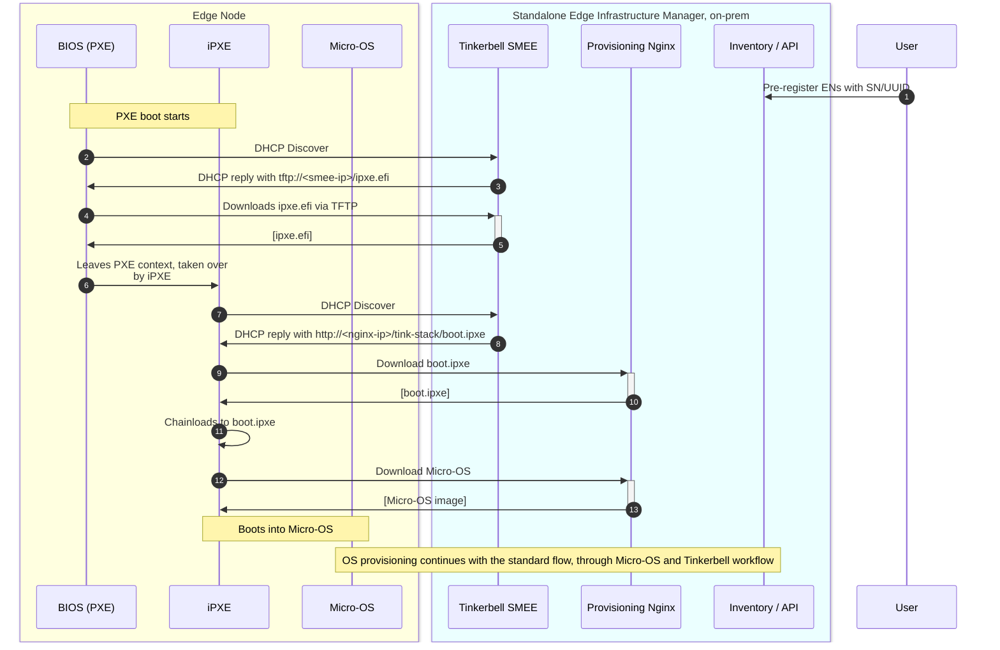
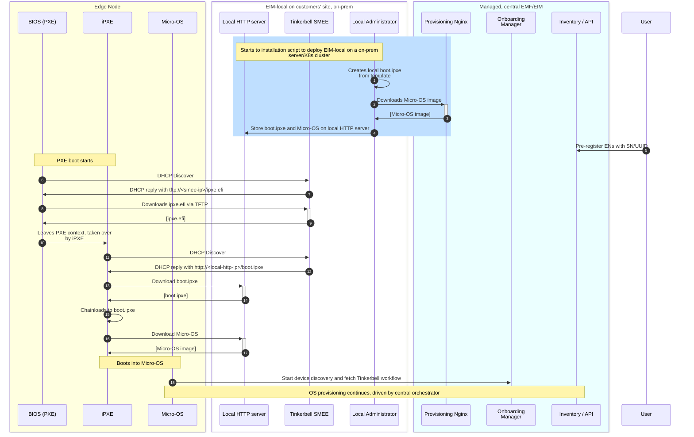

# Design Proposal: Scale provisioning of EMT-S edge node supporting OXM workflow

Author(s): EIM team.

Last updated: 09.05.2025

## Abstract

The Edge Microvisor Toolkit Standalone (EMT-S) node is designed to enable enterprise customers and developers to evaluate Intel silicon-based platforms for Edge AI use cases. In this context, Original Equipment Manufacturers (OXMs) play a critical role by preparing edge nodes in bulk for end customers at their facilities before shipping them to the deployment locations. To support the OXM workflow for Edge AI use cases, it is essential to implement a scalable provisioning solution for multiple EMT-S nodes. This document outlines the design proposal for enabling large-scale provisioning of EMT-S edge nodes to meet the requirements of the OXM workflow.

### Proposal Summary

EIM leverages the Tinkerbell solution for provisioning operating systems on edge nodes. The current implementation supports OS provisioning via bootable USB or iPXE/HTTPs boot. To enable scalable provisioning of EMT-S edge nodes for the OXM workflow, this proposal suggests integrating PXE-based provisioning into EIM by utilizing the `smee` (formerly `boots`) component of Tinkerbell. Additionally, EMF and EIM will support configurations to deploy an EIM only profile (referred in this document as EIM-S), tailored for OXMs to efficiently provision edge nodes at scale. OXM will have the option of provisioning edge nodes using bootable USB, iPXE/HTTPs boot, or PXE-based provisioning. The solution will also include a user experience (UX) for pre-registering edge nodes using serial numbers, UUIDs, or MAC addresses. Furthermore, the solution will support the provisioning of different operating system profiles based on the selected identifiers. In cases where a device on the local area network (LAN) boots over PXE and is not pre-registered, the default operating system will be provisioned

### MVP requirements

Following are the MVP requirements for the scale provisioning of EMT-S edge node supporting OXM workflow:

- Provision multiple BareMetal edge nodes without onboarding for the purpose of standalone/singleton use.
- Provide deploy a service on the local network that can achieve this provisioning at scale.
- Deploy the provisioning service on the local network that support PXE Boot (BIOS/UEFI with DHCP + TFTP) boot and iPXE with HTTPs.  
- Have a UX to pre-register BareMetal edge nodes using Serial number or UUID or MAC address.
- Provision different OS profiles to different edge nodes selected based on Serial number or UUID or MAC address.
- Provision default OS when a device on the LAN boots over PXE and is not pre-registered.
- Have a ux of  collecting provisioning logs and status of edge nodes.

> Note: It might be possible for EMF-EIM to support provisioning of the EMT-S nodes. supporting this capability as part of MVP depends on any active customer requirements.

## Solution

The solution consists of two major enhancements (modifications) to EMF:
1) **Support legacy PXE boot to scale EMT-S provisioning** - the EIM will be extended with a local DHCP/TFTP server that helps initiate OS provisioning via legacy PXE boot. 
2) **Use EIM standalone deployment** - the proposed solution involves deploying a specific EMF profile, referred to as EIM standalone profile. 
   at the customer's premises, specifically the OXM warehouse. This streamlined EMF profile to include EIM only will comprise only the essential components necessary for operating system provisioning. 
   It is important to note that the EIM standalone will not be a separate branch or fork of the existing EMF EIM system. 
   The deployment strategy will utilize configuration settings at deployment time within the EMF to ensure that only the required features are activated.
   The detailed design for the deployment time configuration and profile settings for both EMF and EIM will be addressed in a separate design document.

### Legacy PXE provisioning workflow

The solution relies on the capabilities provided by Tinkerbell SMEE. SMEE provides a minimal DHCP and TFTP server implementations that support PXE boot.
The DHCP server provides necessary PXE info to machines initiating the PXE boot, while the TFTP server provides the iPXE binary that can be chain-loaded at boot time by PXE.
The iPXE binary provided by the SMEE's TFTP server is a third-party script, maintained by the Tinkerbell project.

The solution assumes that the local EIM-provided DHCP/TFTP server is only used to initiate boot via legacy PXE (as legacy PXE has limited capabilities, i.e., it doesn't support HTTPS boot),
but, once chain-loaded to iPXE, the Micro-OS is downloaded and used to drive provisioning.
In other words, the only difference between the new PXE-based boot and HTTP-based boot is how the OS provisioning is triggered. The subsequent workflow remains the same -
it leverages Micro-OS, device discovery and Tinkerbell workflow to complete OS provisioning.

**NOTE1**: Customers should provide their own local DHCP server for dynamic IP address assignment.

**NOTE2**: The workflow assumes that the EIM Standalone is deployed locally on customers' premises and ENs have direct connectivity with EIM services.

The high-level PXE-based provisioning workflow is as follows:

1. Users perform standard EN registration via UI or Bulk Import Tool. For each EN we can define OS profile and additonal settings (e.g., site, local account).
2. ENs on site start PXE boot. They initiate DHCP discovery.
3. DHCP requests are intercepted by Tinkerbell SMEE. It replies with a TFTP address pointing to itself. The Tinkerbell SMEE provides default iPXE environment (e.g., `ipxe.efi`).
   It supports a range of different PXE architectures (see [link](https://github.com/tinkerbell/smee/blob/c0443b87cec44bf5d7d0028c876ea3be4f4d3d47/internal/dhcp/dhcp.go#L44)).
4. `ipxe.efi` is downloaded to PXE environment.
5. EN leaves PXE context and loads iPXE execution environment.
6. iPXE must perform a separate DHCP discovery as EN left PXE context. It sends DHCP requests with another User-Class (`Tinkerbell`).
7. This time, Tinkerbell SMEE replies with the HTTP URL to `boot.ipxe`. The decision on what to return is based on the User-Class.
8. iPXE gets DHCP reply with HTTP URL to EIM's Provisioning Nginx. Note that this is a plain HTTP endpoint (without TLS) because the `ipxe.efi` provided by SMEE
   doesn't include orchestrator's CA certificate and the download would fail. We elaborate more on this below. 
9. iPXE downloads `boot.ipxe` via HTTP from Provisioning Nginx. `boot.ipxe` is our EIM-provided iPXE script that downloads and boots into Micro-OS.
10. `boot.ipxe` is downloaded.
11. iPXE chain-loads to `boot.ipxe`.
12. `boot.ipxe` downloads Micro-OS image from the HTTP endpoint of Provisioning Nginx.

Once Micro-OS is downloaded, EN boots into it and the standard process is continued - device discovery is done and Tinkerbell workflow started to provision target OS.

The following modifications to EIM must be made to support the above workflow:

1. **Enable Tinkerbell SMEE with proper configuration**

By default, Tinkerbell SMEE relies on MAC addresses to uniquely identify PXE-booting machines and customize the iPXE script per machine.
In the case of EIM, we use a static iPXE script that is not customized per Edge Node. Therefore, we can avoid using MAC address as a unique identifier
and it will let use avoid adding MAC address as another EN identifier during pre-registration. We also need to configure Tinkerbell to provide URL to `boot.ipxe` via DHCP reply.

The following modifications are needed:

- Tinkerbell SMEE must be enabled via infra-charts to provide DHCP and TFTP server
- Tinkerbell SMEE must be configured with the following flags to avoid lookups by MAC address and to use our EIM iPXE script:
  - `-dhcp-mode=auto-proxy`
  - `-dhcp-http-ipxe-script-url=<URL to iPXE script on Provisioning NGINX>` (e.g., `http://tinkerbell-nginx.CLUSTER_DOMAIN/tink-stack/boot.ipxe`)
  - `-dhcp-http-ipxe-script-prepend-mac=false`

2. **Expose Provisioning Nginx via HTTP for on-prem EIM standalone only**

Currently, Provisioning Nginx is deployed behind HTTPS and the iPXE binary must be built with orchestrator's CA certificate for successful handshake.
Tinkerbell SMEE obviously doesn't include the EMF's CA certificate. Therefore, any communication over HTTPS is not feasible.

For on-prem, EIM standalone profile only we will disable HTTPS for Provisioning Nginx. The assumption is that the on-prem, customers' sites are typically
controlled environments and we can relax security requirements to support PXE boot (any traffic doesn't leave a local L2 network).

3. **Expose Tinkerbell SMEE's DHCP/TFTP server via K8s External IP**

Tinkerbell SMEE's DHCP/TFTP server must be reachable from a local, on-prem L2 network to handle DHCP/TFTP requests. This requires modifications to FPS services.

#### Alternative workflow with managed EMF

In some cases it may be desirable for users to scale EMT-S provisioning via legacy PXE, but the EMF (or EIM) is deployed in a central location.
This solution also enables the PXE boot when the entire EMF (or EIM Standalone) is deployed as remote, cloud-based, managed solution (not on-prem).

In this alternative there is only a small local piece of EIM (called "EIM-local" hereinafter) deployed on site (via installation script provided by EIM team).
The EIM-local assists in the initial PXE boot and make possible for ENs to initiate boot via PXE. Once booted into Micro-OS, the provisioning process is taken over by the cloud-based orchestrator.

The EIM-local consists of the following components:
1. **Standalone Tinkerbell SMEE** providing DHCP/TFTP server to support legacy PXE boot.
2. **Local HTTP server** (e..g, Nginx) storing mirrors of `boot.ipxe` and Micro-OS image.
3. (OPTIONAL) **K8s cluster with MetalLB extension** to make Standalone SMEE's DHCP/TFTP servers accessible from a local network. Only needed if EIM-local is deployed on top of Kubernetes.
   Note that the EIM-local can also be deployed as standalone OS services or Docker containers with `--network=host`.

**NOTE1:** Local HTTP server providing `boot.ipxe` and Micro-OS image is needed to overcome HTTPS issue as
SMEE's built-in iPXE doesn't include EMF's CA certificate. This alternative design assumes no modifications to Tinkerbell SMEE, for simplicity.
However, an EIM-owned `signed_ipxe.efi` with EMF's CA certificate embedded may also be provided by local TFTP server, removing the need for local HTTP server.
This effectively requires creating a fork of Tinkerbell SMEE to enable serving EIM iPXE. If we decide to follow this path it gives clear advantages:
1. Simplifies deployment and solves HTTPS issue
2. Give us more control over default iPXE script (i.e., for instrumentation purposes, non-standard customer requirements)
3. TFTP/DHCP servers are Go-based, so we can "catch" per-EN provisioning KPIs at the earlier stage than we do now.
4. Tinkerbell project is not actively developed anymore.

This design proposal doesn't pursue this option, but the idea is left for further discussion.

**NOTE2**: This alternative workflow assumes that all ENs have access to Internet and the cloud-based orchestrator.

The alternative workflow with managed EMF is presented below:

The workflow starts by customers deploying the EIM-local on their sites with installation scripts (**Steps 1-4**).
The goal of the installation script is to bootstrap Tinkerbell SMEE and local HTTP server (storing boot.ipxe) on a local bare-metal server or K8s cluster. 
It downloads all necessary artifacts from the Release Service and starts deployment of EIM-local. The Tinkerbell SMEE is configured to point to `boot.ipxe` on the local HTTP server.
The script also downloads Micro-OS image from the central orchestrator. The `boot.ipxe` is customized to point to a local HTTP server for Micro-OS download. Both `boot.ipxe` and Micro-OS are stored on local HTTP server.

In **Steps 6-9** the EN starts PXE boot with assistance of DHCP and TFTP servers.

Once the process is taken over by iPXE (Step 10), the `boot.ipxe` is downloaded by iPXE from the local HTTP server and chain-loaded (**Steps 11-15**).
The `boot.ipxe` script downloads Micro-OS from the local HTTP server and boots into it (**Steps 16-17**).
The Micro-OS has all necessary certificates to communicate with the central orchestrator. Micro-OS services start device discovery and Tinkerbell workflow to provision target OS.
From this point, EN goes through standard provisioning process.

### EIM standalone

The provisioning of EMT-S at scale will be driven by a local orchestrator instance that only includes EIM components. 
The main requirement of EIM standalone is to make it easy and resource-efficient for customers to deploy.

There are two approaches (see options below) to how we can configure EIM standalone to be more lightweight and faster to deploy.

This proposal makes a decision to proceed with Option 1 for 3.1 release, but Option 2 should be a target solution for EIM-S.

#### Option 1: A slimmed down deployment based on the current EIM Standalone profile

This approach will use the existing EIM standalone profile. This is an EMF deployment profile that only deploys EIM with Observability and FPS components.

#### Option 2: A minimal EIM deployment

Even the slimmed down version of EIM from Option 1 may not meet requirements for fast and easy deployment on-site.

This option is a radical approach to make EIM super-lightweight and reduce any FPS dependencies that are not essential to EIM. 
Note that this option requires some modifications to EIM components, as some of them rely on FPS components (e.g., Vault or Keylocak).

The minimal EIM deployment is mainly used to support OXM use cases, where EIM is only used to provision ENs that are further shipped to the target location.

The minimal EIM deployment at high level:
- No cluster and application orchestrator deployed.
- Simplified deployment with just Helm on a standard K8s cluster. No ArgoCD, Fleet, RKE2.
- A single tenant deployment, without the Multi-Tenancy/IAM framework. A default tenant will be created to "own" EIM resources.
- Reduced EIM with infra-core (without exporter, Tenant Controller), infra-onboarding and infra-managers
- Minimal set of FPS services. A rough minimum of FPS services that may be required by EIM are:
  - Postgres database
  - RS proxy
  - Vault (?)
  - Traefik
  - cert-manager
  - MetalLB
- Relaxed security requirements:
  - No Istio for inter-Pod communication security
  - No Kyverno for policies
- No UI deployed, the EN pre-registration is done via Bulk Import Tool, API or CLI tool.
- Limited observability stack that should only provide logs. No alerting, SRE, Prometheus.
- Abandon HA requirements - EIM-S is primarily a single-node, on-prem deployment. Any data loss can be backed by hardware-level redundancy. Think of EIM-S as Rancher Desktop or Virtualbox.

The minimal EIM deployment should consist of:
- infra-core without exporter and 

### Rationale

The current design proposal allows to easily support legacy PXE boot while keeping the current UX around EN pre-registration. It also lets us keep all the features that EIM currently supports,
including logging, KPI instrumentation, observability, etc.

The alternative considered was to use a standalone Tinkerbell deployment without the rest of the EIM stack. While it has advantage of a more lightweight deployment,
it would completely change the UX as we would need to familiarize customers with Tinkerbell APIs (or have a custom CLI tool to help them manage Tinkerbell CRDs).
With the current proposal we keep using the current UX, with possibility to use Bulk Import Tool to scale preregistration process and selectively choose OS profiles for Edge Nodes.

## Affected components and Teams

**FPS team** needs provide help for the following:
- Reduce FPS components to minimum to make EIM-S deployment lightweight
- Make EIM-S deployment operation easy in terms of number of CLI commands/steps to execute
- Make EIM-S deployment fast (ideally deployable in ~2 mins)
- Expose Tinkerbell SMEE's DHCP/TFTP server via External IP (similar to Provisioning Nginx now) or find any other solution to expose DHCP to local L2 network
- Provide a toggle to disable HTTPS for Provisioning Nginx in the case of EIM standalone deployment

**EIM team** responsible for slimming down deployment of EIM and enabling Tinkerbell SMEE with required configuration.

**Observability team**'s help may be needed to reduce size/capabilities of the observability stack for EIM-S (Option 2).

## Open issues

- By default, the provisioning flow will complete and all the agents will be installed, started and connected to the orchestrator instance that deployed them.
  We may need a way to stop the provisioning flow without installing and starting agents.
- In this solution, PXE boot will always be allowed for any device in a local subnet trying to initiate PXE boot.
  On the contrary, the Tinkerbell allows to control whether PXE boot is enabled/disabled for a device. For now, I don't see any need to control who is allowed to PXE-boot.
- If we needed to support ISO images for EMT-D, we would need to create a new OS profile. We would also need to add a new Tinkerbell action that supports flashing ISO images to the disk.
