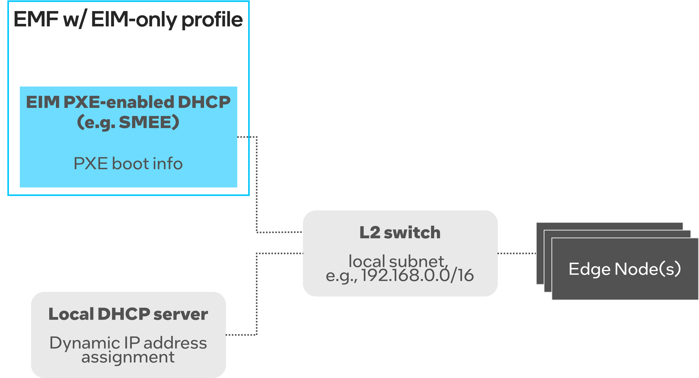
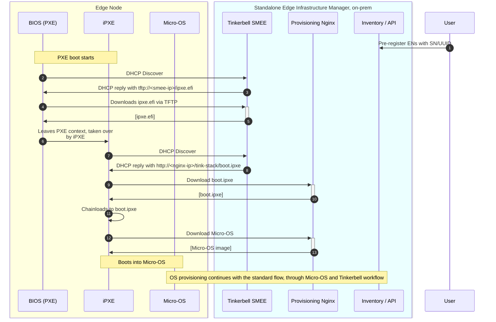

# Design Proposal: Scale provisioning of EMT-S edge node supporting OXM workflow

Author(s): EIM team.

Last updated: 09.05.2025

## Abstract

The Edge Microvisor Toolkit Standalone (EMT-S) node is designed to enable enterprise customers and developers to evaluate Intel silicon-based platforms for Edge AI use cases. In this context, Original Equipment Manufacturers (OXMs) play a critical role by preparing edge nodes in bulk for end customers at their facilities before shipping them to the deployment locations. To support the OXM workflow for Edge AI use cases, it is essential to implement a scalable provisioning solution for multiple EMT-S nodes. This document outlines the design proposal for enabling large-scale provisioning of EMT-S edge nodes to meet the requirements of the OXM workflow.

### Proposal Summary

EIM leverages the Tinkerbell solution for provisioning operating systems on edge nodes. The current implementation supports OS provisioning via bootable USB or iPXE/HTTPs boot. To enable scalable provisioning of EMT-S edge nodes for the OXM workflow, this proposal suggests integrating PXE-based provisioning into EIM by utilizing the `smee` (formerly `boots`) component of Tinkerbell. Additionally, EMF and EIM will support configurations to deploy an EIM only profile (referred in this document as EIM-S), tailored for OXMs to efficiently provision edge nodes at scale. OXM will have the option of provisioning edge nodes using bootable USB, iPXE/HTTPs boot, or PXE-based provisioning. The solution will also include a user experience (UX) for pre-registering edge nodes using serial numbers, UUIDs, or MAC addresses. Furthermore, the solution will support the provisioning of different operating system profiles based on the selected identifiers. In cases where a device on the local area network (LAN) boots over PXE and is not pre-registered, the default operating system will be provisioned

### MVP requirements

Following are the MVP requirements for the scale provisioning of EMT-S edge node supporting OXM workflow:

- Provision multiple BareMetal edge nodes without onboarding for the purpose of standalone/singleton use.
- Provide deploy a service on the local network that can achieve this provisioning at scale.
- Deploy the provisioning service on the local network that support PXE Boot (BIOS/UEFI with DHCP + TFTP) boot and iPXE with HTTPs.  
- Have a UX to pre-register BareMetal edge nodes using Serial number or UUID.
- Provision different OS profiles to different edge nodes selected based on Serial number or UUID.
- Provision default OS when a device on the LAN boots over PXE and is not pre-registered.
- Have a UX of collecting provisioning logs and status of edge nodes.
- Provide the same UX and EN capabilities as if an [EMT-S node is provisioned via USB](https://github.com/open-edge-platform/edge-microvisor-toolkit-standalone-node/tree/main/standalone-node).
- Edge Nodes cannot download anything directly from Internet

> Note: It might be possible for EMF-EIM to support provisioning of the EMT-S nodes. supporting this capability as part of MVP depends on any active customer requirements.

## Solution

The solution consists of three major enhancements (modifications) to EMF:
1) **Support legacy PXE boot to scale EMT-S provisioning** - the EIM will be extended with a local DHCP/TFTP server that helps initiate OS provisioning via legacy PXE boot.
   The legacy PXE boot uses the devices' PXE firmware to bootstrap into iPXE, which then continues the EN provisioning process.
2) **Extend usage of Platform Bundle to be compatible with USB-based EMT-S** - to be consistent with USB-based EMT-S, the EIM will consume Platform Bundle that contains all the scripts and files to install standalone K8s cluster and other customizations.
3) **Use EIM standalone deployment** - the proposed solution involves deploying a specific EMF profile, referred to as EIM standalone profile. 
   at the customer's premises, specifically the OXM warehouse. This streamlined EMF profile to include EIM only will comprise only the essential components necessary for operating system provisioning. 
   It is important to note that the EIM standalone will not be a separate branch or fork of the existing EMF EIM system. 
   The deployment strategy will utilize configuration settings at deployment time within the EMF to ensure that only the required features are activated.
   The detailed design for the deployment time configuration and profile settings for both EMF and EIM will be addressed in a separate design document.

### Legacy PXE provisioning workflow

The solution relies on the capabilities provided by Tinkerbell SMEE. SMEE provides a minimal DHCP and TFTP server implementations that support PXE boot.
The DHCP server provides necessary PXE info to machines initiating the PXE boot, while the TFTP server provides the iPXE binary that can be chain-loaded at boot time by PXE.
The iPXE binary provided by the SMEE's TFTP server is a third-party script, maintained by the Tinkerbell project.

The solution assumes that the local EIM-provided DHCP/TFTP server is only used to initiate boot via legacy PXE (as legacy PXE has limited capabilities, i.e., it doesn't support HTTPS boot),
but, once chain-loaded to iPXE, the Micro-OS is downloaded and used to drive provisioning.
In other words, the only difference between the new PXE-based boot and HTTP-based boot is how the OS provisioning is triggered. The subsequent workflow remains the same -
it leverages Micro-OS, device discovery and Tinkerbell workflow to complete OS provisioning.

The design proposal assumes the following network topology deployed on customers' sites:

- Edge Nodes and the EIM-only profile of EMF are deployed in the same local subnet. All ENs have direct L2 connectivity with EIM services.
- Local subnet must not be exposed to external world.
- The deployment scenario follows the Proxy DHCP scenario as described in [PXE specification, section 2.2.3](https://dimitrije.website/files/pxespec.pdf).
- We assume the existence of two DHCP servers:
  - EIM PXE-enabled DHCP server (e.g., Tinkerbell SMEE) - as described above, it serves PXE boot information. **The EIM PXE-enabled DHCP server is not intended
    to assign IP addresses.**
  - Local DHCP server - it acts as the standard DHCP server that provides dynamic IP addresses to ENs via DHCP.

**NOTE1**: Customers should provide their own local DHCP server for dynamic IP address assignment.

The high-level PXE-based provisioning workflow is as follows:

1. Users perform standard EN registration via UI or Bulk Import Tool. For each EN we can define OS profile and additonal settings (e.g., site, local account).
2. ENs on site start PXE boot. They initiate DHCP discovery.
3. DHCP requests are intercepted by Tinkerbell SMEE. It replies with a TFTP address pointing to itself. The Tinkerbell SMEE provides default iPXE environment (e.g., `ipxe.efi`).
   It supports a range of different PXE architectures (see [link](https://github.com/tinkerbell/smee/blob/c0443b87cec44bf5d7d0028c876ea3be4f4d3d47/internal/dhcp/dhcp.go#L44)).
4. `ipxe.efi` is downloaded to PXE environment.
5. EN leaves PXE context and loads iPXE execution environment.
6. iPXE must perform a separate DHCP discovery as EN left PXE context. It sends DHCP requests with another User-Class (`Tinkerbell`).
7. This time, Tinkerbell SMEE replies with the HTTP URL to `boot.ipxe`. The decision on what to return is based on the User-Class.
8. iPXE gets DHCP reply with HTTP URL to EIM's Provisioning Nginx. Note that this is a plain HTTP endpoint (without TLS) because the `ipxe.efi` provided by SMEE
   doesn't include orchestrator's CA certificate and the download would fail. We elaborate more on this below. 
9. iPXE downloads `boot.ipxe` via HTTP from Provisioning Nginx. `boot.ipxe` is our EIM-provided iPXE script that downloads and boots into Micro-OS.
10. `boot.ipxe` is downloaded.
11. iPXE chain-loads to `boot.ipxe`.
12. `boot.ipxe` downloads Micro-OS image from the HTTP endpoint of Provisioning Nginx.

Once Micro-OS is downloaded, EN boots into it and the standard process is continued - device discovery is done and Tinkerbell workflow started to provision target OS.

The following modifications to EIM must be made to support the above workflow:

1. **Enable Tinkerbell SMEE with proper configuration**

By default, Tinkerbell SMEE relies on MAC addresses to uniquely identify PXE-booting machines and customize the iPXE script per machine.
In the case of EIM, we use a static iPXE script that is not customized per Edge Node. Therefore, we can avoid using MAC address as a unique identifier
and it will let use avoid adding MAC address as another EN identifier during pre-registration. We also need to configure Tinkerbell to provide URL to `boot.ipxe` via DHCP reply.

The following modifications are needed:

- Tinkerbell SMEE must be enabled via infra-charts to provide DHCP and TFTP server
- Tinkerbell SMEE must be configured with the following flags to avoid lookups by MAC address and to use our EIM iPXE script:
  - `-dhcp-mode=auto-proxy`
  - `-dhcp-http-ipxe-script-url=<URL to iPXE script on Provisioning NGINX>` (e.g., `http://tinkerbell-nginx.CLUSTER_DOMAIN/tink-stack/boot.ipxe`)
  - `-dhcp-http-ipxe-script-prepend-mac=false`

2. **Expose Provisioning Nginx via HTTP for on-prem EIM standalone only**

Currently, Provisioning Nginx is deployed behind HTTPS and the iPXE binary must be built with orchestrator's CA certificate for successful handshake.
Tinkerbell SMEE obviously doesn't include the EMF's CA certificate. Therefore, any communication over HTTPS is not feasible.

For on-prem, EIM standalone profile only we will disable HTTPS for Provisioning Nginx. The assumption is that the on-prem, customers' sites are typically
controlled environments and we can relax security requirements to support PXE boot (any traffic doesn't leave a local L2 network).

3. **Expose Tinkerbell SMEE's DHCP/TFTP server via K8s External IP**

Tinkerbell SMEE's DHCP/TFTP server must be reachable from a local, on-prem L2 network to handle DHCP/TFTP requests. This requires modifications to FPS services.

### Compatibility with USB-based EMT-S

Target capabilities and UX of EMT-S provisioned at scale must be consistent with the existing USB-based flow for EMT-S provisioning.
It means that the target OS configuration must be exactly the same as done via [scripts that provisions EMT-S with USB](https://github.com/open-edge-platform/edge-microvisor-toolkit-standalone-node/tree/main/standalone-node).

From the end product (deployed EMT OS) perspective, the main differences between USB-based EMT-S and EIM-provisioned EMT-S are:
- The OS image is read from USB device, while EIM-based approach won't assume USB device is injected to all hundreds of ENs. OS image will be downloaded from Release Service.
- Local OS user and SSH key is configured on USB-based EMT-S. We can achieve the same with EIM by using Local Account feature (requires proper user documentation).
- USB-based EMT-S loads `collect-logs.sh` script that is used to grab logs from ENs. This is a gap with EIM-based approach, as EIM doesn't inject any such file to target OS.
- USB-based EMT-S installs **SEN K8s cluster package** with **custom cloud-init** and installation scripts to deploy K8s cluster on EMT-S. This is another gap with EIM-based approach.

As agreed, the EMT-S image will include all cluster dependencies (base K8s binaries + cluster extensions) baked into the EMT-S image.
The same EMT-S image will be used for USB-based and at-scale approach. EMF OXM profile will include a separate OS profile for EMT-S that will leverage the custom EMT-S image with all extensions.

If needed, a dedicated Tinkerbell workflow will be created to provision EMT-S OS profile. The new Tinkerbell workflow would need to mimic behavior of [EMT-S OS installation script](https://github.com/open-edge-platform/edge-microvisor-toolkit-standalone-node/blob/main/standalone-node/hook_os/files/install-os.sh).

Other EN configurations that are required for EMT-S will be provided as follows:
- EN Proxy settings can be provided as EIM orchestrator settings
- SSH key to EMT-S nodes can be provided via Local Account
- EN username/password credentials can be provided in DEV mode via EIM cluster settings

#### Code hygiene

We should unify actions done via USB-based EMT-S and Tinkerbell workflow. For instance, USB-based EMT-S uses [enable-dmv](https://github.com/open-edge-platform/edge-microvisor-toolkit-standalone-node/blob/main/standalone-node/hook_os/files/enable-dmv.sh) script,
that is almost equal to Tinker action doing the same.

Ideally, EMT-S OS installation scripts should act as a "standalone Tink worker" that reads Tinkerbell YAML file and executes all steps as defined there.
We won't be there yet for 3.1, but this should be a direction for us, so that we don't have diverged codebases.

### Detach of Edge Nodes

Once ENs are provisioned and ready to be shipped to the field to operate as standalone ENs, they should be detached from the local EMF orchestrator.
An explicit detach would be needed if there are agents' configurations, certificates, credentials, etc. installed on ENs.
However, **BM agents won't be configured and activated for EMT-S OS profiles**. Therefore, the only operation to detach ENs from the orchestrator is to delete them via northbound API.
This is already supported via UI or CLI.

### OXM profile of EMF deployment (EIM-S)

The provisioning of EMT-S at scale will be driven by a local OXM orchestrator instance that only includes EIM components. 
The main requirement of EIM standalone is to make it easy and resource-efficient for customers to deploy.

For MVP, we will leverage the EIM Standalone profile. This is an EMF deployment profile that only deploys EIM with Observability and FPS components.
Also, EIM won't include `infra-managers` for the OXM profile.

EIM Standalone profile for minimal OXM warehouse deployments will be configured with EMT-Standalone OS profile only.

Any further optimization to make EIM deployment fast and easy will be handled as part of the effort on the new installer (see [ADR](https://github.com/open-edge-platform/edge-manageability-framework/pull/290)).
To give an example, further optimizations may include deploying EIM as a self-contained Helm chart (instead of ArgoCD appplication) and getting rid of FPS services that are
not required (e.g., Argo, Istio, HA capabilities, etc.).

### Rationale

The current design proposal allows to easily support legacy PXE boot while keeping the current UX around EN pre-registration. It also lets us keep all the features that EIM currently supports,
including logging, KPI instrumentation, observability, etc. The EN pre-registration also enables selectively configuring desired OS profile per EN and acts as
admission control to prevent unwanted ENs being provisioned to EMF "magically". 

The alternative considered was to use a standalone Tinkerbell deployment without the rest of the EIM stack. While it has advantage of a more lightweight deployment,
it would completely change the UX as we would need to familiarize customers with Tinkerbell APIs (or have a custom CLI tool to help them manage Tinkerbell CRDs).
With the current proposal we keep using the current UX, with possibility to use Bulk Import Tool to scale preregistration process and selectively choose OS profiles for Edge Nodes.

Also, an alternative to using SMEE was considered to avoid divergence in security policies (HTTP vs. HTTPS for Provisioning Nginx).
This direction requires more development effort, but is still left as future improvement. It's further elaborated in a separate [design proposal](https://github.com/open-edge-platform/edge-manageability-framework/pull/309).

#### (Alternative) Install K8s package via Platform Bundle

The plan to install K8s package via Platfrom Bundle is as follows:
- The gap will be covered by extending the use of **_Platform Bundle_** to provide additional files to provisioned EN. The details of how the Platform Bundle will be extended are described [here](https://github.com/open-edge-platform/edge-manageability-framework/pull/318).
- The extended Platform Bundle will contain a tarball package that contains all additional files for EMT-S, namely **SEN K8s cluster package**, **custom cloud-init**, and `collect-logs.sh`
- A new OS profile ("EMT Standalone") will be created and configured with extended Platform Bundle. The Platform Bundle files will be provisioned to ENs as described in the [design proposal](https://github.com/open-edge-platform/edge-manageability-framework/pull/318).
- EMT-S repository will have to be extended with CI/CD pipeline to push EMT-S Platform Bundle to Release Service.

The EMT-S Platform Bundle should contain:
- `/etc/cloud/cloud.cfg.d/installer.cfg` - [EMT-S cloud init](https://github.com/open-edge-platform/edge-microvisor-toolkit-standalone-node/blob/main/standalone-node/hook_os/files/cloud-init.yaml)
- `/opt/sen-rke2-package.tar.gz` with all cluster installation files
- `/etc/cloud/collect-logs.sh` with the script to [collect EMT-S logs](https://github.com/open-edge-platform/edge-microvisor-toolkit-standalone-node/blob/main/standalone-node/hook_os/files/collect-logs.sh)

The high-level integration workflow would be:
1. The EMT-S repo will have a CI/CD to generate tarball package and push it to Release Service.
2. OS profile will define Platform Bundle containing the generated RS artifact with tarball package.
3. EMF will deploy EIM Standalone profile that only contains the "EMT Standalone" OS profile.
4. During EN provisioning, Onboarding Manager will generate Tinkerbell workflow step to download install the tarball package to target OS.
5. During Micro-OS stage, there will be a dedicated Tinker action that downloads the tarball package from Release Service and writes it to the target OS location, under specified path.
6. Once OS is booting, we assume all files are already written to target OS filesystem and custom cloud-init can be executed to install K8s cluster.

## Affected components and Teams

**FPS team** needs provide help for the following:
- Reduce FPS components to minimum to make EIM-S deployment lightweight
- Make EIM-S deployment operation easy in terms of number of CLI commands/steps to execute
- Make EIM-S deployment fast (ideally deployable in ~2 mins)
- Expose Tinkerbell SMEE's DHCP/TFTP server via External IP (similar to Provisioning Nginx now) or find any other solution to expose DHCP to local L2 network
- Provide a toggle to disable HTTPS for Provisioning Nginx in the case of EIM standalone deployment

**EIM team** will make changes to the following components:

- **infra-charts**
  - Enable Tinkerbell SMEE and possibly move to separate Helm chart so that SMEE can be run as standalone piece or Deployment Package 
  - Upgrade Tinkerbell SMEE version to support `auto-proxy`
  - Modify deployment files to expose SMEE to L2 network to handle DHCP requests  
- **Documentation**
  - Document the scale EMT-S provisioning flow
  - Document the PXE boot provisioning setup with network requirements and desired configuration
- TBC

## Open issues

- In this solution, PXE boot will always be allowed for any device in a local subnet trying to initiate PXE boot.
  On the contrary, the Tinkerbell allows to control whether PXE boot is enabled/disabled for a device. For now, we won't have any control to who is allowed to PXE-boot, but
  the admission control will be done at later stage (once EMF's iPXE is chainloaded).
- If we needed to support ISO images for EMT-D, we would need to create a new OS profile. We would also need to add a new Tinkerbell action that supports flashing ISO images to the disk.
