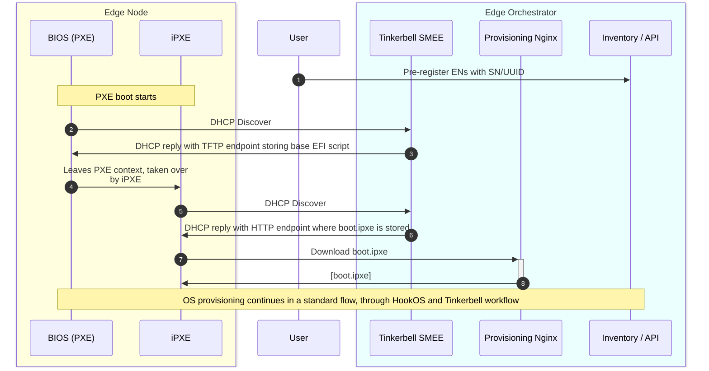

# Design Proposal: Scale provisioning of EMT-S edge node supporting OXM workflow

Author(s): EIM team.

Last updated: 29.04.2025

## Abstract

The Edge Microvisor Toolkit Standalone (EMT-S) node is designed to enable enterprise customers and developers to evaluate Intel silicon-based platforms for Edge AI use cases. In this context, Original Equipment Manufacturers (OXMs) play a critical role by preparing edge nodes in bulk for end customers at their facilities before shipping them to the deployment locations. To support the OXM workflow for Edge AI use cases, it is essential to implement a scalable provisioning solution for multiple EMT-S nodes. This document outlines the design proposal for enabling large-scale provisioning of EMT-S edge nodes to meet the requirements of the OXM workflow.

### Proposal Summary

EIM leverages the Tinkerbell solution for provisioning operating systems on edge nodes. The current implementation supports OS provisioning via bootable USB or iPXE/HTTPs boot. To enable scalable provisioning of EMT-S edge nodes for the OXM workflow, this proposal suggests integrating PXE-based provisioning into EIM by utilizing the `smee` (formerly `boots`) component of Tinkerbell. Additionally, EMF and EIM will support configurations to deploy this as a standalone EIM solution (to be referred in future as EIM-S), tailored for OXMs to efficiently provision edge nodes at scale. OXM will have the option of provisioning edge nodes using bootable USB, iPXE/HTTPs boot, or PXE-based provisioning. The solution will also include a user experience (UX) for pre-registering edge nodes using serial numbers, UUIDs, or MAC addresses. Furthermore, the solution will support the provisioning of different operating system profiles based on the selected identifiers. In cases where a device on the local area network (LAN) boots over PXE and is not pre-registered, the default operating system will be provisioned

### MVP requirements

Following are the MVP requirements for the scale provisioning of EMT-S edge node supporting OXM workflow:

- Provision multiple BareMetal edge nodes without onboarding for the purpose of standalone/singleton use.
- Provide deploy a service on the local network that can achieve this provisioning at scale.
- Deploy the provisioning service on the local network that support PXE Boot (BIOS/UEFI with DHCP + TFTP) boot and iPXE with HTTPs.  
- Have a UX to pre-register BareMetal edge nodes using Serial number or UUID or MAC address.
- Provision different OS profiles to different edge nodes selected based on Serial number or UUID or MAC address.
- Provision default OS when a device on the LAN boots over PXE and is not pre-registered.
- Have a ux of  collecting provisioning logs and status of edge nodes.

> Note: It might be possible for EMF-EIM to support provisioning of the EMT-S nodes. supporting this capability as part of MVP depends on any active customer requirements.

## Solution

The solution assumes that we will deploy a slimmed down version of EIM (aka EIM standalone) on a customer's premises (OXM warehouse). The slimmed-down EIM
should only consist of required components to drive OS provisioning. The EIM standalone will not be a fork of EIM. The approach will be deployment time configuration of EMF to deploy only what the required features. The design for the deployment time configuration/profile for EMF and EIM will be handled in another design document.

### Slimmed-down EIM

The provisioning of EMT-S at scale will be driven by a local orchestrator instance that will be slimmed down to include only necessary components. In a nutshell,
it will consist of:

- Foundational Platform Services that are required to deploy and run the orchestrator instance.
- Limited observability stack that should only provide logs.
- A reduced flavor of EIM - only infra-core and infra-onboarding will be deployed (no infra-managers as they won't be used by EMT-S).
- Limited Web UI with EIM only.
- No cluster and application orchestrator deployed.
- Abandon HA requirements - EIM-S is primarily a single-node, on-prem deployment. Any data loss can be backed by hardware-level redundancy. Think of EIM-S as Rancher Desktop or Virtualbox.

FPS components that are essential to EIM are:

- IAM, Multi-Tenancy components
- Keycloak
- RS-proxy
- Vault
- secrets-config
- MetalLB services

The following FPS/Observability components should be disabled:

- Kyverno
- Prometheus and all metrics-related components (including infra-core's exporter, Mimir)
- SRE exporter
- Alerting monitors
- Loki should be scaled down to minimal deployment

**The installation of EIM-S should become a one-line command operation.**

### PXE-based provisioning workflow

For MVP we will heavily rely on capabilities provided by Tinkerbell SMEE. We will leverage DHCP and TFTP server implementations from SMEE and only make several modifications to the
EIM stack.

By default, Tinkerbell SMEE relies on MAC addresses to uniquely identify PXE-booting machines and customize the iPXE script per machine.
In the case of EIM, we use a static iPXE script that is not customized per Edge Node. Therefore, we can avoid using MAC address as a unique identifier
and it will let use avoid adding MAC address as another EN identifier during pre-registration.

The below flow will be feasible to achieve with minimal modifications to the EIM stack. The following changes must be made:

- Tinkerbell SMEE must be enabled via infra-charts to provide DHCP and TFTP server
- Tinkerbell SMEE must be configured with the following flags to avoid lookups by MAC address and to use our EIM iPXE script:
  - `-dhcp-mode=auto-proxy`
  - `-dhcp-http-ipxe-script-url=<URL to iPXE script on Provisioning NGINX>` (e.g., `https://tinkerbell-nginx.CLUSTER_DOMAIN/tink-stack/boot.ipxe`)
  - `-dhcp-http-ipxe-script-prepend-mac=false`
- We may need to slightly adjust the `boot.ipxe` that is produced by DKAM to meet PXE boot requirements
- We need to revise how we sign iPXE script and HookOS image - in the PXE-based provisioning flow we shouldn't upload any certificates/SB keys.
- We may want to have a minimal Tinkerbell workflow for EMT-S (e.g., we don't need to install cloud-init since EMT-S nodes won't be connected to the same orchestrator instance, likely)

Notes:

- Similar to the standard flow - If EN is not pre-registered, the process will fallback to Interactive Onboarding waiting for a user to provide credentials.
- Similar to the standard flow - If EN is pre-registered, but the OS profile is not selected, the default OS will be provisioned.
- In Step 3, SMEE returns an URL to EFI script that is stored on SMEE'S TFTP server. This operation is fully handled by SMEE and it supports various of hardware PXE architectures:
  <https://github.com/tinkerbell/smee/blob/main/internal/dhcp/dhcp.go#L44>.
- In Step 6, SMEE replies with HTTP(S) URL to iPXE script stored on Provisioning Nginx. We need custom SMEE configuration (mentioned above) to make it happen.
- The rest of steps after Step 6 follows the existing OS provisioning flow. In summary, the difference between HTTPS-based boot and PXE boot is how the iPXE script is triggered.

### Rationale

The current design proposal allows to easily support legacy PXE boot while keeping the current UX around EN pre-registration. It also lets us to keep all the features that EIM currently supports,
including logging, KPI instrumentation, observability, etc.

The alternative considered was to use a standalone Tinkerbell deployment without the rest of the EIM stack. While it has clear advantage of a more lightweight deployment,
it would completely change the UX as we would need to familiarize customers with Tinkerbell APIs (or have a custom CLI tool to help them manage Tinkerbell CRDs).
With the current proposal we keep using the current UX, with possibility to use Bulk Import Tool to scale preregistration process and selectively choose OS profiles for Edge Nodes.

## Affected components and Teams

- **FPS team** should work with the help of EIM team on slimming down the FPS components to meet EIM-S requirements.
- **EIM team** responsible for slimming down deployment of EIM and enabling Tinkerbell SMEE with required configuration.

## Open issues

- By default, the provisioning flow will complete and all the agents will be installed, started and connected to the orchestrator instance that deployed them.
  We may need a way to stop the provisioning flow without installing and starting agents.
- In this solution, PXE boot will always be allowed for any device in a local subnet trying to initiate PXE boot.
  On the contrary, the Tinkerbell allows to control whether PXE boot is enabled/disabled for a device. For now, I don't see any need to control who is allowed to PXE-boot.
- If we needed to support ISO images for EMT-D, we would need to create a new OS profile. We would also need to add a new Tinkerbell action that supports flashing ISO images to the disk.
