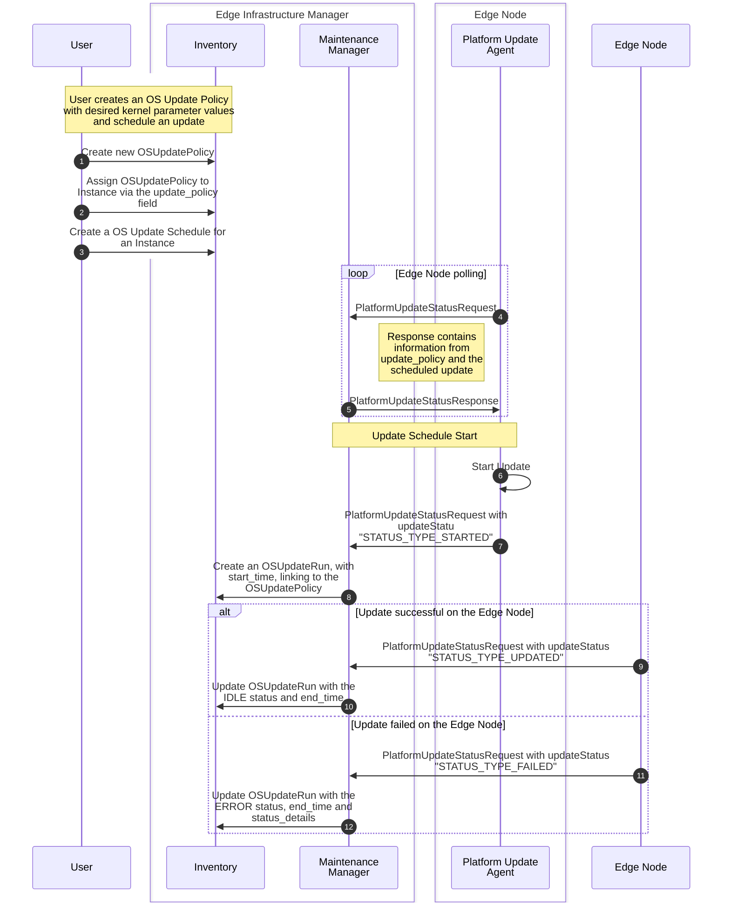

# Design Proposal: Kernel parameter update on Edge Nodes

## Abstract

This document proposes a mechanism to manage kernel parameters on edge nodes in Edge Manageability Framework (EMF).
Kernel parameters are crucial for tuning the operating system to meet the specific performance, security, and resource
constraints of diverse edge environments. The ability to remotely modify these parameters is an essential feature for
managing and optimizing edge nodes at scale.

## Proposal

The proposed mechanism allows for the update of kernel parameters on edge nodes as a day-2 operation.
The update process is exclusively managed through the Orch-cli.
A user specifies the desired kernel parameters within the `OSUpdatePolicy` object.
Subsequently, the user schedules a maintenance window.
During this window, the Maintenance Manager (MM) and Platform Update Agent (PUA) will apply the specified
kernel parameters to the target EdgeNode.

Kernel Parameter workflow

### Proposed changes

#### EIM and Maintenance Manager

The validation logic that blocks kernel parameter updates for immutable operating systems will be removed.
This change enables kernel parameter modifications on all supported OS types, ensuring consistent manageability.

#### Platform Update Agent (PUA)

The Platform Update Agent (PUA) will be updated to manage kernel parameter modifications on immutable operating systems.
The current implementation, which disallows these changes, will be refactored to provide a unified update mechanism for
both mutable and immutable operating systems. This ensures a consistent application of kernel parameters across all
supported OS types.

#### Orch-CLI

- Update Orch-cli to pass kernel parameter as part of OSProfileUpdate.
- Schedule the Edgenode in maintainance mode so that Kernel Paramter changes can be applied.

### Limitation

- On EMT the Kernel parameter can be applied only in non Secure boot mode.
