# Design Proposal: Keycloak Maintenance Theme

Author(s): [Your Name]

Last updated: January 20, 2026

## Abstract

This proposal introduces a custom maintenance theme for Keycloak to provide a user-friendly maintenance page during planned system downtime or upgrades. Currently, when maintenance is required, users encounter generic error pages. The proposed solution adds a dedicated "maintenance" theme that can be easily activated to display a clear, professional maintenance notice to users attempting to authenticate during maintenance windows.

## Problem Statement

During maintenance periods for the Edge Orchestrator, users attempting to log in through Keycloak receive either:
- Generic connection errors that don't clearly communicate the maintenance status
- Confusing technical error messages
- No professional maintenance notification

This results in:
- Poor user experience during maintenance periods
- Increased support burden with users unsure if there's a real issue
- Lack of professional communication about planned downtime
- No standardized way to communicate maintenance status across the platform

## Proposal

### Custom Maintenance Theme Implementation

Add a custom Keycloak login theme named "maintenance" that displays a clear, user-friendly maintenance message. The theme will be:
- Packaged as a ConfigMap in Kubernetes for easy deployment and updates
- Mounted into the Keycloak container at the standard theme location
- Switchable by changing the `loginTheme` configuration in the Keycloak realm settings
- Based on the default Keycloak theme structure for consistency

### Theme Structure

The maintenance theme consists of two files:
1. **theme.properties** - Declares the theme inheritance from the base Keycloak theme
2. **login.ftl** - Custom FreeMarker template that renders the maintenance page

### Maintenance Page Features

The custom login page includes:
- Clear "System Maintenance" header
- Visual warning icon with pulse animation for attention
- Informative message: "The Edge Orchestrator is currently undergoing maintenance"
- User guidance: "Please try again later"
- Professional styling consistent with the platform's design language
- Responsive CSS that works across different screen sizes

### Configuration Changes

The implementation requires modifications to `argocd/applications/configs/platform-keycloak.yaml`:

1. **Volume Configuration** - Add ConfigMap volume for theme files:
   ```yaml
   extraVolumes:
     - name: maintenance-theme
       configMap:
         name: keycloak-maintenance-theme
   ```

2. **Volume Mounts** - Mount theme files to Keycloak's theme directory:
   ```yaml
   extraVolumeMounts:
     - name: maintenance-theme
       mountPath: /opt/bitnami/keycloak/themes/maintenance/login/theme.properties
       subPath: login.theme.properties
     - name: maintenance-theme
       mountPath: /opt/bitnami/keycloak/themes/maintenance/login/login.ftl
       subPath: login.login.ftl
   ```

3. **ConfigMap Deployment** - Deploy the theme files as a ConfigMap:
   ```yaml
   extraDeploy:
     - apiVersion: v1
       kind: ConfigMap
       metadata:
         name: keycloak-maintenance-theme
         namespace: orch-platform
       data:
         login.theme.properties: |
           parent=keycloak
           import=common/keycloak
         login.login.ftl: |
           [FreeMarker template content]
   ```

4. **Default Theme Setting** - Explicitly set default login theme:
   ```yaml
   "loginTheme": "keycloak"
   ```

### Architecture Diagram

```mermaid
flowchart TB
    subgraph ui["Control Interface"]
        direction LR
        Script["🖥️ CLI Script
        maintenance-toggle.sh
        (Current)"]
        
        FutureUI["🌐 Web UI
        Admin Dashboard
        (Future)"]
    end
    
    subgraph k8s["Kubernetes Cluster"]
        direction TB
        
        Secret["🔑 Secret
        platform-keycloak
        └─ admin-password"]
        
        CM["📄 ConfigMap
        keycloak-maintenance-theme
        ├─ theme.properties
        └─ error.ftl"]
        
        KC["🔐 Keycloak Pod
        StatefulSet
        
        Mounted: /themes/maintenance/"]
        
        API["⚙️ Keycloak API
        /admin/realms/master
        
        Theme Configuration"]
    end
    
    User["👤 End User Browser"]
    
    Script -->|1. Read credentials| Secret
    FutureUI -.->|1. Read credentials| Secret
    
    Script -->|2. Authenticate| API
    FutureUI -.->|2. Authenticate| API
    
    Script -->|"3. PUT theme config<br/>loginTheme: maintenance"| API
    FutureUI -.->|3. PUT theme config| API
    
    API -->|4. Update realm| KC
    
    CM -->|mounted as volume| KC
    
    User -->|5. Login request| KC
    KC -->|6. Render page<br/>from theme| User
    
    style Script fill:#c8e6c9,stroke:#4caf50,stroke-width:3px
    style FutureUI fill:#e3f2fd,stroke:#2196f3,stroke-width:2px,stroke-dasharray: 5 5
    style CM fill:#fff3e0
    style KC fill:#f3e5f5
    style Secret fill:#ffebee
    style API fill:#e8f5e9
    style User fill:#fff9c4
```



**Flow Explanation:**
1. **Control Interface** (Script/UI) reads admin credentials from K8s Secret
2. Authenticates with Keycloak API using password grant
3. Sends PUT request to update `loginTheme` configuration
4. Keycloak API updates the realm configuration
5. User attempts to login
6. Keycloak renders the page using the configured theme (mounted from ConfigMap)

### Activation Workflow

```mermaid
sequenceDiagram
    participant Operator as 👤 Operator
    participant Control as 🖥️ Control Interface<br/>(Script/API)
    participant K8s as ☸️ K8s Secret
    participant API as 🔐 Keycloak API
    participant Realm as 🏛️ Keycloak Realm
    participant User as 👥 End Users

    Note over Operator,User: Enable Maintenance Mode
    Operator->>Control: Enable maintenance<br/>(./maintenance-toggle.sh enable<br/>OR kubectl + curl commands)
    Control->>K8s: Read admin credentials
    K8s-->>Control: Return credentials
    Control->>API: POST /token (authenticate)
    API-->>Control: Access token
    Control->>API: PUT /realms/master<br/>{"loginTheme": "maintenance"}
    API->>Realm: Update theme config
    Realm-->>API: Success
    API-->>Control: 200 OK
    Control-->>Operator: ✅ Maintenance enabled
    
    Note over User,Realm: Users now see maintenance page
    User->>Realm: Attempt login
    Realm-->>User: 🚧 Maintenance page displayed

    Note over Operator,User: Disable Maintenance Mode
    Operator->>Control: Disable maintenance<br/>(./maintenance-toggle.sh disable<br/>OR kubectl + curl commands)
    Control->>K8s: Read admin credentials
    K8s-->>Control: Return credentials
    Control->>API: POST /token (authenticate)
    API-->>Control: Access token
    Control->>API: PUT /realms/master<br/>{"loginTheme": "keycloak"}
    API->>Realm: Restore default theme
    Realm-->>API: Success
    API-->>Control: 200 OK
    Control-->>Operator: ✅ Maintenance disabled

    Note over User,Realm: Users can now login normally
    User->>Realm: Attempt login
    Realm-->>User: ✓ Normal login page
```




**CRITICAL:** Changing the `loginTheme` to "maintenance" in keycloak dashboard blocks ALL login attempts, including administrator access to the Keycloak Admin Console. Once activated, the Admin Console UI becomes inaccessible.

#### Activation Methods

Maintenance mode can be controlled via Keycloak's Admin API, either using the provided convenience script or direct API calls. Both approaches use the same underlying API and can be implemented in the backend.

**Option A: Using the maintenance-toggle.sh Script (Recommended)**

A bash script (`maintenance-toggle.sh`) is provided at the repository root:

```bash
# Check current status
./maintenance-toggle.sh status

# Enable maintenance mode
./maintenance-toggle.sh enable

# Disable maintenance mode
./maintenance-toggle.sh disable
```

The script:
- Uses Keycloak Admin API (bypasses UI login)
- Retrieves credentials from Kubernetes secrets automatically
- Includes error handling and validation
- Works even when maintenance theme is active

**Option B: Direct API Calls (Manual or Backend Implementation)**

For backend implementation or manual control:

```bash
# Get credentials
ADMIN_USER="admin"
ADMIN_PASS=$(kubectl -n orch-platform get secret platform-keycloak -o jsonpath="{.data.admin-password}" | base64 -d)
KEYCLOAK_URL="https://api.your-domain.com"

# Get access token (bypasses UI)
TOKEN=$(curl -sk -X POST "${KEYCLOAK_URL}/realms/master/protocol/openid-connect/token" \
  -d "username=${ADMIN_USER}" -d "password=${ADMIN_PASS}" \
  -d "grant_type=password" -d "client_id=admin-cli" | jq -r '.access_token')

# Enable maintenance
curl -sk -X PUT "${KEYCLOAK_URL}/admin/realms/master" \
  -H "Authorization: Bearer ${TOKEN}" \
  -H "Content-Type: application/json" \
  -d '{"loginTheme": "maintenance"}'

# Disable maintenance
curl -sk -X PUT "${KEYCLOAK_URL}/admin/realms/master" \
  -H "Authorization: Bearer ${TOKEN}" \
  -H "Content-Type: application/json" \
  -d '{"loginTheme": "keycloak"}'
```

These API calls can be implemented directly in the platform backend service to enable programmatic control of maintenance mode.

## Rationale

### Alternative Approaches Considered

1. **External Maintenance Page**
   - **Considered:** Using a load balancer or ingress-level redirect to a static maintenance page
   - **In progress:** Feasibility assessment is in progress

2. **Keycloak Realm Disable**
   - **Considered:** Temporarily disabling the entire Keycloak realm during maintenance
   - **Rejected:** Results in generic error pages, no ability to customize messaging

3. **Custom HTML in Error Pages**
   - **Considered:** Modifying Keycloak's error page templates
   - **Rejected:** Error pages are used for actual errors; maintenance is not an error state and should be communicated differently

4. **Dynamic Banner/Message**
   - **Considered:** Adding a banner to the normal login page with maintenance notices
   - **Rejected:** During actual maintenance, backend services may be unavailable, making partial authentication dangerous

### Advantages of Chosen Approach

- **Native Keycloak Integration:** Uses Keycloak's built-in theme system without custom code
- **Simple Activation:** Theme switch can be done through standard Keycloak configuration
- **GitOps Compatible:** Theme is version-controlled and deployed via ArgoCD
- **No Code Changes:** Purely configuration and template files
- **Reusable:** Once deployed, can be activated for any future maintenance window
- **Professional UX:** Provides clear, communication to users
- **Maintainable:** Theme files are standard FreeMarker templates, easy to update

### Trade-offs

- **Manual Activation Required:** Administrators must manually switch themes using the provided script or API
- **Generic Message:** Static message doesn't provide specific details about the maintenance
- **Realm-Wide:** Applies to all projects in the realm when activated
- **Admin Lockout Risk:** Once enabled, the theme blocks ALL logins including admin access to the Keycloak Console.
- **Requires API Access:** Operations team must use the provided script or API to toggle maintenance mode

### Affected Components
- **Keycloak:** Core component being modified with new theme
- **ArgoCD Applications:** Configuration changes in `platform-keycloak.yaml`
- **maintenance-toggle.sh:** New script at repository root for safe theme switching
- **Kubernetes Secrets:** Script reads `platform-keycloak` secret for admin credentials
