# Design Proposal: Keycloak Maintenance Theme

Author(s): [Your Name]

Last updated: January 20, 2026

## Abstract

This proposal introduces a custom maintenance theme for Keycloak to provide a user-friendly maintenance page during planned system downtime or upgrades. Currently, when maintenance is required, users encounter generic error pages. The proposed solution adds a dedicated "maintenance" theme that can be easily activated to display a clear, professional maintenance notice to users attempting to authenticate during maintenance windows.

## Problem Statement

During maintenance periods for the Edge Orchestrator, users attempting to log in through Keycloak receive either:
- Generic connection errors that don't clearly communicate the maintenance status
- Confusing technical error messages
- No professional maintenance notification

This results in:
- Poor user experience during maintenance periods
- Increased support burden with users unsure if there's a real issue
- Lack of professional communication about planned downtime
- No standardized way to communicate maintenance status across the platform

## Proposal

### Custom Maintenance Theme Implementation

Add a custom Keycloak login theme named "maintenance" that displays a clear, user-friendly maintenance message. The theme will be:
- Packaged as a ConfigMap in Kubernetes for easy deployment and updates
- Mounted into the Keycloak container at the standard theme location
- Switchable by changing the `loginTheme` configuration in the Keycloak realm settings
- Based on the default Keycloak theme structure for consistency

### Theme Structure

The maintenance theme consists of two files:
1. **theme.properties** - Declares the theme inheritance from the base Keycloak theme
2. **login.ftl** - Custom FreeMarker template that renders the maintenance page

### Maintenance Page Features

The custom login page includes:
- Clear "System Maintenance" header
- Visual warning icon with pulse animation for attention
- Informative message: "The Edge Orchestrator is currently undergoing maintenance"
- User guidance: "Please try again later"
- Professional styling consistent with the platform's design language
- Responsive CSS that works across different screen sizes

### Configuration Changes

The implementation requires modifications to `argocd/applications/configs/platform-keycloak.yaml`:

1. **Volume Configuration** - Add ConfigMap volume for theme files:
   ```yaml
   extraVolumes:
     - name: maintenance-theme
       configMap:
         name: keycloak-maintenance-theme
   ```

2. **Volume Mounts** - Mount theme files to Keycloak's theme directory:
   ```yaml
   extraVolumeMounts:
     - name: maintenance-theme
       mountPath: /opt/bitnami/keycloak/themes/maintenance/login/theme.properties
       subPath: login.theme.properties
     - name: maintenance-theme
       mountPath: /opt/bitnami/keycloak/themes/maintenance/login/login.ftl
       subPath: login.login.ftl
   ```

3. **ConfigMap Deployment** - Deploy the theme files as a ConfigMap:
   ```yaml
   extraDeploy:
     - apiVersion: v1
       kind: ConfigMap
       metadata:
         name: keycloak-maintenance-theme
         namespace: orch-platform
       data:
         login.theme.properties: |
           parent=keycloak
           import=common/keycloak
         login.login.ftl: |
           [FreeMarker template content]
   ```

4. **Default Theme Setting** - Explicitly set default login theme:
   ```yaml
   "loginTheme": "keycloak"
   ```

### Architecture Diagram

```mermaid
graph TB
    subgraph "Kubernetes Cluster"
        CM[ConfigMap: keycloak-maintenance-theme]
        KC[Keycloak StatefulSet]
        Secret[Secret: platform-keycloak]
        
        CM -->|Volume Mount| KC
        Secret -->|admin-password| Script
    end
    
    subgraph "Maintenance Theme Files"
        CM --> TP[theme.properties]
        CM --> FTL[login.ftl]
    end
    
    subgraph "Theme Location in Pod"
        KC --> Theme[/opt/bitnami/keycloak/themes/maintenance/]
        Theme --> TP2[theme.properties]
        Theme --> FTL2[login.ftl]
    end
    
    subgraph "Management Tools"
        Script[maintenance-toggle.sh]
        API[Keycloak Admin API]
        Console[Admin Console ⚠️]
    end
    
    Script -->|HTTPS| API
    Console -.->|Don't Use<br/>Causes Lockout| API
    API -->|Update loginTheme| KC
    
    subgraph "User Access"
        User[End User]
        User -->|Login Request| KC
        KC -->|Normal Mode| Login[Standard Login Page]
        KC -->|Maintenance Mode| Maint[Maintenance Page]
    end
    
    style Console fill:#ffcccc,stroke:#ff0000
    style Script fill:#ccffcc,stroke:#00ff00
    style Maint fill:#fff3cd,stroke:#ffc107
```



### Activation Workflow

**CRITICAL:** Changing the `loginTheme` to "maintenance" in keycloak dashboard blocks ALL login attempts, including administrator access to the Keycloak Admin Console. Once activated, the Admin Console UI becomes inaccessible.

#### Recommended Activation Methods

**Method 1: Using the maintenance-toggle.sh Script (Recommended)**

A bash script (`maintenance-toggle.sh`) is provided at the repository root to safely manage maintenance mode via Keycloak's Admin API:

```bash
# Check current status
./maintenance-toggle.sh status

# Enable maintenance mode
./maintenance-toggle.sh enable

# Disable maintenance mode
./maintenance-toggle.sh disable
```

The script:
- Uses Keycloak Admin API (bypasses UI login)
- Retrieves credentials from Kubernetes secrets automatically
- Provides color-coded status output
- Includes error handling and validation
- Works even when maintenance theme is active

**Method 2: Via Keycloak Admin API (Manual)**

```bash
# Get credentials
ADMIN_USER="admin"
ADMIN_PASS=$(kubectl -n orch-platform get secret platform-keycloak -o jsonpath="{.data.admin-password}" | base64 -d)
KEYCLOAK_URL="https://api.your-domain.com"

# Get access token (bypasses UI)
TOKEN=$(curl -sk -X POST "${KEYCLOAK_URL}/realms/master/protocol/openid-connect/token" \
  -d "username=${ADMIN_USER}" -d "password=${ADMIN_PASS}" \
  -d "grant_type=password" -d "client_id=admin-cli" | jq -r '.access_token')

# Enable maintenance
curl -sk -X PUT "${KEYCLOAK_URL}/admin/realms/master" \
  -H "Authorization: Bearer ${TOKEN}" \
  -H "Content-Type: application/json" \
  -d '{"loginTheme": "maintenance"}'

# Disable maintenance
curl -sk -X PUT "${KEYCLOAK_URL}/admin/realms/master" \
  -H "Authorization: Bearer ${TOKEN}" \
  -H "Content-Type: application/json" \
  -d '{"loginTheme": "keycloak"}'
```

**Method 3: Via GitOps (For Permanent Changes)**

1. Update `argocd/applications/configs/platform-keycloak.yaml`
2. Change `"loginTheme": "keycloak"` to `"loginTheme": "maintenance"`
3. Commit and push changes
4. ArgoCD will sync and apply the configuration

**⚠️ WARNING: Do NOT change loginTheme via Keycloak Admin Console**

Changing the theme through the Admin Console UI will lock you out immediately. If this happens, use Method 1 or 2 above to recover.

### Activation Flow Diagram

```mermaid
sequenceDiagram
    participant Ops as Operations Team
    participant Script as maintenance-toggle.sh
    participant K8s as Kubernetes Secret
    participant Token as Token Endpoint<br/>/realms/master/protocol/<br/>openid-connect/token
    participant API as Admin API<br/>/admin/realms/master
    participant KC as Keycloak
    participant User as End Users
    
    Note over Ops,User: Enable Maintenance Mode
    
    Ops->>Script: ./maintenance-toggle.sh enable
    Script->>K8s: Get admin password
    K8s-->>Script: admin-password
    
    Script->>Token: POST (username/password)
    Note right of Token: Password Grant Flow<br/>(Bypasses UI)
    Token-->>Script: JWT Access Token
    
    Script->>API: PUT {"loginTheme": "maintenance"}
    Note right of API: Authorization: Bearer {token}
    API->>KC: Update Realm Configuration
    API-->>Script: 204 No Content
    
    Script-->>Ops: ✅ Maintenance mode ENABLED
    
    User->>KC: Attempt Login
    KC-->>User: 🛠️ Maintenance Page<br/>(login.ftl template)
    
    Note over Ops,User: Disable Maintenance Mode
    
    Ops->>Script: ./maintenance-toggle.sh disable
    Script->>K8s: Get admin password
    K8s-->>Script: admin-password
    Script->>Token: POST (username/password)
    Token-->>Script: JWT Access Token
    Script->>API: PUT {"loginTheme": "keycloak"}
    API->>KC: Update Realm Configuration
    API-->>Script: 204 No Content
    Script-->>Ops: ✅ Maintenance mode DISABLED
    
    User->>KC: Attempt Login
    KC-->>User: Standard Login Page
```



#### Recovery Procedure (If Locked Out)

If loginTheme was accidentally set via Admin Console:

1. **Use the maintenance-toggle.sh script:** `./maintenance-toggle.sh disable`
2. **Or use Keycloak CLI from inside pod:**
   ```bash
   kubectl exec -it -n orch-platform statefulset/platform-keycloak -- bash
   /opt/bitnami/keycloak/bin/kcadm.sh config credentials --server http://localhost:8080 \
     --realm master --user $KEYCLOAK_ADMIN --password $KEYCLOAK_ADMIN_PASSWORD
   /opt/bitnami/keycloak/bin/kcadm.sh update realms/master -s loginTheme=keycloak
   ```
3. **Or restart keycloak-config-cli job to reapply ArgoCD configuration:**
   ```bash
   kubectl delete job -n orch-platform keycloak-keycloak-config-cli
   ```

## Rationale

### Alternative Approaches Considered

1. **External Maintenance Page**
   - **Considered:** Using a load balancer or ingress-level redirect to a static maintenance page
   - **Rejected:** Requires infrastructure changes outside of the application layer, more complex to manage, and doesn't integrate well with Keycloak's authentication flow

2. **Keycloak Realm Disable**
   - **Considered:** Temporarily disabling the entire Keycloak realm during maintenance
   - **Rejected:** Results in generic error pages, no ability to customize messaging, and may break health checks

3. **Custom HTML in Error Pages**
   - **Considered:** Modifying Keycloak's error page templates
   - **Rejected:** Error pages are used for actual errors; maintenance is not an error state and should be communicated differently

4. **Dynamic Banner/Message**
   - **Considered:** Adding a banner to the normal login page with maintenance notices
   - **Rejected:** During actual maintenance, backend services may be unavailable, making partial authentication dangerous

### Advantages of Chosen Approach

- **Native Keycloak Integration:** Uses Keycloak's built-in theme system without custom code
- **Simple Activation:** Theme switch can be done through standard Keycloak configuration
- **GitOps Compatible:** Theme is version-controlled and deployed via ArgoCD
- **No Code Changes:** Purely configuration and template files
- **Reusable:** Once deployed, can be activated for any future maintenance window
- **Professional UX:** Provides clear, branded communication to users
- **Maintainable:** Theme files are standard FreeMarker templates, easy to update

### Trade-offs

- **Manual Activation Required:** Administrators must manually switch themes using the provided script or API
- **Generic Message:** Static message doesn't provide specific details about the maintenance
- **Realm-Wide:** Applies to all projects in the realm when activated
- **Admin Lockout Risk:** Once enabled, the theme blocks ALL logins including admin access to the Keycloak Console. Must use API/CLI for theme changes to avoid lockout
- **Requires API Access:** Operations team must use the provided script or API to toggle maintenance mode, cannot use the Admin Console UI

## Affected Components and Teams

### Affected Components
- **Keycloak:** Core component being modified with new theme
- **ArgoCD Applications:** Configuration changes in `platform-keycloak.yaml`
- **orch-platform namespace:** Where ConfigMap is deployed
- **maintenance-toggle.sh:** New script at repository root for safe theme switching
- **Kubernetes Secrets:** Script reads `platform-keycloak` secret for admin credentials

### Teams
- **Platform Team:** Responsible for deploying and managing the Keycloak configuration, maintaining the toggle script
- **Operations Team:** Primary users of the maintenance theme and toggle script during planned maintenance windows
- **Support Team:** Should be aware of the maintenance theme for user communication and recovery procedures

## Implementation Plan

### Phase 1: Development and Testing (Week 1)
- **Owner:** Platform Team
- **Tasks:**
  - Create and test maintenance theme templates locally
  - Validate FreeMarker syntax and styling
  - Test theme switching mechanism in development environment
  - Review visual design with UX team (if applicable)

### Phase 2: Staging Deployment (Week 2)
- **Owner:** Platform Team
- **Tasks:**
  - Deploy theme to staging environment
  - Test theme activation and deactivation using `maintenance-toggle.sh` script
  - **Test lockout recovery procedures** - verify API access works when maintenance theme is active
  - Verify no impact on normal authentication when using default theme
  - Document activation procedures and recovery steps for operations team
  - Test the script with actual Kubernetes secrets and API endpoints

### Phase 3: Production Rollout (Week 3)
- **Owner:** Platform Team, Operations Team
- **Tasks:**
  - Merge changes to main branch (including `maintenance-toggle.sh` script)
  - Deploy via ArgoCD to production
  - Create runbook for maintenance theme activation with recovery procedures
  - Train operations team on:
    - Using the `maintenance-toggle.sh` script
    - Understanding the admin lockout risk
    - Recovery procedures if locked out

### Phase 4: Documentation and Handoff (Week 4)
- **Owner:** Platform Team
- **Tasks:**
  - Update operational documentation
  - Add maintenance theme section to admin guide
  - Create troubleshooting guide
  - Gather feedback from first production use

### Release Cycle Integration
- **Target Release:** 2026.1 (Q1 2026)
- **Type:** Non-breaking enhancement
- **Compatibility:** Fully backward compatible; existing deployments continue using default theme

## Open Issues

### 1. Automated Theme Switching
**Question:** Should we implement automated theme switching?

**Discussion:** While automated switching would be convenient, it requires:
- Additional monitoring to ensure services are actually in maintenance mode
- Risk of accidentally leaving maintenance mode enabled
- Complex integration with deployment pipelines

**Recommendation:** Start with manual activation via the script; revisit automation after gathering operational experience.

### 2. Enhanced User Communication
**Question:** Should the maintenance page provide more detailed information?

**Discussion:** More detailed messaging could include:
- Specific reason for maintenance
- Contact information for support
- Links to status pages
- Dynamic content from external sources

**Recommendation:** Keep message simple and generic; operations team can communicate additional details through other channels (email, status page, chat).

### 3. Multi-Realm Support
**Question:** How should this work in multi-tenant deployments with multiple realms?

**Discussion:** Currently targets the master realm. For multi-tenant deployments:
- Each realm could have its own maintenance theme
- Or use a shared theme across all realms
- Theme activation would need to be coordinated across realms

**Recommendation:** Document current single-realm approach; extend to multi-realm if needed based on requirements.

### 4. Internationalization
**Question:** Should the maintenance message support multiple languages?

**Discussion:** Keycloak themes support i18n, but:
- Adds complexity to theme files
- Requires translation resources
- Current user base may not require it

**Recommendation:** Implement in English first; add i18n support if demand emerges.

### 5. Admin Access During Maintenance
**Question:** Should administrators be able to log in during maintenance mode?

**Discussion:** The current implementation blocks ALL users including admins. Alternative approaches:
- Modify the maintenance theme to detect admin users and show normal login
- Use a separate realm for platform administrators
- Implement role-based conditional logic in the login template
- Keep current approach and rely on API access

**Current Solution:** The `maintenance-toggle.sh` script provides API-based access to toggle themes without requiring UI login. This is sufficient for current needs.

**Recommendation:** Monitor operational usage; if admin access becomes a frequent requirement during maintenance, consider implementing conditional login based on user roles in a future iteration.
