# Design Proposal: Keycloak Maintenance Theme

Author(s): [Your Name]

Last updated: January 20, 2026

## Abstract

This proposal introduces a custom maintenance theme for Keycloak to provide a user-friendly maintenance page during planned system downtime or upgrades. Currently, when maintenance is required, users encounter generic error pages. The proposed solution adds a dedicated "maintenance" theme that can be easily activated to display a clear, maintenance notice to users attempting to authenticate during maintenance windows.

## Problem Statement

During maintenance periods for the Edge Orchestrator, users attempting to log in through Keycloak receive either:
- Generic connection errors that don't clearly communicate the maintenance status
- Confusing technical error messages
- No  maintenance notification

This results in:
- Poor user experience during maintenance periods
- Increased support burden with users unsure if there's a real issue
- Lack of communication about planned downtime
- No standardized way to communicate maintenance status across the platform

## Proposal

### Custom Maintenance Theme Implementation

Add a custom Keycloak login theme named "maintenance" that displays a clear, user-friendly maintenance message. The theme will be:
- Packaged as a ConfigMap in Kubernetes for easy deployment and updates
- Mounted into the Keycloak container at the standard theme location
- Switchable by changing the `loginTheme` configuration in the Keycloak realm settings
- Based on the default Keycloak theme structure for consistency

### Theme Structure

The maintenance theme consists of two files:
1. **theme.properties** - Declares the theme inheritance from the base Keycloak theme
2. **login.ftl** - Custom FreeMarker template that renders the maintenance page

### Maintenance Page Features

The custom login page includes:
- Clear "System Maintenance" header
- Visual warning icon with pulse animation for attention
- Informative message: "The Edge Orchestrator is currently undergoing maintenance"
- User guidance: "Please try again later"
- Styling consistent with the platform's design language

### Configuration Changes

The implementation requires modifications to `argocd/applications/configs/platform-keycloak.yaml`:

1. **Volume Configuration** - Add ConfigMap volume for theme files:
   ```yaml
   extraVolumes:
     - name: maintenance-theme
       configMap:
         name: keycloak-maintenance-theme
   ```

2. **Volume Mounts** - Mount theme files to Keycloak's theme directory:
   ```yaml
   extraVolumeMounts:
     - name: maintenance-theme
       mountPath: /opt/bitnami/keycloak/themes/maintenance/login/theme.properties
       subPath: login.theme.properties
     - name: maintenance-theme
       mountPath: /opt/bitnami/keycloak/themes/maintenance/login/login.ftl
       subPath: login.login.ftl
   ```

3. **ConfigMap Deployment** - Deploy the theme files as a ConfigMap:
   ```yaml
   extraDeploy:
     - apiVersion: v1
       kind: ConfigMap
       metadata:
         name: keycloak-maintenance-theme
         namespace: orch-platform
       data:
         login.theme.properties: |
           parent=keycloak
           import=common/keycloak
         login.login.ftl: |
           [FreeMarker template content]
   ```

4. **Default Theme Setting** - Explicitly set default login theme:
   ```yaml
   "loginTheme": "keycloak"
   ```

### Activation Workflow

The maintenance theme activation flow demonstrates how operators enable and disable maintenance mode through Keycloak's Admin API. The control interface (automation tool, script, or direct API calls) authenticates with Keycloak by retrieving admin credentials from Kubernetes secrets, then updates the realm's `loginTheme` configuration. When maintenance mode is enabled, all users attempting to authenticate see the custom maintenance page. The flow is completely reversible - disabling maintenance mode restores the default login theme, allowing normal authentication to resume.

```mermaid
sequenceDiagram
    participant Operator as 👤 Operator
    participant Control as 🖥️ Control Interface<br/>(Script/API)
    participant K8s as ☸️ K8s Secret
    participant API as 🔐 Keycloak API
    participant Realm as 🏛️ Keycloak Realm
    participant User as 👥 End Users

    Note over Operator,User: Enable Maintenance Mode
    Operator->>Control: Enable maintenance<br/>(via API call)
    Control->>K8s: Read admin credentials
    K8s-->>Control: Return credentials
    Control->>API: POST /token (authenticate)
    API-->>Control: Access token
    Control->>API: PUT /realms/master<br/>{"loginTheme": "maintenance"}
    API->>Realm: Update theme config
    Realm-->>API: Success
    API-->>Control: 200 OK
    Control-->>Operator: ✅ Maintenance enabled
    
    Note over User,Realm: Users now see maintenance page
    User->>Realm: Attempt login
    Realm-->>User: 🚧 Maintenance page displayed

    Note over Operator,User: Disable Maintenance Mode
    Operator->>Control: Disable maintenance<br/>(via API call)
    Control->>K8s: Read admin credentials
    K8s-->>Control: Return credentials
    Control->>API: POST /token (authenticate)
    API-->>Control: Access token
    Control->>API: PUT /realms/master<br/>{"loginTheme": "keycloak"}
    API->>Realm: Restore default theme
    Realm-->>API: Success
    API-->>Control: 200 OK
    Control-->>Operator: ✅ Maintenance disabled

    Note over User,Realm: Users can now login normally
    User->>Realm: Attempt login
    Realm-->>User: ✓ Normal login page
```




**CRITICAL:** Changing the `loginTheme` to "maintenance" blocks ALL login attempts, including administrator access to the Keycloak Admin Console. Use the API method below to toggle maintenance mode.

### API Implementation Guide

This section provides complete implementation details for toggling maintenance mode programmatically. Any automation tool, script, or backend service can implement this using the Keycloak Admin API.

#### Required Keycloak API Endpoints

**1. Authentication (Get Admin Token)**

```
POST {KEYCLOAK_URL}/realms/master/protocol/openid-connect/token
Content-Type: application/x-www-form-urlencoded

Body:
username={ADMIN_USER}&password={ADMIN_PASS}&grant_type=password&client_id=admin-cli

Response: {"access_token": "...", ...}
```

**2. Update Realm Theme**

```
PUT {KEYCLOAK_URL}/admin/realms/master
Authorization: Bearer {ACCESS_TOKEN}
Content-Type: application/json

Body: {"loginTheme": "maintenance"}  // or "keycloak" to disable
```

**3. Check Current Theme (Optional)**

```
GET {KEYCLOAK_URL}/admin/realms/master
Authorization: Bearer {ACCESS_TOKEN}

Response: {..., "loginTheme": "keycloak", ...}
```

#### Implementation Steps

1. **Get admin credentials** from Kubernetes secret `platform-keycloak` (namespace: `orch-platform`)
   - Username: `admin` (hardcoded in platform-keycloak.yaml)
   - Password: Base64 decode the `admin-password` field

2. **Authenticate** via POST to `/realms/master/protocol/openid-connect/token`
   - Extract `access_token` from JSON response
   - Token lifetime: ~60 seconds (use immediately)

3. **Update theme** via PUT to `/admin/realms/master`
   - Set `loginTheme` to `"maintenance"` (enable) or `"keycloak"` (disable)
   - Expect HTTP 200/204 on success

4. **Handle errors**: 401 (bad credentials), 403 (insufficient permissions), 404 (invalid realm)

#### Example Bash Implementation

```bash
#!/bin/bash
KEYCLOAK_URL="https://keycloak.your-domain.com"
MODE="${1:-status}"  # enable, disable, or status

# Get credentials from Kubernetes
ADMIN_USER="admin"
ADMIN_PASS=$(kubectl -n orch-platform get secret platform-keycloak \
  -o jsonpath="{.data.admin-password}" | base64 -d)

# Authenticate and get token
TOKEN=$(curl -sk -X POST "${KEYCLOAK_URL}/realms/master/protocol/openid-connect/token" \
  -d "username=${ADMIN_USER}" \
  -d "password=${ADMIN_PASS}" \
  -d "grant_type=password" \
  -d "client_id=admin-cli" | jq -r '.access_token')

# Update theme based on mode
case "$MODE" in
  enable)
    curl -sk -X PUT "${KEYCLOAK_URL}/admin/realms/master" \
      -H "Authorization: Bearer ${TOKEN}" \
      -H "Content-Type: application/json" \
      -d '{"loginTheme": "maintenance"}'
    echo "Maintenance mode enabled"
    ;;
  disable)
    curl -sk -X PUT "${KEYCLOAK_URL}/admin/realms/master" \
      -H "Authorization: Bearer ${TOKEN}" \
      -H "Content-Type: application/json" \
      -d '{"loginTheme": "keycloak"}'
    echo "Maintenance mode disabled"
    ;;
  status)
    THEME=$(curl -sk "${KEYCLOAK_URL}/admin/realms/master" \
      -H "Authorization: Bearer ${TOKEN}" | jq -r '.loginTheme')
    echo "Current theme: ${THEME}"
    ;;
esac
```

#### Backend Integration

For platform APIs, implement the same flow in your language of choice:

```python
# Python example
import requests, base64, subprocess

def toggle_maintenance(enable: bool):
    # Get credentials
    admin_pass = subprocess.check_output([
        "kubectl", "-n", "orch-platform", "get", "secret", 
        "platform-keycloak", "-o", "jsonpath={.data.admin-password}"
    ]).decode()
    admin_pass = base64.b64decode(admin_pass).decode()
    
    # Authenticate
    token_resp = requests.post(
        f"{KEYCLOAK_URL}/realms/master/protocol/openid-connect/token",
        data={
            "username": "admin",
            "password": admin_pass,
            "grant_type": "password",
            "client_id": "admin-cli"
        }
    )
    token = token_resp.json()["access_token"]
    
    # Update theme
    theme = "maintenance" if enable else "keycloak"
    requests.put(
        f"{KEYCLOAK_URL}/admin/realms/master",
        headers={"Authorization": f"Bearer {token}"},
        json={"loginTheme": theme}
    )
```

## Rationale

### Alternative Approaches Considered

1. **External Maintenance Page**
   - **Considered:** Using a load balancer or ingress-level redirect to a static maintenance page
   - **In progress:** Feasibility assessment is in progress

2. **Keycloak Realm Disable**
   - **Considered:** Temporarily disabling the entire Keycloak realm during maintenance
   - **Rejected:** Results in generic error pages, no ability to customize messaging

3. **Dynamic Banner/Message**
   - **Considered:** Adding a banner to the normal login page with maintenance notices
   - **Rejected:** During actual maintenance, backend services may be unavailable, making partial authentication dangerous

### Advantages of Chosen Approach

- **Native Keycloak Integration:** Uses Keycloak's built-in theme system without custom code
- **Simple Activation:** Theme switch can be done through standard Keycloak configuration
- **GitOps Compatible:** Theme is version-controlled and deployed via ArgoCD
- **No Code Changes:** Purely configuration and template files
- **Reusable:** Once deployed, can be activated for any future maintenance window
- **Friendly UX:** Provides clear, communication to users
- **Maintainable:** Theme files are standard FreeMarker templates, easy to update

### Trade-offs

- **Manual Activation Required:** Administrators must manually switch themes using API calls or automation
- **Generic Message:** Static message doesn't provide specific details about the maintenance
- **Realm-Wide:** Applies to all projects in the realm when activated
- **Requires API Access:** Operations team must use Keycloak Admin API to toggle maintenance mode

