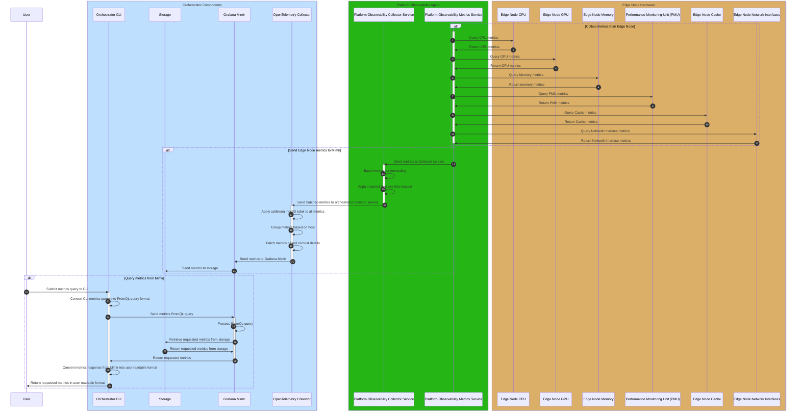

# Design Proposal: Silicon Hardware Metrics Collection for Observability as a Service

Author(s): Christopher Nolan

Last Updated: 2026-04-16

## Abstract

Within the Edge Manageability Framework (EMF) stack, there is an Observability as a Service (ObaaS) pipeline
that is integrated for reporting metrics and logs from edge nodes. The pipeline consists of an agent, the
Platform Observability Agent (POA), installed onto an edge node. This agent collects logs and metrics from
the edge node system and forwards them to the orchestrator. On the orchestrator, the metrics and logs are
processed, labelled and stored for later querying.

There are currently two limitations with the ObaaS implementation; first it only retrieves basic hardware metrics
from the edge node, such as CPU, memory and disk. Secondly, in order to be able to use the ObaaS pipeline, the
full EMF stack is required to be deployed, even though the ObaaS pipeline does not interact with the rest of
the stack when running. Also, in order to view the metrics retrieved from edge nodes, a Grafana dashboard must
be used, with no current option to query metrics directly using the Command Line Interface (CLI) application
available in the orchestrator.

This proposal outlines changes address both of these limitations with the current ObaaS implementation. In the
POA configuration, it will be extended to include implementations to allow for the gathering of the additional
silicon metrics from GPU, PMU, NPU, etc., on the edge node when these are available. For the deployment of the
ObaaS pipeline, the current implementation, which uses open-source components, will be updated to allow it to
be deployed as its own standalone pipeline, separate from the EMF stack. This will allow for ObaaS to be
run independently in different use cases, for example alongside the
[Out-of-Band Device Management](./vpro-eim-modular-decomposition.md) workflow added in the 2026.0 release or as
part of a cluster deployed in a standalone edge node environment.

## Background

As outlined above, the current ObaaS pipeline contains two parts: the POA on the Edge Node and the
orchestrator services that handle the processing and storage of the telemetry from the edge node. Both make use of
standard open-source telemetry collectors to retrieve, process and store the telemetry data.

### Edge Node Agent Services

The POA is made up of four services:

1. **platform-observability-logging**: This service collects logs for all of the agent services installed on
  the edge node from system journal. It runs a [Fluent Bit service](https://docs.fluentbit.io/manual) that
  uses a configuration file provided by the agent at runtime.
2. **platform-observability-health-check**: This service performs a periodic health check on the edge node
  agent services to confirm that they are still active on the system. It is also a [Fluent Bit service](https://docs.fluentbit.io/manual)
  that uses a configuration file provided by the agent.
3. **platform-observability-metrics**: This is a [Telegraf based service](https://github.com/influxdata/telegraf)
  that runs a set of configured metrics collectors specified by the configuration file provided by the agent. These
  collectors gather the required hardware based metrics requested by the agent.
4. **platform-observability-collector**: This is an [OpenTelemetry Collector service](https://github.com/open-telemetry/opentelemetry-collector)
  that batches all of the metrics and logs received from the other three services, applies the required
  protocol headers, including authentication headers, before forwarding to the orchestrator.

For more details on the POA and the individual services it installs on the edge node, please see the
[developer guide](https://docs.openedgeplatform.intel.com/edge-manage-docs/dev/developer_guide/agents/arch/platform_observability.html#)
for the agent.

### ObaaS Pipeline

In the orchestrator, the ObaaS pipeline also uses open source components to process and store
metrics from the connected edge nodes. The services it runs includes:

1. [OpenTelemetry Collector](https://github.com/open-telemetry/opentelemetry-collector) which has been configured
   to apply and configure labels and metadata for filtering edge node metrics as well as for supporting
   multitenancy environments.
2. [Grafana Loki](https://github.com/grafana/loki) is used for the logs backend and storage.
3. [Grafana Mimir](https://github.com/grafana/mimir) is used for the metrics backend and storage.
4. [Grafana](https://github.com/grafana/grafana) provides a UI for viewing edge node logs and metrics. It also
   is used with the [edgenode-dashboards](https://github.com/open-edge-platform/o11y-charts/tree/main/charts/edgenode-dashboards)
   to provide a default set of edge node metrics dashboards configured for use with the edge node POA.

For more details on these services, please see the [developer guide](https://docs.openedgeplatform.intel.com/edge-manage-docs/dev/developer_guide/observability/arch/orchestrator/edgenode-observability.html).

## Proposal

To support collection of additional HW metrics from GPU, PMU, cache utilization, etc., the current POA implementation
will be expanded to include new metrics collectors for these HW components. Also, modifications will be made to
the Edge Node Observability pipeline deployment in the orchestrator to allow it to be deployable as a standalone
pipeline without requiring the deployment of other components such as edge infrastructure manager (EIM), cluster or
app orchestration from the EMF stack.

### Scope

- Proposal will cover both the POA on the edge node and the Edge Node Observability pipeline in the orchestrator
  that are currently used for metrics collection.
- Will cover what metrics will be collected and what collectors will be used to gather them.
- It will also cover how the pipeline and its deployment will be updated to work in a modular environment,
  including any changes to be made to the current pipeline in order to support this.
- Modularization changes outlined below are designed to work with all use cases outlined in the
  [Modular Decomposition documentation](./eim-modular-decomposition.md).

### Design

#### Metric Collectors

On the edge node, the POA metrics service currently provides a number of metrics by default on install. It also
includes configurations for collecting other metrics from the edge node, however these are disabled by default.
This is due to the resource utilization needed by the metrics service, and the agent as a whole, to collect and
forward larger amounts of metrics. As additional metric collectors are added to this service, such utilization
will need to be considered when determining what metrics should be collected when the agent is run. To avoid
the agent utilizing to many resources, a default configuration will be run on start up that gathers basic
metrics. In order to gather additional metrics, the the metrics service configuration can be modified to enable
additional metrics collectors at the cost of increasing the reousrce utilization after the service is restarted
to enable the new configuration.

Since the POA package is a Debian package, it can be directly installed onto an environment and will run as a
system service in the OS environment. Once the ObaaS pipeline is separated from the EMF stack, the agent can
be installed in environments using standard Debian package installation commands. If running in a standalone
environment, when the agent package is installed, the only requirement will be to provide the local endpoint
for the collector service to send metrics to.

##### Configured and Enabled Metrics

- **CPU Utilization and Performance Metrics**: CPU usage metrics can be retrieved using the [Telegraf cpu collector](https://github.com/influxdata/telegraf/tree/master/plugins/inputs/cpu).
- **Memory Utilization and Performance Metrics**: The [Telegraf mem collector](https://github.com/influxdata/telegraf/tree/master/plugins/inputs/mem)
  will provide memory utilization metrics for an edge node.
- **Storage Utilization and Performance Metrics**: For storage performance metrics, there are two collectors that
  provide a variety of metrics. The [Telegraf disk collector](https://github.com/influxdata/telegraf/tree/master/plugins/inputs/disk)
  gathers utilization metrics while the [diskio collector](https://github.com/influxdata/telegraf/tree/master/plugins/inputs/diskio)
  reports the read and write counts to the edge node storage devices. The POA also
  provides a [script](https://github.com/open-edge-platform/edge-node-agents/blob/main/platform-observability-agent/scripts/collect_disk_info.sh)
  that can be run by the [exec plugin](https://github.com/influxdata/telegraf/tree/master/plugins/inputs/exec)
  in Telegraf.
- **Network Interface Utilization and Performance Metrics**: Telegraf provides the [net collector](https://github.com/influxdata/telegraf/tree/master/plugins/inputs/net)
  which provides a per interface view of the network traffic sent and received on the edge node.
- **SRIOV VF Utilization and Performance Metrics**: In Linux, SRIOV VFs created on the system are seen as network
  interfaces alongside any physical interfaces. In this case, they would also appear in the output from Telegraf's
  net collector.

##### Configured and Disabled Metrics

- **Logical Volume Manager (LVM) Utilization and Performance Metrics**: For these metrics, the [Telegraf lvm collector](https://github.com/influxdata/telegraf/tree/master/plugins/inputs/lvm)
  will provide the required metrics.
- **Storage Utilization and Performance Metrics**: Telegraf also provides the [smart collector](https://github.com/influxdata/telegraf/tree/master/plugins/inputs/smart)
  which, when run on an edge node that has storage devices that support it, will provide additional utilization metrics.
- **dGPU Utilization and Performance Metrics**: Currently, the POA metrics service provides a [script](https://github.com/open-edge-platform/edge-node-agents/blob/main/platform-observability-agent/scripts/collect_gpu_metrics.sh)
  that can collect metrics from dGPU devices on an edge node. It requires the
  [XPU System Management Interface](https://github.com/intel/xpumanager) package to be installed on the edge node.
- **Performance Monitoring Unit (PMU) Metrics**: These are metrics specific to Intel CPUs and can be read using the
  [intel_pmu collector](https://github.com/influxdata/telegraf/tree/master/plugins/inputs/intel_pmu) in Telegraf.
- **BIOS Metrics**: One option for these metrics is to use the [Telegraf redfish collector](https://github.com/influxdata/telegraf/tree/master/plugins/inputs/redfish)
  to retrieve thermal and power settings.

##### New Metrics to Configure and Enable

- **CPU Utilization and Performance Metrics**: To retrieve frequency and throttling CPU metrics, the
  [Telegraf linux_cpu collector](https://github.com/influxdata/telegraf/tree/master/plugins/inputs/linux_cpu)
  can be used.
- **iGPU Utilization and Performance Metrics**: To retrieve iGPU metrics on the edge node, the XPU System Management
  Interface package needs to be installed on the edge node along with the intel-level-zero-gpu package. Using these packages
  with the script currently used for dGPU metrics in the POA metrics service will allow it to also retrieve iGPU metrics, such
  as VRAM utilization.
- **Cache Utilization and Performance Metrics**: The primary collector for this will be the [intel_rdt collector](https://github.com/influxdata/telegraf/tree/master/plugins/inputs/intel_rdt)
  in Telegraf, which uses [Intel Resource Director Technology](https://github.com/intel/intel-cmt-cat) to report the
  utilization of the L3 cache. As well as this collector, the intel_pmu collector above also provides some cache performance
  metrics as does the [intel_pmt collector](https://github.com/influxdata/telegraf/tree/master/plugins/inputs/intel_pmt)
  in Telegraf when used with newer Intel processors.
- **BIOS Metrics**: For other BIOS settings, dmidecode can be run using the Telegraf exec collector to gather these.
- **NPU Utilization and Performance Metrics**: This will require a new collector to retrieve these metrics.
- **VPU Utilization and Performance Metrics**: This will require a new collector to retrieve metrics from any
  VPUs on an edge node.

To view the current POA metrics service configuration, please see the [configuration file](https://github.com/open-edge-platform/edge-node-agents/blob/main/platform-observability-agent/configs/poa-telegraf.conf)
for the service.

#### Workflow Design

For the ObaaS pipeline components outlined above, these will remain as is once the deployment is separated from
the EMF stack, with the exception of the Grafana UI and dashboards. Instead of using these components, the
CLI will be extended to provide new commands to allow for querying metrics directly from Mimir. Since the
current ObaaS pipeline has been tested in both cloud and OnPrem deployment environments, the modular ObaaS
implementation should continue to work for both environments as well.

## Implementation Plan

- Hardware Metrics Collection.
  - Identify the new hardware metrics collectors to be added to the current edge node metrics service.
  - Extend the current GPU metrics script to also collect iGPU metrics using the Telegraf exec plugin.
  - Develop a new collector to retrieve VPU metrics.
  - Add additional Telegraf plugins to metrics service configuration.
  - Test deployment of updated metrics sevice on edge node and check the metrics being retrieved.
  - Update documentation for the edge node observability agent.
- Modular observability workflow.
  - Identify the services needed for a modular observability workflow.
  - Modify the deployment profiles to include an observability only modular workflow.
  - Test the deployment of the new modular workflow.
  - Test deployment with the updated edge node observability agent.
  - Extend Orchestrator CLI to retrieve metrics from the observability pipeline.
  - Test the updated CLI with the modular observability pipeline and confirm that new metrics can be retrieved.
  - Provide documentation on how to install the modular observability workflow.
  - Extend Orchestrator CLI documentation with new commands for metrics querying.

## Opens

- Grafana dashboards will not be used in modular flow, instead metrics will be retreived using the CLI. Do
  we still require the dashboards to be maintained?
- Investigate the current support in CLI for retrieving metrics from Mimir
- Not included in this proposal is the telemetry management pipeline that runs parallel to the observability
  pipeline and can be used to configure what metrics an edge node reports after it has been deployed without
  requiring a full redeployment or access to the edge node. For modular deployments, should this also be included
  and used for this purpose or should it be exlcuded?
- Investigate the [Intel Performance Counter Monitor(PCM)](https://github.com/intel/pcm) tool as there may be
  overlap between what it is reporting and what the modular workflow will report.
