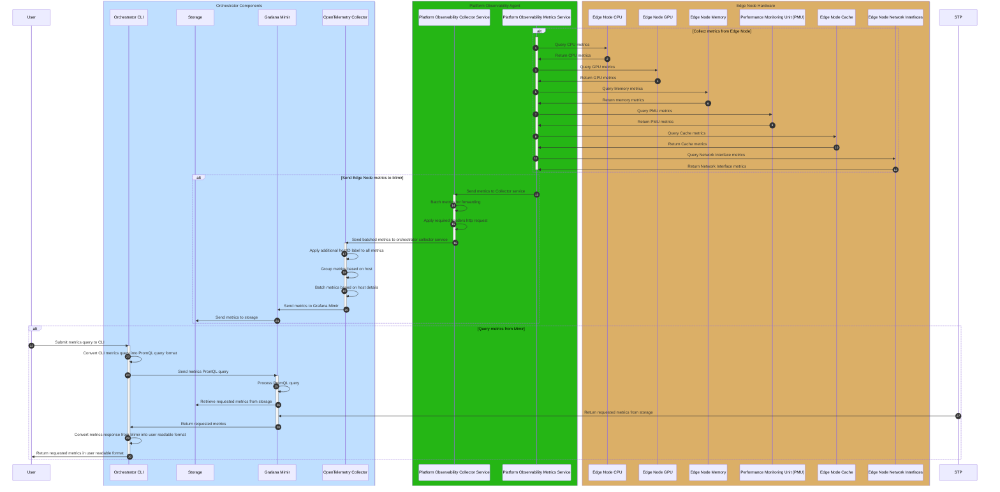

# Design Proposal: Silicon Hardware Metrics Collection for Modular Observability

Author(s): Christopher Nolan

Last Updated: 2026-03-30

## Abstract

Within the Edge Manageability Framework (EMF) stack, there is a Edge Node Observability pipeline that is used
to collect hardware telemetry, specifically metrics and logs, from edge nodes. This pipeline consists of an agent,
the Platform Manageability Agent (POA), on the edge node that collects, batches and forwards telemetry from the
edge node to the Orchestrator. On the Orchestrator, the pipeline consists of a number of services that process
and store the metrics received from the connected edge node agents. Currently, this workflow only retrieves only
basic hardware metrics for CPU, memory, disk, etc., and has not been configured to be deployed separately of
other modular workflows or the full EMF deployment stack. This proposal outlines how this pipeline can be
modified to collect additional, silicon specific hardware metrics from GPU, PMU, NPU, etc., as well as how it can be
deployed as a modular workflow similar to the [Out-Of-band Device Management](./vpro-eim-modular-decomposition.md)
workflow added in the 2026.0 release.

## Background

As outlined above, the current Edge Node Observability pipeline contains two parts: the POA on the Edge Node and the
orchestrator services that handle the processing and storage of the telemetry from the edge node. Both make use of
standard open-source telemetry collectors to retrieve, process and store the telemetry data.

### Edge Node Agent Services

The POA is made up of four services:

1. **platform-observability-logging**: This service collects logs for all of the agent services installed on
  the edge node from system journal. It runs a [Fluent Bit service](https://docs.fluentbit.io/manual) that
  uses a configuration file provided by the agent at runtime.
2. **platform-observability-health-check**: This service performs a periodic health check on the edge node
  agent services to confirm that they are still active on the system. It is also a [Fluent Bit service](https://docs.fluentbit.io/manual)
  that uses a configuration file provided by the agent.
3. **platform-observability-metrics**: This is a [Telegraf based service](https://github.com/influxdata/telegraf)
  that runs a set of configured metrics collectors specified by the configuraion file provided by the agent. These
  collectors gather the required hardware based metrics requested by the agent.
4. **platform-observability-collector**: This is an [OpenTelemetry Collector service](https://github.com/open-telemetry/opentelemetry-collector)
  that batches all of the metrics and logs received from the other three services, applies the required
  protocol headers, including authentication headers, before forwarding to the orchestrator.

For more details on the POA and the individual services it installs on the edge node, please see the
[developer guide](https://docs.openedgeplatform.intel.com/edge-manage-docs/dev/developer_guide/agents/arch/platform_observability.html#)
for the agent.

### Edge Node Observability Pipeline

In the Orchestrator, the Edge Node Observability pipeline also uses open source components to process and store
metrics from the connected edge nodes. The services it runs includes:

1. [OpenTelemetry Collector](https://github.com/open-telemetry/opentelemetry-collector) which has been configured
   to apply and configure labels and metadata for filtering edge node metrics as well as for supporting
   multitenancy environments.
2. [Grafana Loki](https://github.com/grafana/loki) is used for the logs backend and storage.
3. [Grafana Mimir](https://github.com/grafana/mimir) is used for the metrics backend and storage.
4. [Grafana](https://github.com/grafana/grafana) provides a UI for viewing edge node logs and metrics. It also
   is used with the [edgenode-dashboards](https://github.com/open-edge-platform/o11y-charts/tree/main/charts/edgenode-dashboards)
   to provide a default set of edge node metrics dashboards configured for use with the edge node POA.

For more details on the POA and the individual services it installs on the edge node, please see the
[developer guide](https://docs.openedgeplatform.intel.com/edge-manage-docs/dev/developer_guide/observability/arch/orchestrator/edgenode-observability.html)
for the agent.

## Proposal

To support collection of additional HW metrics from GPU, PMU, cache utilization, etc., the current POA implementation
will be expanded to include new metrics collectors for these HW components. Also, modifications will be made to
the Edge Node Observability pipeline deployment in the orchestrator to allow it to be deployable as a standalone
pipeline without requiring other components from the EMF stack.

### Scope

- Proposal will cover both the POA on the edge node and the Edge Node Observability pipeline in the orchestrator
  that are currently used for metrics collection.
- Will cover what metrics will be collected and what collectors will be used to gather them.
- It will also cover how the pipeline and its deployment will be updated to work in a modular environment,
  including any changes to be made to the current pipeline in order to support this.
- Modularization changes outlined below are designed to work with all use cases outlined in the
  [Modular Decomposition documentation](./eim-modular-decomposition.md).

### Design

#### Metric Collectors

On the edge node, the POA will gather the following HW metrics using collectors enabled in the metrics service
installed by the agent:

- **CPU Utilization and Performance Metrics**: CPU usage metrics will be retrieved using the [Telegraf cpu collector](https://github.com/influxdata/telegraf/tree/master/plugins/inputs/cpu)
  while frequency and throttling CPU metrics will be collected using the [Telegraf linux_cpu collector](https://github.com/influxdata/telegraf/tree/master/plugins/inputs/linux_cpu).
  The cpu plugin is currently enabled by default in the POA metrics service.
- **Memory Utilization and Performance Metrics**: The [Telegraf mem collector](https://github.com/influxdata/telegraf/tree/master/plugins/inputs/mem)
  will provide memory utilization metrics for an edge node and is currently enabled by default in the POA metrics service.
- **Logical Volume Manager (LVM) Utilization and Performance Metrics**: For these metrics, the [Telegraf lvm collector](https://github.com/influxdata/telegraf/tree/master/plugins/inputs/lvm)
  will provide the required metrics. This plugin is configured in the POA metrics service but is disabled by default.
- **Storage Utilization and Performance Metrics**: For storage performance metrics, there are four collectors that
  provide a variety of metrics. The [Telegraf disk collector](https://github.com/influxdata/telegraf/tree/master/plugins/inputs/disk)
  gathers utilization metrics while the [diskio collector](https://github.com/influxdata/telegraf/tree/master/plugins/inputs/diskio)
  reports the read and write counts to the edge node storage devices. There is also the
  [smart collector](https://github.com/influxdata/telegraf/tree/master/plugins/inputs/smart) which, when run on an
  edge node that has storage devices that support it, will provide additional utilization metrics. Finally, the POA also
  provides a [script](https://github.com/open-edge-platform/edge-node-agents/blob/main/platform-observability-agent/scripts/collect_disk_info.sh)
  that can be run by the [exec plugin](https://github.com/influxdata/telegraf/tree/master/plugins/inputs/exec)
  in Telegraf. Of the four collectors, the POA metrics service has configuration settings for all four, but only enables
  the disk and diskio plugins by default.
- **iGPU Utilization and Performance Metrics**: There is currently no plugin in Telegraf that gathers such metrics, so to
  enable such metrics to be gathered on the edge node, a new script for collecting such metrics will need to be created
  and will be run using the [exec plugin](https://github.com/influxdata/telegraf/tree/master/plugins/inputs/exec) from Telegraf.
- **dGPU Utilization and Performance Metrics**: Currently, the POA metrics service provides a [script](https://github.com/open-edge-platform/edge-node-agents/blob/main/platform-observability-agent/scripts/collect_gpu_metrics.sh)
  that can collect metrics from dGPU devices on an edge node. This is disabled by default as it requires the
  [XPU System Mnagement Interface](https://github.com/intel/xpumanager) package to be installed on the edge node.
- **Performance Monitoring Unit (PMU) Metrics**: These are metrics specific to Intel CPUs and can be read using the
  [intel_pmu collector](https://github.com/influxdata/telegraf/tree/master/plugins/inputs/intel_pmu) in Telegraf. Currently,
  the POA metrics service configures this plugin but does not enabled it by default.
- **Cache Utilization and Performance Metrics**: The primary collector for this will be the [intel_rdt collector](https://github.com/influxdata/telegraf/tree/master/plugins/inputs/intel_rdt)
  in Telegraf, which uses [Intel Resource Director Technology](https://github.com/intel/intel-cmt-cat) to report the
  utilization of the L3 cache. As well as this collector, the intel_pmu collector above also provides some cache performance
  metrics as does the [intel_pmt collector](https://github.com/influxdata/telegraf/tree/master/plugins/inputs/intel_pmt)
  in Telegraf when used with newer Intel processors.
- **BIOS Metrics**: This would require a new collector to provide such metrics from the BIOS environment.
- **Network Interface Utilization and Performance Metrics**: Telegraf provides the [net collector](https://github.com/influxdata/telegraf/tree/master/plugins/inputs/net)
  which provides a per interface view of the network traffic sent and received on the edge node. In the current POA
  metrics service, this is enabled by default.
- **SRIOV VF Utilization and Performance Metrics**: In Linux, SRIOV VFs created on the system are seen as network
  interfaces alongside any physical interfaces. In this case, they would also appear in the output from Telegraf's
  net collector.
- **NPU Utilization and Performance Metrics**: This will require a new collector to retrieve metrics from any
  NPUs on an edge node.

To view the current POA metrics service configuration, please see the [configuration file](https://github.com/open-edge-platform/edge-node-agents/blob/main/platform-observability-agent/configs/poa-telegraf.conf)
for the service.

#### Workflow Design

For the pipeline, the pipeline will remain as it currently is when deploying the full EMF stack, however the
modular workflow will not deploy the Grafana UI and dashboards when it is deployed without the full stack.
Instead the Orchestrator Command Line Interface (CLI) tool will be extended to provide commands for a user
to run to query the Mimir backend for metrics.

The CLI will receive a command containing the metric to be queried for, the edge node to be checked as well as
any time range required by user. If a time range is not provided, then the CLI should use a default time range,
such as the last 5 minutes. The CLI should also support retrieving both averages and sums for metrics over set time
periods.

Within the CLI, it should convert the received query into the PromQL format needed for querying Mimir
and then send the PromQL query to the Mimir API. When the CLI receives the metrics back from Mimir,
it should convert it into a easy read format before returning it to the user.

## Implementation Plan

- Hardware Metrics Collection.
  - Identify the new hardware metrics collectors to be added to the current edge node metrics service.
  - Create a new script to collect iGPU based metrics that can be run using the Telegraf exec plugin.
  - Create a new collector to retrieve BIOS based metrics from the edge node.
  - Develop a new collector to retrieve NPU metrics.
  - Add additional Telegraf plugins to metrics service configuration.
  - Test deployment of updated metrics sevice on edge node and check the metrics being retrieved.
  - Update documentation for the edge node observability agent.
- Modular observability workflow.
  - Identify the services needed for a modular observability workflow.
  - Modify the deployment profiles to include an observability only modular workflow.
  - Test the deployment of the new modular workflow.
  - Test deployment with the updated edge node observability agent.
  - Extend Orchestrator CLI to retrieve metrics from the observability pipeline.
  - Test the updated CLI with the modular observability pipeline and confirm that new metrics can be retrieved.
  - Provide documentation on how to install the modular observability workflow.
  - Extend Orchestrator CLI documentation with new commands for metrics querying.

## Opens

- Grafana dashboards will not be used in modular flow, instead metrics will be retreived using the CLI. Do
  we still require the dashboards to be maintained?
- Investigate the current support in CLI for retrieving metrics from Mimir
- Not included in this proposal is the telemetry management pipeline that runs parallel to the observability
  pipeline and can be used to configure what metrics an edge node reports after it has been deployed without
  requiring a full redeployment or access to the edge node. For modular deployments, should this also be included
  and used for this purpose or should it be exlcuded?
- Investigate the [Intel Performance Counter Monitor(PCM)](https://github.com/intel/pcm) tool as there may be
  overlap between what it is reporting and what the modular workflow will report.
