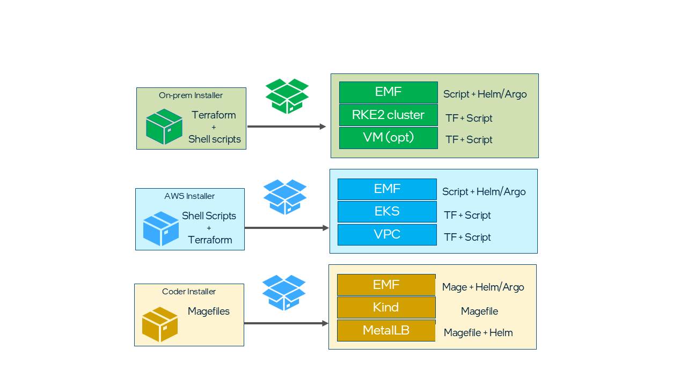
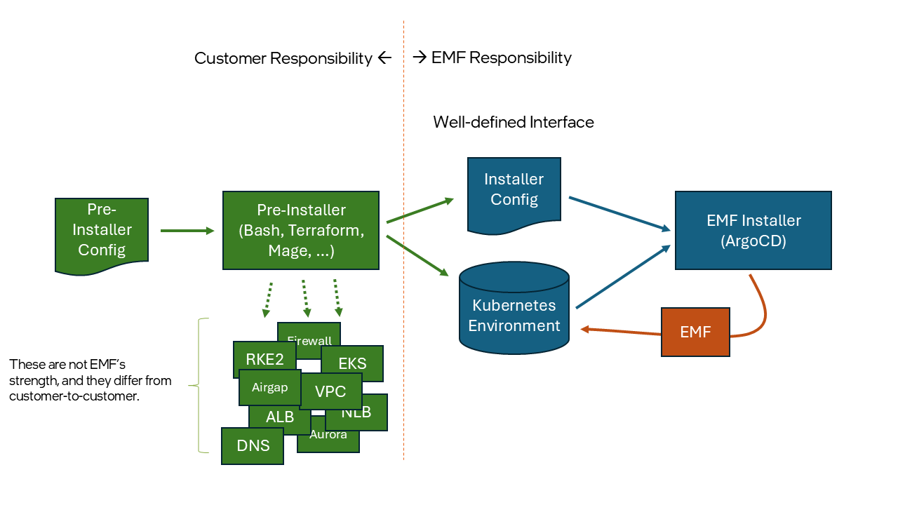
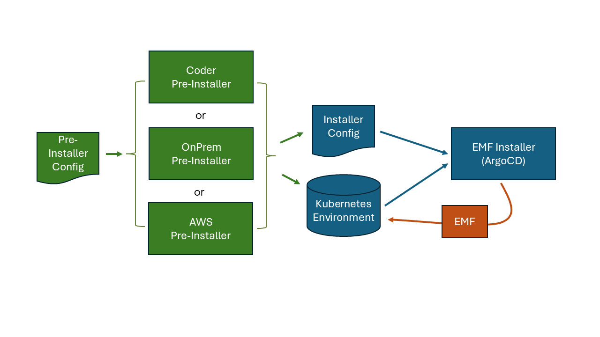

# Design Proposal: Installer Simplification

Author(s): Scott Baker

Last updated: 2025-09-08

## Abstract

This document provides a summary of the current EMF installer approach, highlighting key issues
posed by the approach due to the shift in consumption model from closed source to open source.
It also states the higher order goals to be met by the installation and covers recommended
approach to achieving the goals in a phased rollout manner.

## Problem Statement

EMF currently is installed using a custom installer that provides full automation of installation
by bundling all the layers together such as provisioning infrastructure, installing and configuring
Kubernetes cluster and deploying EMF microservices. This approach was intended to provide a
platform-as-a-product experience to customers, which naturally led to a curated set of installers
targeting different infrastructure kinds. When EMF was distributed through GSI partners, this approach
had served well. However, with the shift to open sourcing EMF, this approach has already led to and
will continue to lead to sprawl of installers and adoption issues due to the opinionated cluster
approach. Most customers would either already have or would like to have control over their Kubernetes
clusters. It’s critical to provide an installation approach that’s using standards and simplified for
end customer adoption, as well as contribution. To that end, the first goal below is defined to simplify
EMF installation.

Note: The following goals do not necessarily need to be tackled sequentially.
Aspects may be undertaken simultaneously.

### Goal #1 - Standardize and Simplify EMF Installation

The scope of the "installer" must be reduced to the functions necessary to install EMF on any suitable
Kubernetes infrastructure., such as cloud VMs, on-prem machines and managed Kubernetes clusters.
EMF must be installable on this Kubernetes cluster using standard tools and techniques such as
Helm, Kubernetes, ArgoCD, etc. The requirements must be well documented.

### Goal #2 – EMF is deployable as an Edge Application

EMF must be deployable as an edge application on Intel platforms.

Once installation is simplified and standardized, EMF becomes a regular Kubernetes application that can
run on Intel Edge Platforms if one decides to do so. However, the footprint of EMF is still substantial,
with production grade gitops using ArgoCD, Platform observability, multitenancy etc. We must provide
sufficient controls to reduce the footprint, enabling EMF to run on smaller environments, including typical
Intel Edge hardware.

This requires EMF footprint review and optimization including lightweight Kubernetes, tuning resources
requests/limits and skipping some components such as GitOps, Platform Observability and Multitenancy.

### Goal #3 – Simple, reliable, and lightweight upgrades

The upgrade process must become simpler, and its scope must be confined to upgrading the EMF software,
avoiding the complexity of managing and upgrading infrastructure that is outside the scope of EMF.

It must be feasible to perform upgrades not only between major releases, but to integrate patch releases
between major releases. It must be feasible to upgrade individual components as necessary and integrate
hot fixes. These capabilities are expected of modern Helm-based software.

## Current state of installers in EMF 3.1

There are three installers maintained today:

1. AWS installer which provisions a EKS cluster and deploys EMF

2. On-prem installer which provisions an RKE2 cluster and deploys EMF

3. A lightweight development installer which provisions a Kind clusters and deploys EMF

## Problems with the current approach

- Multiple installers – hard to maintain multiple installers each one catering to different infrastructure
  provider

- Infrastructure provisioning – automating customer infrastructure is not our responsibility. Customers
  might want to do this differently and take care of their infrastructure provisioning in public clouds
  and on-prem

- Cluster creation – same as “Infrastructure provisioning” in the previous point

- Shell script – Shell scripting is not the idiomatic approach in the cloud native application ecosystem to
  provision infrastructure, create clusters, and deploy applications. Scripts become brittle and make testing
  and debugging harder. Scripts also lack monitoring, error handling, and reliability.

- Multiple mechanisms to solve identical processes – There are a mix of Magefiles and Shell scripts for such
  actions as configuring a tenant. Sometimes within the Magefiles there are even multiple mechanisms for doing
  the same thing. Duplication leads to additional maintenance effort as well as unintentional divergence of behavior.

## Phased Approach

EMF installation problems listed above will be addressed in multiple phases as follows:

- Phase 0: Establish a clear boundary between “installer” and “pre-installer”

- Phase 1: Installer Simplification

- Phase 2: Composable Installation (EMF Lite)

- Phase 3: Eliminate dependency on ArgoCD

### Phase 0: Establish a clear boundary between installer and pre-installer

The Installer is based on ArgoCD. The installer requires two things to run:

1. A Kubernetes environment. The installer installs EMF into this environment. It also uses the environment to
   run the installer itself.

2. A set of Installer Configuration values, including the credentials to the Kubernetes environment. This may
   include database configuration, root/admin passwords, public IP addresses, repository URLs, etc.

The installer configuration is primarily composed of a set of service profiles and a cluster profile.
These profiles are inputs to the ArgoCD root app, which in turn configures the other applications.

#### Pre-Installer

The job of the pre-installer is to prepare the environment that the installer will run in. It accepts a set
of Pre-installer Configuration values, and does the following:

1. Creates a Kubernetes environment.

2. Creates any necessary assets to enable that environment (ALBs, NLBs, Databases, etc).

3. Creates or updates the Installer Configuration that may be passed to the Installer.

4. (optionally) Invokes the Installer to complete the installation.

In Phase 0 there will be three pre-installers:

1. Development/Preview. Creates a kind-based environment that is not intended to be used in production.

2. OnPrem. Creates an OnPrem Kubernetes on an Ubuntu node.

3. AWS. Creates an EKS Kubernetes on AWS together with the necessary ALBs, NLBs, Aurora, etc.

The most important contribution of Phase 0 is to document the inputs to the Installer and to break our user-facing
documentation into separate pre-install and install sections. This allows any partner to write their own
pre-installer, or to fork and customize our pre-installers for their production use.

### Phase 1: Installer Simplification

Converge on the single installer as the way to install EMF on any infrastructure, while continuing to support
the pre-installers as necessary for our customers.

#### Eliminate Gitea as a pre-installer dependency

The current behavior of cloning the EMF repo into a local gitea shall be eliminated. ArgoCD shall point to a
public github source.

- The open-edge-platform/edge-manageability-framework repository is one potential github source that may be
  used. Alternatively, our customers who wish to significantly customize the orchestrator installation in
  ways above and beyond what we support are free to fork the edge-manageability-framework repo and point
  the installer at their fork.

- Local customizations of the installation (i.e. the installer configuration mentioned in Phase 0) may be
  passed to the ArgoCD root app as a valuesObject parameter, overriding default values that are obtained
  from git.

- If we wish to support air-gapped installation, then we will instruct our customers to create a local gitea
  instance of their own withing their airgapped domain. We can provide documentation on how to do this.

- Gitea is still used as an app-orch dependency by Fleet. As such, when Gitea is removed as a pre-installer
  dependency, at the same time, it will be added as an app-orch dependency and managed for app-orch use by
  ArgoCD.

#### Deprecate the production-ready AWS pre-installer

EMF will no longer be directly responsible for provisioning production cloud infrastructure.

The EMF team shall retain the AWS pre-installer as a validation tool to ensure that EMF remains compatible
with popular cloud services on AWS. We may distribute the AWS pre-installer as a “starting point” for our
customers to write their own AWS installers.

The EMF team will continue to provide guidance and assistance for select partners wishing to perform and
AWS install, with the goal that as documentation of the AWS installation improves, the documentaiton will
eventually become self-sufficient and a sufficiently skilled partner will be able to set up the AWS
infrastructure with minimum assistance required.

#### Migrate any remaining Helm/Kubernetes services from pre-installer to the installer

The 3.1 installers may contain some helm-based components, such as Postgres, or other services that were
installed prior to the invocation of ArgoCD. These should be moved from these pre-installers into the
installer and handled by ArgoCD. We should have a consistent mechanism for installing Helm charts.

Redundant components in can always be disabled. For example, if a cloud-based database such as Aurora is
used, then we will have a knob that disables installation of Postgres.

#### Ensure all pre-installers and the installer are noninteractive

The pre-installers and the installer should be fully configured from the configuration values that are passed
to them initially. There should be no interactive prompts given to the user and no pausing of the installer
to solicit additional input.

### Phase 2 - Composable Installer

In the prior phase, we moved terraform recipes to the pre-installers only, but if for any reason terraform files
still exist within the installer, we will move them in this phase. We continue to remove shell scripts and replace
them with standard helm charts and Kubernetes jobs, all of which are exposed as ArgoCD apps. Pre-installers may
continue to be used internally or distributed as examples.

By the end of this phase, it shall be possible to invoke the installer directly, by the customer bringing their
own Kubernetes, without using a pre-installer.

The following need to be taken care to support this model

- All Kubernetes objects including namespaces, databases, secrets, configs, policies etc must be treated as
  application components. They must be created via Helm and Argo

- Expose proper helm value overrides for customers to provide configuration values as appropriate

#### Make subsystems easy to disable

Make sure the installer configuration allows the following to be individually disabled, to support reduced footprint
for customers who do not require all components. This will allow the following services and their pods to be disabled,
reducing the footprint of the platform:

- Observability

  - Telemetry pods

  - Grafana

  - Loki

  - Mimir

- Cluster Orchestration

  - cluster-connect-gateway

  - cluster-manager

  - intel-infra-provider

  - capi-core-provider

  - cluster-api-k3s-provider

- Application Orchestration

  - app-deployment

  - app-interconnect

  - app-orch-catalog

  - app-orch-tenant-controller

  - app-resource-manager

  - app-service-proxy

  - fleet

  - gitea

#### Add optional single-tenant initialization job

Add an optional Kubernetes job that initializes a single tenant in the tenancy model. This is intended to facilitate
“EMF Lite”. By implementing this as a Kubernetes Job rather than a script, initialization of single-tenant
configuration may be fully encapsulated within the Helm (and ArgoCD) layers, and avoid requiring any external scripts.

Note: There is an existing job that can be re-used and/or extended, as part of the infra-charts repository.

The various tenant-controllers will remain deployed, but will be left in an idle state once the single tenant has been created.

#### Make multitenancy fully optional

Above, we introduced a job that creates a single-tenant. In a truly single-tenant / single-project configuration, there
is no need for the various tenant-controllers to exist. These long-running controllers would be replaced with one-time
jobs. This includes the following components:

- app-orch-tenant-controller
- cluster-manager (part of this service listens to tenant events)
- keycloak-tenant-controller
- observability-tenant-controller
- (eim) tenant-controller

### Phase 3 – “EMF Lite” / installation without ArgoCD

Support lighter weight deployment by eliminating argocd components. Use techniques such as umbrella helm charts or tools
such as helmfile. We will move away from heavy weight services such as ArgoCD that are always running and consuming resources.
If the customer wishes to use a gitops tool (such as ArgoCD) to maintain their EMF installation, they are free to do so.
Installing EMF should be as simple as installing a helm chart.

#### ArgoCD Syncwave Investigation

ArgoCD uses syncwaves to ensure that some services are installed before other services. To our knowledge, this was largely
determined by observation rather than planning – people noticed that some services did not install properly unless prerequisites
were in place, and adjusted syncwaves to suit. These syncwaves are a cause for additional deployment time, because chart
deployment is delayed.

- We will document the dependencies between components, and justify why the syncwaves exist.

- We will seek alternative solutions to syncwaves, such as modifying components to be more resilient and retry when
  their dependencies are not ready.

- The ultimate goal is to eliminate syncwaves entirely, though this may not be feasible. For example, it is often necessary
  to install CRDs before a service that uses CRDs can be installed.

#### Eliminate ArgoCD

Once the syncwaves have been reduced or eliminated, then it is feasible to eliminate ArgoCD in favor of a simpler tool. We
will explore alternatives such as umbrella charts, the helmfile tool, or other opensource solutions. We may explore repo
and/or chart consolidation to make the helm chart structure simpler.

Eliminating argocd will allow the following pods to be eliminated from the platform:

- argocd-application-controller
- argocd-applicationset-controller
- argocd-notifications-controller
- argocd-redis
- argocd-repo-server
- argocd-server

## Rationale

The rationale for simplification is that it is infeasible to continue to maintain three independent monolithic
installers. Convergence is necessary, with a focus on installing EMF itself rather than provisioning infrastructure,
which differs on a customer-by-customer basis.

## Affected components and Teams

The installer and the team working on the installer will be affected for all phases. The UI team may be affected
for phase 2, as disabling subsystems will impact the UI.

## Implementation plan

The implementation shall be carried out in the phases outlined in the "Phased Approach" section above.

## Decision

Proceed with Phase 0. Accelerate Phase 2 into Q1-2026 timeframe. Defer commitment of Phase 3 for future discussion.

## Open issues (if applicable)

None.
