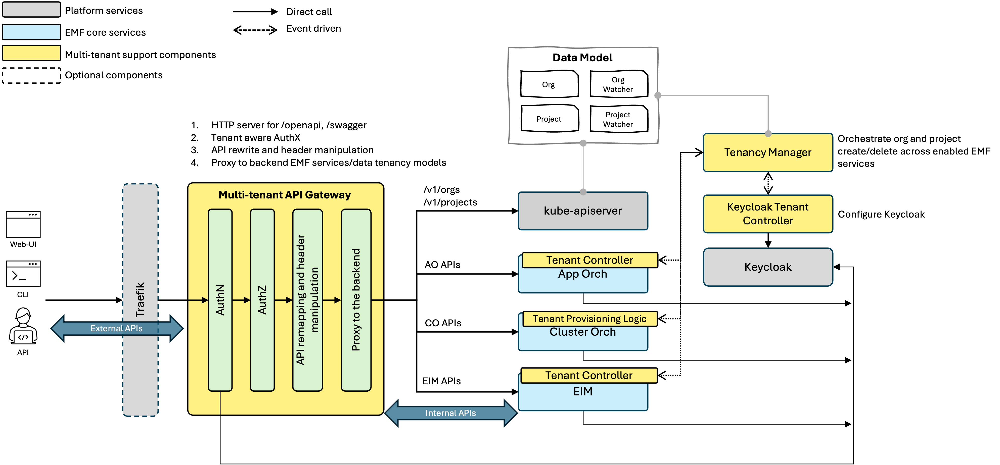
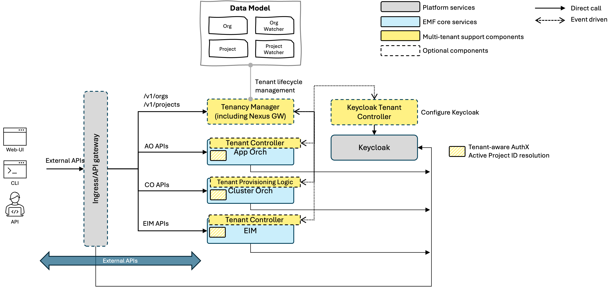
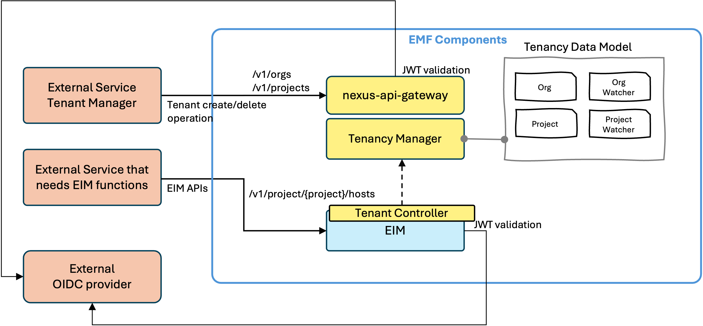
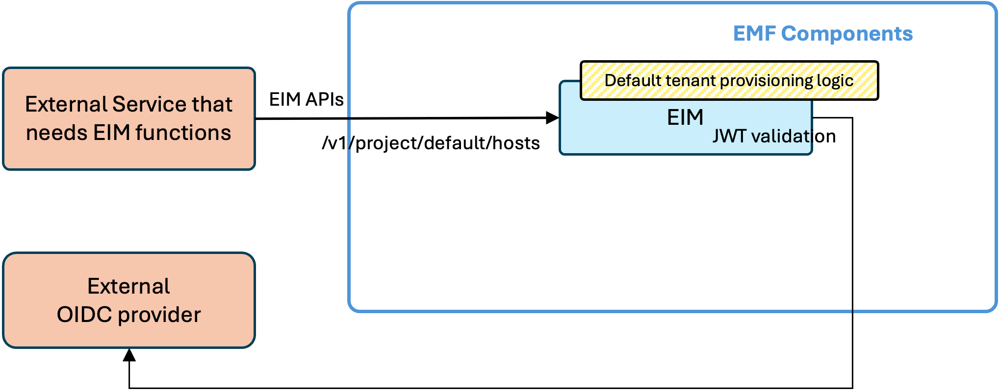

# Design Proposal: Multi-tenancy Simplification

Author(s): Hyunsun Moon, Denisio Togashi

Last updated: 12/3/25

## Abstract

The existing EMF multi-tenancy architecture enforces a centralized multi-tenant API gateway, resulting in tight coupling
and unnecessary complexity for all deployments. This proposal aims to simplify the architecture by making multi-tenancy
components optional, enabling direct API exposure for services, and introducing a shared middleware library. These
changes allow for flexible deployment options—from full multi-tenant environments to lightweight, single-service
integrations—while preserving backward compatibility and supporting external service integrations. The focus is on
achieving architectural modularity and deployment flexibility, rather than optimizing for performance or resource usage.

## User Stories

**User Story 1: Configurable Multi-tenancy** As a platform administrator, I need the ability to enable or disable
multi-tenancy features based on deployment requirements, so that the system can be tailored to specific organizational
needs.

**User Story 2: Lightweight EIM Integration** As a third-party service developer, I want to integrate only the EIM
sub-components without deploying the entire EMF stack, so that I can add infrastructure management capabilities with
minimal overhead.

**User Story 3: Flexible External Service Integration** As a solution architect, I want to connect external services to
EMF regardless of the tenancy mode, so that I can extend EMF’s capabilities across diverse environments.

**User Story 4: Seamless Backward Compatibility** As an existing EMF customer, I want to ensure that my current
multi-tenant deployments remain fully compatible after upgrades, so that my workflows continue without disruption.

## Proposal

### Overview

This proposal introduces a phased migration from the current monolithic multi-tenant architecture to a modular system
that supports both single-tenant and multi-tenant deployment modes. By decoupling multi-tenancy components and making
them optional, the architecture enables flexible service deployment and direct API exposure while reducing operational
complexity. The approach preserves all existing multi-tenancy features and maintains backward compatibility where
required, while allowing lightweight, simplified deployments when multi-tenancy is not needed.

### Current Architecture Problems

The current EMF architecture exhibits several key issues:

- **Single Point of Failure** All external requests are funneled through a single Multi-tenant API Gateway, creating a
  potential point of failure.
- **Mandatory Complexity:** Every deployment, regardless of actual requirements, must include the entire multi-tenancy
  stack, increasing operational overhead.
- **Lack of Flexibility:** The architecture does not support selective component deployment or straightforward
  integration with external services, restricting adaptability to diverse environments.

### Proposed Solution

The proposed architecture is modular and flexible, focusing on these key changes:

- The Multi-tenant API Gateway is reduced to a simple HTTP router for Tenant Manager APIs.
- Core services (AO, CO, EIM) expose their APIs directly, removing the need for centralized API gateway coordination.
- Multi-tenancy is configurable; Tenant Manager and controllers can be enabled or disabled per deployment.
- When multi-tenancy is off, services initialize a default tenant and restrict API requests to the default project for
  consistent logic.
- Backward compatibility is maintained for seamless upgrades from existing multi-tenant deployments.

This modular approach enables organizations to deploy EMF in single-tenant or multi-tenant modes, reducing complexity
and adapting to varied infrastructure needs. Below are examples of how the new modular architecture enables flexible
integration of external services in both multi-tenant and single-tenant environments.

#### Multi-Tenant Integration

External services with multi-tenant capabilities can interact with EMF components as follows:

- **Tenant Provisioning:** External services create or delete tenants via the Tenant Manager’s `/v1/orgs` and
  `/v1/projects` endpoints.
- **Authentication:** External OIDC providers issue JWT tokens for secure API access, serving as alternatives to EMF’s
  Keycloak.
- **API Access:** External services use EIM APIs (e.g., `/v1/project/{project}/hosts`) for infrastructure management
  within tenant contexts.
- **Core Components:** The Tenant Manager oversees organization and project structures, handling tenant provisioning for
  services. EIM delivers infrastructure management APIs that are aware of tenant context, ensuring operations are scoped
  to the appropriate organization or project.

This scenario enables multiple organizations and projects to be managed by external services. Tenant operations—such as
creation, deletion, and updates—are propagated to EIM through integration with the Tenant Manager. Core EMF services
process requests according to the active project context, ensuring data isolation and secure access for each tenant.

#### Single-Tenant Integration

External services can also integrate with EMF in a simplified single-tenant mode:

- **Default Tenant Logic:** EIM provisions a default tenant and project automatically.
- **Direct API Access:** External services connect directly to EIM APIs using pre-defined default project name, with no
  tenant management required.
- **Authentication:** JWTs are issued by external OIDC providers, without tenant-specific claims.

In this scenario, only the EIM service is required. All API requests operate within a default tenant/project context,
eliminating the need for complex tenant handling. This approach is ideal for environments where multi-tenancy is
unnecessary, offering a lightweight and efficient integration path.

### Core Changes

#### Track 1: Reduce the scope of nexus-api-gateway

- Limit the nexus-api-gateway’s responsibility to routing only Tenant Manager APIs (`/v1/orgs`, `/v1/projects`).
- Remove all API remapping configuration from nexus-api-gateway.
- Add Traefik IngressRoute for EIM, AO, and CO APIs, allowing these services to expose their APIs directly.
- Ensure that tenant-aware authentication and authorization are handled by the shared middleware (`orch-lib`) in each
  service, not by the gateway.
- Gradually deprecate legacy gateway features as services transition to direct API exposure.
- Validate that existing multi-tenant workflows continue to function as expected through integration and regression
  testing.

##### Step 1: Foundation

Develop a shared middleware library (`orch-lib`) to centralize multi-tenancy logic and standardize API handling. Key
features:

- Extract the project name from the request URI and resolve it to the corresponding ActiveProjectID by querying the
  Tenant Manager.
- Perform tenant-aware authentication by verifying that the resolved project ID exists in the JWT claims.
- Inject ActiveProjectID into the request context for downstream service logic.

##### Step 2: EIM Modernization

- Enable direct external API access to EIM by decoupling it from the legacy API gateway ([PoC Completed][1]). Actions
  include:
  - Update [services.proto][2] to expose the external API path.
  - Regenerate gRPC stubs and OpenAPI specs with the new path.
  - Change [base URL config][3] from `/edge-infra.orchestrator.apis/v2` to `/v1/projects`.
  - Update [proxy/server.go][4] to use `orch-lib` middlewares.
  - Create Traefik IngressRoute to route “PathRegexp(`^/projects/[^/]+/compute`)” to the EIM API.
- Remove EIM-specific API mapping from the `nexus-api-gateway` configuration.
- Update CO to use EIM’s external APIs for inventory operations.

##### Step 3: CO and AO Modernization

- Refactor App Orchestration (AO) and Cluster Orchestration (CO) to adopt the modular architecture, following the EIM
  approach.
- Complete the transition to the target architecture with all services decoupled from the legacy gateway.

##### Step 4: Cleanup

- Remove legacy code paths and deprecated components.
- Finalize documentation for deployment and migration.

#### Track 2: Make Multi-Tenancy Configurable

- Refactor tenant provisioning logic in each service into a reusable function, callable by both the service main process
  and the tenant controller.
- When multi-tenancy is enabled, the tenant controller triggers provisioning upon new project creation events from the
  Tenant Manager.
- When multi-tenancy is disabled, the service main process initializes the default project during startup.
- Add single-tenant API handling logic to `orch-lib` to ensure consistent request processing when multi-tenancy is
  inactive.
- Provide Helm chart configuration options to select either single-tenant or multi-tenant deployment modes during
  installation.
- Add a global multi-tenant mode configuraion in the EMF installer, which propagates the selected mode to all enabled
  services for consistent configuration.

[1]: https://github.com/open-edge-platform/infra-core/tree/poc-api-gateway
[2]: https://github.com/open-edge-platform/infra-core/blob/main/apiv2/api/proto/services/v1/services.proto
[3]: https://github.com/open-edge-platform/infra-core/blob/main/apiv2/internal/common/config.go#L100
[4]: https://github.com/open-edge-platform/infra-core/blob/main/apiv2/internal/proxy/server.go#L110
