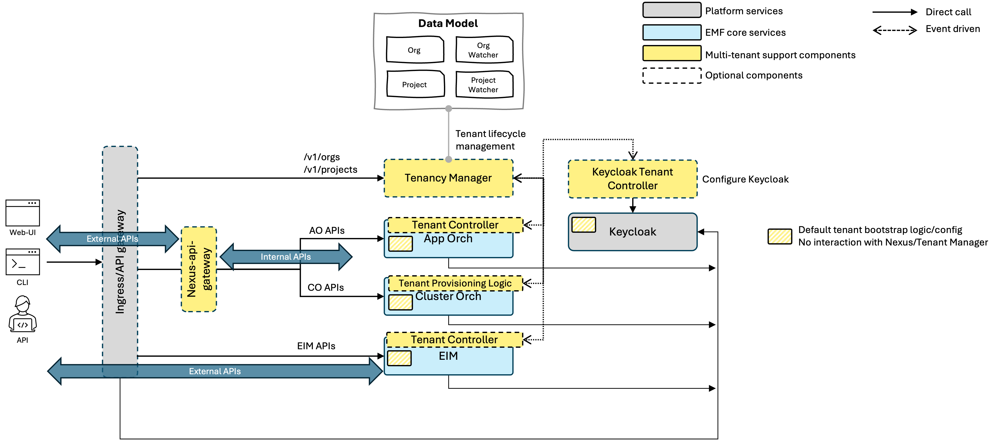

# Design Proposal: Multi-tenancy Simplification

Author(s): Hyunsun Moon, Denisio Togashi

Last updated: 12/2/25

## Abstract

The existing EMF multi-tenancy architecture enforces a centralized multi-tenant API gateway, resulting in tight coupling
and unnecessary complexity for all deployments. This proposal aims to simplify the architecture by making multi-tenancy
components optional, enabling direct API exposure for services, and introducing a shared middleware library. These
changes allow for flexible deployment options—from full multi-tenant environments to lightweight, single-service
integrations—while preserving backward compatibility and supporting external service integrations. The focus is on
achieving architectural modularity and deployment flexibility, rather than optimizing for performance or resource usage.

## User Stories

### User Story 1: Configurable Multi-tenancy

As a platform administrator, I need the ability to enable or disable multi-tenancy features based on deployment
requirements, so that the system can be tailored to specific organizational needs.

### User Story 2: Lightweight EIM Integration

As a third-party service developer, I want to integrate only the EIM sub-components without deploying the entire EMF
stack, so that I can add infrastructure management capabilities with minimal overhead.

### User Story 3: Flexible External Service Integration

As a solution architect, I want to connect external services to EMF regardless of the tenancy mode, so that I can extend
EMF’s capabilities across diverse environments.

### User Story 4: Seamless Backward Compatibility

As an existing EMF customer, I want to ensure that my current multi-tenant deployments remain fully compatible after
upgrades, so that my workflows continue without disruption.

## Proposal

### Overview

This proposal introduces a phased migration from the current monolithic multi-tenant architecture to a modular system
that supports both single-tenant and multi-tenant deployment modes. By decoupling multi-tenancy components and making
them optional, the architecture enables flexible service deployment and direct API exposure while reducing operational complexity. The approach preserves all
existing multi-tenancy features and maintains backward compatibility where required, while allowing lightweight, simplified deployments when multi-tenancy is
not needed.

### Current Architecture Problems

The current EMF architecture exhibits several key issues:

- **Single Point of Failure** All external requests are funneled through a single Multi-tenant API Gateway, creating a
  potential point of failure.
- **Mandatory Complexity:** Every deployment, regardless of actual requirements, must include the entire multi-tenancy
  stack, increasing operational overhead.
- **Lack of Flexibility:** The architecture does not support selective component deployment or straightforward
  integration with external services, restricting adaptability to diverse environments.

### Proposed Solution (WIP)

The target architecture achieves a fully modular system with the following characteristics:

- The complex Multi-tenant API Gateway is repurposed as HTTP router for tenant-manager, serving only `/v1/projects` and `/v1/orgs` endpoints.
- All multi-tenancy components are optional (indicated by dashed borders).
- Services (AO, CO, EIM) expose external APIs directly, eliminating central coordination.
- External integrations are streamlined via direct service access.

Below are examples of external service integration scenarios enabled by the new architecture:

### Core Architecture Changes

1. **Distributed API Handling**
    - Enable direct external API exposure, removing the need for complex central routing and API remapping.
    - Each service (AO, CO, EIM) manages Multi-tenant API Gateway responsibilities including:
      - Resolve active project ID
      - Tenant-aware AuthX
      - Provide `/openapi` and `/swagger` endpoints
    - Consolidate common functionality into a shared `orch-lib` middleware library to minimize duplicate work and ensure consistent API behaviors across services.

2. **Optional Multi-tenancy Components**
    - Make the Tenancy Manager optional, allowing it to be disabled in single-tenant deployments.
    - Service-specific Tenant Controllers and Keycloak Tenant Controller are also optional.
    - Provide default tenant bootstrap for single-tenant scenarios to simplify setup.

### Migration Strategy

#### Phase 0: Foundation

- Develop a shared middleware library (`orch-lib`) to centralize common multi-tenancy logic.
- Create Helm configuration templates to support both single-tenant and multi-tenant deployment modes.
- Implement standardized service initialization patterns for consistent startup across services.
- Build a comprehensive testing framework to validate modularity and backward compatibility.

#### Phase 1: EIM Modernization

- Decouple EIM from the legacy API gateway, enabling direct external API exposure.
- Remove EIM-specific API mapping from `nexus-api-gateway` configuration.
- Update CO to interact with EIM via its external APIs for inventory operations.
- Pilot the modular architecture with EIM to validate design and integration patterns.
- Support external service integrations with EIM in both single-tenant and multi-tenant modes.

**Benefits:**
- Minimizes migration risk by introducing changes incrementally.
- Provides early access to EIM integration for external services.
- Confirms the effectiveness of the modular approach before expanding to other components.
- Ensures AO and CO remain stable throughout the transition.

#### Phase 2: CO and AO Modernization

- Transform App Orchestration and Cluster Orchestration to the modular architecture.
- Achieve the full target architecture with all services decoupled.

#### Phase 3: Cleanup

- Remove legacy code paths and deprecated components.
- Finalize documentation for deployment and migration processes.
