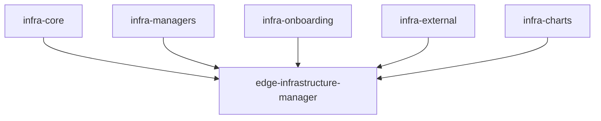
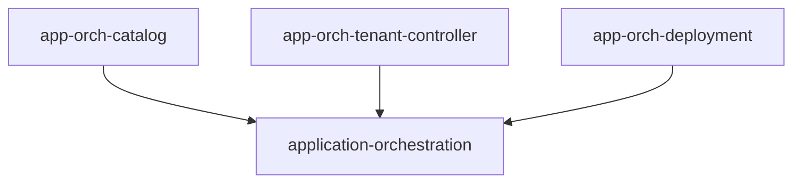
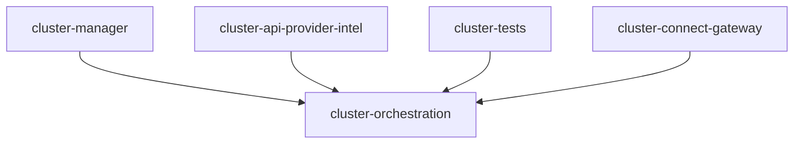
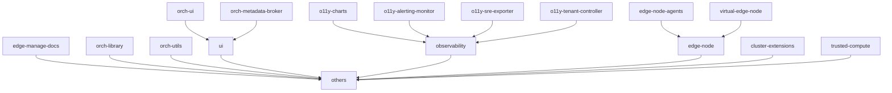
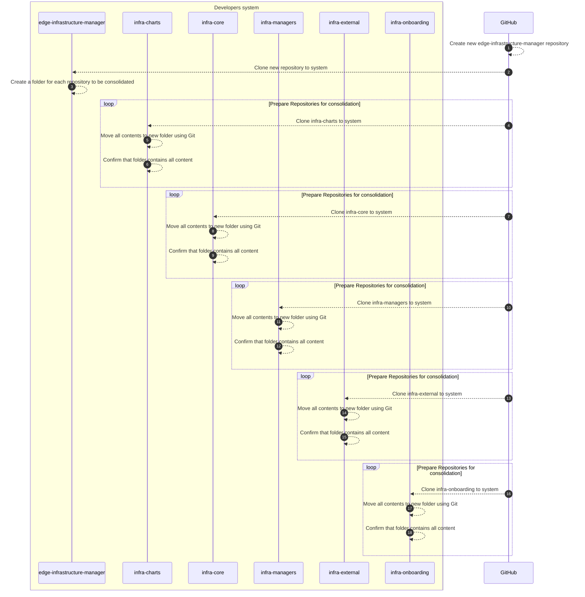
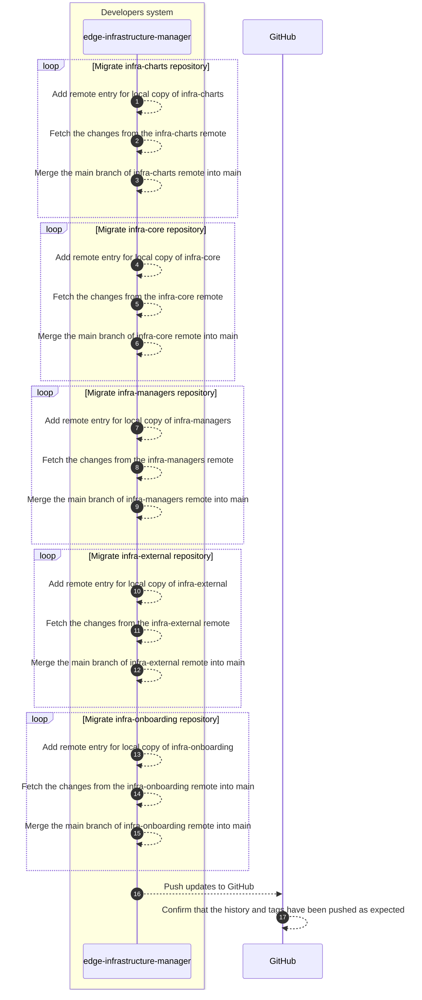

# Design Proposal: Consolidation of Edge Manageability Framework Repositories

Author(s): Christopher Nolan

Last updated: 2025/09/12

## Abstract

The Edge Manageability Framework (EMF) Repository streamlines the deployment of the Edge Orchestrator as well as
managing the components and applications deployed onto the Orchestrator and Edge Nodes. These components are contained
within multiple repositories, outlined in the
[EMF Readme](https://github.com/open-edge-platform/edge-manageability-framework?tab=readme-ov-file#repositories)
document.

In total, there are 24 separate repositories that directly impact the EMF repository spread across its
[key components](https://github.com/open-edge-platform/edge-manageability-framework?tab=readme-ov-file#key-components).
This is a significant number of repositories to maintain and it makes it difficult for users to raise issues against
specific areas of the EMF.

To improve the usability and maintenance of the EMF and its dependent repositories, it is intended to combine the current
number of repositories in EMF down to six to improve maintainability:

- edge-manageability-framework - will remain as is
- edge-infrastructure-manager
- application-orchestration
- cluster-orchestration
- orch-ci - will remain as is
- others

## Proposal

As outlined in the EMF Readme document, there are different components within EMF, with each component containing
multiple repositories. For those components with a number of existing repositories, these can be combined into a single
repository for that component. Each current repository will be listed as a folder with the same name in the new
repositories.

### Edge Infrastructure Manager

The new `edge-infrastructure-manager` repository will contain the combined code base for the current `infra-`
repositories:

- [infra-core](https://github.com/open-edge-platform/infra-core)
- [infra-managers](https://github.com/open-edge-platform/infra-managers)
- [infra-onboarding](https://github.com/open-edge-platform/infra-onboarding)
- [infra-external](https://github.com/open-edge-platform/infra-external)
- [infra-charts](https://github.com/open-edge-platform/infra-charts)

### Application Orchestration

In the new `application-orchestration` repository, the contents of the repositories listed under `app-orch-` will be
included:

- [app-orch-catalog](https://github.com/open-edge-platform/app-orch-catalog)
- [app-orch-tenant-controller](https://github.com/open-edge-platform/app-orch-tenant-controller)
- [app-orch-deployment](https://github.com/open-edge-platform/app-orch-deployment)

### Cluster Orchestration

The current `cluster-` repositories will be combined into a new `cluster-orchestration` repository. This includes the
following repositories:

- [cluster-manager](https://github.com/open-edge-platform/cluster-manager)
- [cluster-api-provider-intel](https://github.com/open-edge-platform/cluster-api-provider-intel)
- [cluster-tests](https://github.com/open-edge-platform/cluster-tests)
- [cluster-connect-gateway](https://github.com/open-edge-platform/cluster-connect-gateway)

### Others

The final new repository will cover the additional repositories that are not listed under the other three repositories.
If there is some overlap between repositories, these will be placed side by side within a single folder in this
repository. For example, for the `o11y-` repositories, these will all be moved into folders under a top level
`observability` folder in this repository.

This repository will include the following repositories:

- `ui` - contains both:
  - [orch-ui](https://github.com/open-edge-platform/orch-ui)
  - [orch-metadata-broker](https://github.com/open-edge-platform/orch-metadata-broker)
- `observability` - contains the `o11y` repositories, including:
  - [o11y-charts](https://github.com/open-edge-platform/o11y-charts)
  - [o11y-alerting-monitor](https://github.com/open-edge-platform/o11y-alerting-monitor)
  - [o11y-sre-exporter](https://github.com/open-edge-platform/o11y-sre-exporter)
  - [o11y-tenant-controller](https://github.com/open-edge-platform/o11y-tenant-controller)
- `edge-node` - contains both:
  - [edge-node-agents](https://github.com/open-edge-platform/edge-node-agents)
  - [virtual-edge-node](https://github.com/open-edge-platform/virtual-edge-node)
- [orch-utils](https://github.com/open-edge-platform/orch-utils)
- [edge-manage-docs](https://github.com/open-edge-platform/edge-manage-docs)*
- [orch-library](https://github.com/open-edge-platform/orch-library)
- [cluster-extensions](https://github.com/open-edge-platform/cluster-extensions)
- [trusted-compute](https://github.com/open-edge-platform/trusted-compute)

> Note: it is still to be determined if the edge-manage-docs repository can be moved into the others repo without impact.

### New repository formatting

When consolidating the repositories, the contents of each current repository will be moved into a single folder in the
same format currently used in that repository. This new folder will have the same name as the current repository. Git
provides the following command, `git filter-repo --to-subdirectory-filter <folder-name>`, which can perform the move of
the contents of a repository to folder while maintaining the format.

### Converge Repository Commit History

As part of the consolidation, the commit histories of the different individual repositories will also be converged into
a single combined commit history in the consolidated repository. This history will be synchronized, based on the time
stamps for each commit from each repository, so that the combined history contains all of the commits from all
repositories in a chronological order.

This combined history will also include any version tags applied to each individual repository as well. The history can
be included by adding remotes to the consolidated repository that point to local versions of the current repositories
that have been updated to place all contents into subfolders. To merge the different repositories with the commit
history can be done in Git using the `git merge --allow-unrelated-histories <local-remote>/<branch>` command.

### CI workflows and versioning

Consolidation of the current repositories will have an impact on the current CI workflows that we use as well as the
versioning used for some repositories.

Currently, a number of the repositories make use of a shared CI workflow that covers all the required steps to be run
for each build. Each repository calls this shared workflow from their own workflows, passing in the required settings
needed to tell the shared workflow what steps it needs to run for each build. After consolidation, these workflows for
individual repositories will need to be combined into a single workflow that works for each code base being
consolidated. However, when a change is made to one part of the consolidated repo, we want only the workflow needed for
that part to be run.

To do this, we can use a similar shared workflow to the one used in the
[edge-node-agents](https://github.com/open-edge-platform/edge-node-agents) to detect which of the folders was updated
and only run the required checks for those. This is done using the
[discover-changed-subfolders](https://github.com/open-edge-platform/orch-ci/tree/main/discover-changed-subfolders)
GitHub action included in the orch-ci repository. Using the output from this action in the pre-check stage of the
workflow, we can have the main workflow which calls the shared workflow pass the list of changed folders as a matrix,
causing the workflow to only run for those folders.

Another update needed for the consolidated repositories to support the CI workflows is to include a common Makefile at
the top level of the repository. This top level Makefile will have the same standard commands needed to run all of the
steps in the shared workflow. Each consolidated repository will have the same Makefile with the same commands to allow
for each repository to share a single common CI workflow.

For versioning of components in each of the consolidated repositories, each sub-folder should have its own VERSION file
to track the version for the contents of that sub-folder. An implementation of this can be seen in the
[edge-node-agents repository](https://github.com/open-edge-platform/edge-node-agents). To enable the versioning and
tagging of new versions for each consolidated repository, the CI workflows will need to be updated to check the correct
paths for VERSION files. Also, in the consolidated repositories, the tags that will be applied will be required to be
in the format `<component-name>/v<version>`. An example of this format can be seen in the edge-node-agents repository.

## Rationale

Another consideration for repository consolidation was to combine the repositories based on how they were listed in the
EMF README documentation. In this case, there would be consolidated repositories for Observability and Edge Node that
 would site alongside the Edge Infratructure Manager and other consolidated repositories.

It was decided that this was not the best option as, although this would reduce the total number of repositories from
the 24 currently in use, it would still leave approximately 10 repositories to be maintained. Although this would
improve usability and maintainability compared to the current number of repositories, it would still be complex to
maintain and use this number of repositories compared to a consolidation of repositories to only five.

## Affected components and Teams

- Application Orchestration
- CI
- Cluster Orchestration
- Edge Infrastructure Management
- Edge Node Agents
- GUI
- Observability
- Provisioning
- Validation

## Implementation plan

Implementation will be in three phases:

### Phase 1 (Prototyping)

- Take the `infra-` repositories and combine them into a single `edge-infratructure-manager` repository containing the
combined history of the individual `infra-` repositories.
- Create a new workflow and top level Makefile for the new repository to work with the shared CI workflow.
- Update the shared CI workflow to align with the new consolidated repository.
- Add any necessary updates to the common GitHub actions in the orch-ci repository to support the new folder framework.
- Test and validate that the updated CI workflows work for the new consolidated repository.
- Update EMF repository to work with the new consolidated repository.
- Validate that EMF deployment works as expected with the new consolidated repository.

### Phase 2 (Implementation for Application and Cluster Orchestration)

> Note: Phases 2 and 3 will be done in parallel.

- Apply the same steps used to create `edge-infrastructure-manager` to create the `application-orchestration` and
`cluster-orchestration` consolidated repositories.
- Test and confirm that the CI workflows run successfully for the new repositories.
- Update EMF repository to align with new repositories.
- Validate that EMF deployment works as expected with the new consolidated repository.

### Phase 3 (Implementation of Others repository)

- For repositories that combine for some components (such as edge node and observability), these will be consolidated
together first.
- Take the remaining repositories and the combined repositories from the previous step and combine them into the
`others` repository.
- Create a new workflow and top level Makefile for the new repository to work with the shared CI workflow.
- Update the shared CI workflow to align with the new consolidated repository, including updates to work with the
nested subfolders that have been created from steps 1 and 2.
- Add required updates to the common GitHub actions to support working with the new nested folder structure.
- Test and validate that the updated CI workflows work for the new consolidated repository.
- Update the EMF repository to work with the new consolidated repository.
- Validate that EMF deployment works as expected with the new consolidated repository.

## Open issues (if applicable)

- Confirm the name for the Others repository that will contain multiple repositories that do not align with the other
three consolidated repostories.
- Can the current CI repository be consolidated into the `others` repository or should it be kept separate due to it
storing the shared workflows for all repositories? The `orch-ci` repository will be kept separate and as is.
- `edge-manage-docs` contains the Developer, User and Deployment Guides that are rendered to
[the documentation site](https://docs.openedgeplatform.intel.com/edge-manage-docs/dev/index.html), need to confirm if
this repository needs to be kept separate so it can be rendered to the documentation site.
