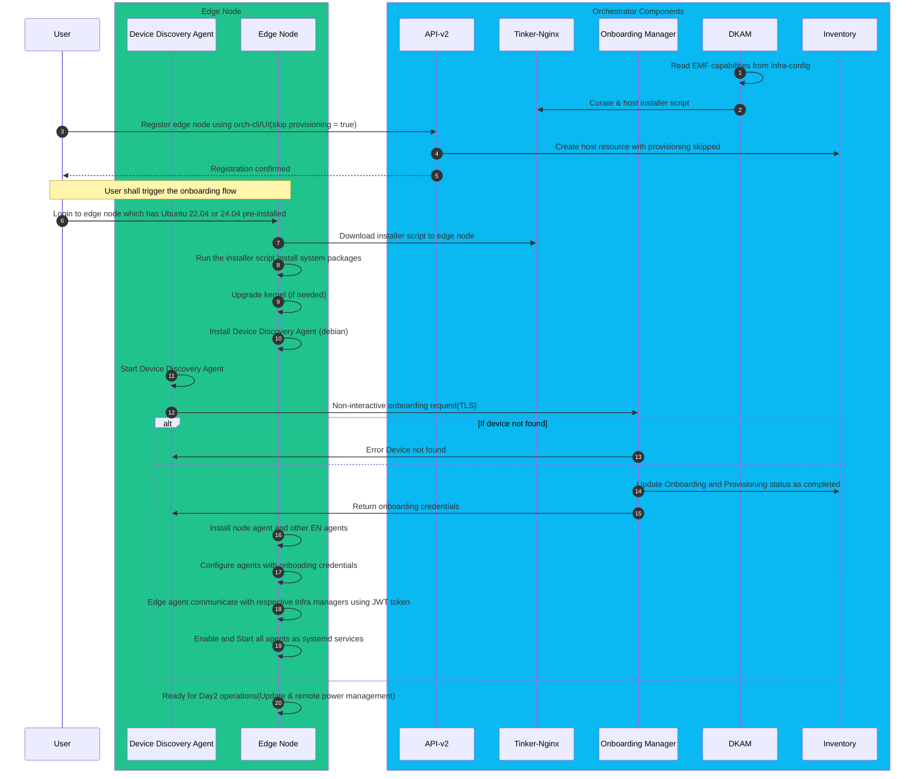

# Design Proposal: Split onboarding and OS provisioning flows in the EIM

Author(s): Edge Manageability Architecture Team

Last updated: 17th Nov 2025

## Abstract

Existing onboarding of edge node has to go through the provisioning workflow to install the operating system and required agents so that edge node is ready to manage by EMF orchestrator. It becomes to mandatory to test any day2 flows like VPro features, cluster orchestration, app orchestration. If customer or the user has an edge node which is already provisioned with the required Operation system meeting EMF requirements then it is an additional overhead to go through entire OS provisioning workflow to repeat the same process. Customer might have their own OS provisioning to install the OS in the edge node then we should support the onboarding of that edge node to EMF orchestrator and start using the day2 workflows. It becomes neccessity to split the onboarding and provisioning flow and it should be configurable by the end user when they want to onboard an edge to EMF to go through only onboarding flow without OS provisiong or with OS provisioning.

## Requirements

When an user choose to onboard an edge node to EMF orchestrator, there should be an option to use to opt for provisioning flow or skip it entirely. When user opt for the onboard with OS provisioning option then it is exising workflow to go through the entire the Day0 workflow(installation OS, edge node installation and configuration). OS provisioning workflow differs between the 2 EMF supported Operating systems(EMT and Ubuntu) because EMT is pre-bundled with Edge node agents because immutability. Existing provsioning workflow for Ubuntu includes below steps

1. Ubuntu installation by downloading the canonical base server image

2. Upgrade the required base kernel as part provisioning flow to support intel platforms features. Required base kernel for Intel platforms like ADL, RPC are
 - Ubuntu 22.04 -> Kernel 6.8.x

 - Ubuntu 24.05 -> Kernel 6.11.x 
 
3. Install edge node agents as post installation of OS. DKAM curates the installer script with required EMF compatible versions of EN agents(by making use of EN manifest file) along with their configurations. It configures apt package manager with EMF release service where edge node agents debians are hosted.

4. Edge node agent configurations include resource managers end points, key cloak credentials, Edge node proxy configurations, edge node agent's log rotation policies, etc.

5. Starting the edge node agent as systemd services and enable them to start reboot.

EMF orchstrator side steps to skip the provisioning flow

1. User should be able to register the edge node with EMF orchestrator by opting or skipping the provisioning flow.

If user opt for the onboarding without OS provisioning then user should minimal steps in the edge node to onboard to EMF orchestrator. 
Onboarding steps those should be done on the edge node includes 

1. Kernel upgrade to installed base kernel version required for the intel supported platforms as defined above provisioning flow.

2. Edge node agents installation

 - Additional system packages to be installed on the edge node to run the edge node agents.

 - It includes Edge node agents configuration files with all required version of EN agents which is compatible with EMF, infra-managers end points, keycloak credentials etc. This configuration also include what are specific agents to be installed on the edge node based on EMF capabilities(EIM with AMT, App orchestration, cluster orchestartion, observability)

3. Run the new onboarding agent to perform Non-interactive onboarding and get the keycloak host specific credentials for the edge node agents.

4. Start other agents once key cloak credentials received from EMF orchestrator and enable them to start on reboot.

5. If the host resource is associated with custom config(cloud-init) then it there should be a way to run run cloud-init stpes on the edge node as a post onboarding step.

## Scope and Implementation plan

EMF side steps to skip the provisioning workflow.

1. Device disocery agent - Build debian for the device discovery agent and include it in the agent installer script which does onboarding(non-interactive) and gets required keycloak credentials to the edge node. Until device discovery completes the onboarding other agents installation shouldn't be started.

2. DKAM - should curate and host the installer script in the tinker-nginx service. It should also read the configuration with enabled capabilities of EMF (App orchestration, cluster orchestration, observability). Based on that configuration it shall include the respective agent installations. It should include device discovery agent.

3. Onboarding manager - Should skip the provisioning flow to creation of the tinkerbell workflow if edge node is registered with skip provisioning flow option. It should update the inventory with required instance resource fields like provisioning status and status indicator fields. Creation of instance resource with mapping OS resource of Edge node.

4. API-v2 and inventory changes to include new field, skip provisioning flow in host resource.

5. Orch-cli/Infra web-ui changes for device registration to include the new field skip provisiong flow. By default skip provisioning flow will be set to false.

## Workflow

## Opens

In the interactive onboarding mapping the instance resource to OS resource is done by taking OS version from the Edge node during device discovery stage.

