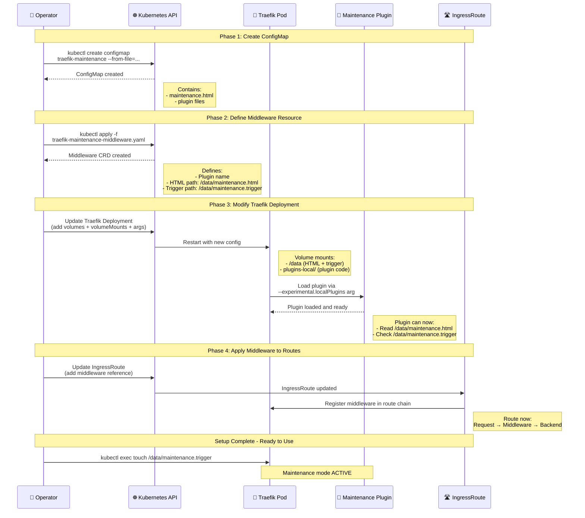

# Design Proposal: Traefik-Based Maintenance Mode

Author(s): UI Team

Last updated: February 4, 2026

## Abstract

This proposal introduces a Traefik middleware-based maintenance mode solution
that displays a user-friendly maintenance page during planned system upgrades
or downtime. Unlike application-specific approaches, this solution operates at
the ingress level, providing a unified maintenance experience across all
services behind Traefik. The maintenance mode is controlled by the presence of
a trigger file, allowing operators to quickly enable or disable maintenance
pages without service restarts or configuration redeployments.

## Problem Statement

During system maintenance or upgrades for the Edge Orchestrator, users
attempting to access any service receive:

- Generic connection timeout errors
- 502 Bad Gateway errors when services are down
- Inconsistent error messages across different services
- No clear communication about maintenance status or expected downtime

This results in:

- Poor user experience during maintenance windows
- Increased support burden with users uncertain about system status
- Lack of standardized maintenance communication
- No ability to provide estimated completion times or instructions

## Proposal

### Traefik Middleware Plugin Implementation

Implement maintenance mode using the `traefik-maintenance` plugin that
intercepts requests at the ingress level. The plugin serves a custom HTML
maintenance page when a trigger file is present, providing a unified
maintenance experience for all services.

### Key Components

The solution consists of three main components:

1. **ConfigMap for Maintenance Content** - Stores the maintenance HTML page
   and plugin files
2. **Traefik Middleware** - Kubernetes resource defining the plugin
   configuration
3. **Trigger File Mechanism** - Simple file-based toggle for enabling/disabling
   maintenance mode

### Setup Flow

The following diagram shows the complete setup process for implementing maintenance
mode:



### Configuration

#### 1. ConfigMap Creation

Create a ConfigMap containing the maintenance HTML page and plugin files:

```bash
kubectl -n orch-gateway create configmap traefik-maintenance \
  --from-file=/path/to/traefik-maintenance/
```

Example ConfigMap YAML:

```yaml
apiVersion: v1
kind: ConfigMap
metadata:
  name: traefik-maintenance
  namespace: orch-gateway
data:
  maintenance.html: |
    <!DOCTYPE html>
    <html lang="en">
    <head>
      <meta charset="UTF-8">
      <meta name="viewport" content="width=device-width, initial-scale=1.0">
      <title>System Maintenance</title>
      <style>
        body {
          font-family: Arial, sans-serif;
          display: flex;
          justify-content: center;
          align-items: center;
          height: 100vh;
          margin: 0;
          background: linear-gradient(135deg, #667eea 0%, #764ba2 100%);
        }
        .container {
          text-align: center;
          background: white;
          padding: 3rem;
          border-radius: 10px;
          box-shadow: 0 10px 40px rgba(0,0,0,0.2);
        }
        h1 { color: #333; margin-bottom: 1rem; }
        p { color: #666; font-size: 1.1rem; }
        .icon { font-size: 4rem; margin-bottom: 1rem; }
      </style>
    </head>
    <body>
      <div class="container">
        <div class="icon">🚧</div>
        <h1>System Maintenance</h1>
        <p>The Edge Orchestrator is currently undergoing maintenance.</p>
        <p>We'll be back shortly. Thank you for your patience.</p>
      </div>
    </body>
    </html>
```

#### 2. Middleware Definition

Create the Traefik maintenance mode Middleware resource:

```yaml
apiVersion: traefik.io/v1alpha1
kind: Middleware
metadata:
  name: maintenance-plugin
  namespace: orch-gateway
spec:
  plugin:
    traefik-maintenance:
      enabled: "true"
      filename: /data/maintenance.html
      httpContentType: text/html; charset=utf-8
      httpResponseCode: "503"
      triggerFilename: /data/maintenance.trigger
```

**Configuration Parameters:**

- `enabled`: Plugin activation flag
- `filename`: Path to maintenance HTML file inside container
- `httpContentType`: Response content type header
- `httpResponseCode`: HTTP status code (503 Service Unavailable)
- `triggerFilename`: Path to trigger file that enables maintenance mode

#### 3. Traefik Deployment Modifications

Modify the Traefik deployment to mount the ConfigMap and load the plugin.

Add to `volumes` section:

```yaml
volumes:
  - name: traefik-maintenance
    configMap:
      name: traefik-maintenance
      defaultMode: 420
```

Add to `volumeMounts` section:

```yaml
volumeMounts:
  - name: traefik-maintenance
    mountPath: /data
  - name: traefik-maintenance
    mountPath: ./plugins-local/src/github.com/TRIMM/traefik-maintenance/
```

Add to Traefik container args:

```yaml
args:
  - --experimental.localPlugins.traefik-maintenance.moduleName=github.com/TRIMM/traefik-maintenance
```

#### 4. IngressRoute Configuration

Apply the middleware to IngressRoutes that should show maintenance pages:

```yaml
apiVersion: traefik.io/v1alpha1
kind: IngressRoute
metadata:
  name: web-ui-root
  namespace: orch-gateway
spec:
  routes:
    - kind: Rule
      match: Host(`your-domain.com`)
      middlewares:
        - name: maintenance-plugin
          namespace: orch-gateway
      services:
        - name: web-ui
          port: 80
```

### Activation Workflow

#### Enabling Maintenance Mode

1. **Access Traefik Pod:**

   ```bash
   kubectl get pods -n orch-gateway | grep traefik
   kubectl -n orch-gateway exec -it <traefik-pod-name> -- /bin/sh
   ```

2. **Create Trigger File:**

   ```bash
   cd /data
   touch maintenance.trigger
   # Or with custom message
   echo "Maintenance in progress" > maintenance.trigger
   exit
   ```

3. **Verify Maintenance Mode:**
   - Access the application URL
   - Should see maintenance page with HTTP 503 status
   - Verify middleware is active:

     ```bash
     kubectl -n orch-gateway get middleware maintenance-plugin
     ```

#### Disabling Maintenance Mode

1. **Access Traefik Pod:**

   ```bash
   kubectl -n orch-gateway exec -it <traefik-pod-name> -- /bin/sh
   ```

2. **Remove Trigger File:**

   ```bash
   cd /data
   rm maintenance.trigger
   exit
   ```

3. **Verify Normal Operation:**
   - Access the application URL
   - Should reach the normal application
   - No maintenance page displayed

### POC Implementation Status

1. ✅ Create ConfigMap with maintenance HTML manually via kubectl
2. ✅ Create Middleware YAML definition
3. ✅ Modify Traefik deployment via ArgoCD UI
4. ✅ Apply middleware to test IngressRoute
5. ✅ Test trigger file mechanism

### Advantages

- Centralized control for all services
- No changes required to backend applications
- Instant activation via file toggle
- Returns proper HTTP 503 status
- No Traefik restart needed

### Trade-offs

- Requires plugin installation and pod exec permissions
- Trigger file lost on pod restart (intentional)
- Static HTML only, no dynamic content

## Related Documentation

- [Keycloak Maintenance Theme ADR](./keycloak-maintenance-theme.md) -
  Authentication-layer maintenance approach
- Traefik Middleware Documentation:
  <https://doc.traefik.io/traefik/middlewares/overview/>
- Traefik Plugins: <https://plugins.traefik.io/>

## Security Considerations

- **Pod Access Control:** Restrict kubectl exec permissions to authorized
  operators only
- **ConfigMap Security:** Ensure maintenance HTML doesn't expose sensitive
  information
- **Plugin Source:** Verify plugin source and keep updated for security patches
